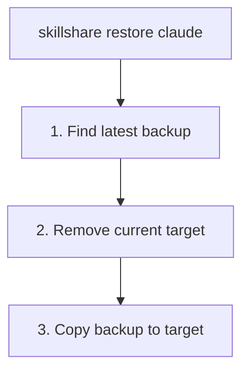

# restore

백업으로부터 target을 복원합니다.

```bash
skillshare restore                                     # Interactive TUI (browse + restore)
skillshare restore claude                              # Latest backup
skillshare restore claude --from 2026-01-19_10-00-00   # Specific backup
skillshare restore claude --dry-run                    # Preview
```

## 언제 사용하나요

- sync가 잘못되어 target을 이전 상태로 되돌려야 할 때
- target에서 skill을 실수로 제거했을 때
- 백업 버전을 대화형으로 탐색하며 현재 상태와 비교할 때

## 대화형 TUI

TTY에서 인자 없이 `skillshare restore`를 실행하면 통합 restore TUI가 실행됩니다.

1. **Source picker** — "Backup Restore"와 "Trash Restore" 중 선택
2. **Backup Restore** — target을 선택한 후, 다음 정보를 보여주는 상세 패널과 함께 백업 버전을 탐색:
   - 백업 날짜, 크기, skill 개수
   - 현재 target과의 diff (추가/제거된 skill)
   - 개별 파일 목록
3. **Trash Restore** — 삭제된 skill을 복원하기 위해 trash TUI를 엽니다

### 키 바인딩

| Key | Action |
|-----|--------|
| `↑`/`↓` | target/버전 탐색 |
| `Enter` | target 선택 / 버전 복원 |
| `/` | target 필터링 |
| `d` | 백업 버전 삭제 |
| `Ctrl+d`/`Ctrl+u` | 상세 패널 스크롤 |
| `Esc` | 뒤로 가기 |
| `q`/`Ctrl+C` | 종료 |

TUI를 건너뛰고 일반 백업 목록을 표시하려면 `--no-tui`를 사용하세요.

## 동작 방식



## 옵션

| Flag | Description |
|------|-------------|
| `--all` | skill과 agent 모두 복원 |
| `--project, -p` | project mode 사용(`.skillshare/backups/`); **agent 전용** |
| `--global, -g` | global mode 사용(skill의 기본값) |
| `--from, -f <timestamp>` | 특정 백업에서 복원 |
| `--force` | 확인 없이 덮어쓰기 |
| `--dry-run, -n` | 변경 없이 미리보기 |
| `--no-tui` | 대화형 TUI 건너뛰고 백업 목록 표시 |

`restore`는 위치 인자로 kind도 받습니다: `skillshare restore agents claude`는 `claude` target의 agent 백업을 복원합니다.

## 백업 찾기

사용 가능한 백업 목록을 확인합니다.

```bash
skillshare backup --list
```

```
All backups (15.3 MB total)
  2026-01-20_15-30-00  claude, cursor     4.2 MB
  2026-01-19_10-00-00  claude             2.1 MB
  2026-01-18_09-00-00  claude, cursor     4.0 MB
```

## 예시

```bash
# Restore from latest backup
skillshare restore claude

# Restore from specific backup
skillshare restore claude --from 2026-01-19_10-00-00

# Preview restore
skillshare restore claude --dry-run

# Force restore (skip confirmation)
skillshare restore claude --force
```

## 복원 후

`restore`는 target 디렉터리를 스냅샷의 내용으로 교체합니다. 백업은 로컬 콘텐츠만 캡처하므로 — symlink된 skill은 제외됩니다. [What Gets Backed Up](/docs/reference/commands/backup#what-gets-backed-up) 참고 — 동기화된 skill을 다시 가져오려면 이후에 `sync`를 실행하세요.

```bash
skillshare restore claude    # Restore local content from backup
skillshare sync              # Recreate symlinks for synced skills
```

복원된 콘텐츠는 symlink가 아닌 일반 파일입니다. target이 로컬 skill만 보유했던 경우 restore만으로 충분합니다.

## 사용 사례

### 실수로 삭제한 경우

skill을 실수로 삭제한 경우:

```bash
skillshare restore claude --from 2026-01-19_10-00-00
```

### 변경 사항 되돌리기

sync가 잘못된 경우:

```bash
skillshare restore claude  # Go back to pre-sync state
```

### 테스트

이전 skill 버전을 테스트하기 위해 복원합니다.

```bash
skillshare restore claude --from 2026-01-15_10-00-00
# Test old skills...
skillshare sync  # Return to current state
```

### Agent 복원

Agent 복원은 skill 복원과 유사하게 동작하며, `backup agents`(및 `sync agents` 실행 전에 자동으로 실행되는 자동 백업)로 생성된 병렬 `<target>-agents` 백업 항목에 대해 작동합니다.

```bash
skillshare restore agents claude                       # Latest agent backup for claude
skillshare restore agents claude --from 2026-01-19_10-00-00
skillshare restore agents -p                           # Project agents (the only project mode allowed)
skillshare restore --all claude                        # Skills + agents in one shot
```

project mode에서는 restore가 — backup과 마찬가지로 — agent에 대해서만 동작합니다. `agents` 인자 없이 실행하면 오류가 발생합니다.

```
restore is not supported in project mode (except for agents)
```

`skillshare backup --list`로 백업을 나열할 때, agent 백업은 `-agents` 접미사가 붙은 별도 항목으로 표시됩니다(예: `claude-agents`).

## 참고 항목

- [backup](/docs/reference/commands/backup) — 백업 생성 및 관리
- [sync](/docs/reference/commands/sync) — 복원 후 재동기화
- [Agents](/docs/understand/agents) — agent 리소스 모델
