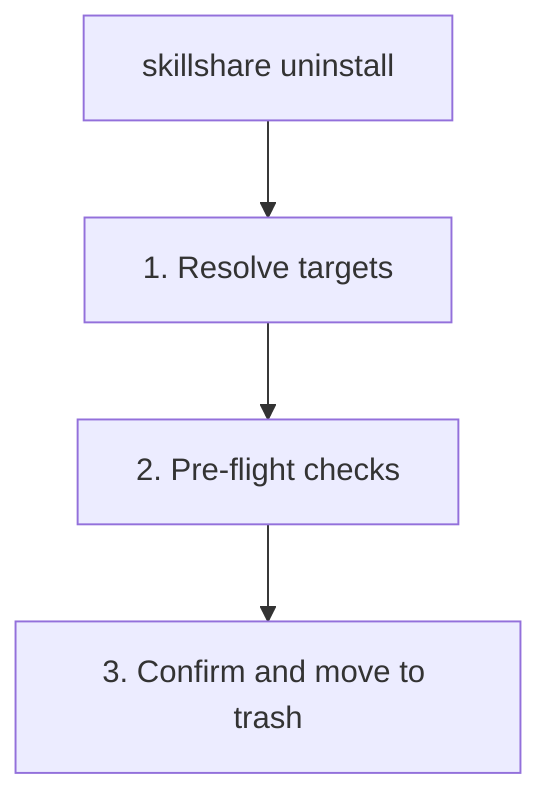

# uninstall

source 디렉터리에서 하나 이상의 skill 또는 tracked repository를 제거합니다. skill은 trash로 이동되어 자동 정리 전까지 7일간 보관됩니다.

```bash
skillshare uninstall my-skill              # Remove a single skill
skillshare uninstall a b c --force         # Remove multiple skills at once
skillshare uninstall --all                 # Remove all skills
skillshare uninstall --group frontend      # Remove all skills in a group
skillshare uninstall team-repo             # Remove tracked repository (_ prefix optional)
```

## 언제 사용하나요

- 더 이상 필요 없는 skill을 제거할 때(7일간 trash로 이동)
- 더 이상 사용하지 않는 tracked repository를 정리할 때
- skill 그룹 전체를 한 번에 일괄 제거할 때
- `--all`로 **모든** skill을 한 번에 제거할 때


## 동작 방식



## 옵션

| Flag | Description |
|------|-------------|
| `--all` | source에서 **모든** skill 제거(확인 필요) |
| `--group, -G <name>` | 그룹 내 모든 skill 제거(접두사 매칭, 반복 가능) |
| `--force, -f` | 확인을 건너뛰고 커밋되지 않은 변경 사항을 무시 |
| `--dry-run, -n` | 변경 없이 미리보기 |
| `--project, -p` | 현재 디렉터리의 project 레벨 config 사용 |
| `--global, -g` | global config 사용(`~/.config/skillshare`) |
| `--json` | Global mode: JSON을 출력하고 확인을 건너뜀; dirty한 tracked repository는 여전히 `--force`가 필요함 |
| `--help, -h` | 도움말 표시 |

## JSON Output

```bash
skillshare uninstall my-skill another-skill --json
```

```json
{
  "removed": ["my-skill", "another-skill"],
  "failed": [],
  "skipped": 0,
  "dry_run": false,
  "duration": "0.089s"
}
```

`--dry-run`과 조합하여 미리보기할 수 있습니다.

```bash
skillshare uninstall --all --json --dry-run
```

## 여러 Skill 제거

한 번의 명령으로 여러 skill을 제거합니다.

```bash
skillshare uninstall alpha beta gamma --force
```

일부 skill을 찾을 수 없는 경우, 명령은 경고와 함께 **해당 skill을 건너뛰고** 나머지 제거를 계속합니다. 지정된 skill이 **모두** 유효하지 않은 경우에만 실패합니다.

### Glob 패턴

skill 이름은 일괄 제거를 위한 glob 패턴(`*`, `?`, `[...]`)을 지원합니다.

```bash
skillshare uninstall "core-*"              # Remove all skills matching core-*
skillshare uninstall "test-?" --force      # Single-character wildcard
skillshare uninstall "core-*" "util-*"     # Multiple patterns
```

Glob 매칭은 대소문자를 구분하지 않습니다: `"Core-*"`는 `core-auth`, `CORE-DB` 등과 매칭됩니다.

:::note 최상위 레벨 매칭만 지원
Glob 패턴은 source 폴더 내의 **최상위 디렉터리 이름**에만 매칭됩니다. 중첩된 skill(예: `frontend/react-hooks`)은 `"react-*"`로 매칭되지 않습니다 — 하위 디렉터리 내의 skill을 대상으로 하려면 `--group frontend`를 사용하세요.
:::

## Remove All

`--all`을 사용하면 source 디렉터리의 모든 skill을 한 번에 제거합니다.

```bash
skillshare uninstall --all                 # Interactive confirmation
skillshare uninstall --all --force         # Skip confirmation
skillshare uninstall --all -n              # Preview what would be removed
```

`--all`은 skill 이름이나 `--group`과 함께 사용할 수 없습니다.

:::tip Shell glob 보호
따옴표 없이 `skillshare uninstall *`를 실행하면 shell이 `*`를 현재 디렉터리의 파일 이름으로 확장합니다. skillshare는 이를 감지하고 대신 `--all` 사용을 제안합니다. 항상 와일드카드에 따옴표(`"*"`)를 사용하거나 `--all`을 사용하세요.
:::

## Group Removal

하위 skill이 포함된 디렉터리를 제거하면 skillshare는 자동으로 이를 **그룹**으로 감지하고 확인을 요청하기 전에 포함된 skill을 나열합니다.

```
Uninstalling group (5 skills)
─────────────────────────────────────────
  - feature-radar
  - feature-radar-archive
  - feature-radar-learn
  - feature-radar-ref
  - feature-radar-scan
→ Name: feature-radar
→ Path: ~/.config/skillshare/skills/feature-radar

Are you sure you want to uninstall this group? [y/N]:
```

`--group` 플래그는 **접두사 매칭**을 사용해 디렉터리 아래의 모든 skill을 제거합니다.

```bash
# Remove all skills under frontend/
skillshare uninstall --group frontend

# Also removes nested skills: frontend/react/hooks, frontend/vue/composables
skillshare uninstall --group frontend --force

# Preview what would be removed
skillshare uninstall --group frontend --dry-run
```

그룹 제거가 적용되면(자동 감지된 디렉터리 그룹 포함) 제거된 각 구성원도 config의 관리되는 `skills:` 목록(`~/.config/skillshare/config.yaml` 또는 project mode의 `.skillshare/config.yaml`)에서 제거됩니다.

위치 인수(이름)와 `--group`을 조합할 수 있으며, `-G`를 여러 번 사용할 수도 있습니다.

```bash
# Mix names and groups
skillshare uninstall standalone-skill -G frontend -G backend --force

# Duplicates are automatically deduplicated
skillshare uninstall frontend/hooks -G frontend --force  # hooks removed once
```

## Tracked Repositories

tracked repository(`_`로 시작하는 폴더)의 경우:

- 커밋되지 않은 변경 사항을 확인합니다(재정의하려면 `--force` 사용)
- `.gitignore`에서 항목을 자동으로 제거합니다
- uninstall 시 `_` 접두사는 선택 사항입니다

```bash
skillshare uninstall _team-skills        # With prefix
skillshare uninstall team-skills         # Without prefix (auto-detected)
skillshare uninstall _team-skills --force # Force remove with uncommitted changes
```

## 예시

```bash
# Remove a single skill
skillshare uninstall my-skill

# Remove multiple skills
skillshare uninstall skill-a skill-b skill-c --force

# Remove all skills
skillshare uninstall --all
skillshare uninstall --all --force
skillshare uninstall --all -n              # Preview

# Remove by group
skillshare uninstall --group frontend --force

# Preview removal
skillshare uninstall my-skill --dry-run
skillshare uninstall --group frontend -n

# Remove tracked repository
skillshare uninstall team-repo

# Mix names and groups
skillshare uninstall my-skill -G frontend --force
```

## 안전성

제거된 skill은 영구 삭제되지 않고 **trash로 이동**됩니다.

- **위치:** `~/.local/share/skillshare/trash/`(global) 또는 `.skillshare/trash/`(project)
- **보관 기간:** 7일 후 자동으로 정리됨
- **재설치 힌트:** skill이 remote source에서 설치된 경우, 재설치 명령이 표시됨
- **복원:** trash에서 복구하려면 `skillshare trash restore <name>` 사용

단일 skill(verbose):

```
✓ Uninstalled skill: my-skill
ℹ Moved to trash (7 days): ~/.local/share/skillshare/trash/my-skill_2026-01-20_15-30-00
ℹ Reinstall: skillshare install github.com/user/repo/my-skill
```

여러 skill(batch):

```
✓ Uninstalled 4 skill(s) (0.1s)

── Removed ─────────────────────────────
✓ pdf        skill
✓ tdd        skill
✓ security   group, 2 skills
✗ bad-skill  failed to move to trash: ...

── Next Steps ──────────────────────────
ℹ Moved to trash (7 days).
ℹ Run 'skillshare sync' to update all targets
```

대량 배치는 축약된 형식을 사용합니다.

```
✓ Uninstalled 920, failed 2 (1.2s)

── Failed ──────────────────────────────
✗ bad-a  failed to move to trash: permission denied
✗ bad-b  failed to move to trash: permission denied

── Removed ─────────────────────────────
✓ 920 uninstalled

── Next Steps ──────────────────────────
ℹ Moved to trash (7 days).
ℹ Run 'skillshare sync' to update all targets
```

실수로 제거한 skill을 복원하려면:

```bash
skillshare trash list                  # See what's in trash
skillshare trash restore my-skill      # Restore to source
skillshare sync                        # Sync back to targets
```

## Uninstall 이후

`skillshare sync`를 실행해 모든 target에서 skill을 제거하세요.

```bash
skillshare uninstall old-skill
skillshare sync  # Remove from Claude, Cursor, etc.
```

## Project Mode

project의 `.skillshare/skills/`에서 skill 또는 tracked repo를 제거합니다.

```bash
skillshare uninstall my-skill -p                  # Remove a skill
skillshare uninstall a b c -p -f                  # Remove multiple skills
skillshare uninstall --all -p -f                   # Remove all project skills
skillshare uninstall --group frontend -p -f        # Remove a group
skillshare uninstall team-skills -p                # Tracked repo (_ prefix optional)
```

Project mode에서 uninstall은 다음을 수행합니다.
- skill 디렉터리를 `.skillshare/trash/`로 이동합니다(7일간 보관)
- `.skillshare/config.yaml`의 `skills:` 목록에서 skill 항목을 제거합니다(remote skill의 경우)
- `.skillshare/.gitignore`에서 항목을 제거합니다(remote/tracked skill의 경우)
- `.skillshare/skills.lock.json`에서 skill의 고정을 제거합니다(group의 경우 그 아래의 모든 고정)
- tracked repo의 경우: 커밋되지 않은 변경 사항을 확인합니다(재정의하려면 `--force` 사용)
- `_` 접두사는 선택 사항입니다 — 자동 감지됨

```bash
skillshare uninstall pdf -p
skillshare sync
git add .skillshare/ && git commit -m "Remove pdf skill"
```

## Agent Support

skill 대신 agent를 제거하려면 `--kind agent`를 사용하세요.

```bash
skillshare uninstall --kind agent tutor              # Remove an agent
skillshare uninstall --kind agent tutor reviewer -f   # Remove multiple agents
skillshare uninstall --kind agent --all               # Remove all agents
```

Agent uninstall은 skill과 동일한 trash-and-retain 동작을 따릅니다(trash로 이동, 7일간 보관). 배경 지식은 [Agents](/docs/understand/agents)를 참조하세요.

## 참고

- [install](/docs/reference/commands/install) — skill 설치
- [list](/docs/reference/commands/list) — 설치된 skill 나열
- [trash](/docs/reference/commands/trash) — 제거된 skill 관리
- [Project Skills](/docs/understand/project-skills) — project mode 개념
- [Agents](/docs/understand/agents) — Agent 개념
