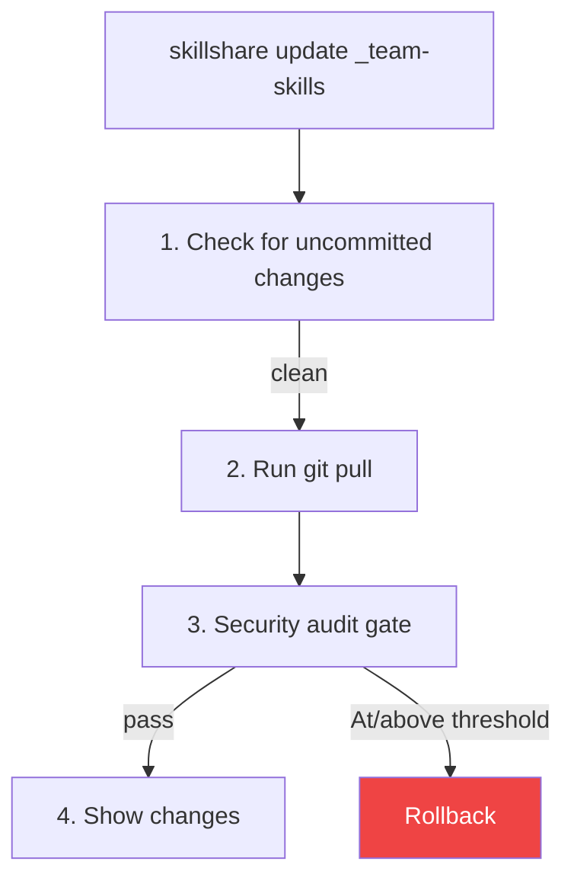
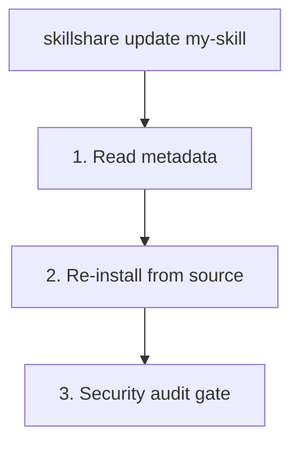

# update

하나 이상의 skill 또는 tracked 저장소를 최신 버전으로 업데이트합니다.

```bash
skillshare update my-skill           # 단일 skill 업데이트
skillshare update a b c              # 여러 개를 한 번에 업데이트
skillshare update --group frontend   # 그룹의 모든 skill 업데이트
skillshare update team-skills        # tracked 저장소 업데이트
skillshare update --all              # 전체 업데이트
skillshare update agents --all       # 모든 tracked/updatable agent 업데이트
```

## 사용 시점

- tracked 저장소에 새 커밋이 있는 경우(`check`로 발견)
- 설치된 skill에 더 새로운 버전이 있는 경우
- 원본 source에서 skill을 다시 다운로드하고 싶은 경우


## 동작 방식

### Tracked 저장소의 경우



### 일반 Skill의 경우



## 옵션

| Flag | 설명 |
|------|-------------|
| `--all, -a` | 모든 tracked 저장소/skill을 업데이트하거나, `update agents --all`로 사용 시 모든 agent를 업데이트 |
| `--group, -G <name>` | 그룹 내 업데이트 가능한 모든 skill을 업데이트하거나, agent 하위 디렉터리의 모든 agent를 업데이트 |
| `--force, -f` | 로컬 변경 사항을 버리고 audit findings에도 불구하고 진행 |
| `--dry-run, -n` | 변경 없이 미리보기 |
| `--skip-audit` | 업데이트 후 보안 audit gate를 건너뜀 |
| `--audit-threshold <t>`, `--threshold <t>`, `-T <t>` | update audit block threshold 재정의(`critical|high|medium|low|info`; 축약형: `c|h|m|l|i`, 그리고 `crit`, `med`) |
| `--diff` | skill/저장소 업데이트 후 파일 수준 변경 요약 표시 |
| `--audit-verbose` | batch mode에서 skill별 상세 audit findings 표시 |
| `--prune` | 경고 대신 stale skill(upstream에서 삭제됨)을 제거 |
| `--project, -p` | 현재 디렉터리의 project 수준 config 사용 |
| `--global, -g` | global config 사용(`~/.config/skillshare`) |
| `--json` | JSON으로 출력 |
| `--help, -h` | 도움말 표시 |

`update agents`는 `--all`, `--group`, `--force`, `--dry-run`, `--skip-audit`, `--audit-threshold` / `--threshold` / `-T`, `--json`, 그리고 `--project` / `--global`을 지원합니다. `--diff`, `--audit-verbose`, `--prune`은 지원하지 **않습니다**.

## JSON 출력

```bash
skillshare update --all --json
```

```json
{
  "updated": 3,
  "skipped": 1,
  "security_failed": 0,
  "pruned": 0,
  "dry_run": false,
  "duration": "4.567s",
  "items": [
    {"name": "_team-skills", "type": "repo", "status": "updated"},
    {"name": "my-skill", "type": "skill", "status": "updated"},
    {"name": "another-skill", "type": "skill", "status": "updated"},
    {"name": "local-only", "type": "skill", "status": "skipped"}
  ]
}
```

가능한 `status` 값: `updated`, `skipped`, `failed`, `security_blocked`. 항목이 실패하면 `error` 필드가 포함됩니다.

tracked 저장소가 메타데이터에 선언되어 있지만 디스크에 없는 경우, 각각은 간결한 `error`(`clone directory absent`)와 함께 skipped `repo` 항목으로 보고되며, 집계된 `missing_tracked_repos` 요약에는 이름과 일회성 재수화(rehydration) 힌트가 포함됩니다:

```json
{
  "updated": 0,
  "skipped": 1,
  "items": [
    {"name": "_team-skills", "type": "repo", "status": "skipped", "error": "clone directory absent"}
  ],
  "missing_tracked_repos": {
    "names": ["_team-skills"],
    "hint": "Run 'skillshare install' to rehydrate tracked repositories"
  }
}
```

누락된 tracked 저장소가 없으면 `missing_tracked_repos` 필드는 생략됩니다.

### Agent JSON 출력

```bash
skillshare update agents --all --json
```

```json
{
  "agents": [
    {"name": "reviewer", "status": "updated", "source": "github.com/user/agents/reviewer.md"},
    {"name": "team/tutor", "status": "up_to_date", "source": "github.com/user/agents/team/tutor.md"}
  ],
  "dry_run": false,
  "duration": "1.234s"
}
```

가능한 agent `status` 값에는 `updated`, `failed`, `skipped`, `up_to_date`, `update_available`, `dirty`, `drifted`, `local`이 포함됩니다.

## Agent 업데이트

독립형 `.md` agent만 업데이트하려면 `agents` kind selector를 사용하세요:

```bash
skillshare update agents reviewer
skillshare update agents --group team
skillshare update agents --all -T high
skillshare update agents --all --json
```

Agent 업데이트는 skill과 동일한 audit gate를 따릅니다:

- tracked agent 저장소는 `git pull`을 실행한 후 업데이트된 저장소를 audit합니다
- metadata 기반의 단일 파일 agent는 source에서 재설치하고, staged된 `.md`를 audit하며, 성공한 경우에만 로컬 파일을 교체합니다

## 여러 개 업데이트

여러 skill을 한 번에 업데이트:

```bash
skillshare update skill-a skill-b skill-c
```

업데이트 가능한 skill(tracked 저장소 또는 metadata가 있는 skill)만 처리됩니다. 찾을 수 없는 skill은 경고만 표시되고 실패로 이어지지 않습니다. 다만 어떤 skill이든 **보안 audit gate에 의해 차단**되면 batch 명령은 0이 아닌 코드로 종료됩니다.

### Glob 패턴

skill 이름은 batch 작업을 위해 glob 패턴(`*`, `?`, `[...]`)을 지원합니다:

```bash
skillshare update "core-*"              # core-*와 일치하는 모든 skill 업데이트
skillshare update "_team-?"             # 단일 문자 와일드카드
skillshare update "core-*" "util-*"     # 여러 패턴
```

glob 패턴은 각 skill 또는 tracked 저장소의 **basename**(경로의 마지막 구성 요소)과 일치합니다. 예를 들어 `"react-*"`는 basename이 `react-hooks`이기 때문에 `frontend/react-hooks`와 일치합니다.

glob 매칭은 대소문자를 구분하지 않습니다: `"Core-*"`는 `core-auth`, `CORE-DB` 등과 일치합니다.

:::tip Shell glob 보호
셸이 현재 디렉터리의 파일 이름으로 `*`를 확장하지 않도록 glob 패턴(`"core-*"`)은 항상 따옴표로 감싸세요.
:::

## 그룹 업데이트

그룹 디렉터리 내의 업데이트 가능한 모든 skill을 업데이트:

```bash
skillshare update --group frontend        # frontend/의 전체 업데이트
skillshare update -G frontend -G backend  # 여러 그룹
skillshare update x -G backend            # 이름과 그룹 혼합
```

그룹 내의 local skill(metadata나 `.git`이 없는)은 알림 없이 건너뜁니다.

그룹 디렉터리와 일치하는(저장소나 skill이 아닌) positional argument는 자동으로 확장됩니다:

```bash
skillshare update frontend   # --group frontend와 동일
# ℹ 'frontend'는 그룹입니다 — 업데이트 가능한 skill 3개로 확장
```

:::note
`--all`은 skill 이름이나 `--group`과 함께 사용할 수 없습니다.
:::

## 전체 업데이트

한 번에 전체 업데이트:

```bash
skillshare update --all
```

이는 다음을 업데이트합니다:
1. 모든 tracked 저장소(git pull)
2. source metadata가 있는 모든 skill(재설치)

### 출력 예시

```
Updating 2 tracked repos + 3 skills

[1/5] ✓ _team-skills       Already up to date
[2/5] ✓ _personal-repo     3 commits, 2 files
[3/5] ✓ my-skill           Reinstalled from source
→ risk: LOW (12/100)
[4/5] ! other-skill        has uncommitted changes (use --force)
[5/5] ✓ another-skill      Reinstalled from source

── Summary ─────────────────────────────
  Total:    5
  Updated:  4
  Skipped:  1
```

### 누락된 Tracked 저장소

`.metadata.json`이 tracked 저장소(`tracked: true`)를 선언했지만 클론 디렉터리가 디스크에 없는 경우 — 클론 디렉터리가 관리되는 `.gitignore` 블록에 있기 때문에 새 머신에서 흔히 발생합니다 — `update --all`은 더 이상 이를 조용히 건너뛰지 않습니다. 누락된 각 저장소를 보고하고 재수화 방법을 안내합니다:

```
! 1 tracked repo(s) declared in metadata but missing on disk:
  ! _team-skills         clone directory absent
→ Run 'skillshare install' to rehydrate tracked repositories
```

이는 global mode와 project(`-p`) mode 모두에 적용됩니다. metadata로부터 클론을 다시 생성하려면 인수 없이 [install](/docs/reference/commands/install)을 실행하세요([Rehydrating After a Fresh Clone](/docs/understand/tracked-repositories#rehydrating-after-a-fresh-clone) 참고).

## Stale Skill 정리 (`--prune`)

upstream 저장소가 skill의 이름을 바꾸거나 제거하면, `update`는 이를 **stale**로 감지하고 경고합니다:

```
⚠ 1 skill(s) no longer found in upstream repository:
  ⚠ frontend/old-skill — stale (deleted upstream)
ℹ Run with --prune to remove stale skills
```

stale skill을 자동으로 제거하려면(영구 삭제가 아니라 trash로 이동) `--prune`을 추가하세요:

```bash
skillshare update --all --prune
```

`check`도 stale skill을 보고합니다:

```bash
skillshare check --all
# ⚠ stale skill 1개(upstream에서 삭제됨) — 제거하려면 'skillshare update --all --prune' 실행
```

:::note
tracked 저장소(`_repo`)는 `--prune`의 영향을 받지 않습니다. tracked 저장소가 내부적으로 skill을 제거하면, `sync`는 `PruneOrphanLinks`를 통해 orphan symlink를 자동으로 정리합니다.
:::

## 보안 Audit Gate {#security-audit-gate}

skill을 업데이트한 후, `update`는 자동으로 보안 audit를 실행합니다:

- **Tracked 저장소(`git pull`)**는 활성 threshold(`audit.block_threshold`, 기본값 `CRITICAL`)에서 post-pull gate를 사용합니다
- **일반 skill(재설치 경로)**은 동일한 threshold 정책을 사용합니다
- 모든 업데이트 유형에서 검토를 위해 risk label/score가 표시됩니다

```
→ risk: LOW (12/100)
```

### 대화형 Mode (TTY, tracked 저장소)

findings가 활성 threshold 이상에서 감지되면 결정하라는 프롬프트가 표시됩니다:

```
  [HIGH] Source repository link detected — may be used for supply-chain redirects (SKILL.md:5)

  Security findings at or above active threshold detected.
  Apply anyway? [y/N]:
```

- **`y`** — findings에도 불구하고 업데이트를 수락
- **`N`**(기본값) — pull 이전 상태로 롤백

### 비대화형 Mode (CI/CD)

비대화형 환경에서는 업데이트가 자동으로 롤백되고 명령은 0이 아닌 코드로 종료됩니다. 이는 CI 파이프라인에서 fail-closed 동작을 보장합니다.

```bash
# source를 신뢰하는 경우 audit gate를 우회
skillshare update --all --skip-audit
```

:::caution
`--skip-audit`는 업데이트 후 보안 스캔을 완전히 비활성화합니다. source를 신뢰하거나 외부 audit 프로세스가 있는 경우에만 사용하세요.
:::

### 수락된 Findings {#accepted-findings}

`--force`로 gate를 재정의하거나(또는 프롬프트에서 `y`로 응답하면), 수락한 findings는 `.metadata.json`의 `audit_accepted` 아래에 기록됩니다. 이후 동일한 skill의 업데이트는 정확히 동일한 findings에서 더 이상 차단되지 않으므로, `update --all`을 실행할 때마다 `--force`를 반복할 필요가 없습니다.

```
ℹ 1 previously accepted finding(s) skipped
```

finding은 줄 번호가 아니라 rule, 파일, 일치한 텍스트로 매칭되므로 관련 없는 내용이 바뀌어도 수락된 상태로 유지됩니다. 새로운 finding이나 동일한 rule이 다른 텍스트와 일치하는 경우에는 다시 차단됩니다. 이는 공격 문자열을 예시로 정당하게 인용하는 skill(보안 스캐너, red-team 문서)에 적합하면서도, 이후 버전에서 새로운 payload는 계속 탐지합니다.

`--audit-threshold`, `--threshold`, 또는 `-T`로 명령별로 threshold를 재정의할 수 있습니다:

```bash
skillshare update _team-skills --threshold high
skillshare update --all -T h
```

## 파일 변경 요약 (`--diff`)

각 업데이트 후 파일 수준 변경 요약을 보려면 `--diff`를 사용하세요:

```bash
skillshare update team-skills --diff
skillshare update --all --diff
```

**tracked 저장소**의 경우, diff는 `git diff`를 사용하며 줄 수준 통계를 포함합니다:

```
┌─ Files Changed ─────────────────────────────┐
│                                             │
│  ~ SKILL.md (+12 -3)                        │
│  + scripts/deploy.sh (+45 -0)               │
│  - old-helper.sh (+0 -22)                   │
│  ~ utils/format.md (+5 -2)                  │
│                                             │
└─────────────────────────────────────────────┘
```

**일반 skill**(원격 source에서 설치된 경우)의 경우, diff는 재설치 전후의 파일 해시를 비교합니다:

```
┌─ Files Changed ─────────────────────────────┐
│                                             │
│  ~ SKILL.md                                 │
│  + new-helper.sh                            │
│                                             │
└─────────────────────────────────────────────┘
```

마커: `+` 추가됨, `-` 삭제됨, `~` 수정됨. 최대 20개 파일까지 표시하며, 추가 파일은 "... and N more file(s)"로 요약됩니다.

## 충돌 처리

tracked 저장소에 커밋되지 않은 변경 사항이 있는 경우:

```bash
# 옵션 1: 먼저 변경 사항을 commit
cd ~/.config/skillshare/skills/_team-skills
git add . && git commit -m "My changes"
skillshare update _team-skills

# 옵션 2: 버리고 강제 업데이트
skillshare update _team-skills --force
```

## 업데이트 후

모든 target에 변경 사항을 배포하려면 `skillshare sync`를 실행하세요:

```bash
skillshare update --all --diff   # 파일 수준 변경 요약과 함께 업데이트
skillshare sync
```

## Project Mode

프로젝트에서 skill과 tracked 저장소 업데이트:

```bash
skillshare update pdf -p              # 단일 skill 업데이트(재설치)
skillshare update a b c -p            # 여러 skill 업데이트
skillshare update --group frontend -p # 그룹의 전체 업데이트
skillshare update team-skills -p      # tracked 저장소 업데이트(git pull)
skillshare update --all -p            # 전체 업데이트
skillshare update --all -p --dry-run  # 미리보기
skillshare update --all -p --diff     # 파일 변경 요약과 함께 업데이트
skillshare update --all -p --skip-audit  # 보안 audit gate 건너뛰기
```

### 동작 방식

| Type | Method | 감지 방법 |
|------|--------|-------------|
| **Tracked repo**(`_repo`) | `git pull` | `.git/` 디렉터리가 있음 |
| **Remote skill**(metadata 포함) | source에서 재설치 | `.metadata.json`에 등록됨 |
| **Local skill** | 건너뜀 | `.metadata.json`에 등록되지 않음 |

`_` 접두사는 선택 사항입니다 — `skillshare update team-skills -p`는 `_team-skills`를 자동으로 감지합니다.

### Lockfile

`update -p`는 고정된 커밋을 앞으로 이동시키는 방법입니다. 새 커밋으로 이동한 각 skill 또는 tracked repo는 `.skillshare/skills.lock.json`의 항목이 다시 쓰이며, 변경되지 않은 skill은 고정을 그대로 유지합니다. 팀원이 다음 `skillshare install -p`에서 동일한 커밋을 받을 수 있도록 lockfile을 커밋하세요. [Lockfile](/docs/understand/project-skills#lockfile)을 참고하세요.

### 충돌 처리

커밋되지 않은 변경 사항이 있는 tracked 저장소는 기본적으로 차단됩니다:

```bash
# 옵션 1: 먼저 변경 사항 commit
cd .skillshare/skills/_team-skills
git add . && git commit -m "My changes"
skillshare update team-skills -p

# 옵션 2: 버리고 강제 업데이트
skillshare update team-skills -p --force
```

### 일반적인 워크플로

```bash
skillshare update --all -p
skillshare sync
git add .skillshare/ && git commit -m "Update remote skills"
```

## 참고

- [install](/docs/reference/commands/install) — skill 설치
- [upgrade](/docs/reference/commands/upgrade) — CLI 및 built-in skill 업그레이드
- [sync](/docs/reference/commands/sync) — target으로 sync
- [Project Skills](/docs/understand/project-skills) — Project mode 개념
