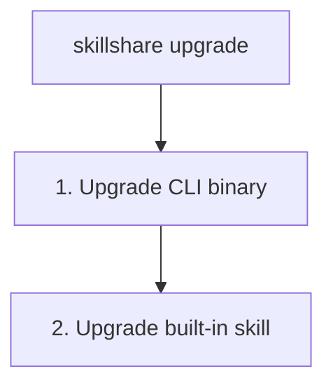

# upgrade

skillshare CLI binary와/또는 내장된 skillshare skill을 업그레이드합니다.

```bash
skillshare upgrade              # CLI와 skill 모두 업그레이드
skillshare upgrade --cli        # CLI만
skillshare upgrade --skill      # skill만
```

## 사용 시점

- 새 버전의 skillshare CLI가 있을 때
- 내장된 skillshare skill 업데이트가 필요할 때
- `doctor`가 업데이트 가능 여부를 보고한 후


## 동작 방식



## 옵션

| Flag | 설명 |
|------|-------------|
| `--cli` | CLI만 업그레이드 |
| `--skill` | skill만 업그레이드(설치되어 있지 않으면 프롬프트 표시) |
| `--force, -f` | 확인 프롬프트 생략 |
| `--dry-run, -n` | 변경 사항 적용 없이 미리보기 |
| `--help, -h` | 도움말 표시 |

## Homebrew 사용자

Homebrew로 설치했다면, `skillshare upgrade`는 자동으로 `brew upgrade`에 위임합니다.

```bash
skillshare upgrade
# → brew update && brew upgrade skillshare
```

Homebrew를 직접 사용할 수도 있습니다.

```bash
brew upgrade skillshare
```

## 예시

```bash
# 표준 업그레이드(CLI와 skill 모두)
skillshare upgrade

# 업그레이드될 내용 미리보기
skillshare upgrade --dry-run

# 프롬프트 없이 강제 업그레이드
skillshare upgrade --force

# CLI binary만 업그레이드
skillshare upgrade --cli

# skillshare skill만 업그레이드
skillshare upgrade --skill
```

## 업그레이드 후

skill을 업그레이드했다면, 배포를 위해 `skillshare sync`를 실행하세요.

```bash
skillshare upgrade --skill
skillshare sync  # 모든 target으로 배포
```

## 업그레이드 대상

### CLI 바이너리

`skillshare` 실행 파일 자체입니다. GitHub 릴리스에서 다운로드합니다.

binary가 보호된 디렉터리(예: `/usr/local/bin`)에 있으면, skillshare는 별도의 접두사 없이 자동으로 `sudo`를 사용해 업그레이드를 재실행합니다.

### Web UI 에셋

업그레이드 후, skillshare는 새 버전의 Web UI frontend asset을 미리 다운로드합니다. 이는 `~/.cache/skillshare/ui/<version>/`에 캐시되며 `skillshare ui`를 실행할 때 제공됩니다.

미리 다운로드가 실패하면(예: network 문제), 다음 `skillshare ui` 실행 시 대신 다운로드됩니다.

### skillshare Skill

AI CLI에 `/skillshare` command를 추가하는 내장 `skillshare` skill입니다. 위치:
```
~/.config/skillshare/skills/skillshare/SKILL.md
```

## 참고

- [update](/docs/reference/commands/update) — 다른 skill과 repo 업데이트
- [status](/docs/reference/commands/status) — 현재 버전 확인
- [doctor](/docs/reference/commands/doctor) — 문제 진단
