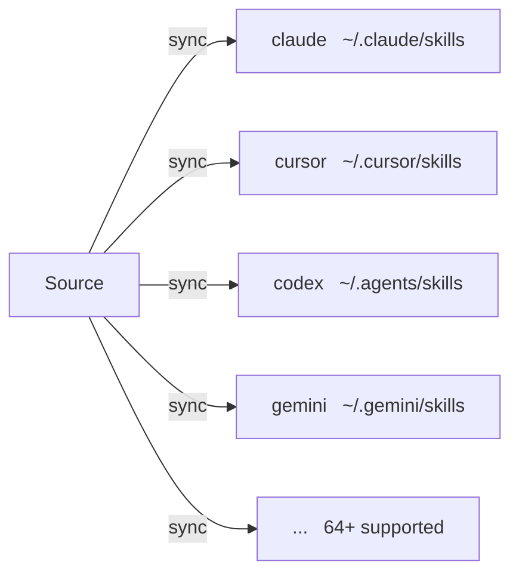

# Targets

Target은 skillshare가 동기화하는 AI CLI skill 디렉터리입니다.

## Overview



## What do you want to do?

| I want to... | Read |
|--------------|------|
| 어떤 AI CLI가 지원되는지 보고 싶다 | [Supported Targets](./supported-targets.md) |
| 기본 제공 목록에 없는 Target을 추가하고 싶다 | [Adding Custom Targets](./adding-custom-targets.md) |
| Sync 모드, 필터, 경로를 설정하고 싶다 | [Configuration](./configuration.md) |

## Quick Links

| Topic | Description |
|-------|-------------|
| [Supported Targets](./supported-targets.md) | 지원되는 64개 이상의 AI CLI 전체 목록 |
| [Adding Custom Targets](./adding-custom-targets.md) | skill 디렉터리를 가진 어떤 도구든 추가 |
| [Configuration](./configuration.md) | Config 파일 참조 |

---

## Common Operations

### List targets

```bash
skillshare target list
```

### Show target details

```bash
skillshare target claude
```

### Change sync mode

```bash
skillshare target claude --mode symlink
skillshare sync
```

### Add custom target

```bash
skillshare target add myapp ~/.myapp/skills
skillshare sync
```

### Remove target

```bash
skillshare target remove claude
```

---

## Auto-Detection

`skillshare init`을 실행하면, 설치된 AI CLI가 자동으로 감지되어 Target으로 추가됩니다.

존재하는 경로만 추가됩니다. 확인된 전체 경로 목록은 [Supported Targets](./supported-targets.md)를 참고하세요.

---

## Related

- [Source & Targets](/docs/understand/source-and-targets) — 핵심 개념
- [Sync Modes](/docs/understand/sync-modes) — Merge, copy, symlink
- [Commands: target](/docs/reference/commands/target) — target 명령어 세부 사항
