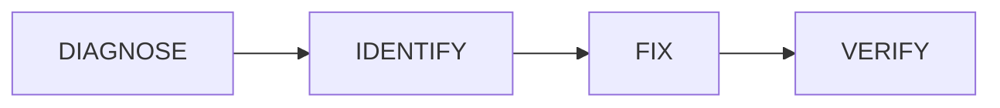

# Troubleshooting Workflow

문제를 진단하고 해결하는 체계적인 접근법입니다.

## Overview



---

## Step 1: Diagnose

doctor 명령어를 실행하세요.

```bash
skillshare doctor
```

**What it checks:**
- Source 디렉터리가 존재하고 유효한지
- Config 파일이 올바르게 형식화되어 있는지
- 모든 Target에 접근 가능한지
- symlink가 깨지지 않았는지
- Git repository 상태 (초기화된 경우)
- Skill 형식의 유효성

---

## Step 2: Identify the Issue

### Common symptoms and causes

| Symptom | Likely Cause | Quick Fix |
|---------|--------------|-----------|
| AI CLI에 skill이 표시되지 않음 | 동기화되지 않음 | `skillshare sync` |
| symlink가 깨짐 | Source가 삭제됨 | 복원 또는 재설치 |
| Config 오류 | 잘못된 YAML | `skillshare doctor`가 세부 사항을 보여줌 |
| push/pull 불가 | Git 문제 | git 상태를 수동으로 확인 |
| 권한 거부 | 잘못된 소유권 | 파일 권한 확인 |

---

## Step 3: Fix

### Sync issues

```bash
# 모든 Target 재동기화
skillshare sync

# 강제 동기화 (symlink 재생성)
skillshare sync --force
```

### Broken symlinks

```bash
# 상태 확인
skillshare status

# 재생성을 위해 동기화
skillshare sync
```

### Config issues

```bash
# 현재 config 보기
cat ~/.config/skillshare/config.yaml

# config 초기화
rm ~/.config/skillshare/config.yaml
skillshare init
```

### Git issues

```bash
cd ~/.config/skillshare/skills

# 상태 확인
git status

# pull 실패 (로컬 변경 사항)
git stash
git pull
git stash pop

# push 실패 (remote가 앞서 있음)
git pull
git push
```

### Target issues

```bash
# 제거 후 다시 추가
skillshare target remove claude
skillshare target add claude ~/.claude/skills
skillshare sync
```

---

## Step 4: Verify

```bash
# 상태 확인
skillshare status

# doctor 다시 실행
skillshare doctor

# AI CLI에서 테스트
# (skill 호출)
```

---

## Recovery Options

### Light recovery

```bash
# 그냥 재동기화
skillshare sync
```

### Medium recovery

```bash
# 백업에서 복원
skillshare restore claude
skillshare sync
```

### Heavy recovery (start fresh)

```bash
# 현재 상태 백업
skillshare backup

# config 제거 (skill은 보존됨)
rm ~/.config/skillshare/config.yaml

# 재초기화
skillshare init

# 동기화
skillshare sync
```

---

## Getting Help

문제를 해결할 수 없다면:

1. **정보 수집:**
   ```bash
   skillshare doctor > doctor-output.txt
   skillshare status >> doctor-output.txt
   ```

2. **FAQ 확인:** [Common Errors](/docs/troubleshooting/common-errors)

3. **이슈 보고:** [GitHub Issues](https://github.com/runkids/skillshare/issues)
   - doctor 출력 포함
   - 오류 메시지 포함
   - 하려고 했던 작업 설명

---

## Related

- [Common Errors](/docs/troubleshooting/common-errors) — 오류 메시지와 해결 방법
- [Windows Issues](/docs/troubleshooting/windows) — Windows 관련 문제
- [FAQ](/docs/troubleshooting/faq) — 자주 묻는 질문
- [Commands: doctor](/docs/reference/commands/doctor) — doctor 명령어
