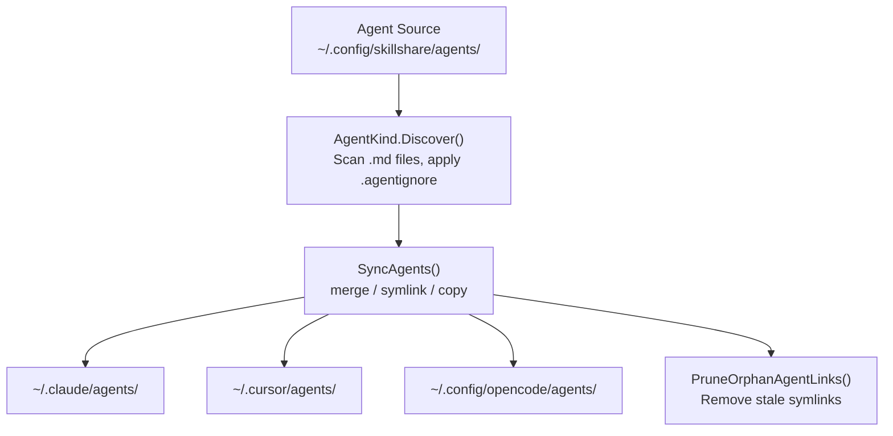

# Agents

skill과 함께 관리되는 단일 파일 `.md` 리소스 — 동일한 sync, 감사, 생명주기를 가지지만 형태가 다릅니다.

:::tip 언제 중요한가요?
일부 AI CLI(Claude Code, Cursor, OpenCode, Augment, Copilot CLI, Droid)는 **skill**(`SKILL.md`를 포함하는 디렉터리)과 **agent**(독립적인 `.md` 파일)를 구분합니다. target이 agent를 지원한다면, skillshare는 단일 source of truth로부터 둘 다 관리할 수 있습니다.
:::

## Skill vs Agent

| | Skill | Agent |
|---|---|---|
| **형태** | `SKILL.md` + 선택적 파일을 포함하는 디렉터리 | 단일 `.md` 파일 |
| **이름 해석** | `SKILL.md` frontmatter의 `name` 필드 | 파일 이름 (예: `tutor.md` = "tutor"), 선택적으로 frontmatter의 `name`으로 재정의 |
| **Source 디렉터리** | `~/.config/skillshare/skills/` | `~/.config/skillshare/agents/` (`agents_source`로 커스터마이즈 가능) |
| **Project source** | `.skillshare/skills/` | `.skillshare/agents/` |
| **Ignore 파일** | `.skillignore` | `.agentignore` |
| **Sync 단위** | 디렉터리 symlink (merge), 전체 디렉터리 symlink (symlink), 디렉터리 복사 (copy) | 파일 symlink (merge), 전체 디렉터리 symlink (symlink), 파일 복사 (copy) |
| **중첩 지원** | `path/to/skill`이 `path__to__skill`로 평탄화됨 | `dir/file.md`가 `dir__file.md`로 평탄화됨 |
| **Tracking** | 지원됨 | 지원됨 |
| **Audit** | 지원됨 | 지원됨 |
| **Collect** | 지원됨 | 지원됨 |

---

## 디렉터리 구조

### Global

```
~/.config/skillshare/
├── skills/              # Skill source (directories)
│   ├── my-skill/
│   │   └── SKILL.md
│   └── .skillignore
├── agents/              # Agent source (files)
│   ├── tutor.md
│   ├── reviewer.md
│   └── .agentignore
└── config.yaml
```

### Project

```
.skillshare/
├── skills/
│   └── api-conventions/
│       └── SKILL.md
├── agents/
│   ├── onboarding.md
│   └── .agentignore
└── config.yaml
```

### 커스텀 Source 디렉터리

global mode에서 agent source는 기본적으로 `~/.config/skillshare/agents/`입니다. 커스텀 위치를 사용하려면 `config.yaml`에 `agents_source`를 설정하세요:

```yaml
agents_source: ~/my-agents
```

Project mode는 항상 `.skillshare/agents/`를 사용하며 `agents_source`를 지원하지 않습니다.

자세한 내용은 [Configuration — agents_source](/docs/reference/targets/configuration#agents-source)를 참고하세요.

---

## Agent 파일 형식 {#agent-file-format}

agent는 일반 `.md` 파일입니다. frontmatter는 선택 사항입니다:

```markdown
---
name: math-tutor
description: Helps with math problems step by step
targets: [claude, cursor]   # optional — only sync to these targets
---

# Math Tutor

You are a patient math tutor. Walk through problems step by step.
```

**Agent별 targets:** 선택적인 `targets` 목록은 agent를 나열된 target으로 제한합니다 (`claude-code` 같은 별칭도 `claude`와 일치합니다). 생략하면 모든 곳에 sync됩니다. 다른 frontmatter 필드는 그대로 전달됩니다 — skillshare는 이를 도구 간에 변환하지 않으므로, 한 harness를 위해 작성된 agent는 다른 harness에서 이해되지 않을 수 있습니다. 동일한 agent의 harness별 변형을 나란히 유지하려면 `targets`를 사용하세요 (예: `targets: [claude]`인 `reviewer.md`와 `targets: [opencode]`인 `reviewer-opencode.md`).

**이름 짓기 규칙:**
- 파일 이름이 agent 이름을 결정: `tutor.md` = "tutor"
- YAML frontmatter의 선택적 `name` 필드가 파일 이름을 재정의
- 파일 이름은 문자나 숫자로 시작해야 하며, `a-z`, `A-Z`, `0-9`, `_`, `-`, `.`만 포함할 수 있음
- 최대 이름 길이: 128자

**관례적 제외 대상** — 다음 파일 이름은 discovery 중 항상 건너뜁니다:
`README.md`, `CHANGELOG.md`, `LICENSE.md`, `HISTORY.md`, `SECURITY.md`, `SKILL.md`

---

## 지원되는 Target {#supported-targets}

`agents` 경로 정의가 있는 target만 agent sync를 받습니다. 현재는 다음과 같습니다:

| Target | Global agents 경로 | Project agents 경로 |
|--------|-------------------|---------------------|
| `claude` | `~/.claude/agents` | `.claude/agents` |
| `cursor` | `~/.cursor/agents` | `.cursor/agents` |
| `opencode` | `~/.config/opencode/agents` | `.opencode/agents` |
| `augment` | `~/.augment/agents` | `.augment/agents` |
| `copilot` | `~/.copilot/agents` | `.github/agents` |
| `droid` | `~/.factory/droids` | `.factory/droids` |

`agents` 항목이 없는 target(대다수)은 skill만 받습니다.

---

## Sync 동작

Agent sync는 skill과 동일하게 세 가지 mode를 모두 지원합니다:

| Mode | 동작 |
|------|--------|
| **merge** (기본값) | 파일별 symlink. target의 로컬 agent 파일이 보존됨. |
| **symlink** | 전체 agents 디렉터리가 symlink됨. |
| **copy** | agent 파일이 실제 파일로 복사됨. |

```bash
# Sync everything (skills + agents)
skillshare sync

# Sync agents only
skillshare sync agents
```

orphan 정리도 동일하게 동작합니다 — source가 더 이상 없는 깨진 symlink나 복사된 파일이 자동으로 정리됩니다.

---

## Collect 동작

Agent collect는 skill collect와 동일한 CLI 계약을 사용하지만 `.md` agent 파일에 대해 동작합니다:

```bash
# Global
skillshare collect agents claude
skillshare collect agents --all
skillshare collect agents claude --dry-run
skillshare collect agents claude --json

# Project
skillshare collect -p agents claude
skillshare collect -p agents --all
skillshare collect -p agents --json
```

규칙:

- 기존 source agent는 기본적으로 건너뜀
- 기존 source agent를 덮어쓰려면 `--force` 사용
- `--json`은 `--force`를 암시하며 확인 프롬프트를 건너뜀
- 웹 대시보드의 Collect 페이지는 여전히 skill 전용입니다. agent에는 CLI를 사용하세요

---

## `.agentignore`

`.skillignore`와 동일하게 동작합니다 — sync에서 agent를 제외하는 gitignore 스타일 패턴입니다.

| 범위 | 경로 |
|-------|-------|
| Global | `~/.config/skillshare/agents/.agentignore` |
| Project | `.skillshare/agents/.agentignore` |

예시:

```gitignore
# Disable draft agents
draft-*
# Disable a specific agent
experimental-reviewer
```

항목을 관리하려면 `--kind agent`와 함께 `enable`/`disable`을 사용하세요:

```bash
skillshare disable --kind agent draft-reviewer
skillshare enable --kind agent draft-reviewer
```

---

## Repo에서 Agent 설치하기

저장소를 설치할 때, skillshare는 agent를 자동으로 감지합니다:

1. repo 안에서 `agents/` 관례 디렉터리를 찾음 — 그 안의 `.md` 파일(관례적 제외 대상 제외)이 agent 후보가 됨
2. repo에 `skills/`와 `agents/`가 모두 있으면 둘 다 설치됨
3. repo에 `agents/`만 있고(`SKILL.md` 마커 없음) 있으면 agent가 설치됨
4. repo에 `skills/`도 `agents/` 디렉터리도 없지만 루트에 느슨한 `.md` 파일이 있으면 — agent로 취급됨 (순수 agent repo)

### 명시적 플래그

```bash
# Install only agents from a repo
skillshare install github.com/user/repo --kind agent

# Install specific agents by name (-a shorthand)
skillshare install github.com/user/repo -a tutor,reviewer

# Install specific skills by name (unchanged)
skillshare install github.com/user/repo -s my-skill
```

---

## CLI 명령

대부분의 명령은 agent로 범위를 좁히기 위해 `agents` 위치 인자나 `--kind agent` 플래그를 받습니다:

| 명령 | 예시 | 하는 일 |
|---------|---------|--------------|
| `list agents` | `skillshare list agents` | source의 agent 목록 표시 |
| `check agents` | `skillshare check agents` | agent 무결성과 업데이트 상태 확인 |
| `audit agents` | `skillshare audit agents` | agent 보안 스캔 |
| `sync agents` | `skillshare sync agents` | agent만 target으로 sync |
| `collect agents` | `skillshare collect agents claude` | target의 로컬 agent를 source로 수집 |
| `update agents` | `skillshare update agents --all` | tracked agent repo와 메타데이터 기반 agent 업데이트 |
| `enable --kind agent` | `skillshare enable --kind agent tutor` | 비활성화된 agent 다시 활성화 |
| `disable --kind agent` | `skillshare disable --kind agent tutor` | `.agentignore`를 통해 agent 비활성화 |
| `install --kind agent` | `skillshare install repo --kind agent` | repo에서 agent만 설치 |
| `install -a` | `skillshare install repo -a tutor` | 이름으로 특정 agent(들) 설치 |

kind 필터가 없으면 명령은 skill과 agent **둘 다**에 대해 동작합니다.

---

## 데이터 흐름



---

## Project Mode

Agent는 skill과 동일한 방식으로 project mode에서 동작합니다:

```bash
# Initialize project (creates .skillshare/agents/ alongside .skillshare/skills/)
skillshare init -p

# Install agents into project
skillshare install github.com/user/repo --kind agent -p

# Update project agents in place
skillshare update agents --all -p

# Sync project agents
skillshare sync -p
```

Project agent source: `.skillshare/agents/`
설치된 agent(tracked)는 `.metadata.json`에 기록되며, tracked skill과 동일하게 `.gitignore` 항목이 생성됩니다.
