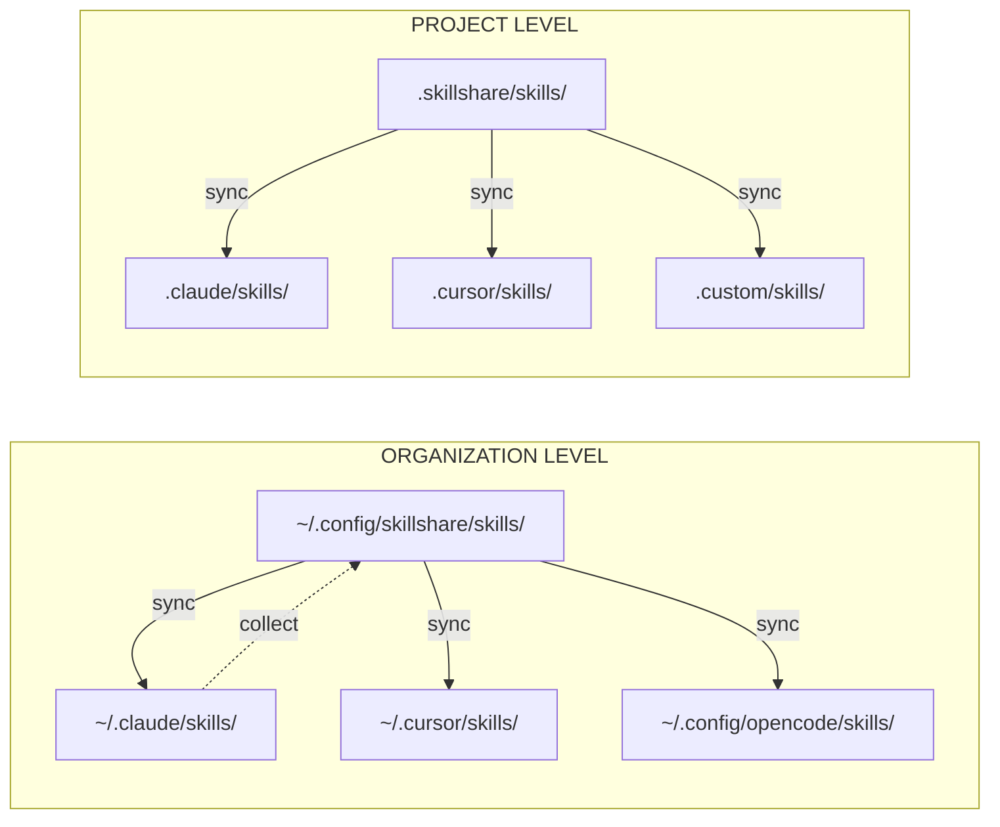

# 이해하기

이 개념들을 이해하면 skillshare를 최대한 활용할 수 있습니다.

## 무엇을 알고 싶으신가요?

| 질문 | 읽어보세요 |
|----------|------|
| skillshare는 어떻게 skill을 이동시키나요? | [Source & Targets](./source-and-targets.md) |
| merge와 symlink의 차이는 무엇인가요? | [Sync Modes](./sync-modes.md) |
| 조직 전체에 skill을 공유하려면 어떻게 하나요? | [Tracked Repositories](./tracked-repositories.md) |
| SKILL.md 안에는 무엇이 들어가나요? | [Skill Format](./skill-format.md) |
| 프로젝트 레벨 skill은 어떻게 동작하나요? | [Project Skills](./project-skills.md) |

## 개요

## 핵심 개념

| 개념 | 설명 | 더 알아보기 |
|---------|-----------|------------|
| **Source & Targets** | 하나의 source, 여러 목적지 | [→ Source & Targets](./source-and-targets.md) |
| **Sync Modes** | Merge, copy, symlink — 파일이 연결되는 방식 | [→ Sync Modes](./sync-modes.md) |
| **Tracked Repos** | `--track`로 설치한 git repo | [→ Tracked Repositories](./tracked-repositories.md) |
| **Skill Format** | SKILL.md 구조와 메타데이터 | [→ Skill Format](./skill-format.md) |
| **Project Skills** | 하나의 저장소에 국한된 프로젝트 레벨 skill | [→ Project Skills](./project-skills.md) |
| **Organization Skills** | tracked repository를 통한 조직 전체 skill | [→ Organization-Wide Skills](/docs/how-to/sharing/organization-sharing) |

---

## 요약

### Source & Targets
- **Source**: `~/.config/skillshare/skills/` — skill을 편집하는 곳
- **Targets**: AI CLI skill 디렉터리 — symlink를 통해 skill이 배포되는 곳

### Sync Modes
- **Merge** (기본값): 각 skill이 개별적으로 symlink되며, 로컬 skill이 보존됨
- **Copy**: 각 skill이 개별적으로 복사되며, 로컬 skill이 보존됨
- **Symlink**: 디렉터리 전체가 하나의 symlink

### Tracked Repos
- `--track`로 설치한 git repo
- `_` 접두사가 붙음 (예: `_team-skills/`)
- `skillshare update <name>`으로 업데이트

### Skill Format
- YAML frontmatter가 있는 `SKILL.md`
- 필수: `name` 필드
- 선택: `description`, 커스텀 메타데이터

### Project Skills
- 단일 저장소에 국한된 skill (`.skillshare/skills/`)
- git을 통해 팀과 공유 — `.skillshare/`가 존재하면 자동 감지
- 타겟별로 sync mode 설정 가능 (기본값 merge, symlink 선택 가능)

### Organization Skills
- tracked repository(`--track`)를 통해 모든 프로젝트에서 공유
- 한 번 설치하고 `skillshare update --all`로 업데이트
- project skill을 보완 — organization은 표준을, project는 저장소 컨텍스트를 담당

---

## 설계 철학

skillshare의 설계 결정에 대한 더 깊은 설명입니다.

| 주제 | 요약 |
|-------|-------|
| [Why Local-First](./philosophy/why-local-first) | 단일 바이너리, 의존성 없음, 기본적으로 오프라인 |
| [Security-First](./philosophy/security-first) | 15개 이상의 감사 패턴, 공급망 위협 모델 |
| [Sync Modes Deep Dive](./philosophy/sync-modes-explained) | Merge vs. symlink의 상세한 트레이드오프 |
| [Comparison](./philosophy/comparison) | skillshare와 다른 도구들의 비교 |
| [Skill Design](./philosophy/skill-design) | 효과적인 skill 작성을 위한 가이드라인 |
