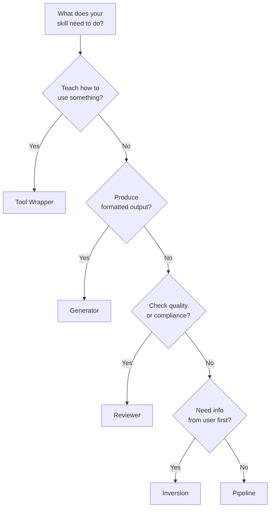

# Skill Design Patterns

skill을 빠르게 시작하기 위한 다섯 가지 구조적 템플릿. 패턴을 하나 고르고, `skillshare new`로 템플릿을 생성한 다음, 거기서부터 커스터마이즈하세요.

:::tip 빠른 시작
`skillshare new my-skill -P <pattern>`을 사용해 원하는 패턴의 템플릿을 생성하세요. 대화형 선택기를 원한다면 `skillshare new my-skill`을 실행하세요.
:::

---

## Part 1: 빠른 참조

### 패턴 개요

| 패턴 | 하는 일 | 사용 시점 |
|---------|-------------|----------|
| Tool Wrapper | agent에게 라이브러리/API 사용법을 가르침 | agent에게 도메인 특화 관례가 필요할 때 |
| Generator | 템플릿으로부터 구조화된 출력을 생성함 | 일관된 문서/코드 형식이 필요할 때 |
| Reviewer | 체크리스트에 대해 점수를 매기거나 감사함 | 코드 리뷰, 보안 감사, 품질 검사 |
| Inversion | agent가 행동하기 전에 사용자를 인터뷰함 | 요구사항 수집, 프로젝트 계획 |
| Pipeline | 체크포인트가 있는 다단계 워크플로우 | 검증 게이트가 필요한 복잡한 작업 |

### 어떤 패턴을 사용해야 하나요?



### 유스케이스 카테고리

skill을 생성할 때, 도메인을 나타내는 **category**로 태그를 붙일 수도 있습니다:

| 카테고리 | 설명 | 예시 |
|----------|-------------|----------|
| `library` | 라이브러리 및 API 참조 | `billing-lib`, `internal-platform-cli` |
| `verification` | 제품 검증 | `signup-flow-driver`, `checkout-verifier` |
| `data` | 데이터 조회 및 분석 | `funnel-query`, `grafana` |
| `automation` | 업무 프로세스 및 팀 자동화 | `standup-post`, `weekly-recap` |
| `scaffold` | 코드 스캐폴딩 및 템플릿 | `new-migration`, `create-app` |
| `quality` | 코드 품질 및 리뷰 | `adversarial-review`, `testing-practices` |
| `cicd` | CI/CD 및 배포 | `babysit-pr`, `deploy-service` |
| `runbook` | Runbook 및 장애 대응 | `oncall-runner`, `log-correlator` |
| `infra` | 인프라 운영 | `orphan-cleanup`, `cost-investigation` |

카테고리는 SKILL.md frontmatter에 저장되며 패턴과는 독립적입니다 — 어떤 패턴이든 어떤 카테고리와도 조합할 수 있습니다.

---

## Part 2: 상세 예시

### Tool Wrapper

관례와 사용 예시를 임베드하여 agent에게 특정 라이브러리, 프레임워크, API 사용법을 가르칩니다.

agent는 관례를 한 번 로드한 다음, 해당 라이브러리를 다루는 코드를 작성하거나 리뷰할 때마다 이를 적용합니다. 이는 도메인 특화 지식을 여러분의 머릿속이 아니라 반복 가능한 skill 안에 두게 해줍니다.

**SKILL.md 예시:**

```markdown
---
name: billing-lib
description: >-
  Conventions for the billing-lib SDK. Use when writing or reviewing
  code that imports billing-lib or handles payment flows.
pattern: tool-wrapper
category: library
---

# Billing Lib

## Core Conventions

Load and follow the rules in `references/conventions.md` before writing any code.

## When Reviewing Code

- Check that all API calls follow the conventions
- Verify error handling matches the library's patterns
- Ensure imports and initialization are correct

## When Writing Code

- Follow the conventions from `references/conventions.md`
- Use idiomatic patterns for this library/API
- Include error handling for common failure modes
```

**디렉터리 구조:**

```
billing-lib/
├── SKILL.md
└── references/
    └── conventions.md      # API patterns, error codes, initialization
```

**변형:** 일부 tool-wrapper skill은 복사해서 붙여넣을 수 있는 스니펫이 있는 `references/examples.md`를 포함하거나, 버전 업그레이드를 위한 `references/migration.md`를 포함합니다.

---

### Generator

스타일 가이드에 따라 템플릿을 채워서 구조화된 출력(문서, config 파일, 코드)을 만듭니다. agent가 사용자로부터 변수를 수집한 다음, 매번 일관된 출력을 생성합니다.

**SKILL.md 예시:**

```markdown
---
name: rfc-writer
description: >-
  Generates RFC documents following the team template. Use when user
  says "write an RFC", "new proposal", or "design doc".
pattern: generator
category: scaffold
---

# RFC Writer

## Steps

### Step 1: Load Style Guide

Read `references/style-guide.md` for formatting and naming rules.

### Step 2: Load Template

Read `assets/template.md` as the base structure.

### Step 3: Gather Input

Ask the user what they need generated. Collect all required variables.

### Step 4: Generate

Fill in the template following the style guide. Ensure all placeholders are replaced.

### Step 5: Deliver

Present the generated output. Ask if adjustments are needed.
```

**디렉터리 구조:**

```
rfc-writer/
├── SKILL.md
├── assets/
│   └── template.md         # RFC skeleton with placeholders
└── references/
    └── style-guide.md       # Formatting, section ordering, naming
```

**변형:** 일부 generator는 스타일 가이드를 생략하고 모든 규칙을 템플릿에 직접 넣습니다. 다른 것들은 서로 다른 문서 유형을 위해 `assets/`에 여러 템플릿을 포함합니다.

---

### Reviewer

정의된 체크리스트에 대해 작업을 채점하거나 감사합니다. agent가 대상을 읽고, 각 기준을 적용한 다음, 심각도 등급과 pass/fail 점수가 포함된 구조화된 보고서를 만듭니다.

**SKILL.md 예시:**

```markdown
---
name: pr-review
description: >-
  Reviews pull requests against the team quality checklist. Use when
  user says "review this PR", "check this code", or "audit quality".
pattern: reviewer
category: quality
---

# PR Review

## Steps

### Step 1: Load Checklist

Read `references/review-checklist.md` for the complete list of review criteria.

### Step 2: Understand

Read the code/document under review. Identify its purpose and scope.

### Step 3: Apply Rules

Evaluate each checklist item. Classify findings by severity:
- **Critical**: Must fix before proceeding
- **Warning**: Should fix, may cause issues later
- **Info**: Suggestion for improvement

### Step 4: Report

Produce a review report with:
1. Summary (pass/fail + one-line verdict)
2. Findings (severity, location, description)
3. Score (percentage of checklist items passed)
4. Top 3 recommended fixes
```

**디렉터리 구조:**

```
pr-review/
├── SKILL.md
└── references/
    └── review-checklist.md  # Criteria with severity weights
```

**변형:** 일부 reviewer skill은 각 규칙에 대해 좋은/나쁜 코드를 보여주는 `references/examples.md`를 포함합니다. 다른 것들은 가중치 채점을 위한 `references/scoring-rubric.md`를 추가합니다.

---

### Inversion

일반적인 상호작용을 뒤집습니다: 사용자가 agent에게 무엇을 할지 말하는 대신, agent가 행동에 나서기 전에 요구사항을 수집하기 위해 사용자를 인터뷰합니다. 이는 "먼저 만들고 나중에 묻는" 문제를 방지합니다.

**SKILL.md 예시:**

```markdown
---
name: project-planner
description: >-
  Plans a new project by interviewing the user about goals, constraints,
  and success criteria. Use when user says "plan a project", "new feature
  spec", or "help me think through this".
pattern: inversion
category: automation
---

# Project Planner

**DO NOT start building until all phases are complete.**

## Phase 1: Discovery

Ask the user these questions before proceeding:
- What is the goal?
- Who is the audience?
- What does success look like?

## Phase 2: Constraints

Ask the user about constraints:
- What are the technical limitations?
- What is the timeline?
- Are there existing patterns to follow?

## Phase 3: Synthesis

Based on the answers, load `assets/template.md` and produce a plan.
Present the plan for approval before executing.
```

**디렉터리 구조:**

```
project-planner/
├── SKILL.md
└── assets/
    └── template.md          # Plan document skeleton
```

**변형:** 일부 inversion skill은 인라인 대신 `references/interview-questions.md`에 고정된 질문 목록을 둡니다. 다른 것들은 질문을 하기 전에 기존 프로젝트 컨텍스트를 읽는 Phase 0을 추가합니다.

---

### Pipeline

각 단계마다 검증 게이트가 있는 다단계 워크플로우를 오케스트레이션합니다. agent는 진행하기 전에 각 체크포인트를 통과해야 하며, 이는 복잡한 작업에서 연쇄적인 실패를 방지합니다.

**SKILL.md 예시:**

```markdown
---
name: deploy-staging
description: >-
  Deploys to staging with pre-flight checks and rollback plan. Use when
  user says "deploy to staging", "push to staging", or "staging release".
pattern: pipeline
category: cicd
---

# Deploy Staging

## Steps

### Step 1: Prepare

Gather inputs and validate prerequisites:
- Confirm branch is clean (`git status`)
- Run tests (`make test`)
- Check CI status

### Step 2: Gate Check

Present the plan to the user.

**Do NOT proceed until user confirms.**

### Step 3: Execute

Run the deployment pipeline. After each stage, verify output before continuing:
1. Build: `make build`
2. Push: `make push-staging`
3. Health check: `curl -sf https://staging.example.com/health`

### Step 4: Quality Check

Review results against `references/quality-checklist.md`.
Report pass/fail status for each criterion.
```

**디렉터리 구조:**

```
deploy-staging/
├── SKILL.md
├── references/
│   └── quality-checklist.md  # Post-deploy verification criteria
├── assets/
│   └── rollback-plan.md      # Steps to undo if something fails
└── scripts/
    └── healthcheck.sh        # Automated health verification
```

**변형:** 일부 pipeline은 agent가 실행하는 자동화가 담긴 `scripts/` 디렉터리를 포함합니다. 다른 것들은 롤백 지침을 SKILL.md 본문에 직접 임베드합니다.

---

## 패턴은 조합됩니다

이 패턴들은 고정된 틀이 아니라 building block입니다. 실제 필요에 맞게 조합하세요:

- **Pipeline + Reviewer:** 완료로 표시하기 전에 체크리스트에 따라 배포를 채점하는 품질 리뷰 단계로 끝나는 배포 파이프라인.
- **Inversion + Generator:** 먼저 목표와 제약 사항에 대해 사용자를 인터뷰한 다음(Inversion), 수집된 정보로 템플릿을 채우는(Generator) RFC skill.
- **Tool Wrapper + Reviewer:** 관례를 가르치면서(Tool Wrapper) 기존 코드의 준수 여부도 감사할 수 있는(Reviewer) 라이브러리 skill.

하나의 패턴으로 시작한 다음, skill의 범위가 성장함에 따라 추가 패턴을 레이어로 쌓으세요.

---

## 참고

- [Skill Design](./skill-design.md) — 설계 원칙 (결정론성, progressive disclosure, 복잡도 매칭)
- [Creating Skills](/docs/how-to/daily-tasks/creating-skills) — 단계별 생성 가이드
- [Skill Format](/docs/understand/skill-format) — SKILL.md 구조와 메타데이터
