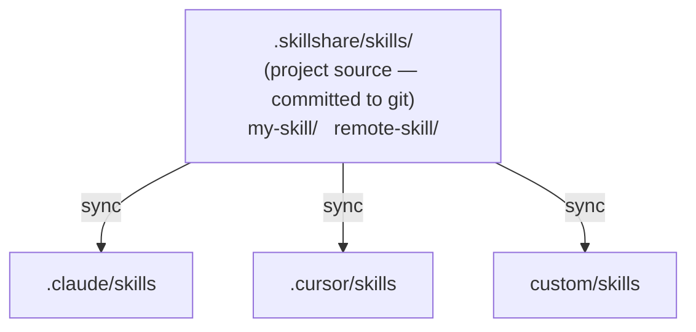

# Project Skills

skillshare를 프로젝트 레벨에서 실행하세요 — 하나의 저장소에 국한된 skill을 git을 통해 공유합니다.

:::tip 언제 중요한가요?
개인 global skill 컬렉션에 넣고 싶지 않은 저장소 전용 AI 지침(코딩 표준, 배포 가이드, API 관례)이 팀에 필요할 때 project skill을 사용하세요.
:::

## 사용 시나리오

| 시나리오 | 예시 |
|----------|---------|
| **모노레포 온보딩** | 새 개발자가 repo를 clone한 뒤 `skillshare install -p && skillshare sync`를 실행 — 즉시 프로젝트 컨텍스트 확보 |
| **API 관례** | API 스타일 가이드를 skill로 임베드하여 모든 AI assistant가 팀 관례를 따르게 함 |
| **도메인 특화 컨텍스트** | 규제 규칙이 있는 금융 앱, 규정 준수 가이드라인이 있는 헬스케어 앱 |
| **프로젝트 도구** | 이 repo 전용 CI/CD 배포 지식, 테스트 패턴, 마이그레이션 스크립트 |
| **온보딩 가속화** | "여기서 인증은 어떻게 동작하나요?" — 커밋된 project skill 덕분에 AI가 이미 알고 있음 |
| **오픈소스 프로젝트** | 유지관리자가 `.skillshare/`를 커밋하면 기여자가 clone 시 프로젝트 전용 AI 컨텍스트를 얻음 |
| **커뮤니티 skill 큐레이션** | repo의 `config.yaml`의 `skills:` 섹션이 큐레이션된 skill 목록 역할을 함 — 누구나 `install -p`로 동일한 설정을 얻을 수 있음 |

---

## 개요



---

## 자동 감지

현재 디렉터리에 `.skillshare/config.yaml`이 존재하면 skillshare는 자동으로 project mode로 진입합니다:

```bash
cd my-project/           # Has .skillshare/config.yaml
skillshare sync          # → Project mode (auto-detected)
skillshare status        # → Project mode (auto-detected)
```

:::tip 설정 불필요
`.skillshare/`가 있는 어떤 프로젝트로든 그냥 `cd`하면 skillshare가 자동으로 감지합니다. 플래그도, 환경 변수도, 설정도 필요 없습니다.
:::

특정 mode를 강제하려면:

```bash
skillshare sync -p       # Force project mode
skillshare sync -g       # Force global mode
```

---

## Global vs Project

| | Global Mode | Project Mode |
|---|---|---|
| **Source** | `~/.config/skillshare/skills/` | `.skillshare/skills/` (프로젝트 루트) |
| **Config** | `~/.config/skillshare/config.yaml` | `.skillshare/config.yaml` |
| **Targets** | 시스템 전체 AI CLI 디렉터리 | 프로젝트별 디렉터리 |
| **Sync mode** | Merge, copy, symlink (target별) | Merge, copy, symlink (target별, 기본값 merge) |
| **Tracked repos** | 지원 (`--track`) | 지원 (`--track -p`) |
| **Git 통합** | 선택 사항 (`push`/`pull`) | skill이 프로젝트 repo에 직접 커밋됨 |
| **범위** | 머신 상의 모든 프로젝트 | 단일 저장소 |

혼자만 사용하는 프로젝트를 위한 세 번째 방법도 있습니다: global 설정의 [`projects`](/docs/reference/targets/configuration#projects) 아래에 폴더를 나열하세요. 각 폴더는 자신만의 skill, agent, MCP 서버 세트를 받고, repo에는 아무것도 추가되지 않으며, 한 번의 `sync`로 모두 업데이트됩니다. 어떤 방식을 언제 선택할지는 [Many Projects, One Config](/docs/how-to/recipes/many-projects-one-config#scenario)를 참고하세요.

---

## `.skillshare/` 디렉터리 구조

```
<project-root>/
├── .skillshare/
│   ├── config.yaml              # Targets + settings (incl. extras)
│   ├── skills/.metadata.json     # Runtime metadata (hashes, timestamps — auto-managed, gitignored)
│   ├── .gitignore               # Ignores logs/, trash/, backups/, and cloned remote/tracked skill dirs
│   ├── extras/                  # Extras source directories
│   │   └── rules/               # e.g. extras init rules --target .claude/rules -p
│   │       └── coding.md
│   └── skills/
│       ├── my-local-skill/      # Created manually or via `skillshare new`
│       │   └── SKILL.md
│       ├── remote-skill/        # Installed via `skillshare install -p`
│       │   └── SKILL.md
│       ├── tools/               # Category folder (via --into tools)
│       │   └── pdf/             # Installed via `skillshare install ... --into tools -p`
│       │       └── SKILL.md
│       └── _team-skills/        # Installed via `skillshare install --track -p`
│           ├── .git/            # Git history preserved
│           ├── frontend/ui/
│           └── backend/api/
├── .claude/
│   └── skills/
│       ├── my-local-skill → ../../.skillshare/skills/my-local-skill
│       ├── remote-skill → ../../.skillshare/skills/remote-skill
│       ├── tools__pdf → ../../.skillshare/skills/tools/pdf
│       ├── _team-skills__frontend__ui → ../../.skillshare/skills/_team-skills/frontend/ui
│       └── _team-skills__backend__api → ../../.skillshare/skills/_team-skills/backend/api
└── .cursor/
    └── skills/
        └── (same symlink structure as .claude/skills/)
```

project mode의 symlink는 **상대 경로**를 사용합니다 (예: `../../.skillshare/skills/...`). 덕분에 프로젝트 디렉터리를 이식할 수 있습니다 — 이름을 바꾸거나, 옮기거나, 다른 머신에서 clone해도 모든 symlink가 계속 동작합니다. global mode는 source와 target이 서로 다른 파일시스템 위치에 있으므로 절대 경로를 사용합니다.

---

## 보이는 Project 디렉터리 {#visible-project-directory}

skill을 도구 상태가 아니라 검토 가능한 콘텐츠로 취급하는 저장소는 숨김 `.skillshare/` 대신 보이는 `skillshare/` 디렉터리를 사용할 수 있습니다:

```bash
skillshare init -p --visible
```

```
<project-root>/
├── skillshare/
│   ├── config.yaml
│   ├── skills/
│   └── agents/
└── src/
```

그 외에는 모두 동일합니다 — `config.yaml`, `skills/`, `agents/`, `extras/`, 그리고 운영용 `trash/`, `backups/`, `logs/` 디렉터리가 모두 사용 중인 프로젝트 디렉터리 안에 위치합니다.

감지는 먼저 `.skillshare/config.yaml`을 확인하고 그다음 `skillshare/config.yaml`을 확인하므로:

- 기존 프로젝트는 영향받지 않습니다.
- 두 디렉터리가 모두 존재하면 `.skillshare/`가 우선합니다.
- 기존 프로젝트를 옮기려면 `mv .skillshare skillshare`를 실행한 뒤 `skillshare sync -p`를 실행하여 여전히 기존 디렉터리를 가리키는 target symlink를 복구하세요. `sources` 설정이 명시적으로 `.skillshare/`를 참조한다면, sync 전에 `config.yaml`에서 해당 경로를 업데이트하세요.

`--visible` 없이 실행하는 `init -p`는 계속 `.skillshare/`를 생성합니다.

:::note
global config 디렉터리도 `skillshare`라고 불립니다 (`~/.config/skillshare/`). 프로젝트 루트 안의 `skillshare/` 디렉터리만 프로젝트로 취급됩니다.
:::

### 누락된 Config

프로젝트 명령은 아직 프로젝트가 없을 때 자동으로 프로젝트를 초기화하며, `--config local`을 사용하는 [공유 skill repo](/docs/how-to/recipes/centralized-skills-repo)도 gitignore된 `config.yaml`을 같은 방식으로 재생성합니다.

한 가지 경우에는 예외입니다: 프로젝트 디렉터리에 이미 skill이나 agent가 있는데 `config.yaml`이 누락된 경우, 재초기화하면 빈 config를 작성하여 구성된 모든 target을 잃게 됩니다. 이런 명령은 대신 문제를 보고하므로, 버전 관리에서 `config.yaml`을 복원하거나 의도적으로 `skillshare init -p`를 실행할 수 있습니다.

---

## Config 형식

`.skillshare/config.yaml`:

```yaml
targets:
  - claude                    # Known target (uses default path)
  - cursor                         # Known target
  - name: custom-ide               # Custom target with explicit path
    path: ./tools/ide/skills
    mode: symlink                  # Optional: "merge" (default), "copy", or "symlink"
  - name: codex                    # Optional filters (merge mode)
    include: [codex-*]
    exclude: [codex-experimental-*]
```

**Targets**는 두 가지 형식을 지원합니다:
- **짧은 형식**: target 이름만 (예: `claude`). 알려진 기본 경로와 merge mode를 사용합니다.
- **긴 형식**: `name`, 선택적 `path`, 선택적 `mode`(`merge`, `copy`, `symlink`), 그리고 선택적 `include`/`exclude` 필터를 가진 객체. 상대 경로(프로젝트 루트 기준으로 해석됨)와 `~` 확장을 지원합니다.

원격 skill 의존성은 `config.yaml`의 `skills:` 아래에 선언됩니다:

```yaml
targets:
  - claude
  - cursor

skills:
  - name: pdf
    source: anthropic/skills/pdf
  - name: _team-skills
    source: github.com/team/skills
    tracked: true
  - name: review
    source: github.com/team/skills/code-review
    group: frontend
```

**Skills** 목록은 원격 설치만 선언합니다. 로컬 skill은 여기에 항목이 필요 없습니다.

- `tracked: true`: `--track`으로 설치됨 (`.git/`이 보존된 git repo). 누군가 `skillshare install -p`를 실행하면, tracked skill은 전체 git 히스토리와 함께 clone되어 `skillshare update`가 올바르게 동작합니다.
- `group`: 하위 디렉터리 경로 (install 중 `--into`에 해당).

런타임 메타데이터(설치 타임스탬프, 파일 해시, 커밋 SHA)는 `.skillshare/skills/.metadata.json`에 별도로 저장됩니다 — 이 파일은 자동으로 관리되며 gitignore됩니다.

:::tip 이식 가능한 Skill Manifest
`config.yaml`은 선언적 skill manifest입니다. 프로젝트에서는 git에 커밋하면 누구나 `skillshare install -p && skillshare sync`를 실행할 수 있습니다. global mode의 경우, global config는 git으로 공유할 필요가 없으므로 `.metadata.json`이 manifest 역할을 합니다.
:::

---

## 커스텀 Source 디렉터리 {#custom-source-directories}

기본적으로 project mode는 `.skillshare/skills/`, `.skillshare/agents/`, `.skillshare/extras/`에서 skill, agent, extras를 읽습니다. skill 콘텐츠를 다른 프로젝트 문서와 함께 두고 싶다면, 선택적인 `sources` map으로 이 경로들을 재정의하세요:

```yaml
sources:
  skills: ./docs/skills
  agents: ./docs/agents
  extras: ./docs/extras
targets:
  - claude
```

각 키는 선택 사항입니다 — 키를 생략하면 기본 `.skillshare/<type>/` 경로로 대체됩니다. 경로는 프로젝트 루트를 기준으로 해석되며, 절대 경로(`~` 포함)도 동작합니다.

**일반적인 구성:**

```yaml
# Co-locate skill content with existing project docs
sources:
  skills: ./docs/skills

# Keep agents in an AI-focused subdirectory
sources:
  agents: ./ai/agents
```

**제약 조건:**

- **target 경로와 별칭 불가.** `skillshare sync -p`는 source가 target과 동일한 디렉터리로 해석되거나(또는 한쪽이 다른 쪽을 포함하는) config를 거부합니다. 이는 `sync --force`가 구성된 source를 지워버리는 것을 방지합니다. 예를 들어, `claude` target과 함께 사용된 `sources.skills: .claude/skills`는 `overlaps` 오류와 함께 거부됩니다.
- **외부 경로는 gitignore 관리를 건너뜁니다.** source가 프로젝트 루트 바깥(디스크의 다른 절대 경로)으로 해석되면, skillshare는 프로젝트의 `.gitignore`에 항목을 추가하지 않습니다. 필요하다면 source 디렉터리에서 직접 ignore 규칙을 관리하세요.
- **운영 디렉터리는 프로젝트 디렉터리에 남습니다.** Trash, backup, 운영 로그는 `sources` 설정과 무관하게 항상 활성 프로젝트 디렉터리(`.skillshare/` 또는 `skillshare/` — 아래 참고) 아래에 위치합니다.
- **`init -p`는 항상 프로젝트 디렉터리에 `{skills,agents}/`를 시드합니다.** 커스텀 source는 `config.yaml`을 편집한 후에만 적용됩니다.

---

## Mode 제한 사항

Project mode에는 의도적인 몇 가지 제한이 있습니다:

| 기능 | 지원? | 참고 |
|---------|-----------|-------|
| Merge sync mode | ✓ | 기본값, skill별 symlink |
| Copy sync mode | ✓ | `skillshare target <name> --mode copy -p`를 통해 target별로 |
| Symlink sync mode | ✓ | `skillshare target <name> --mode symlink -p`를 통해 target별로 |
| `--track` repos | ✓ | `.skillshare/skills/_repo/`에 clone되어 `.gitignore`에 추가됨 (`logs/`, `trash/`, `backups/`도 기본적으로 무시됨) |
| `--discover` | ✓ | 기존 프로젝트 config에 새 target을 감지하여 추가 |
| `push` / `pull` | ✗ | 프로젝트 repo에서 직접 git 사용 |
| `collect` | ✓ | 프로젝트 target에서 로컬 skill을 `.skillshare/skills/`로 수집 |
| `extras` | ✓ | Extras sync, init, list, remove, collect — 모두 `-p` 지원 |
| `backup` / `restore` | ✗ | 필요 없음 (프로젝트 target은 재현 가능함) |

---

## 언제 사용하나요: Project vs Organization

| 필요 | 사용 |
|------|------|
| **하나의 repo**에 특화된 skill (API 스타일, 배포, 도메인 규칙) | **Project skill** — repo에 커밋됨 |
| **모든 프로젝트**에서 공유되는 skill (코딩 표준, 보안 감사) | **Organization skill** — `--track`을 통한 tracked repo |
| 특정 프로젝트에 새 멤버 **온보딩** | **Project skill** — clone + install + sync |
| 조직에 새 멤버 **온보딩** | **Organization skill** — 하나의 install 명령 |
| repo 컨텍스트 **와** 조직 표준 모두 | **둘 다 사용** — 독립적으로 공존함 |

---

## 참고

- [Project Setup](/docs/how-to/sharing/project-setup) — 단계별 설정 가이드
- [Project Workflow](/docs/how-to/daily-tasks/project-workflow) — project mode의 일상적인 사용법
- [Organization-Wide Skills](/docs/how-to/sharing/organization-sharing) — 팀 전체 공유
