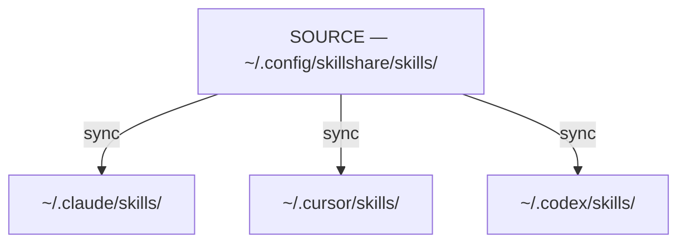
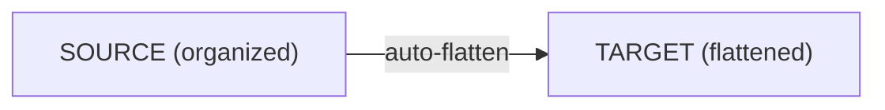

# Source & Targets

skillshare의 핵심 모델: 하나의 source, 여러 target.

:::tip 언제 중요한가요?
Source와 target의 차이를 이해하면 skill과 agent를 어디서 편집해야 하는지(항상 source에서 — 변경 사항은 symlink를 통해 반영됩니다), `sync`가 왜 별도의 단계인지, 그리고 `collect`가 반대 방향으로 어떻게 동작하는지 알 수 있습니다.
:::

## 문제 상황

skillshare가 없다면, 각 AI CLI마다 skill을 따로 관리해야 합니다:

```
~/.claude/skills/         # Edit here
  └── my-skill/

~/.cursor/skills/         # Copy to here
  └── my-skill/           # Now out of sync!

~/.codex/skills/          # And here
  └── my-skill/           # Also out of sync!
```

**문제점:**
- 한 곳에서 편집해도 다른 곳에 전파되지 않음
- 시간이 지나면서 skill들이 서로 어긋남
- 단일 진실 공급원(single source of truth)이 없음

---

## 해결책

skillshare는 모든 **target**과 동기화되는 **source 디렉터리**를 도입합니다:



**이점:**
- source에서 편집 → 모든 target이 즉시 업데이트됨
- target에서 편집 → 변경 사항이 source로 전달됨 (symlink를 통해)
- 단일 진실 공급원

---

## Sync가 별도 단계인 이유 {#why-sync-is-a-separate-step}

`install`, `update`, `uninstall` 같은 작업은 **source** 디렉터리만 수정합니다. 별도의 `sync` 단계가 모든 target에 변경 사항을 전파합니다. 이 2단계 설계는 의도적입니다:

**전파 전 미리보기** — `sync --dry-run`을 실행하면 모든 target에 적용되기 전에 무엇이 변경될지 검토할 수 있습니다. 특히 `uninstall`이나 `--force` 작업 이후에 유용합니다.

**여러 변경 사항을 일괄 처리** — skill 5개를 설치한 다음 한 번만 sync하세요. 분리되어 있지 않다면 각 설치마다 모든 target에서 전체 스캔과 symlink 업데이트가 트리거됩니다.

**기본적으로 안전함** — source의 변경 사항은 즉시 반영되지 않고 대기 상태로 유지됩니다. target이 언제 업데이트될지 사용자가 직접 제어합니다. 또한 `uninstall`은 skill을 영구 삭제하는 대신 trash 디렉터리로 이동시키므로(7일간 보관), 실수로 제거해도 복구할 수 있습니다.

:::tip 예외: pull
`pull`은 `git pull` 이후 자동으로 sync를 실행합니다. "원격에서 모든 것을 최신 상태로 가져온다"는 의도이므로, 자동 sync가 기대되는 동작과 일치합니다.
:::

:::info sync가 필요하지 않은 경우
기존 skill을 편집하는 것은 sync가 필요하지 않습니다 — symlink 덕분에 변경 사항이 모든 target에 즉시 반영됩니다. skill 집합이 변경되거나(추가, 제거, 이름 변경), target이나 mode가 변경될 때만 sync가 필요합니다.
:::

---

## Source 디렉터리

**기본 위치:** `~/.config/skillshare/skills/`

여기는 다음이 이루어지는 곳입니다:
- skill을 생성하고 편집
- skill이 설치되는 곳
- git이 변경 사항을 추적 (여러 기기 간 sync를 위해)

:::tip Symlink된 source 디렉터리
source 디렉터리는 symlink일 수 있습니다 — dotfiles 관리 도구(GNU Stow, chezmoi, yadm)를 사용할 때 흔합니다. 예를 들어, `~/.config/skillshare/skills/ → ~/dotfiles/ss-skills/`처럼요. skillshare는 스캔 전에 symlink를 해석하므로 모든 명령이 투명하게 동작합니다. 체인으로 연결된 symlink도 지원됩니다.
:::

**구조:**
```
~/.config/skillshare/skills/
├── my-skill/
│   └── SKILL.md
├── code-review/
│   └── SKILL.md
├── _team-skills/          # Tracked repo (underscore prefix)
│   ├── frontend/
│   │   └── ui/
│   └── backend/
│       └── api/
└── ...
```

### 폴더로 정리하기 (자동 평탄화) {#organize-with-folders-auto-flattening}

폴더를 사용해 자신의 skill을 정리할 수 있습니다 — target으로 sync될 때 자동으로 평탄화됩니다:



**이점:**
- 프로젝트, 팀, 카테고리별로 skill을 정리
- 수동으로 평탄화할 필요 없음
- AI CLI는 기대하는 평평한 구조를 그대로 받음
- 폴더 이름이 추적성을 위한 접두사가 됨

---

## Agents Source

Agent는 skill과 병렬적인 리소스 종류입니다. `skills/` 옆에 자체 source 디렉터리를 가지며, 동일한 source-and-targets 모델을 따릅니다:

```
~/.config/skillshare/
├── skills/                    # Skills source (directories)
│   └── my-skill/
│       └── SKILL.md
└── agents/                    # Agents source (single .md files)
    ├── reviewer.md
    └── auditor.md
```

동일한 `skillshare init` 실행이 두 디렉터리를 모두 생성합니다. Agent는 (중첩 디렉터리 없이) 단일 `.md` 파일이며 `skillshare sync`를 통해 동기화됩니다 (또는 agent만 대상으로 하려면 `skillshare sync agents`).

**Agent를 지원하는 Target.** 모든 AI CLI가 agent 디렉터리를 노출하는 것은 아닙니다. 지원하는 target은 다음과 같습니다:

- `~/.claude/agents/` — Claude Code
- `~/.cursor/agents/` — Cursor
- `~/.augment/agents/` — Augment
- `~/.config/opencode/agents/` — OpenCode
- `~/.factory/droids/` — Droid

그 외의 target은 agent sync 시 자동으로 건너뜁니다 (`target(s) skipped for agents (no agents path)` 경고와 함께). skill에 적용되는 것과 동일한 merge / copy / symlink mode가 agent에도 적용됩니다.

전체 agent 파일 형식, `.agentignore` 규칙, discovery 시맨틱스는 [Agents](/docs/understand/agents)를 참고하세요.

---

## 커스텀 Source 디렉터리

기본적으로 global mode는 `~/.config/skillshare/skills/`에서 skill을, `~/.config/skillshare/agents/`에서 agent를 읽고, skills source로부터 extras의 상위 경로를 도출합니다. v0.19.16부터, 선택적인 최상위 `sources` map을 사용하면 이 중 무엇이든 재정의할 수 있습니다:

```yaml
# ~/.config/skillshare/config.yaml
sources:
  skills: ~/work/skills
  agents: ~/work/agents
  extras: ~/work/extras
targets:
  claude:
    skills:
      path: ~/.claude/skills
```

각 키는 선택 사항입니다 — 키를 생략하면 내장 기본값이 유지됩니다. 경로는 `~`(home 확장)와 절대 경로를 지원합니다.

**일반적인 구성:**

```yaml
# Point all three at a shared dotfiles directory
sources:
  skills: ~/dotfiles/skillshare/skills
  agents: ~/dotfiles/skillshare/agents
  extras: ~/dotfiles/skillshare/extras

# Override only skills; agents and extras keep their defaults
sources:
  skills: ~/projects/team-skills
```

### 하위 호환성

v0.19.16 이전의 최상위 필드도 여전히 지원되며 변경 없이 계속 동작합니다:

```yaml
# Legacy format — fully supported, no auto-migration on save
source: ~/.config/skillshare/skills
agents_source: ~/.config/skillshare/agents
extras_source: ~/.config/skillshare/extras
```

두 형식이 모두 존재할 경우, `sources.<key>` 값이 해당 레거시 필드보다 우선합니다. 기존 설정은 자동으로 재작성되지 않습니다 — 새로 실행하는 `skillshare init`만 새로운 `sources:` 형태를 생성합니다.

### 이것이 중요한 경우

동일한 기능이 project mode에도 존재합니다 (project mode 형식은 [Project Skills](/docs/understand/project-skills#custom-source-directories)를 참고하세요. 여기서는 프로젝트 루트 기준 상대 경로도 지원합니다).

---

## Targets

Target은 skillshare가 sync하는 AI CLI skill 디렉터리입니다.

**일반적인 target:**
- `~/.claude/skills/` — Claude Code
- `~/.cursor/skills/` — Cursor
- `~/.agents/skills/` — OpenAI Codex CLI (공유 `universal` 디렉터리)
- `~/.gemini/config/skills/` — Antigravity (앱)
- `~/.gemini/antigravity-cli/skills/` — Antigravity CLI
- `~/.gemini/skills/` — Gemini CLI
- 그 외 [64개 이상](/docs/reference/targets/supported-targets)

**자동 감지:** `skillshare init`을 실행하면 설치된 AI CLI를 자동으로 감지하여 target으로 추가합니다.

**수동 추가:**
```bash
skillshare target add myapp ~/.myapp/skills
```

---

## Sync 동작 방식

### Source → Targets (`sync`)

```bash
skillshare sync
```

각 target에서 source로 연결되는 symlink를 생성합니다:
```
~/.claude/skills/my-skill → ~/.config/skillshare/skills/my-skill
```

### Target → Source (`collect`)

```bash
skillshare collect claude
```

target에서 로컬 skill을 source로 다시 수집합니다:
1. target에서 symlink되지 않은 skill을 찾음
2. source로 복사 (`.git/` 디렉터리는 자동으로 제외됨)
3. symlink로 교체

---

## Skill 편집

target이 source와 symlink되어 있으므로 어디서든 편집할 수 있습니다:

**Source에서 편집:**
```bash
$EDITOR ~/.config/skillshare/skills/my-skill/SKILL.md
# Changes visible in all targets immediately
```

**Target에서 편집:**
```bash
$EDITOR ~/.claude/skills/my-skill/SKILL.md
# Changes go to source (same file via symlink)
```

---

## 참고

- [sync](/docs/reference/commands/sync) — source에서 target으로 변경 사항 전파
- [collect](/docs/reference/commands/collect) — target에서 source로 skill을 다시 가져오기
- [Sync Modes](./sync-modes.md) — 파일이 연결되는 방식 (merge, copy, symlink)
- [Agents](./agents.md) — Agent 리소스 모델과 discovery
- [Configuration](/docs/reference/targets/configuration) — Target 설정 참조
