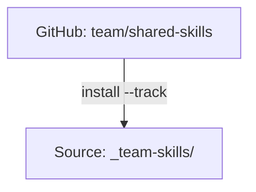

# Tracked Repositories

팀 공유와 손쉬운 업데이트를 위해 `--track`으로 설치한 git repo.

:::tip 언제 중요한가요?
Tracked repo는 조직이 공유 skill을 배포하는 방법입니다. `--track`으로 한 번 설치하면 단일 명령으로 업데이트할 수 있습니다. 변경 사항은 관리자의 repo에서 모든 팀원에게 흘러갑니다.
:::

## 개요

Tracked repository는 `.git` 디렉터리를 그대로 보존한 채 source에 clone된 git repo입니다. 이를 통해 다음이 가능합니다:

- **팀 공유**: 모두가 같은 repo를 설치
- **손쉬운 업데이트**: `skillshare update <name>`이 git pull을 실행
- **버전 관리**: 어떤 커밋에 있는지 추적



---

## 일반 Skill vs Tracked Repo

| 측면 | 일반 Skill | Tracked Repo |
|--------|---------------|--------------|
| Source | source로 복사됨 | `.git`과 함께 clone됨 |
| Update | `install --update` | `update <name>` (git pull) |
| 접두사 | 없음 | `_` 접두사 |
| 중첩 skill | 평탄화됨 | `__`로 평탄화됨 |

---

## Tracked Repo 설치하기

```bash
skillshare install github.com/team/shared-skills --track
skillshare sync
```

**일어나는 일:**
1. repo가 `~/.config/skillshare/skills/_team-skills/`로 clone됨
2. `.git` 디렉터리가 보존됨
3. clone 디렉터리가 관리되는 `.gitignore` 블록에 추가되어 머신 로컬 상태로 유지되며, 중첩된 git repo로 커밋되지 않음
4. 활성 install 임계값(`audit.block_threshold` 또는 `--threshold`)을 사용해 전체 repo가 보안 감사됨
5. AI CLI를 위해 중첩된 skill이 평탄화됨

발견 사항이 임계값에 도달하면 `--force`를 사용하지 않는 한 설치가 차단됩니다. 차단 시 skillshare는 clone된 repo를 자동으로 제거합니다. 정리에 실패하면 수동 정리를 위한 정확한 경로를 명령이 보고합니다.

---

## 언더스코어 접두사

Tracked repo는 일반 skill과 구분하기 위해 `_` 접두사가 붙습니다:

```
~/.config/skillshare/skills/
├── my-skill/           # Regular skill (no prefix)
├── code-review/        # Regular skill
└── _team-skills/       # Tracked repo (underscore prefix)
```

---

## 중첩 Skill과 자동 평탄화 {#nested-skills--auto-flattening}

skill repo는 종종 폴더 안에 skill을 정리합니다. skillshare는 AI CLI를 위해 이를 자동으로 평탄화합니다:

```
SOURCE                              TARGET
(your organization)                 (what AI CLI sees)
────────────────────────────────────────────────────────────
_team-skills/
├── frontend/
│   ├── react/          ───►   _team-skills__frontend__react/
│   └── vue/            ───►   _team-skills__frontend__vue/
├── backend/
│   └── api/             ───►   _team-skills__backend__api/
└── devops/
    └── deploy/         ───►   _team-skills__devops__deploy/

• _ prefix = tracked repository
• __ (double underscore) = path separator
```

### 왜 자동 평탄화인가?

| 이점 | 설명 |
|---------|-------------|
| **AI CLI 호환성** | 대부분의 AI CLI는 중첩 폴더가 아닌 평평한 디렉터리에 skill이 있기를 기대합니다 |
| **조직 구조 보존** | CLI 요구 사항을 충족하면서 source에서는 논리적인 폴더 구조를 유지합니다 |
| **추적성** | 평탄화된 이름이 출처 경로를 보여줍니다 (예: `_team__frontend__react` → `_team/frontend/react/`에서 왔음을 알 수 있음) |
| **수작업 불필요** | skillshare가 sync 중에 자동으로 변환을 처리합니다 |

**여러분은 정리하고, skillshare는 맞춥니다.** 어떤 폴더 구조로든 skill을 작성하세요. 어디서든 동작할 것입니다.

:::tip
자동 평탄화는 **모든 skill**에 적용되며, tracked repo에만 국한되지 않습니다. 개인 skill도 폴더로 정리할 수 있습니다. [폴더로 정리하기](/docs/understand/source-and-targets#organize-with-folders-auto-flattening)를 참고하세요.
:::

---

## 새 Clone 이후 복구하기 {#rehydrating-after-a-fresh-clone}

Tracked repo clone 디렉터리는 자체 `.git` 디렉터리를 포함하기 때문에 의도적으로 git에서 무시됩니다. 새 머신에서 skillshare source repo를 clone하거나 pull하면, `_team-skills/` clone 디렉터리가 아직 없는 상태에서 `.metadata.json`이 이미 tracked repo를 선언하고 있을 수 있습니다.

메타데이터로부터 누락된 tracked repo clone을 재생성하려면 인자 없이 install을 실행하세요:

```bash
skillshare install
skillshare sync
```

Project mode의 경우 다음을 실행하세요:

```bash
skillshare install -p
skillshare sync -p
```

`status`, `check`, `update --all`, `doctor`는 누락된 tracked repo clone을 보고하며, 조용히 무시하는 대신 `skillshare install`을 제안합니다.

---

## Tracked Repo 업데이트하기

### 단일 repo

```bash
skillshare update _team-skills
skillshare sync
```

### 모든 tracked repo

```bash
skillshare update --all
skillshare sync
```

**일어나는 일:**
```
cd ~/.config/skillshare/skills/_team-skills
git pull origin main
```

**업데이트 중 보안 동작:**
- pull 이후 업데이트된 콘텐츠가 감사됩니다.
- 차단은 활성 임계값(기본값은 `audit.block_threshold`, 또는 명령별 `--threshold`/`-T` 재정의)을 사용합니다.
- TTY mode에서는 `skillshare update`가 발견 사항이 임계값에 도달하면 확인을 요청합니다. non-TTY mode에서는 (`--skip-audit`을 사용하지 않는 한) 자동으로 롤백됩니다.
- 거부 시, tracked repo는 로컬 상태를 보존하기 위해 이전 커밋으로 롤백됩니다.
- 롤백 기준점 캡처가 실패하면 안전을 위해 업데이트가 중단됩니다 (fail-closed).

---

## 제거하기

```bash
skillshare uninstall _team-skills
```

**일어나는 일:**
1. 커밋되지 않은 변경 사항이 있는지 확인 (있으면 경고)
2. 디렉터리 제거
3. 다음 `sync`에서 target의 symlink 제거

---

## Project Mode

Tracked repo는 project mode에서도 동작합니다. repo는 `.skillshare/skills/`에 clone되어 `.skillshare/.gitignore`에 추가됩니다 (tracked repo의 git 히스토리가 여러분 프로젝트의 git과 충돌하지 않도록). Project 로그(`.skillshare/logs/`), trash(`.skillshare/trash/`), backup(`.skillshare/backups/`)도 기본적으로 무시됩니다.

Tracked repo를 설치하면 `.skillshare/.metadata.json`에 `tracked: true`가 자동으로 기록되어, 새 팀원이 `skillshare install -p`를 통해 올바른 clone 동작을 얻을 수 있습니다:

```json
{
  "skills": [
    {
      "name": "_team-shared-skills",
      "source": "github.com/team/shared-skills",
      "tracked": true
    }
  ]
}
```

```bash
# Install tracked repo into project
skillshare install github.com/team/shared-skills --track -p
skillshare sync

# Update via git pull
skillshare update team-skills -p
skillshare sync

# Force update (discard local changes)
skillshare update team-skills -p --force

# Uninstall
skillshare uninstall team-skills -p
```

**디렉터리 구조:**

```
<project-root>/
└── .skillshare/
    ├── .gitignore           # Contains: logs/, trash/, and skills/_team-skills
    └── skills/
        └── _team-skills/    # Tracked repo with .git/ preserved
            ├── .git/
            ├── frontend/ui/
            └── backend/api/
```

프로젝트 로그를 의도적으로 커밋하고 싶다면, `.skillshare/.gitignore`의 관리 블록 뒤에 `!logs/`와 `!logs/*.log`를 추가하세요.

중첩 skill은 global mode와 동일한 방식으로 자동 평탄화됩니다 — `_team-skills/frontend/ui`는 target에서 `_team-skills__frontend__ui`가 됩니다.

---

## 커스텀 이름

```bash
skillshare install github.com/team/skills --track --name acme-skills
# Installed as: _acme-skills/
```

`--track --name`의 이름 제약 조건:
- `_`로 시작하는 tracked repo 디렉터리 이름으로 해석되어야 합니다.
- 경로 구분자(`/`, `\`)나 상위 디렉터리 탐색(`..`)을 포함할 수 없습니다.
- 유효하지 않은 이름은 clone 전에 거부됩니다.

---

## 브랜치 추적

저장소의 특정 브랜치를 추적할 수 있습니다:

```bash
skillshare install github.com/team/skills --track --branch frontend
```

Tracked repo는 clone된 뒤 지정된 브랜치를 따릅니다. `skillshare update`를 통한 업데이트는 자동으로 해당 브랜치에서 pull합니다.

동일한 repo를 여러 브랜치로 설치하려면, 이름 충돌을 피하기 위해 `--name`을 사용하세요:

```bash
skillshare install github.com/team/skills --track --branch frontend --name team-frontend
skillshare install github.com/team/skills --track --branch backend --name team-backend
```

브랜치는 일반(tracked가 아닌) install에서도 동작합니다:

```bash
skillshare install github.com/team/skills --branch develop --all
```

브랜치는 skill 메타데이터에 유지되므로, `skillshare update`와 `skillshare check`가 자동으로 올바른 브랜치를 사용합니다.

---

## 충돌 감지

여러 skill이 같은 `name` 필드를 공유할 때, sync는 `include`/`exclude` 필터가 적용된 후 실제로 동일한 target에 도달하는지 확인합니다.

**필터가 충돌을 격리함** — 정보성 메시지일 뿐입니다:

```
ℹ Duplicate skill names exist but are isolated by target filters:
  'ui' (2 definitions)
```

**충돌이 동일한 target에 도달함** — 실행 가능한 경고입니다:

```
⚠ Target 'claude': skill name 'ui' is defined in multiple places:
  - _team-a/frontend/ui
  - _team-b/components/ui
Rename one in SKILL.md or adjust include/exclude filters
```

**모범 사례** — skill에 네임스페이스를 부여하거나 필터를 사용하세요:

```yaml
# Option 1: Namespace in SKILL.md
name: team-a-ui

# Option 2: Route with filters (global config)
targets:
  codex:
    path: ~/.codex/skills
    include: [_team-a__*]
  claude:
    path: ~/.claude/skills
    include: [_team-b__*]
```

```yaml
# Option 2: Route with filters (project config)
targets:
  - name: claude
    exclude: [codex-*]
  - name: codex
    include: [codex-*]
```

전체 문법과 예시는 [Target Filters](/docs/reference/targets/configuration#include--exclude-target-filters)를 참고하세요.

---

## 참고

- [install](/docs/reference/commands/install) — `--track`으로 설치
- [update](/docs/reference/commands/update) — 최신 변경 사항 pull
- [check](/docs/reference/commands/check) — 사용 가능한 업데이트 확인
- [Organization-Wide Skills](/docs/how-to/sharing/organization-sharing) — 팀 공유 가이드
