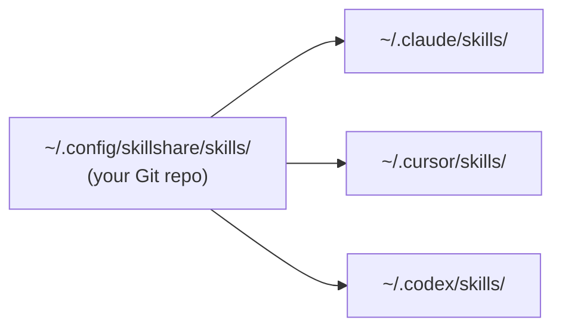

# 快速上手

skillshare 让一个 Source 目录与你机器上每个 AI CLI 的 skill 目录保持同步。你只需编写或安装一次 skill，symlink 会让它同时出现在 Claude、Cursor、Codex 以及其他任何已配置的 Target 中。



Source 就是一个你自己的普通 Git repo。在一台机器上 push，在另一台 pull，或者分享给同事 —— 底层的 symlink 由 skillshare 负责处理。

## Source 里都有什么

Source 目录里共存着三类 skills。它们的区别只在于 Git 如何追踪，以及你怎么更新它们。

**你自己编写的 skills。** 用 `skillshare new <name>` 创建，或者直接放一个文件夹进去。会提交到你的 repo，靠编辑来更新。

**Vendored skills。** 用 `skillshare install <url>` 安装。clone 下来的内容直接放在你的 repo 里，和你自己的成果一起提交。`.metadata.json` 记录了上游 URL，之后 `skillshare update` 就能拉取新版本。适合你想做定制、锁定版本，或者希望离线可复现的场景。

**Tracked skills。** 用 `skillshare install <url> --track` 安装。clone 内容会落在一个 `_` 前缀的目录里，该目录会被自动加入 `.gitignore`，因此永远不会进入你的 repo。`skillshare update` 会从上游重新拉取。适合那些你不打算改动的公司或社区 repo。

用上几个月后，典型的 Source 大致长这样：

```
~/.config/skillshare/skills/
├── my-review/                 # authored
├── my-deploy-checklist/       # authored
├── agent-browser/             # vendored
├── skill-creator/             # vendored
├── _company-skills/           # tracked  (gitignored)
└── _team-rules/               # tracked  (gitignored)
```

## 选一个起点

| 你的情况是…… | 从这里开始 |
|---|---|
| 第一次配置 skillshare | [第一次 Sync](./first-sync.md) |
| Claude / Cursor / Codex 里已经有 skills | [从现有 Skills 迁移](./from-existing-skills.md) |
| 只想快速查命令语法 | [速查表](./quick-reference.md) |
| 不想安装，先随便玩玩 | [Docker Playground](/docs/how-to/advanced/docker-sandbox#playground) |

## 接下来

- [核心概念](/docs/understand) —— 深入讲解 Source、Targets、Sync 模式
- [日常工作流](/docs/how-to/daily-tasks/daily-workflow) —— 日常使用方式
- [命令参考](/docs/reference/commands) —— 完整命令文档
