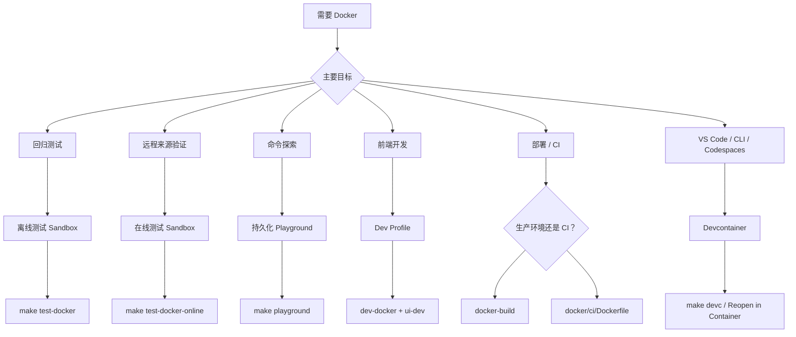

# Docker：测试、开发与部署

使用 Docker 进行可重复的测试、无需 Go 环境的前端开发、生产部署，以及 CI 中的自动化 Skill 验证。

## 模式选择图



命令对照：

| 命令 | `mise` | `make` |
|---|---|---|
| 测试（离线） | `mise run test:docker` | `make test-docker` |
| 测试（在线） | `mise run test:docker:online` | `make test-docker-online` |
| **Playground**（启动 + shell） | **`mise run playground`** | **`make playground`** |
| Playground（停止） | `mise run playground:down` | `make playground-down` |
| Sandbox（进阶） | — | `./scripts/sandbox.sh <up\|down\|shell\|reset\|status\|logs\|bare>` |
| **Devcontainer**（启动 + shell） | **`mise run devc`** | **`make devc`** |
| Devcontainer（仅启动） | `mise run devc:up` | `make devc-up` |
| Devcontainer（停止） | `mise run devc:down` | `make devc-down` |
| Devcontainer（重启） | `mise run devc:restart` | `make devc-restart` |
| Devcontainer（完全重置） | `mise run devc:reset` | `make devc-reset` |
| Devcontainer（状态） | `mise run devc:status` | `make devc-status` |
| Dev API 服务器 | `mise run dev:docker` | `make dev-docker` |
| Dev 停止 | `mise run dev:docker:down` | `make dev-docker-down` |
| Docker 构建 | `mise run docker:build` | `make docker-build` |
| Docker 多架构 | `mise run docker:build:multiarch` | `make docker-build-multiarch` |

## 各模式用途

| 模式 | 适用场景 | 网络 | 生命周期 |
|------|----------|---------|-----------|
| 离线测试 Sandbox | 稳定的回归测试（`build + unit + integration`） | 禁用 | 一次性 |
| 在线测试 Sandbox | 可选的远程 install/update 检查 | 启用 | 一次性 |
| 交互式 Playground | 手动命令探索与演示 | 启用 | 持久化 |
| Dev Profile | Docker 中的 Go API 服务器 + 主机上的 Vite HMR | 启用 | 持久化 |
| Devcontainer | 一键式 VS Code / Codespaces 开发环境 | 启用 | 持久化 |
| 生产镜像 | 轻量级部署（`docker/production/`） | 启用 | 持久化 |
| CI 镜像 | 流水线中的 Skill 验证（`docker/ci/`） | 启用 | 一次性 |

---

## 常见场景

### 1. 确定性地验证本地 install/update 逻辑

在修改 `install` / `update` 行为、需要类似 CI 的本地验证关卡时使用。

```bash
mise run test:docker
make test-docker
```

这会在隔离环境中验证本地路径和 `file://` 工作流程。

### 2. 运行可选的远程来源检查

用于依赖网络访问的 GitHub / 远程来源验证。

```bash
make test-docker-online
```

### 3. 打开专属 Playground 并探索所有命令 {#playground}

一条命令即可启动并进入 Playground：

```bash
make playground
mise run playground
```

在 Playground 中，`skillshare` 和 `ss` 已就绪。Global mode 和 Project mode 都已预先初始化：

```bash
skillshare --help
ss status
skillshare list
```

### Playground 中的 Project Mode

Playground 会自动在 `~/demo-project` 建立一个带有示例 Skill 和 `claude` Target 的演示项目。你可以立即开始探索 Project mode：

```bash
cd ~/demo-project
skillshare status        # 自动检测为 Project mode
skillshare list
skillshare sync --dry-run
```

要启动 Web 控制台，可使用内置别名：

```bash
skillshare-ui            # Global mode 控制台 → http://localhost:19420
skillshare-ui-p          # Project mode 控制台（~/demo-project）→ http://localhost:19420
```

然后在你的主机上打开 `http://localhost:19420`（端口已通过 Docker Compose 映射）。

### GitHub Token（用于 Search）

Playground 会自动从主机获取你的 GitHub token，供 `skillshare search` 使用。它按以下顺序检查：`$GITHUB_TOKEN` → `$GH_TOKEN` → `gh auth token`。如果你已在主机上完成身份验证，则无需额外设置。

```bash
# 如果未检测到，请在启动 Playground 前先设置：
export GITHUB_TOKEN=ghp_your_token_here
make playground
```

完成后：

```bash
make playground-down
```

---

## 按角色划分的使用场景

### 个人开发者

| 场景 | 使用什么 | 替代了什么 |
|----------|-------------|-----------------|
| 无需安装 Go/Node 即可试用 skillshare | `docker run ghcr.io/runkids/skillshare` | 安装 Go + Node + pnpm，再从源码构建 |
| 在开 PR 前运行完整测试套件 | `make test-docker` | 依赖本地工具链（Go 版本不一致导致结果不稳定） |
| 无需安装 Go 也能做前端工作 | `make dev-docker` + `cd ui && pnpm run dev` | 必须在本地安装 Go 1.25+ 才能运行 API 服务器 |
| 向同事演示 skillshare | `make playground` → Web UI 位于 `:19420` | 带他们完整走一遍本地安装流程 |
| 在 Apple Silicon 上验证 Linux 行为 | `make docker-build` | 推送到 CI 后等待结果 |

### 团队与开源贡献者

| 场景 | 使用什么 | 解决了什么问题 |
|----------|-------------|---------------|
| 新贡献者上手 | `make playground` — 一条命令即可就绪 | 不再需要「安装 Go、设置 PATH、clone、build」的搭建指南 |
| CI 中的自动化 Skill 质量关卡 | `docker run ghcr.io/.../skillshare-ci audit /skills` | 此前每个工作流都需要安装 Go 并从源码构建 |
| 「在我机器上没问题」跨贡献者的一致性 | Docker 固定了 Go 1.25.5 及所有依赖 | 不同的本地 Go 版本导致测试不稳定 |
| PR 审阅者复现问题 | `./scripts/test_docker.sh --cmd "go test -run TestXxx ..."` | 必须 clone 并完整本地搭建才能复现 |

### 企业与自托管部署

| 场景 | 使用什么 | 价值 |
|----------|-------------|-------|
| 内部 Skill 管理控制台 | 生产镜像 + Skill 的卷挂载 | 单个容器，服务器上无需 Go/Node |
| Kubernetes 部署 | 生产镜像（健康检查 + 优雅关闭 + 非 root） | 支持 readiness/liveness 探针，通过 PodSecurityPolicy |
| 自动化 Skill PR 审查 | CI 镜像 + GitHub Actions 中的 `skillshare audit` | 阻止不安全的 Skill 合入 — 工作流中一行即可 |
| 容器安全合规 | `read_only` + `cap_drop: ALL` + `no-new-privileges` | 通过 CIS Docker Benchmark、Trivy 与 Aqua 扫描 |
| 为节省成本使用 ARM 服务器（AWS Graviton） | `make docker-build-multiarch` | 原生 arm64 镜像，无需模拟开销 |

### 快速示例

**带持久化 Skill 的自托管控制台：**

```bash
docker run -d \
  -p 19420:19420 \
  -v skillshare-data:/home/skillshare/.config/skillshare \
  ghcr.io/runkids/skillshare
```

**GitHub Actions 中的 CI Skill 审计：**

```yaml
- name: Audit skills
  run: |
    docker run --rm \
      -v ${{ github.workspace }}/skills:/skills \
      ghcr.io/runkids/skillshare-ci audit /skills
```

**Kubernetes 部署（最小化）：**

```yaml
apiVersion: apps/v1
kind: Deployment
metadata:
  name: skillshare
spec:
  replicas: 1
  template:
    spec:
      containers:
        - name: skillshare
          image: ghcr.io/runkids/skillshare:latest
          ports:
            - containerPort: 19420
          livenessProbe:
            httpGet:
              path: /api/health
              port: 19420
          readinessProbe:
            httpGet:
              path: /api/health
              port: 19420
          securityContext:
            runAsNonRoot: true
            readOnlyRootFilesystem: true
```

---

## Dev Profile {#dev-profile}

有两种方式在带 Vite HMR 的情况下开发前端：

**本地已安装 Go**（单条命令）：

```bash
make ui-dev              # 同时启动 Go API 服务器 + Vite 开发服务器
# 打开 http://localhost:5173
```

**未安装 Go**（Go API 在 Docker 中运行，Go 代码变更时自动重建）：

```bash
# 终端 1
make dev-docker          # Docker 中的 Go API + Compose Watch（localhost:19420）

# 终端 2
cd ui && pnpm run dev    # Vite 开发服务器（localhost:5173，代理 /api → :19420）

# 完成后
make dev-docker-down
```

两种方式都能让 `ui/` 的变更即时获得 HMR。Docker 方案固定了 Go 工具链版本，使后端行为在各贡献者之间保持一致。当你修改 Go 文件时，Compose Watch 会检测到变更，重建容器并自动重启 API 服务器。需要 Docker Compose v2.22+。

**注意：** 使用 `make ui-dev` 时，Go 代码变更需要重启服务器（`Ctrl+C` 后重新运行）。`make dev-docker` 会通过 Compose Watch 自动处理这一点。

---

## Devcontainer（VS Code / Codespaces / CLI）

在一个开箱即用的容器中打开项目 — 无需本地 Go、Node 或 pnpm。**有** VS Code **或没有** VS Code 都能使用。

:::info Devcontainer 与 Playground 的区别
两者使用相同的基础镜像和演示内容。**Playground**（`make playground`）是仅限终端的环境，用于探索命令。**Devcontainer** 增加了开发工具（Go、Node、pnpm、air），用于开发 skillshare 代码库本身 — 可在 VS Code、Codespaces 或普通终端中使用。
:::

### 前置条件

- [Docker Desktop](https://www.docker.com/products/docker-desktop/) 正在运行
- **方式 A（终端）：** 无需额外工具 — `make devc` 会处理一切
- **方式 B（VS Code）：** 已安装 [Dev Containers](https://marketplace.visualstudio.com/items?itemName=ms-vscode-remote.remote-containers) 扩展的 VS Code

:::tip GitHub Codespaces
在 GitHub 上，点击 **Code → Codespaces → New codespace**。Devcontainer 配置会自动生效 — 无需本地 Docker 或扩展。
:::

### 快速开始

**从终端**（无需 VS Code）：

```bash
make devc            # 构建镜像 → 启动容器 → 设置 → 进入 shell
```

首次运行需要几分钟（构建镜像、安装依赖）。后续运行会检测到已有设置并直接进入 shell。

其他生命周期命令：

```bash
make devc-up         # 仅启动（不进入 shell）
make devc-down       # 停止容器
make devc-restart    # 重启并重新运行 start-dev.sh
make devc-reset      # 完全重置（移除卷），之后运行 make devc 重新初始化
make devc-status     # 显示容器状态
```

**从 VS Code：**

1. 在 VS Code 中打开项目目录
2. 按 `Ctrl+Shift+P`（macOS 上为 `Cmd+Shift+P`），选择 **Dev Containers: Reopen in Container**
3. 等待容器构建完成（首次需要几分钟，之后再打开会很快）
4. 就绪后，设置脚本会自动构建二进制文件并创建演示 Skill

### 包含内容

Devcontainer 复用了与 Sandbox 相同的 `docker/sandbox/Dockerfile`，因此你会获得：

- Go 1.25 工具链
- Node.js 24 + pnpm（打包在 Docker 镜像中）— 支持在容器内运行 `make ui-dev` 和 `cd website && pnpm start`
- VS Code 扩展：Go、Tailwind CSS、ESLint、Prettier
- 已转发的端口：`45173`（Vite HMR）、`49420`（Go API）、`48888`（Docusaurus）— 刻意使用不常见的端口号，避免与主机上的其他项目冲突
- 源码挂载于 `/workspace`
- **预配置的演示环境** — 与交互式 Playground 相同：
  - PATH 中的快捷命令（`ss`、`ui`、`docs`）
  - 预先安装的前端依赖（`ui/` 与 `website/`）
  - 全局演示 Skill（审计示例、部署检查清单）
  - 自定义审计规则（全局 + 项目）
  - 位于 `~/demo-project` 的带 Project mode Skill 的演示项目

### 容器打开后的快速开始

```bash
ss status                 # global mode — 已初始化
ss list                   # 查看演示 Skill（扁平 + 嵌套）
ss audit                  # 使用自定义规则运行审计

cd ~/demo-project
ss status                 # 自动检测为 project mode
ss audit                  # 项目级审计
ui -p                     # 将 API 切换到 project mode → http://localhost:45173
```

### 前端开发

| 端口 | 服务 | 命令 |
|------|---------|---------|
| `45173` | Vite（React UI + HMR） | `ui` 或 `ui -p` |
| `49420` | Go API 后端 | 由 `ui` / `ui -p` 启动 |
| `48888` | Docusaurus | `docs` |

```bash
ui                        # global mode：API + Vite → http://localhost:45173
ui -p                     # project mode：API + Vite → http://localhost:45173
ui stop                   # 停止 API + Vite
docs                      # 文档站点 → http://localhost:48888
docs stop                 # 停止 Docusaurus
```

`ui` 会同时启动 Go API 后端（端口 49420，后台运行）和 Vite 开发服务器（端口 45173，HMR）。在 `ui` 与 `ui -p` 之间切换会自动以新模式重启 API。VS Code 会自动将端口转发到你的主机浏览器。

### Token 配置

用于私有仓库访问的 Token（`GITHUB_TOKEN`、`GITLAB_TOKEN` 等）可以来自多个来源，按以下顺序检查：

| 优先级 | 来源 | 设置方式 |
|----------|--------|-------|
| 1 | `.devcontainer/.env` | 复制 `.env.example` → `.env`，填入值（已加入 gitignore） |
| 2 | 主机环境变量 | 在 `~/.zshrc` 中设置 — 通过 `devcontainer.json` 中的 `remoteEnv` 转发 |
| 3 | `gh auth login` | 容器启动时自动检测 `GITHUB_TOKEN`（仅限 GitHub） |

所有来源均为可选。你也可以随时在容器内手动 `export`。

检查当前状态：

```bash
credential-helper status
```

### 私有仓库测试

VS Code Dev Containers 会自动将主机的 git 凭据转发到容器内。这意味着即使没有显式设置 token 环境变量，`git clone` 私有仓库也可能成功 — 转发的凭据助手会静默处理身份验证。

要禁用**全部**身份验证（凭据助手 + token 环境变量）以进行测试：

```bash
eval "$(credential-helper --eval off)"    # 禁用一切
eval "$(credential-helper --eval on)"     # 恢复一切
credential-helper status                  # 检查当前状态
```

不带 `--eval` 时，只会切换 git 凭据助手（token 环境变量仍然有效）。

### 运行测试

```bash
make test          # 单元测试 + 集成测试
make test-unit     # 仅单元测试
make lint          # go vet
```

---

## 生产与 CI 镜像

### 镜像对比

三个 Dockerfile 服务于不同用途：

| | 生产 | CI | Sandbox |
|---|---|---|---|
| **镜像** | `ghcr.io/runkids/skillshare` | `ghcr.io/runkids/skillshare-ci` | 仅本地构建 |
| **Dockerfile** | `docker/production/Dockerfile` | `docker/ci/Dockerfile` | `docker/sandbox/Dockerfile` |
| **基础镜像** | `debian:bookworm-slim` | `debian:bookworm-slim` | `golang:1.25.5-bookworm` |
| **包含内容** | git、curl、tini | 仅 git | Go 工具链、gh、jq、air、delve、预构建 UI |
| **非 root** | 是（UID 10001） | 否 | 否 |
| **PID 1** | tini | 默认 | 默认 |
| **健康检查** | 是（`/api/health`） | 否 | 否 |
| **入口点** | `skillshare ui`（Web 控制台） | `skillshare`（直接 CLI） | `entrypoint.sh`（测试运行器） |
| **使用场景** | 自托管控制台、Kubernetes | CI/CD Skill 验证 | 开发、测试、Playground |
| **发布至 GHCR** | 是 | 是 | 否 |
| **多架构** | amd64 + arm64 | amd64 + arm64 | 仅主机架构 |

**何时使用哪个：**

- **生产** — 在服务器或 Kubernetes 集群上部署 Web UI 控制台
- **CI** — 在 GitHub Actions / GitLab CI 中运行 `audit`、`install --dry-run` 或其他验证命令
- **Sandbox** — 本地开发（`make test-docker`、`make playground`、`make dev-docker`）

### 生产镜像

构建带有内嵌 Web UI 的轻量级生产镜像：

```bash
make docker-build                          # 仅当前平台（快速，用于本地测试）
make docker-build-multiarch                # linux/amd64 + linux/arm64（较慢，用于推送到镜像仓库）
```

`docker-build` 只会生成适用于你机器架构的镜像 — 在 Apple Silicon 上构建的 arm64 镜像无法在 x86 服务器上运行。推送到镜像仓库时使用 `docker-build-multiarch`，这样任何平台都能自动获取正确的镜像。

生产镜像使用 `tini` 作为 PID 1，以非 root 用户（UID 10001）运行，包含健康检查，并在首次运行时自动初始化配置。默认命令：`skillshare ui -g --host 0.0.0.0 --no-open`。

已发布的镜像可在 GHCR 获取（打 tag 时自动推送）：

```bash
# 拉取并运行（自动选择 amd64 或 arm64）
docker run -d -p 19420:19420 ghcr.io/runkids/skillshare

# 带持久化 Skill 数据
docker run -d -p 19420:19420 \
  -v skillshare-data:/home/skillshare/.config/skillshare \
  ghcr.io/runkids/skillshare
```

### CI 镜像

用于在 CI 流水线中验证 Skill 的最小化镜像：

```bash
docker build -f docker/ci/Dockerfile -t skillshare-ci .
docker run --rm -v ./my-skills:/skills skillshare-ci audit /skills
```

CI 镜像的入口点就是 `skillshare` 本身，因此你可以直接传入子命令：

```bash
# 带阈值的审计
docker run --rm -v ./skills:/skills ghcr.io/runkids/skillshare-ci audit /skills --threshold HIGH

# 试运行 install 以验证仓库
docker run --rm ghcr.io/runkids/skillshare-ci install org/repo --dry-run
```

### Sandbox 镜像

Sandbox 镜像仅用于本地开发和测试（不会发布到 GHCR）。它包含完整的 Go 工具链、开发工具（air、delve）、GitHub CLI，以及预构建的前端资源。

使用方：`make test-docker`、`make test-docker-online`、`make playground`、`make dev-docker`。

用法请参见上方的 [Playground](#playground) 与 [Dev Profile](#dev-profile) 章节。

### 镜像标签与版本管理

推送 tag（`v*`）时，`docker-publish` GitHub Actions 工作流会构建并推送生产镜像和 CI 镜像到 GHCR，并支持多架构。

每个镜像都会打上三种标签模式：

| 标签模式 | 示例 | 说明 |
|---|---|---|
| `v<major>.<minor>.<patch>` | `v0.16.1` | 精确版本（不可变） |
| `<major>.<minor>` | `0.16` | 该次要版本的最新补丁版本（滚动更新） |
| `sha-<short>` | `sha-153464a` | Git commit SHA（不可变） |

:::tip
在生产环境中使用精确版本标签（`v0.16.1`）以确保可复现性。使用次要版本标签（`0.16`）自动获取补丁更新。使用 `sha-` 标签固定到特定 commit。
:::

在 [GitHub Packages](https://github.com/runkids/skillshare/pkgs/container/skillshare) 浏览已发布的版本。

---

## 限制与预期

- **Playground 与 Dev Profile 共用端口 19420** — 同时只能运行一个，需先停止另一个（`make playground-down` 或 `make dev-docker-down`）。
- 离线 Sandbox 无法验证依赖网络的功能（例如从 GitHub 进行的远程 `install`）。
- Playground 使用容器本地的 `HOME`，因此不会直接修改你真实主机的 home 配置。
- Go 代码变更会自动生效（`go build` 在容器内基于挂载的源码运行）。在 Devcontainer 中运行 `make ui-dev`（Vite HMR）时，**前端（`ui/`）变更**会即时生效。Devcontainer 和 Playground 都包含 Node.js 和 pnpm。
- 如果需要自定义实验，可直接传入命令：

```bash
./scripts/test_docker.sh --cmd "go test -v ./tests/integration/..."
./scripts/sandbox_playground_shell.sh "skillshare list"
```

---

## 另请参阅

- [Getting Started](/docs/getting-started) — 标准设置
- [Commands Reference](/docs/reference/commands) — 所有命令
- [Troubleshooting](/docs/troubleshooting) — 常见问题
