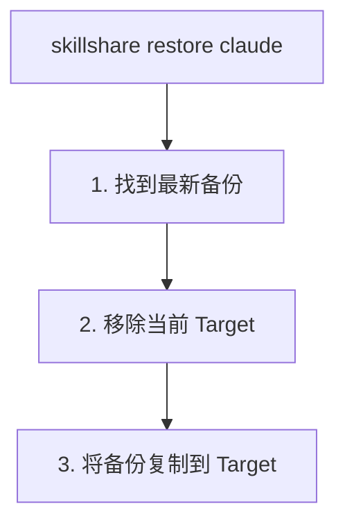

# Backup 与 Restore

保护你的 Skill，并从失误中恢复。

## 概览

skillshare 会自动维护备份，并提供手动的 backup/restore 命令。


---

## 自动备份

以下操作前会自动创建备份：

- `skillshare sync`（Skill Target 与 agent Target）
- `skillshare sync agents`（仅 agent Target）
- `skillshare target remove`

**位置：** `~/.local/share/skillshare/backups/<timestamp>/`（agent 备份会以 `<target>-agents/` 的形式出现在常规 `<target>/` 目录旁边）。

**范围：** 只会捕获本地 Target 内容。merge 模式的符号链接会被跳过，因为它们指向你的 Source — `sync` 会重新创建它们。参见 [What Gets Backed Up](/docs/reference/commands/backup#what-gets-backed-up)。

---

## 手动 Backup

### 所有 Target

```bash
skillshare backup
```

### 指定 Target

```bash
skillshare backup claude
```

### 预览

```bash
skillshare backup --dry-run
```

---

## 列出备份

```bash
skillshare backup --list
```

**输出示例：**
```
Backups
─────────────────────────────────────────
  2026-01-20_15-30-00/
    claude/    5 skills, 2.1 MB
    cursor/    5 skills, 2.1 MB
  2026-01-19_10-00-00/
    claude/    4 skills, 1.8 MB
```

---

## Restore

### 从最新备份恢复

```bash
skillshare restore claude
```

### 从指定备份恢复

```bash
skillshare restore claude --from 2026-01-19_10-00-00
```

### 预览

```bash
skillshare restore claude --dry-run
```

---

## Restore 的执行过程



**注意：** Restore 之后，Target 中包含的是真实文件（而非符号链接）。运行 `skillshare sync` 以重新建立符号链接。

---

## 清理旧备份

```bash
skillshare backup --cleanup
```

删除超过配置保留期限的备份。保留策略已经在每次 `sync` 后自动运行，因此这个命令只用于按需清理。

查看快照占用了多少空间：

```bash
du -sh ~/.local/share/skillshare/backups
skillshare backup --cleanup --dry-run   # 预览将被移除的内容
```

关于备份范围与 `.gitignore`、`ignore:` 的区别，请参见 [Backups & Disk Space](/docs/reference/commands/backup#backups--disk-space)。

---

## 恢复场景

### 通过符号链接意外删除了某个 Skill

```bash
# 如果已初始化 git（推荐）
cd ~/.config/skillshare/skills
git checkout -- deleted-skill/

# 或从备份恢复
skillshare restore claude
skillshare sync
```

### Sync 模式配置错误

```bash
skillshare restore claude
skillshare target claude --mode merge
skillshare sync
```

### 想要撤销近期变更

```bash
skillshare backup --list
skillshare restore claude --from <earlier-timestamp>
```

### 恢复某个 agent

Agent 有各自的备份记录（`<target>-agents`），流程与 Skill 相同：

```bash
# 手动备份 agent
skillshare backup agents claude

# 从最新备份恢复
skillshare restore agents claude

# 从指定时间戳恢复
skillshare restore agents claude --from 2026-01-19_10-00-00
```

在 Project mode 中，只有 agent 能被备份或恢复 — `skillshare backup -p agents` 可以执行，但单独的 `skillshare backup -p` 会报错。Project mode 的相关规则请参见 [backup](/docs/reference/commands/backup#agent-backup)。

---

## 最佳实践

### 在高风险操作前

```bash
skillshare backup
```

### 在重大变更后

```bash
skillshare push -m "Major update"  # Git 备份
```

### 每周维护

```bash
skillshare backup --cleanup
```

---

## 以 Git 作为备份

Git 提供了额外的一层备份：

```bash
# 恢复已删除的 Skill
cd ~/.config/skillshare/skills
git checkout -- deleted-skill/

# 查看历史记录
git log --oneline

# 恢复到之前的 commit
git checkout <commit-hash> -- specific-skill/
```

---

## 另请参阅

- [backup](/docs/reference/commands/backup) — Backup 命令参考
- [restore](/docs/reference/commands/restore) — Restore 命令参考
- [trash](/docs/reference/commands/trash) — 软删除管理
- [Troubleshooting](/docs/troubleshooting) — 遇到问题时
