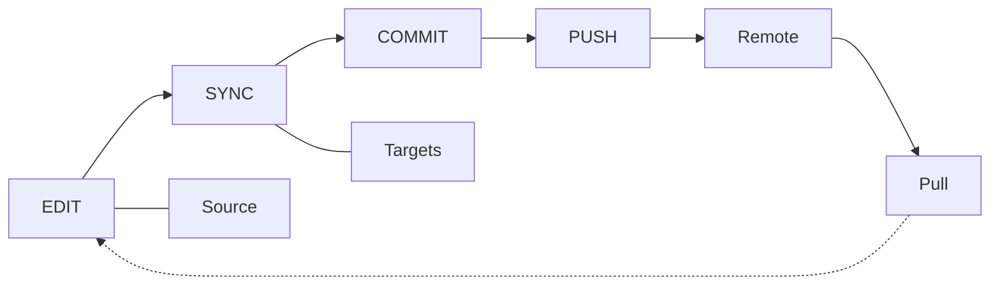

# 日常工作流程

日常管理 Skill 的编辑 → sync → commit/push/pull 循环。

## 概览



---

## 编辑 Skill

### 方式一：在 Source 中编辑（推荐）

```bash
$EDITOR ~/.config/skillshare/skills/my-skill/SKILL.md
```

由于符号链接的存在，改动会立即体现在所有 Target 中。

### 方式二：在 Target 中编辑

```bash
$EDITOR ~/.claude/skills/my-skill/SKILL.md
```

因为 Target 是符号链接，这实际上就是在直接编辑 Source 文件。

---

## Sync

编辑之后，由于符号链接的存在，**通常不需要** sync。但以下情况需要运行 sync：

- 你安装或移除了 Skill
- 你更改了 sync mode
- 你新增或移除了 Target
- 你在 status 中看到 "out of sync"

```bash
skillshare sync
```

:::tip 为什么 sync 是独立的一步？
Sync 被有意设计为与 install/update/uninstall 解耦。这样你可以批量处理多个变更（例如：先安装 3 个 Skill → 再统一 sync 一次），也可以在同步前用 `--dry-run` 预览，并完全掌控 Target 更新的时机。详见 [Source & Targets: Why Sync is a Separate Step](/docs/understand/source-and-targets#why-sync-is-a-separate-step)。
:::

### 先预览

```bash
skillshare sync --dry-run
```

### 只 sync agents

如果你只改动了 agents（或只想把 agents 推送到支持 agent 的 Target），可以缩小 sync 范围：

```bash
skillshare sync agents
```

`skillshare sync` 会一次性同时运行 skills 和 agents 的同步。agent 文件格式与支持的 Target 参见 [Agents](/docs/understand/agents)。

---

## Git 检查点与跨机器同步

### 本地提交

想要一个不推送到 remote 的本地还原点时，使用 `commit`：

```bash
skillshare commit -m "Update draft skill"
```

它会执行：
1. `git add .`
2. `git commit -m "Update draft skill"`

即使 Source 仓库没有配置 remote，`commit` 也能正常工作。

### 推送变更（从这台机器）

如果你使用 git remote，`push` 会一步完成提交并共享变更：

```bash
skillshare push -m "Add new skill"
```

它会执行：
1. `git add .`
2. `git commit -m "Add new skill"`
3. `git push`

### 拉取变更（到这台机器）

```bash
skillshare pull
```

它会执行：
1. `git pull`
2. `skillshare sync`

---

## 常见日常任务

### 创建新 Skill

```bash
skillshare new code-review
$EDITOR ~/.config/skillshare/skills/code-review/SKILL.md
skillshare sync
```

### 编辑或新增 agent

Agent 是位于 `~/.config/skillshare/agents/` 下的单个 `.md` 文件。可以直接用编辑器创建或编辑它们：

```bash
$EDITOR ~/.config/skillshare/agents/reviewer.md
skillshare sync agents
```

`disable` / `enable` 可以通过 `.agentignore` 切换单个 agent 的启用状态，而无需删除它们：

```bash
skillshare disable reviewer --kind agent     # Excludes from sync
skillshare enable reviewer --kind agent      # Re-enables
```

### 更新一个 tracked repo

```bash
skillshare update _team-skills
skillshare sync
```

### 更新所有 tracked repo

```bash
skillshare update --all
skillshare sync
```

### 检查状态

```bash
skillshare status
```

显示内容：
- Source 目录状态
- Git 状态（领先/落后的提交数）
- Target 同步状态

---

## 小技巧

### 让流程自动化

添加到你的 shell 启动脚本：
```bash
# ~/.bashrc or ~/.zshrc
alias ss="skillshare"
alias sss="skillshare sync"
alias ssc="skillshare commit"
alias ssp="skillshare push"
alias ssl="skillshare pull"
```

### 重要工作前先检查

```bash
# Start of day
skillshare pull
skillshare status

# Before committing
skillshare diff
```

### 保持整洁

```bash
# Weekly maintenance
skillshare audit             # Scan for security threats
skillshare backup --cleanup  # Remove old backups
skillshare doctor            # Check for issues
```

---

## 另请参阅

- [sync](/docs/reference/commands/sync) — 核心 sync 命令
- [status](/docs/reference/commands/status) — 检查同步状态
- [commit](/docs/reference/commands/commit) — 不推送的本地 git 检查点
- [push](/docs/reference/commands/push) / [pull](/docs/reference/commands/pull) — 跨机器同步
- [Skill Discovery](/docs/how-to/daily-tasks/skill-discovery) — 发现新 Skill
