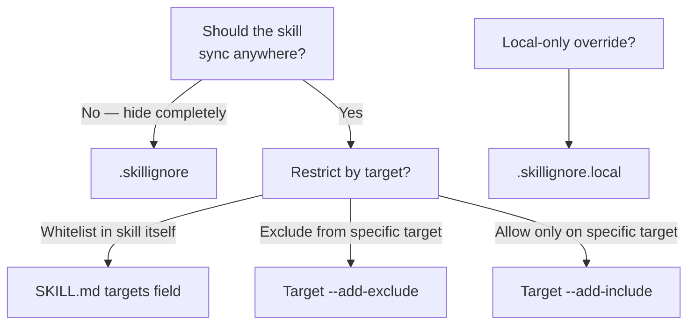

# 过滤 Skill

Skillshare 提供三层过滤机制，用于控制哪些 Skill 会到达哪些 Target。
请根据你的目标选择对应的场景。

## 只把某个 Skill 同步到特定 Target

在 Skill 的 SKILL.md frontmatter 中添加 `metadata.targets`（推荐方式）。
该 Skill 只会同步到列出的 Target。

```yaml
---
name: my-cursor-only-skill
metadata:
  targets: [cursor]
---
```

支持 Target 别名——`claude` 会同时匹配 `claude` 和 `claude-code`。

📖 [SKILL.md targets field](/docs/understand/skill-format#targets) · [Filtering Reference](/docs/reference/filtering#skillmd-targets-field)

## 从某个 Target 中排除特定 Skill

在该 Target 上使用 `--add-exclude`，用 glob 模式屏蔽匹配的 Skill：

```bash
skillshare target cursor --add-exclude "legacy-*"
skillshare sync
```

📖 [Target filter flags](/docs/reference/commands/target#target-filters-includeexclude) · [Filtering Reference](/docs/reference/filtering#target-includeexclude-filters)

## 只允许特定 Skill 同步到某个 Target

使用 `--add-include` 建立白名单——只有匹配的 Skill 才会同步：

```bash
skillshare target claude --add-include "team-*"
skillshare sync
```

📖 [Target filter flags](/docs/reference/commands/target#target-filters-includeexclude) · [Filtering Reference](/docs/reference/filtering#target-includeexclude-filters)

## 从所有 Target 隐藏 Skill

在你的 Source 目录中放置一个 `.skillignore` 文件。匹配这些规则的 Skill 会在发现阶段就被排除在**所有** Target 之外：

```text title="~/.config/skillshare/skills/.skillignore"
drafts/
experimental-*
```

添加或移除规则最快的方式是使用 `enable` / `disable` 命令：

```bash
skillshare disable experimental-*   # adds to .skillignore
skillshare enable experimental-*    # removes from .skillignore
```

你也可以在 `skillshare list` TUI 中按 **E** 键来切换某个 Skill 的启用状态。

📖 [enable / disable](/docs/reference/commands/enable) · [.skillignore syntax](/docs/reference/appendix/file-structure#skillignore-optional) · [Filtering Reference](/docs/reference/filtering#skillignore)

## 排除某个 tracked repo 内部的 Skill

在该 tracked repo 目录内放置一个 `.skillignore`。它只影响该仓库内的 Skill：

```text title="_team-repo/.skillignore"
internal-only/*
validation-scripts
```

📖 [Repo-level .skillignore](/docs/reference/appendix/file-structure#skillignore-optional)

## 仅本地生效的覆盖规则

`.skillignore.local` 会附加在 `.skillignore` 之后——以最后匹配的规则为准。使用否定模式可以在不修改共享文件的情况下，在本地取消忽略某个 Skill：

```text title="_team-repo/.skillignore.local"
# The repo ignores private-*, but I need mine
!private-mine
```

不要提交这个文件——请将它加入 `.gitignore`。

📖 [.skillignore.local](/docs/reference/appendix/file-structure#skillignorelocal-optional)

## 该用哪一层？



## 如何确认过滤生效情况

| 命令 | 显示内容 |
|---------|--------------|
| `skillshare sync` | 底部显示被忽略的 Skill 数量与名称 |
| `skillshare status --json` | 完整的 `.skillignore` 统计信息（规则、被忽略的 Skill、生效文件） |
| `skillshare doctor` | 健康检查包含 `.skillignore` 的规则数量与被忽略数量 |
| `skillshare ui` → Sync 页面 | 可折叠的 "Ignored by .skillignore" 卡片，附带徽章 |

## 另请参阅

- [Filtering Reference](/docs/reference/filtering) — 三层过滤机制的完整规格说明
- [Sync command](/docs/reference/commands/sync#per-target-includeexclude-filters) — 过滤行为示例
- [Target command](/docs/reference/commands/target#target-filters-includeexclude) — include/exclude 的 CLI flag
