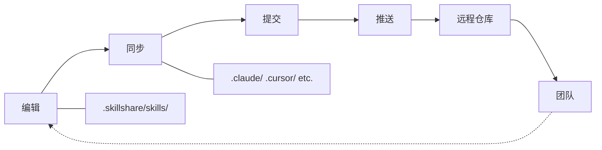

# Project Workflow

用于 Project 层级 Skill 管理的 编辑 → 同步 → 提交 循环。

## 概览



---

## 团队协作场景

一个典型的团队工作流程，展示项目 Skill 如何保持同步：

```
Alice（新增一个 Skill）                 Bob（获取更新）
──────────────────────                  ──────────────────────
skillshare new api-guide -p
$EDITOR .skillshare/skills/api-guide/
skillshare sync
git add . && git commit && git push
                                        git pull
                                        skillshare install -p
                                        skillshare sync
                                        → api-guide 现已出现在 .claude/skills/ 中
```

Bob 不需要知道新增了哪些 Skill——`skillshare install -p` 会读取配置并安装其中列出的所有内容。

---

## 常见操作

### 新增一个 Skill

```bash
# 创建该 Skill
skillshare new my-skill -p
$EDITOR .skillshare/skills/my-skill/SKILL.md

# 同步到 Target
skillshare sync

# 提交
git add .skillshare/
git commit -m "Add my-skill"
```

### 新增一个 Agent

Agent 是单一的 `.md` 文件；直接在 `.skillshare/agents/` 下创建它们：

```bash
# 创建一个 Agent 文件
$EDITOR .skillshare/agents/my-agent.md

# 同步到支持 Agent 的 Target（claude、cursor、augment、opencode）
skillshare sync agents

# 提交
git add .skillshare/agents/
git commit -m "Add my-agent"
```

`skillshare sync`（不带 `agents` 参数）会一次性同步 Skill 与 Agent。使用 `skillshare disable my-agent --kind agent -p` 可以在不删除文件的情况下，在 `.skillshare/agents/.agentignore` 中新增一条记录。

### 安装远程 Skill

```bash
# 从 GitHub 安装
skillshare install anthropics/skills/skills/pdf -p

# 同步到 Target
skillshare sync

# 提交配置变更
git add .skillshare/
git commit -m "Add pdf skill from anthropic"
```

### 更新远程 Skill

```bash
# 更新指定的 Skill
skillshare update pdf -p

# 或更新所有远程 Skill
skillshare update --all -p

# 同步已更新的 Skill
skillshare sync

# 如果配置有变更，则提交
git add .skillshare/
git commit -m "Update remote skills"
```

### 移除一个 Skill

```bash
# 卸载
skillshare uninstall my-skill -p

# 同步以清理符号链接
skillshare sync

# 提交
git add .skillshare/
git commit -m "Remove my-skill"
```

### 有人加入项目

无论是新的团队成员、开源贡献者，还是尝试某个社区模板的人——设置流程都是一样的：

```bash
# 克隆项目
git clone github.com/team/project
cd project

# 安装配置中列出的远程 Skill
skillshare install -p

# 同步到 Target
skillshare sync
```

`config.yaml` 就像一份可携带的 Skill 清单——无需手动寻找 Skill。

---

## 管理 Target

### 新增 Target

```bash
# 新增一个已知的 Target
skillshare target add windsurf -p

# 新增带路径的自定义 Target
skillshare target add custom-tool ./tools/ai/skills -p

# 同步到新的 Target
skillshare sync
```

### 移除 Target

```bash
skillshare target remove windsurf -p
```

### 列出 Target

```bash
skillshare target list -p
```

```
Project Targets
  claude    .claude/skills (merge)
  cursor         .cursor/skills (merge)
```

---

## 检查状态

```bash
skillshare status
```

```
Project Skills (.skillshare/)

Source
  ✓ .skillshare/skills (3 skills)

Targets
  ✓ claude       [merge] .claude/skills (3 synced)
  ✓ cursor       [merge] .cursor/skills (3 synced)

Remote Skills
  ✓ pdf          anthropic/skills/pdf
  ✓ review       github.com/team/tools
```

---

## 列出 Skill

```bash
skillshare list
```

```
Installed skills (project)
─────────────────────────────────────────
  → my-skill            local
  → pdf                 anthropic/skills/pdf
  → review              github.com/team/tools

→ 3 skill(s): 2 remote, 1 local
```

---

## Web 控制台

使用 Web UI 以可视化方式管理 Project 的 Skill：

```bash
skillshare ui -p
```

如果 `.skillshare/config.yaml` 已存在（自动检测），也可以直接使用 `skillshare ui`。该控制台会隐藏 Git Sync（请使用你项目自身的 git），并直接编辑 `.skillshare/config.yaml`。

---

## 小技巧

### 自动检测

一旦 `.skillshare/config.yaml` 存在，大多数命令会自动检测为 Project mode：

```bash
cd my-project/
skillshare sync          # 自动进入 Project mode
skillshare status        # 自动进入 Project mode
skillshare list          # 自动进入 Project mode
```

:::tip 零配置
只需 `cd` 进入项目目录——skillshare 会检测到 `.skillshare/config.yaml` 并自动切换到 Project mode。无需任何参数。
:::

### 编辑后立即看到变更

Skill 是以符号链接的方式存在的——在 `.skillshare/skills/` 中编辑，会立即反映在 Target 中：

```bash
$EDITOR .skillshare/skills/my-skill/SKILL.md
# 变更已存在于 .claude/skills/my-skill/（符号链接）中
```

只有在新增/移除 Skill 或 Target 时才需要执行 `sync`。

### 同步前先预览

```bash
skillshare sync --dry-run
```

---

## 另请参阅

- [Project Skills](/docs/understand/project-skills) —— 概念说明
- [Project Setup](/docs/how-to/sharing/project-setup) —— 初始设置指南
- [Daily Workflow](./daily-workflow.md) —— Global mode 的日常使用
