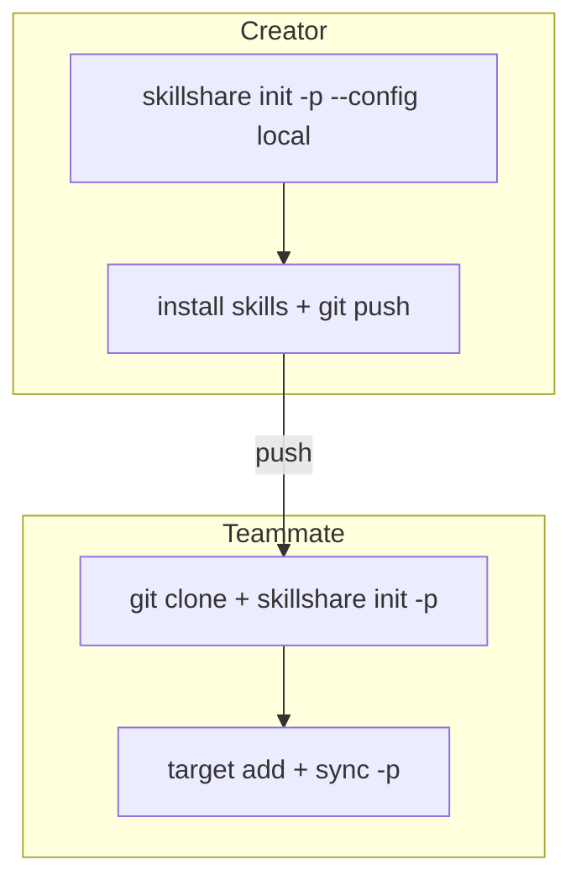

# Centralized Skills Repo

> 使用一个 Project 作为共享的 Skill 仓库；其他 Project 保持干净。

## Scenario

你的团队有多个 Project（B、C、D），但希望在一个专用仓库（A）中统一管理 AI Skill。每位开发者克隆仓库 A，并将 Targets 指向自己本地的 Project。

## Solution

### 创建者：搭建共享仓库

```bash
cd ~/DEV/skills-repo        # Project A
skillshare init -p --config local --targets claude
```

这会创建 `.skillshare/`，其中 `config.yaml` 被 gitignore 排除，因此每位开发者可以独立管理自己的 Targets。

```bash
# 添加共享 Skill
skillshare install <skill-repo> -p

# 提交（config.yaml 被 .gitignore 排除）
git add .skillshare/
git commit -m "add shared skills"
git push
```

### 队友：克隆并配置

```bash
git clone <A-repo> && cd skills-repo
skillshare init -p
```

skillshare 会自动检测共享仓库（`.gitignore` 中包含 `config.yaml`）并创建一个空的 config。无需 `--config local` 参数。

```bash
# 添加指向你本地 Project 的 Targets
skillshare target add project-b ~/DEV/project-b/.cursor/skills -p
skillshare target add project-c ~/DEV/project-c/.claude/skills -p

# 将共享 Skill Sync 到你的所有 Targets
skillshare sync -p
```

## How It Works



`--config local` 参数会把 `config.yaml` 加入 `.skillshare/.gitignore`。这意味着：

- **Skills**（`.skillshare/skills/`）通过 git 共享
- **Config**（`.skillshare/config.yaml`）对每位开发者是本地的
- 每位开发者可以选择自己的 Targets，而不影响其他人

## Verification

创建者执行 `init -p --config local` 后：

```bash
cat .skillshare/.gitignore
# 应包含：config.yaml
```

队友克隆并执行 `init -p` 后：

```bash
skillshare list -p     # 显示共享 Skill
skillshare status -p   # 显示你的个人 Targets
```

## FAQ

**Q：每位队友都需要 `--config local` 吗？**
A：不需要。只有创建者使用 `--config local`。队友只需运行 `skillshare init -p`，skillshare 会自动检测共享仓库模式。

**Q：队友可以安装额外的 Skill 吗？**
A：可以。`skillshare install <repo> -p` 正常可用。安装的 Skill 会放入 `.skillshare/skills/`，该目录由 git 跟踪，因此你可以推送它供其他人使用。

**Q：如果队友想要不同的 Skill 怎么办？**
A：`.skillshare/skills/` 中的 Skill 是共享的。对于真正个人化的 Skill，请使用 [global mode](/docs/understand/project-skills)（`skillshare install <repo>` 不加 `-p`）。
