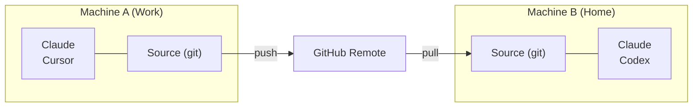

# Cross-Machine Sync

使用 git 在多台电脑之间同步你的 Skill。

## Overview



---

## First Machine Setup

### Interactive（引导式提示）

```bash
skillshare init --remote git@github.com:you/my-skills.git
```

### Non-interactive（无提示）

```bash
# Remote 已有你的 Skill（或从空白 Source 开始）
skillshare init --remote git@github.com:you/my-skills.git --no-copy --all-targets --no-skill

# 第一台机器已有既有的 Claude Skill：在 init 时一并导入
skillshare init --remote git@github.com:you/my-skills.git --copy-from claude --all-targets --no-skill
```

这会：
1. 建立 Source 目录
2. 以初始 commit 初始化 git
3. 加入 remote
4. 自动侦测并设置 Target

之后可选（仅在设置完成后又安装了其他 AI CLI 时才需要）：

```bash
skillshare init --discover
```

接着 push 你的 Skill：
```bash
skillshare push
```

:::tip 已经初始化过？
为既有设置加入 remote：
```bash
skillshare init --remote git@github.com:you/my-skills.git
```
即使在初次设置之后执行，这个指令依然有效——它只会加入 remote。
:::

---

## Second Machine Setup

在新机器上，**同样的指令即可**：

```bash
skillshare init --remote git@github.com:you/my-skills.git
```

Init 会自动侦测 remote 已有既有 Skill 并将其拉取下来，不需要手动执行 `git clone`。

:::info 背后发生了什么
1. 建立 Source 目录并初始化 git
2. 加入 remote 并执行 `git fetch`
3. 侦测到 remote 已有 Skill → 将本地重置为与 remote 一致
4. 设置 tracking branch
5. 自动侦测并设置本地 Target
:::

若你偏好手动控制：

```bash
# 直接 clone，再以既有 Source 执行 init
git clone git@github.com:you/my-skills.git ~/.config/skillshare/skills
skillshare init --source ~/.config/skillshare/skills
skillshare sync
```

---

## Daily Workflow

### Machine A：修改并 push

```bash
# 编辑 Skill（透过 symlink，变更会立即可见）
$EDITOR ~/.config/skillshare/skills/my-skill/SKILL.md

# 可选：建立本地检查点而不 push
skillshare commit -m "Update my-skill"

# 准备好分享时再 push 到 remote
skillshare push -m "Update my-skill"
```

### Machine B：拉取并 sync

```bash
skillshare pull
```

就这样。`pull` 会在拉取后自动执行 `sync`。

---

## Commands

### Commit

建立本地检查点而不 push：

```bash
skillshare commit                  # 默认讯息
skillshare commit -m "Add pdf"     # 自定义讯息
skillshare commit --dry-run        # 预览
```

**实际执行内容：**
```
git add -A
git commit -m "Add pdf"
```

`commit` 不需要 remote，也绝不会 push。

### Push

Commit 并 push 本地变更：

```bash
skillshare push                  # 自动生成讯息
skillshare push -m "Add pdf"     # 自定义讯息
```

**实际执行内容：**
```
git add -A
git commit -m "Add pdf"
git push          # 首次 push 时自动设置 upstream
```

### Pull

拉取 remote 变更并 sync：

```bash
skillshare pull
```

**实际执行内容：**
```
git pull           # 或首次拉取时改用 fetch + reset
skillshare sync
```

---

## Conflict Handling

### Pull 失败（本地有未 commit 的变更）

若想保留本地变更但还不打算 push，先在本地 commit：

```bash
skillshare commit -m "Save local changes"
skillshare pull
```

### Push 失败（remote 领先）

```
$ skillshare push
Push failed
  Remote may have newer changes
  Run: skillshare pull
  Then: skillshare push
```

**解法：**
```bash
skillshare pull
skillshare push
```

### Pull 仍因本地未 commit 的变更而失败

```
$ skillshare pull
Local changes detected
  Run: skillshare push
  Or:  cd ~/.config/skillshare/skills && git stash
```

**解法：**
```bash
# 选项 1：先在本地 commit
skillshare commit -m "Local changes"
skillshare pull

# 选项 2：先 push 你的变更
skillshare push -m "Local changes"
skillshare pull

# 选项 3：暂时 stash 变更
cd ~/.config/skillshare/skills
git stash
skillshare pull
git stash pop
```

### Merge 冲突

```bash
cd ~/.config/skillshare/skills
git status                    # 查看冲突文件
# 编辑文件以解决冲突
git add .
git commit -m "Resolve conflicts"
skillshare sync
```

---

## Check Status

```bash
skillshare status
```

会显示：
- Git 状态（clean、ahead、behind）
- Remote 设置
- Sync 状态

---

## Private Repository

私有仓库请使用 SSH URL：

```bash
skillshare init --remote git@github.com:you/private-skills.git
```

---

## Tips

### 使用 SSH 密钥

设置 SSH 密钥以避免密码提示：
```bash
ssh-keygen -t ed25519 -C "your@email.com"
# 将公钥加入 GitHub
```

### dotfiles 的可移植路径

若你透过 dotfiles 分享 `config.yaml`，启用 `preserve_tilde_on_save` 可将路径保持为 `~/...`，而不是 `/home/alice/...`：

```yaml
preserve_tilde_on_save: true
```

这能避免同一份 config 在不同用户名或不同 OS 家目录前缀的机器间使用时产生杂讯般的 diff。参见 [Configuration — preserve_tilde_on_save](/docs/reference/targets/configuration#preserve_tilde_on_save)。

### 多个 remote

加入备用 remote：
```bash
cd ~/.config/skillshare/skills
git remote add backup git@gitlab.com:you/skills-backup.git
git push backup main
```

### 在 shell 启动时 sync

加入 `~/.bashrc` 或 `~/.zshrc`：
```bash
# 在开启终端时 sync skillshare（若已设置 remote）
skillshare pull 2>/dev/null
```

---

## Alternative: Install from Config {#alternative-install-from-config}

若不想设置 git remote，`config.yaml` 也能当作可移植的 Skill 清单。每次 `install` / `uninstall` 都会自动更新 `skills:` 区块，而 `skillshare install`（不带参数）会重新安装清单中的所有项目：

```bash
# Machine A —— config.yaml 记录你安装过的内容
skillshare install anthropics/skills -s pdf
# config.yaml 现在会有：skills: [{name: pdf, source: "..."}]

# Machine B —— 复制 config.yaml，然后：
skillshare install      # 安装清单中的所有 Skill
skillshare sync
```

### 该用哪一种

| | `push` / `pull` | `install`（不带参数） |
|---|---|---|
| 同步的内容 | 实际 Skill 文件（完整内容） | 仅同步来源 URL——安装时重新下载 |
| 本地/手写 Skill | 包含在内 | 不包含（没有来源 URL） |
| 所需设置 | Source 目录需有 Git remote | 只需 `config.yaml` |
| Project mode | 仅限 Global | 可搭配 `-p`（`.skillshare/config.yaml`）使用 |
| 维护方式 | 变更后手动 `push` | 于 install/uninstall 时自动调解 |

**建议**：个人跨机器同步请用 `push`/`pull`。团队 onboarding 与专案设置请用 config 中的 `install`。

---

## See Also

- [push](/docs/reference/commands/push) — Push 到 remote
- [pull](/docs/reference/commands/pull) — 从 remote pull
- [install](/docs/reference/commands/install#install-from-config-no-arguments) — 从 config 安装
- [Organization-Wide Skills](./organization-sharing.md) — 团队分享
- [init](/docs/reference/commands/init) — 以 `--remote` 执行 init
