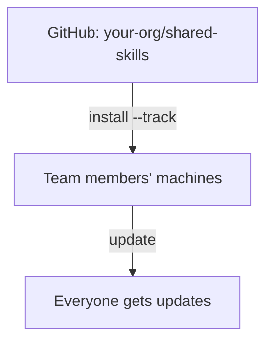

# Organization-Wide Skills

使用 tracked repository 在所有专案之间分享 Skill。

## Overview



---

## Usage Scenarios

| 场景 | 范例 |
|----------|---------|
| **公司编码规范** | 在所有仓库中强制统一的命名、错误处理与架构风格 |
| **安全审查 Skill** | 将组织级安全审查清单应用到每个专案 |
| **部署知识** | 标准的 CI/CD 模式、基础设施惯例、发布流程 |
| **代码审查准则** | 所有团队与专案的一致审查标准 |
| **跨专案模式** | 共享的 API 设计模式、日志标准、测试框架 |

---

## Why Organization Sharing?

| 没有 Organization Skills | 有 Organization Skills |
|-----------------------------|--------------------------|
| "嘿，去 Slack 拿最新的部署 Skill" | `skillshare update --all` |
| 在机器之间复制粘贴 Skill | 一条指令安装全部 |
| "你那份 Skill 是哪个版本？" | 所有人都从同一来源同步 |
| Skill 散落在各种文档/仓库中 | 组织统一维护一个精选仓库 |

---

## For Team Leads

### Step 1：建立 Skill 仓库

为你的组织建立一个 GitHub/GitLab/Bitbucket 仓库来存放 Skill。

```bash
mkdir org-skills && cd org-skills
git init

# 建立 Skill 结构
mkdir -p frontend/ui backend/api devops/deploy

# 新增 Skill
echo "---
name: acme-ui
description: Frontend UI patterns
---
# UI Skill
..." > frontend/ui/SKILL.md

git add .
git commit -m "Initial skills"
git push -u origin main
```

### Step 2：加入 .skillignore（可选）

若你的仓库中有内部工具或 CI 脚本，不该被侦测为 Skill，请在仓库根目录建立 `.skillignore`：

```text title=".skillignore"
# CI/CD 辅助工具 —— 不是可安装的 Skill
ci-scripts
_internal-*
```

若个别团队成员需要使用被 `.skillignore` 排除的 Skill，可以在同一目录建立 `.skillignore.local`（不会被 commit 进 git）来局部覆盖：

```text title=".skillignore.local"
!_internal-my-tool
```

### Step 3：分享安装指令

将以下内容发给你的团队：

```bash
skillshare install github.com/your-org/org-skills --track && skillshare sync
```

只需要部分 Skill 的团队成员可以使用 `--exclude`：

```bash
skillshare install github.com/your-org/org-skills --all --exclude devops-deploy
```

---

## For Team Members

### 初始设置

```bash
# 安装组织 Skill 仓库
skillshare install github.com/org/skills --track

# Sync 到你的 AI CLI
skillshare sync
```

### 日常使用

```bash
# 检查更新
skillshare update --all
skillshare sync
```

---

## Nested Skills & Auto-Flattening

在文件夹中组织 Skill——skillshare 会自动展平以符合 AI CLI 的要求：

```
SOURCE                              TARGET
(your organization)                 (what AI CLI sees)
────────────────────────────────────────────────────────────
_org-skills/
├── frontend/
│   ├── react/          ───►   _org-skills__frontend__react/
│   └── vue/            ───►   _org-skills__frontend__vue/
├── backend/
│   └── api/            ───►   _org-skills__backend__api/
└── devops/
    └── deploy/         ───►   _org-skills__devops__deploy/

• _ 前缀 = tracked repository
• __（双底线）= 路径分隔符
```

**优点：**
- 在仓库中维持逻辑上的文件夹组织
- AI CLI 看到的是它们预期的扁平结构
- 展平后的名称保留原始路径，方便追溯来源

详见 [Tracked Repositories](/docs/understand/tracked-repositories#nested-skills--auto-flattening)。

---

## Collision Detection

当多个 Skill 共享相同的 `name` 字段时，sync 会检查它们在套用 `include`/`exclude` 过滤器后，是否真的会落在同一个 Target 上。

**过滤器隔离了冲突**——仅供参考：

```
ℹ Duplicate skill names exist but are isolated by target filters:
  'ui' (2 definitions)
```

**冲突落在同一个 Target 上**——需要处理的警告：

```
⚠ Target 'claude': skill name 'ui' is defined in multiple places:
  - _team-a/frontend/ui
  - _team-b/components/ui
Rename one in SKILL.md or adjust include/exclude filters
```

**解法：** 使用带命名空间的名称，或用过滤器分流：

```yaml
# 选项 1：在 SKILL.md 中加上命名空间
name: team-a-ui

# 选项 2：以过滤器分流（global 设置）
targets:
  codex:
    path: ~/.codex/skills
    include: [_team-a__*]
  claude:
    path: ~/.claude/skills
    include: [_team-b__*]
```

```yaml
# 选项 2：以过滤器分流（project 设置）
targets:
  - name: claude
    exclude: [codex-*]
  - name: codex
    include: [codex-*]
```

完整语法与范例请见 [Target Filters](/docs/reference/targets/configuration#include--exclude-target-filters)。

---

## Multiple Organization Repos

为不同团队或用途安装多个仓库：

```bash
# 前端团队
skillshare install github.com/org/frontend-skills --track --name frontend

# 后端团队
skillshare install github.com/org/backend-skills --track --name backend

# DevOps 团队
skillshare install github.com/org/devops-skills --track --name devops

skillshare sync
```

全部更新：
```bash
skillshare update --all
skillshare sync
```

---

## Private Repositories

**SSH**（建议用于开发者机器）：

```bash
skillshare install git@github.com:org/private-skills.git --track
```

**HTTPS with token**（建议用于 CI/CD）：

```bash
export GITHUB_TOKEN=ghp_your_token
skillshare install https://github.com/org/private-skills.git --track
```

官方 token 文档：
- GitHub：[Managing your personal access tokens](https://docs.github.com/en/authentication/keeping-your-account-and-data-secure/managing-your-personal-access-tokens)
- GitLab：[Token overview](https://docs.gitlab.com/security/tokens/)
- Bitbucket：[Access tokens](https://support.atlassian.com/bitbucket-cloud/docs/access-tokens/)

### CI/CD Setup

**GitHub Actions：**

```yaml
- name: Install org skills
  env:
    GITHUB_TOKEN: ${{ secrets.GITHUB_TOKEN }}
  run: |
    skillshare install https://github.com/org/skills.git --track
    skillshare sync
```

**GitLab CI：**

```yaml
install-skills:
  script:
    - skillshare install https://gitlab.com/org/skills.git --track
    - skillshare sync
  variables:
    GITLAB_TOKEN: $CI_JOB_TOKEN
```

**Bitbucket Pipelines：**

```yaml
- step:
    name: Install org skills
    script:
      - skillshare install https://bitbucket.org/team/skills.git --track
      - skillshare sync
    env:
      BITBUCKET_USERNAME: $BITBUCKET_USERNAME   # 用于 app password
      BITBUCKET_TOKEN: $BITBUCKET_TOKEN
```

所有支持的 token 请见 [Environment Variables](/docs/reference/appendix/environment-variables#git-authentication)。

---

## Commands Reference

| 指令 | 说明 |
|---------|-------------|
| `install <url> --track` | 将仓库克隆为 tracked repository |
| `update <name>` | 对指定的 tracked repo 执行 git pull |
| `update --all` | 更新所有 tracked repo |
| `uninstall <name>...` | 移除 tracked repo |
| `list` | 列出所有 Skill 与 tracked repo |
| `status` | 显示 sync 状态 |

---

## Organization Agents

一个 tracked 的组织仓库可以在 Skill 之外一并携带 **agent**。将它们放在与 `skills/` 同层的顶层 `agents/` 目录中：

```
your-org/org-shared/
├── skills/                  # 被侦测为 Skill
│   ├── api-design/
│   │   └── SKILL.md
│   └── security/
│       └── SKILL.md
└── agents/                  # 被侦测为 agent
    ├── reviewer.md
    └── auditor.md
```

当团队成员运行 `skillshare install github.com/your-org/org-shared --track` 时，两个目录都会被自动侦测。`skillshare update --all` 会让两者保持同步，而 `skillshare sync`（或 `skillshare sync agents`）会将 agent 传播到支持 agent 的 Target（Claude、Cursor、Augment、OpenCode）。

组织仓库内的 `.agentignore` 文件会在磁盘上生效，但通常应该放在消费端的 Source 根目录（或 `.agentignore.local`），让个别机器可以在不修改上游仓库的情况下选择退出。完整的侦测规则请见 [Agents](/docs/understand/agents)。

---

## Organization vs Project Skills

| | Organization Skills | Project Skills |
|---|---|---|
| **范围** | 机器上的所有专案 | 单一仓库 |
| **来源** | `~/.config/skillshare/skills/_repo/` | `.skillshare/skills/` |
| **安装** | `skillshare install <url> --track` | `skillshare install <url> -p` |
| **分享方式** | 每位成员各自安装 tracked repo | commit 到专案的 git 仓库 |
| **适用场景** | 编码规范、安全、组织级模式 | API 惯例、领域上下文、专案工具 |
| **共存** | 可与 project skill 并存 | 可与 organization skill 并存 |

:::tip 两者并用
Organization skill 提供全公司统一的标准，project skill 提供仓库专属的上下文。两者互补——同时使用可获得最佳的开发体验。
:::

---

## Best Practices

### For Team Leads

1. **使用清晰的结构**：依功能（frontend、backend、devops）组织
2. **为 Skill 加上命名空间**：`org-skill-name`，避免冲突
3. **记录需求**：附上说明设置方式的 README
4. **版本控制**：以 tag 标注稳定版本

### For Team Members

1. **定期更新**：每天执行 `skillshare update --all`
2. **回报问题**：若某个 Skill 无法运作，告知维护者
3. **提出改进**：向 Skill 仓库开 PR

---

## See Also

- [Tracked Repositories](/docs/understand/tracked-repositories) — 概念说明
- [install](/docs/reference/commands/install) — 以 `--track` 安装
- [update](/docs/reference/commands/update) — 更新 tracked repo
- [Project Setup](./project-setup.md) — 专案层级的分享
- [Cross-Machine Sync](./cross-machine-sync.md) — 个人同步
