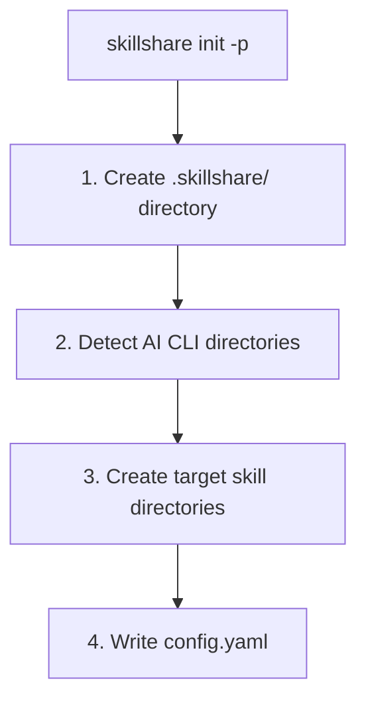

# Project Setup

从零开始设置专案级 Skill——范围仅限单一仓库，透过 git 与团队分享。

## When to Use Project Mode

| 场景 | 范例 | 适用模式 |
|----------|---------|-----|
| Monorepo onboarding | 新人克隆仓库后立即取得所有专案上下文 | **Project mode** |
| API 惯例 | "所有端点都必须使用 camelCase 并回传标准错误格式" | **Project mode** |
| 领域专属上下文 | 金融监管规则、医疗合规指南 | **Project mode** |
| 部署知识 | "透过 `make deploy-staging` 部署到 staging，需要 VPN" | **Project mode** |
| 专案工具 | 自定义测试模式、迁移脚本、构建设置 | **Project mode** |
| 跨所有专案共享的 Skill | 全公司编码规范、安全审查 | Organization mode |
| 多台机器上的个人 Skill | 个人格式偏好、工作流捷径 | Global mode |

---

## Step-by-Step Setup

### Step 1：初始化

在专案根目录运行 `skillshare init -p`：

```bash
cd my-project
skillshare init -p
```



:::tip Auto-Detection
初始化之后，只要 `cd` 进入这个目录，skillshare 就会自动侦测为 project mode，后续指令不需要再加 `-p`。
:::

你也可以直接指定 Target：

```bash
skillshare init -p --targets claude,cursor
```

### Step 2：建立本地 Skill

手动建立 Skill，或使用 `skillshare new`：

```bash
# 使用 skillshare new
skillshare new my-skill -p

# 或手动建立
mkdir -p .skillshare/skills/my-skill
cat > .skillshare/skills/my-skill/SKILL.md << 'EOF'
---
name: my-skill
description: Project-specific coding guidelines
---
# My Skill

Your skill content here...
EOF
```

### Step 3：安装远端 Skill

将 GitHub 上的 Skill 安装进专案：

```bash
skillshare install anthropics/skills/skills/pdf -p
skillshare install github.com/team/shared-skills/review -p

# 使用 --into 组织进子目录
skillshare install anthropics/skills -s pdf --into tools -p
# → .skillshare/skills/tools/pdf/
```

远端 Skill 会：
- 安装到 `.skillshare/skills/<name>/`（若使用 `--into` 则为 `.skillshare/skills/<into>/<name>/`）
- 记录在 `.skillshare/config.yaml` 的 `skills:` 中
- 加入 `.skillshare/.gitignore`（克隆下来的内容不会被 commit；`logs/`、`trash/` 与 `backups/` 默认会被忽略）

### Step 4：Sync 到 Target

```bash
skillshare sync
```

会从 `.skillshare/skills/` 建立指向各个 Target 目录的 symlink，并自动侦测 project mode。

### Step 5：Commit 到版本控制

```bash
git add .skillshare/
git commit -m "Add project-level skills"
```

**会被 commit 的内容：**
- `.skillshare/config.yaml` —— Target 与远端 Skill 清单
- `.skillshare/skills.lock.json` —— 每个远端 Skill 固定的 commit，让所有人安装到相同版本
- `.skillshare/.gitignore` —— 专案日志、trash、backup 与克隆 Skill 的忽略规则
- `.skillshare/skills/<local-skills>/` —— 本地 Skill 内容

**会被忽略的内容：**
- `.skillshare/logs/`（操作与 audit 日志）
- `.skillshare/trash/`（软删除的 Skill，7 天后自动清除）
- `.skillshare/backups/`（sync 与 backup 指令产生的 agent 备份）
- 远端 Skill 目录（会从 config 重新安装）

### 可选：Commit 日志文件

若想将专案日志纳入版本控制，在 `.skillshare/.gitignore` 中加入覆盖规则：

```gitignore
# 使用者自定义覆盖：追踪日志
!logs/
!logs/*.log
```

若根目录的 `.gitignore` 忽略了整个 `.skillshare/`，也要在那里加上对应的取消忽略规则。

---

## New Team Member Onboarding

### 没有 skillshare 时

1. 克隆仓库
2. 阅读 README 找出该安装哪些 Skill
3. 手动复制或安装每一个 Skill
4. 分别设置每个 AI CLI 工具
5. 祈祷自己没有漏掉任何东西

### 使用 skillshare 时

```bash
git clone github.com/team/my-project
cd my-project
skillshare install -p && skillshare sync
```

完成。所有专案 Skill 都已安装并 sync 完毕。`skillshare install -p`（不带 URL）会读取 `.skillshare/config.yaml` 并自动安装其中列出的所有远端 Skill。同样的模式在 global mode 下也适用——`skillshare install`（不带参数）会读取 `~/.config/skillshare/config.yaml`。

---

## Custom Target Paths

Target 同时支持已知名称与自定义路径：

```yaml
# .skillshare/config.yaml
targets:
  - claude                    # 已知名称 → .claude/skills/
  - cursor                         # 已知名称 → .cursor/skills/
  - name: custom-tool              # 自定义路径
    path: ./tools/ai/skills        # 相对于专案根目录
  - name: another-tool
    path: ~/global/path/skills     # 绝对路径，支持 ~ 展开
```

---

## Full Config Example

```yaml
targets:
  - claude
  - cursor
  - name: windsurf
    path: .windsurf/skills

skills:
  - name: pdf
    source: anthropic/skills/pdf
  - name: code-review
    source: github.com/team/skills/code-review
```

---

## Web Dashboard

Web dashboard 支持 project mode——可视化管理 Skill、Target、Sync 与设置：

```bash
cd my-project
skillshare ui -p
```

或者，若已存在 `.skillshare/config.yaml`（会自动侦测），直接运行 `skillshare ui` 即可。

在 project mode 下，dashboard 会：
- 在侧边栏显示 **"Project" 徽章**
- 隐藏 **Git Sync**（请使用你专案自己的 git）
- 在 Config 页面编辑 **`.skillshare/config.yaml`**
- 安装远端 Skill 后自动**调解**（reconcile）`skills:` 条目

---

## Coexistence with Global Mode

Project 与 global（organization）Skill 各自独立运作：

```
Organization level                  Project level
~/.config/skillshare/skills/        .skillshare/skills/
├── personal-skill/                 ├── project-skill/
└── _company-std/                   └── remote-skill/
         │                                   │
         ▼                                   ▼
   ~/.claude/skills/                .claude/skills/
   (system-wide targets)            (project-local targets)
```

- Project 的 Target 是**专案本地**的（例如专案内的 `.claude/skills/`）
- Organization 的 Target 是**系统全局**的（例如 `~/.claude/skills/`）
- 两者不会冲突——目录不同、范围不同

### 真实案例：Alice 的两个专案

Alice 同时负责一个金融应用与一个营销仪表板。她有：

- **Organization skills**：公司编码规范、安全审查（到处都能用）
- **Finance project skills**：监管合规、金融 API 惯例
- **Marketing project skills**：分析模式、A/B 测试准则

```bash
cd ~/finance-app
skillshare status     # 显示 finance 专案 Skill + 系统全局 Target 中的 org Skill

cd ~/marketing-dash
skillshare status     # 显示 marketing 专案 Skill + 同样的 org Skill
```

每个专案都有自己的上下文，同时 organization 标准会全局套用。

---

## See Also

- [Project Skills](/docs/understand/project-skills) — 概念说明
- [Project Workflow](/docs/how-to/daily-tasks/project-workflow) — 日常使用
- [Organization-Wide Skills](./organization-sharing.md) — 团队分享
- [init](/docs/reference/commands/init) — 以 `--project` 执行 init
