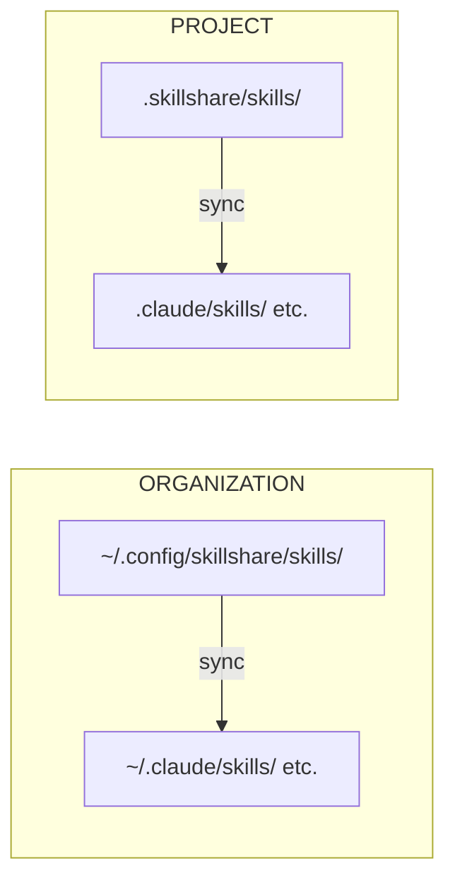

# 简介

**skillshare** 是一个 CLI 工具，把 AI CLI skills 从单一 Source 同步到你所有的 AI 编程助手。

## 为什么选择 skillshare？

安装类工具能把 skills 装到 agent 上。**skillshare 让它们保持同步。**

| | 一次性安装工具 | skillshare |
|---|-------------------|------------|
| 安装之后 | 手动执行更新命令 | **Merge sync** —— 逐个 skill 的 symlink，本地 skills 原样保留 |
| 更新 skill | 执行更新命令／重新安装 | **编辑 Source**，改动立即生效 |
| 回收改动 | — | **双向** —— 可从任意 agent collect 回来 |
| 跨机器 | 每台机器都重新安装一遍 | **git push/pull** —— 一条命令同步 |
| 本地 + 已安装 | 分开管理 | **统一**在单一 Source 目录中 |
| 组织内共享 | 提交 skills.json 或重新安装 | **Tracked repos** —— git pull 即可更新 |
| 项目级 skills | 每个 repo 各复制一份，日久分叉 | **Project mode** —— 自动检测，通过 git 共享 |
| 安全审计 | 无 | **内置** —— 安装时自动扫描，另有 `audit` 命令 |
| AI 集成 | 只能手动敲 CLI | **内置 skill** —— AI 直接操作 |

## 快速开始

```bash
# Install
curl -fsSL https://raw.githubusercontent.com/runkids/skillshare/main/install.sh | sh

# Initialize (auto-detects CLIs, sets up git)
skillshare init

# Install a skill
skillshare install anthropics/skills/skills/pdf

# Sync to all targets
skillshare sync
```

搞定。你的 skills 现在已经同步到所有 AI CLI 工具了。

:::tip[不安装也能试用]
想先体验一下？用 [Docker Playground](/docs/how-to/advanced/docker-sandbox#playground) —— 一条命令，无需本地安装：

```bash
git clone https://github.com/runkids/skillshare.git && cd skillshare
make playground
```
:::

## 工作原理



在 Source 里编辑 → 所有 Targets 同步更新。在 Target 里编辑 → 改动回写到 Source（通过 symlink）。

## 核心特性

- **自动检测** —— `cd` 进入带有 `.skillshare/` 的项目，skillshare 自动切换到 Project mode
- **双层架构** —— 组织级 skills 承载公司规范 + 项目级 skills 承载 repo 上下文
- **即时更新** —— 基于 symlink 的 Sync，编辑后立即在所有 AI 工具中生效
- **面向团队** —— 组织级 skills 走 tracked repos，项目级 skills 走 git commit
- **任意 Git 托管** —— 可从 GitHub、GitLab、Bitbucket、Azure DevOps、AtomGit、Gitee 或任意自建 Git 安装、更新与检查
- **安全审计** —— 扫描 skills 中的 prompt injection、数据外泄等威胁。安装时自动扫描

## 支持的平台

| 平台 | Source 路径 | 链接类型 |
|----------|-------------|-----------|
| macOS/Linux | `~/.config/skillshare/skills/` | Symlinks |
| Windows | `%AppData%\skillshare\skills\` | NTFS Junctions |

## 下一步

### 独立开发者

1. [第一次 Sync](/docs/getting-started/first-sync) —— 5 分钟完成同步
2. [创建 Skills](/docs/how-to/daily-tasks/creating-skills) —— 写下你的第一个 skill
3. [跨机器 Sync](/docs/how-to/sharing/cross-machine-sync) —— 让 skills 在多台机器间保持一致

### 团队负责人／组织

1. [组织级 Skills](/docs/how-to/sharing/organization-sharing) —— 在团队内共享规范
2. [项目配置](/docs/how-to/sharing/project-setup) —— 配置项目范围的 skills
3. [安全审计](/docs/reference/commands/audit) —— 部署前扫描第三方 skills

### 已经有 Skills 了？

- [从现有 Skills 迁移](/docs/getting-started/from-existing-skills) —— 迁移与整合

### 了解更多

- [核心概念](/docs/understand) —— Source、Targets、Sync 模式
- [命令参考](/docs/reference/commands) —— 所有可用命令
- [Docker Sandbox](/docs/how-to/advanced/docker-sandbox) —— 在隔离环境中体验 skillshare
- [FAQ](/docs/troubleshooting/faq) —— 常见问题
