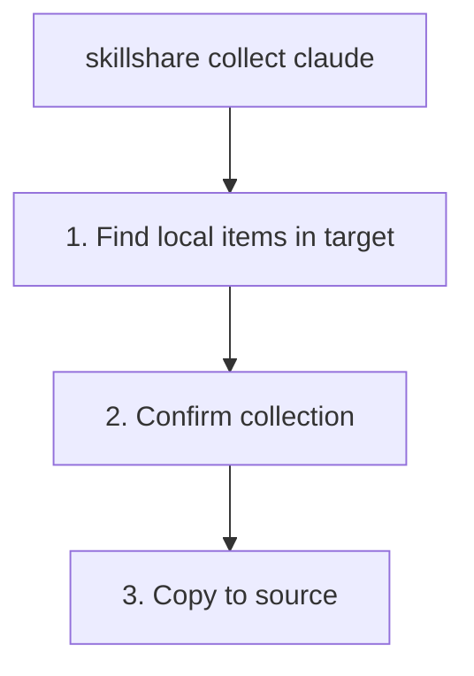

# collect

将本地 skills 或 agents 从 targets 收集回 source。

```bash
skillshare collect claude           # 从指定 target 收集
skillshare collect --all            # 从所有 targets 收集
skillshare collect claude --dry-run # 预览
skillshare collect agents claude    # 收集 agents 而不是 skills
```

## 何时使用

当你直接在 target 目录中创建或编辑了资源，并希望将它们拉回 source of truth 时，使用 `collect`：

1. 将它们添加到你的 source 以便共享
2. 将它们同步到其他 AI CLI
3. 用 git 备份它们

示例：

- Skills：`~/.claude/skills/my-skill/`
- Agents：`~/.claude/agents/tutor.md`

## 会发生什么



:::tip
在收集过程中会自动排除 `.git/` 目录。如果你直接把某个 skill 仓库 git clone 到了 target 目录中，只有 skill 内容会被复制——仓库元数据会被保留在原处。
:::

:::note
Web 仪表盘的 **Collect** 页面目前仅支持 skills。如需 `collect agents`，请使用 CLI。
:::

## 选项

| 标志 | 描述 |
|------|-------------|
| `--all, -a` | 从所有 targets 收集 |
| `--force, -f` | 覆盖 source 中已存在的项目并跳过确认 |
| `--dry-run, -n` | 预览而不做任何更改 |
| `--json` | 输出 JSON 并跳过确认；source 中已存在的项目仍需 `--force` 才能覆盖 |

## JSON 输出

```bash
skillshare collect claude --json
```

```json
{
  "pulled": ["new-skill", "another-skill"],
  "skipped": [],
  "failed": {},
  "dry_run": false,
  "duration": "0.123s"
}
```

结合 `--dry-run` 预览而不做更改：

```bash
skillshare collect claude --json --dry-run
skillshare collect -p --json
skillshare collect -p agents --json
```

## 示例输出

```bash
$ skillshare collect claude

Local skills found
  ℹ new-skill       [claude] ~/.claude/skills/new-skill
  ℹ another-skill   [claude] ~/.claude/skills/another-skill

Collect these skills to source? [y/N]: y

Collecting skills
  ✓ new-skill: copied to source
  ✓ another-skill: copied to source

Run 'skillshare sync' to distribute to all targets
```

## 处理冲突

如果某个项目已经存在于 source 中，默认情况下收集会跳过它：

```bash
$ skillshare collect claude

Collecting skills
  ⚠ my-skill: skipped (already exists in source, use --force to overwrite)

# 要覆盖：
$ skillshare collect claude --force

$ skillshare collect agents claude

Collecting agents
  ⚠ tutor.md: skipped (already exists in source, use --force to overwrite)
```

## 工作流

在 target 中创建 skill 后的典型工作流：

```bash
# 1. 在 Claude 中创建 skill
# （编辑 ~/.claude/skills/my-new-skill/SKILL.md）

# 2. 收集到 source
skillshare collect claude

# 3. 同步到所有其他 targets
skillshare sync

# 4. 提交到 git（可选）
skillshare push -m "Add my-new-skill"
```

对于 agents，使用专门的 collect/sync 组合：

```bash
skillshare collect agents claude
skillshare sync agents
```

## 另请参阅

- [sync](/docs/reference/commands/sync) — 从 source 同步到 targets
- [diff](/docs/reference/commands/diff) — 查看仅存在于本地的 skills
- [push](/docs/reference/commands/push) — 推送到 git remote
