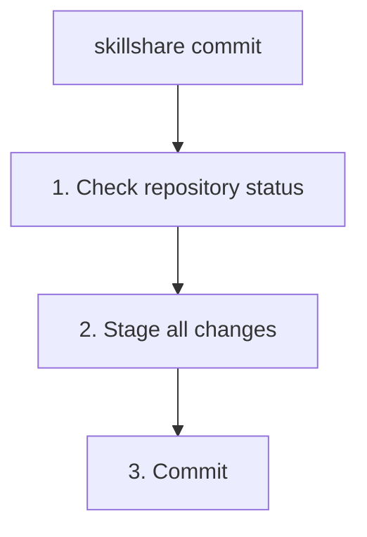

# commit

为 source skills 创建本地 git commit，但不推送。

```bash
skillshare commit                         # 使用默认消息提交
skillshare commit -m "Update skill"       # 自定义消息
skillshare commit --dry-run               # 预览
```

## 何时使用

- 在试验性地修改 skill 之前保存一个本地检查点
- 在没有配置 remote 的机器或 source 仓库上提交更改
- 将本地历史与跨机器共享的更改分开保存

如果你想要提交**并且**推送到 git remote，请使用 [`push`](./push.md)。

## 会发生什么



`commit` 会暂存 skills source 目录中的所有更改并创建一个 git commit。它不需要 remote，也绝不会执行 `git push`。

## 选项

| 标志 | 描述 |
|------|-------------|
| `-m, --message <msg>` | Commit 消息（默认："Update skills"） |
| `--dry-run, -n` | 预览而不做任何更改 |

## Git Root 作用域 {#git-root-scope}

`commit` 作用于 `git_root` 配置字段所选定的目录（默认：`skills` source）。使用 `skillshare init --git-root <scope>` 来更改被纳入版本控制的目录。有效的作用域如下：

| 作用域 | 目录 |
|-------|-----------|
| `skills`（默认） | Skills source（`~/.config/skillshare/skills/`） |
| `agents` | Agents source（`~/.config/skillshare/agents/`） |
| `extras` | Extras source（`~/.config/skillshare/extras/`） |
| `root` | 配置根目录（`~/.config/skillshare/`）——在同一个仓库中对 skills + agents + extras 一并进行版本控制 |

如果 `git_root` 被更改了，但 git 仓库仍然位于另一个作用域的目录中，`commit` 会打印一条 "Git root mismatch" 错误，并给出精确的 `git init` / `mv` 命令来修复。参见 [Changing the scope after init](/docs/reference/targets/configuration#git-root)。

## 前提条件

你的 skills source 目录必须是一个 git 仓库：

```bash
skillshare init
```

如果 source 不是 git 仓库，`commit` 会打印一条设置提示并退出，不会更改任何文件。

## 示例

```bash
# 使用默认消息提交
skillshare commit

# 使用自定义消息提交
skillshare commit -m "Update review skill"

# 预览已暂存的文件和消息，但不提交
skillshare commit --dry-run
```

## 另请参阅

- [push](./push.md) — 提交并推送到 git remote
- [pull](./pull.md) — 从 remote 拉取并同步到 targets
- [status](./status.md) — 检查 git 与同步状态
