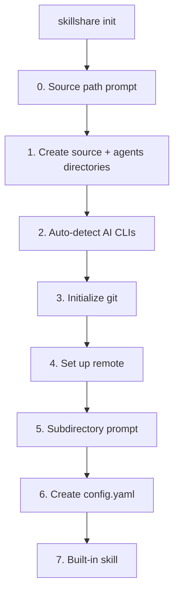
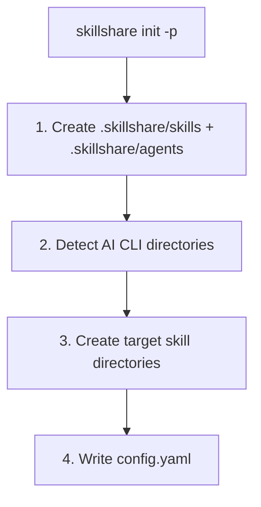

# init

首次设置。自动检测已安装的 AI CLI 并配置 targets。

```bash
skillshare init              # 交互式设置
skillshare init --dry-run    # 预览而不做任何更改
```

## 何时使用

- 在一台机器上首次设置 skillshare
- 迁移到新电脑（配合 `--remote` 连接到现有仓库）
- 为某个 project 添加 skillshare（配合 `--project`）
- 发现新安装的 AI CLI（配合 `--discover`）

## 会发生什么



`init` 会一步创建 skills source 目录**以及**与之并列的 `agents/` 目录，让两类资源都能立即使用。agents 目录是静默创建的——不会有额外提示或标志。agent 文件格式参见 [Agents](/docs/understand/agents)。

:::info Universal target
当检测到任意 AI CLI 时，`init` 会自动推荐 **universal** target（`~/.agents/skills`）。这是 [vercel-labs/skills](https://github.com/vercel-labs/skills)（`npx skills list`）所使用的共享目录，可一次性为所有兼容的 agent 提供 skills。
:::

:::tip Agents source path
agents source 默认路径为 `<source parent>/agents`（因此默认安装下为 `~/.config/skillshare/agents/`）。可在 `config.yaml` 中设置 `agents_source:` 来覆盖该位置。Project 模式始终使用 project 目录内的 `agents/`，不遵循 `agents_source`。支持 agent 的 targets（Claude、Cursor、Augment、OpenCode）会在你运行 `skillshare sync` 后自动获取 agents。
:::

## Project 模式

使用 `-p` 初始化 project 级别的 skills：

```bash
skillshare init -p                              # 交互式
skillshare init -p --targets claude,cursor  # 非交互式
skillshare init -p --visible                    # 使用可见的 skillshare/ 目录
```

### 会发生什么



init 完成后，将 project 目录（`skills/` 和 `agents/` 都要）提交到 git。使用 `--visible` 可创建 `skillshare/` 而非 `.skillshare/`。完整指南参见 [Project Setup](/docs/how-to/sharing/project-setup)。

## Discover 模式

在已有的设置上重新运行 init，可检测并添加新的 AI CLI targets：

### Global

```bash
skillshare init --discover              # 交互式选择
skillshare init --discover --select codex,opencode  # 非交互式
```

扫描尚未加入你配置的新安装 AI CLI，并提示你添加它们。只要检测到任意 CLI，就会自动推荐 `universal` target（`~/.agents/skills`）。

### Project

```bash
skillshare init -p --discover           # 交互式选择
skillshare init -p --discover --select antigravity  # 非交互式
```

扫描 project 目录中新的 AI CLI 目录（例如 `.agents/`），并将其添加为 targets。

### Discover + Mode 行为

当你将 `--discover` 与 `--mode` 结合使用时，该 mode **仅**作用于本次 discover 运行中新增的 targets。
配置中已有的 targets 保持不变。

```bash
# Adds cursor with mode=copy, does not change existing targets
skillshare init --discover --select cursor --mode copy

# Project mode variant (same rule)
skillshare init -p --discover --select cursor --mode copy
```

:::tip
如果你在一个已初始化的设置上运行 `skillshare init` 而不带 `--discover`，错误消息会提示你使用它。
:::

## 选项

| 标志 | 说明 |
|------|-------------|
| `--source, -s <path>` | 自定义 source 目录（交互式模式下若未设置会提示输入） |
| `--remote <url>` | 设置 git remote（隐含 `--git`；如果 remote 中已有 skills 会自动 pull；如果 remote 中已有 skills 会跳过内置 skill 的提示） |
| `--project, -p` | 在当前目录初始化 project 级别的 skills |
| `--copy-from, -c <name\|path>` | 从指定 CLI 或路径复制 skills |
| `--no-copy` | 从空的 source 开始（跳过复制提示） |
| `--targets, -t <list>` | 以逗号分隔的 target 名称列表 |
| `--all-targets` | 添加所有检测到的 targets |
| `--no-targets` | 跳过 target 选择 |
| `--mode, -m <mode>` | 为新配置的 targets 设置默认 mode（`merge`、`copy`、`symlink`）。配合 `--discover` 时，仅影响新添加的 targets。 |
| `--git` | 初始化 git，不做提示 |
| `--no-git` | 跳过 git 初始化 |
| `--skill` | 不做提示，直接安装内置 skillshare skill（为 AI CLI 添加 `/skillshare`） |
| `--no-skill` | 跳过内置 skill 安装 |
| `--discover, -d` | 检测并将新的 AI CLI targets 添加到现有配置中 |
| `--select <list>` | 以逗号分隔的待添加 target 列表（需配合 `--discover` 使用） |
| `--config local` | 将 `config.yaml` 加入 gitignore，让每位开发者自行管理各自的 targets（仅限 project 模式）。参见 [Centralized Skills Repo](/docs/how-to/recipes/centralized-skills-repo) recipe。 |
| `--visible` | 创建可见的 `skillshare/` project 目录而非 `.skillshare/`（仅限 project 模式）。参见 [Project Skills](/docs/understand/project-skills#visible-project-directory)。 |
| `--git-root <scope>` | `commit`/`push`/`pull` 操作所使用的目录（默认 `skills`，另有 `agents`、`extras`、`root`）。`root` 会将 skills + agents + extras 一并纳入同一个仓库进行版本控制，并自动忽略 `config.yaml`。在设置过程中也可交互式选择。之后可重新运行 `skillshare init --git-root <scope>` 无提示地切换作用域——它会在新作用域下初始化一个仓库并保存该设置，但不会迁移已有历史记录。 |
| `--subdir <name>` | 使用某个子目录作为 source 路径（例如 `skills`） |
| `--dry-run, -n` | 预览而不做任何更改 |

`init` 会设置你的初始 mode 策略。之后你随时可以对单个 target 进行微调：

```bash
skillshare target cursor --mode copy
skillshare sync
```

## Source 子目录

默认情况下，`init --remote` 会将整个 git 仓库根目录作为 skills source。如果你的仓库还包含非 skill 文件（README、CI 配置、dotfile 等），可以改为将 skills 存放在子目录中：

```
# Without --subdir: repo root = source (all files are skills)
~/.config/skillshare/skills/          ← git repo root = source
  ├── my-skill/
  └── another-skill/

# With --subdir skills: source points to a subdirectory
~/.config/skillshare/skills/          ← git repo root
  ├── README.md
  ├── .github/
  └── skills/                         ← source points here
      ├── my-skill/
      └── another-skill/
```

典型使用场景：将 skills 内嵌到现有的 dotfiles 或 monorepo 中，而不是使用专门的 skills 仓库。

```bash
# Interactive: prompts during init
skillshare init --remote git@github.com:you/dotfiles.git

# Non-interactive: specify directly
skillshare init --remote git@github.com:you/dotfiles.git --subdir skills
```

## 常见场景

### Remote 设置（任选其一）

交互式（推荐用于希望有引导提示的首次设置）：

```bash
skillshare init --remote git@github.com:you/my-skills.git
```

非交互式（无提示，自动检测已安装的 targets）：

```bash
skillshare init --remote git@github.com:you/my-skills.git --no-copy --all-targets --no-skill
```

非交互式（无提示，并立即导入现有的 Claude skills）：

```bash
skillshare init --remote git@github.com:you/my-skills.git --copy-from claude --all-targets --no-skill
```

### 集中式 skills 仓库

```bash
# Creator: set up shared repo with local config
skillshare init -p --config local --targets claude

# Teammate: clone and auto-detect shared repo
git clone <repo> && cd <repo>
skillshare init -p
skillshare target add myproject ~/DEV/myproject/.claude/skills -p
```

### 其他场景

```bash
# Standard setup (auto-detect everything)
skillshare init

# Use existing skills directory
skillshare init --source ~/.config/skillshare/skills

# Project-level setup
skillshare init -p
skillshare init -p --targets claude,cursor

# Fully non-interactive setup
skillshare init --no-copy --all-targets --git --skill

# Start with copy mode defaults for newly added targets
skillshare init --mode copy

# Add newly installed CLIs to existing config
skillshare init --discover
skillshare init -p --discover

# Add a newly discovered target and force copy mode only for that new target
skillshare init --discover --select cursor --mode copy
```
