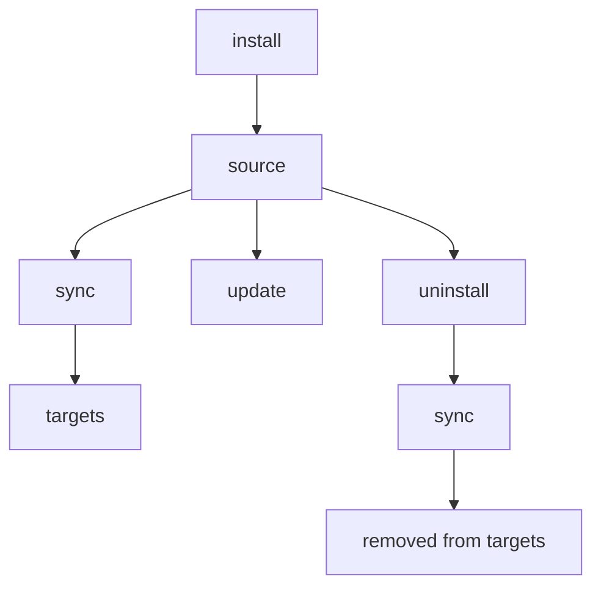

# install

从 GitHub 仓库、git URL 或本地路径添加 Skill。

## 概述



## 使用场景

- 从 GitHub、GitLab、Bitbucket、Azure DevOps 或本地路径添加一个新的 Skill
- 安装组织共享的 Skill 仓库（配合 `--track`）
- 重新安装或更新一个已存在的 Skill（配合 `--update` 或 `--force`）

---

## 快速示例

```bash
# 来自 GitHub（简写形式）
skillshare install anthropics/skills/skills/pdf

# 浏览某个仓库中可用的 Skill
skillshare install anthropics/skills

# 来自本地路径
skillshare install ~/Downloads/my-skill

# 作为 tracked repo（用于团队共享）
skillshare install github.com/team/skills --track

# 安装到子目录（按类别组织）
skillshare install ~/my-skill --into frontend

# 从配置安装所有 Skill（不带参数）
skillshare install
```

## Source 格式

### GitHub 简写形式

使用 `owner/repo` 格式 —— 会自动展开为 `github.com/owner/repo`：

```bash
skillshare install anthropics/skills                    # 浏览模式
skillshare install anthropics/skills/skills/pdf         # 直接安装
skillshare install ComposioHQ/awesome-claude-skills     # 另一个仓库
```

### GitLab / Bitbucket / 其他托管平台

对于非 GitHub 的托管平台，使用 `domain/owner/repo` 格式：

```bash
skillshare install gitlab.com/user/repo                 # GitLab
skillshare install bitbucket.org/team/skills            # Bitbucket
skillshare install git.company.com/team/skills          # 自建托管
```

完整 URL 和 SSH 形式同样可用：

```bash
skillshare install https://gitlab.com/user/repo.git
skillshare install git@gitlab.com:user/repo.git
```

:::tip 自定义域名下的自建 GitLab
名称中包含 `gitlab` 或 `jihulab` 的主机会被自动识别，并支持嵌套 subgroup。对于其他部署在自定义域名上的自建 GitLab 实例（例如 `git.company.com`），请将该主机名添加到你配置中的 [`gitlab_hosts`](/docs/reference/targets/configuration#gitlab_hosts)，这样 skillshare 就会把完整的 URL 路径当作仓库路径处理。如果没有配置，你也可以通过追加 `.git` 作为变通方案：`git.company.com/team/frontend/ui.git`。
:::

### Azure DevOps

使用 `ado:` 简写形式或完整的 Azure DevOps URL：

```bash
# 简写形式（ado:org/project/repo）
skillshare install ado:myorg/myproject/myrepo
skillshare install ado:myorg/myproject/myrepo/skills/react    # 带子目录

# 完整 HTTPS URL
skillshare install https://dev.azure.com/myorg/myproject/_git/myrepo

# 旧版格式（自动标准化）
skillshare install https://myorg.visualstudio.com/myproject/_git/myrepo

# SSH
skillshare install git@ssh.dev.azure.com:v3/myorg/myproject/myrepo
```

## Discovery Mode（浏览 Skill）

当你不指定路径时，skillshare 会克隆该仓库、扫描其中的 Skill，并展示一个交互式选择器：

```bash
skillshare install anthropics/skills
```

<p>
  
</p>

Discovery 会扫描所有目录以查找 `SKILL.md` 文件，仅跳过 `.git`。这意味着位于隐藏目录（如 `.curated/` 或 `.system/`）中的 Skill 也会被自动发现。当发现多个 Skill 时，选择提示会按目录对它们分组，方便浏览。

如果仓库根目录下存在 `.skillignore` 文件，匹配的 Skill 会被自动从 discovery 中排除。参见下方的 [.skillignore](#skillignore)。

如果某个 Skill 的 `SKILL.md` 包含 `license:` frontmatter 字段，该 license 会显示在选择提示中（例如 `my-skill (MIT)`），以及单 Skill 安装的确认界面中。

**提示**：使用 `--dry-run` 可以在不安装的情况下预览：
```bash
skillshare install anthropics/skills --dry-run
```

## Selective Install（非交互式）

无需提示，从多 Skill 仓库中挑选特定 Skill。`--skill` flag 支持**模糊匹配**和 **glob 模式** —— 如果找不到精确名称，会先尝试 glob 匹配（`*`、`?`、`[...]`），然后回退到最接近的子串匹配：

```bash
# 按名称安装特定 Skill（精确或模糊匹配）
skillshare install anthropics/skills -s pdf,commit

# 安装匹配 glob 模式的 Skill
skillshare install anthropics/skills -s "core-*"

# 安装所有发现的 Skill
skillshare install anthropics/skills --all

# 自动接受（对多 Skill 仓库等效于 --all）
skillshare install anthropics/skills -y

# 与其他 flag 组合使用
skillshare install anthropics/skills -s pdf --dry-run
skillshare install anthropics/skills --all -p
```

Glob 匹配不区分大小写：`"Core-*"` 会匹配 `core-auth`、`CORE-DB` 等。

:::tip Shell glob 保护
请始终为 glob 模式加上引号（`"core-*"`），以防止 shell 将 `*` 展开为当前目录下的文件名。
:::

适用于 CI/CD 流水线和脚本化工作流。

## Direct Install（指定路径）

提供完整路径即可立即安装：

```bash
# 带子目录的 GitHub 仓库
skillshare install anthropics/skills/skills/pdf
skillshare install google-gemini/gemini-cli/packages/core/src/skills/builtin/skill-creator

# 模糊子目录匹配 —— 如果精确路径不存在，会按 Skill 名称匹配
skillshare install runkids/my-skills/vue-best-practices

# 完整 URL
skillshare install github.com/user/repo/path/to/skill

# SSH URL
skillshare install git@github.com:user/repo.git

# 带子目录的 SSH URL（使用 // 分隔符）
skillshare install git@github.com:user/repo.git//path/to/skill

# 本地路径
skillshare install ~/Downloads/my-skill
skillshare install /absolute/path/to/skill
```

:::tip 模糊子目录解析
当指定像 `owner/repo/skill-name` 这样的子目录路径时，如果该精确路径在仓库中不存在，skillshare 会扫描所有 `SKILL.md` 文件并按目录 basename 进行匹配。如果多个 Skill 共享同一个名称，会显示带完整路径的歧义错误，方便你指定具体的那一个。
:::

## Install from Config（不带参数）{#install-from-config-no-arguments}

不带 source 参数运行时，`skillshare install` 会读取已记录的远程 Skill 元数据（global mode）或 project 的 `skills:` manifest（project mode），并安装所有本地尚不存在的远程 Skill：

```bash
# Global — 读取 ~/.config/skillshare/config.yaml
skillshare install

# Project — 读取 .skillshare/config.yaml
skillshare install -p
```

这使得记录下来的元数据/manifest 成为一份**可移植的 Skill 配置** —— 分享它即可在任何机器上复现相同的 Skill 集合：

```bash
# 新机器设置
skillshare install       # 从元数据重新拉取远程 Skill 和 tracked repo
skillshare sync          # 同步到 target

# 新团队成员入职
git clone github.com/team/project && cd project
skillshare install -p    # 从 project 配置安装所有远程 Skill
skillshare sync
```

标记为 `tracked: true` 的 Skill 会以完整 git 历史克隆（与 `--track` 相同），因此 `skillshare update` 能正常工作。磁盘上已存在的 Skill 会被跳过。当 tracked repo 目录被 gitignore 掉、克隆后本地缺失时，这就是恢复用的命令。

:::tip push/pull 与 install from config 的区别
`push`/`pull` 通过 git 同步实际的 Skill **文件**。`install` from config 则从 **source URL** 重新下载。两者是互补的 —— 具体该用哪个，参见 [Cross-Machine Sync](/docs/how-to/sharing/cross-machine-sync#alternative-install-from-config)。
:::

使用不带参数的 install 时，`--name`、`--into`、`--track`、`--skill`、`--exclude`、`--all`、`--yes` 和 `--update` 不受支持（它们需要 source 参数）。`--dry-run`、`--force`、`--skip-audit` 以及阈值覆盖项（`--audit-threshold` / `--threshold` / `-T`）可以正常使用。

## Project Mode

将 Skill 安装到 project 的 `.skillshare/skills/` 目录中：

```bash
# 将一个 Skill 安装到 project 中
skillshare install anthropics/skills/skills/pdf -p

# 安装到 project 内的子目录中
skillshare install anthropics/skills -s pdf --into tools -p
# → .skillshare/skills/tools/pdf/

# 从配置安装所有远程 Skill（用于新团队成员）
skillshare install -p
```

:::caution 不要把 project 根目录安装进它自身
在 project mode 下，如果安装的本地路径解析后指向 project 根目录（例如 `skillshare install ./ -p`），该操作会被拒绝 —— 把根目录复制进它自己的 `.skillshare/skills/` 子树会导致递归进入目标目录。请改为指向具体的 Skill 子目录：

```bash
skillshare install ./my-skill -p
```

这个防护同时适用于 CLI 和 Web UI（[`skillshare ui`](./ui.md)）。
:::

### 两者的区别

| | Global | Project (`-p`) |
|---|---|---|
| Destination | `~/.config/skillshare/skills/` | `.skillshare/skills/` |
| `--track` | 支持 | 支持 |
| Config update | 自动协调 `config.yaml` 中的 `skills:` | 自动协调 `.skillshare/config.yaml` 中的 `skills:` |
| No-arg install | 安装配置中列出的所有 Skill | 安装配置中列出的所有 Skill |

**Project mode 下的 tracked repo** 与 global 模式工作方式相同 —— 仓库会保留 `.git` 克隆下来，并添加到 `.skillshare/.gitignore` 中（该文件默认还会忽略 `.skillshare/logs/` 和 `.skillshare/trash/`）。`tracked: true` 标记会自动记录到 `.skillshare/config.yaml` 中：

```bash
skillshare install github.com/team/skills --track -p
skillshare sync
```

完整指南参见 [Project Setup](/docs/how-to/sharing/project-setup)。

## 选项

| Flag | Short | Description |
|------|-------|-------------|
| `--name <name>` | | 当只安装了恰好一个 Skill 时，覆盖安装后的名称 |
| `--into <dir>` | | 安装到子目录中（例如 `--into frontend` 或 `--into frontend/react`） |
| `--force` | `-f` | 覆盖已存在的 Skill；跳过 audit 拦截和跨路径重复检测 |
| `--update` | `-u` | 如果已存在则更新（git pull 或重新安装） |
| `--branch <ref>` | `-b` | 要安装的 git branch、tag 或 commit SHA（默认：远程默认分支） |
| `--track` | `-t` | 为 tracked repo 保留 `.git` |
| `--kind <skill\|agent>` | | 限制只安装某一种资源类型 |
| `--agent <names>` | `-a` | 从仓库中选择指定的 agent（逗号分隔） |
| `--skill` | `-s` | 从多 Skill 仓库中选择指定的 Skill（逗号分隔；支持像 `core-*` 这样的 glob 模式） |
| `--exclude` | | 安装时跳过特定的 Skill（逗号分隔；支持像 `test-*` 这样的 glob 模式） |
| `--all` | | 不经提示安装所有发现的 Skill |
| `--yes` | `-y` | 自动接受所有提示（对 CI/CD 友好） |
| `--skip-audit` | | 为本次安装跳过安全扫描 |
| `--audit-threshold <t>`, `--threshold <t>` | `-T` | 覆盖本次命令的 audit 拦截阈值（`critical\|high\|medium\|low\|info`；简写：`c\|h\|m\|l\|i`，另有 `crit`、`med`） |
| `--audit-verbose` | | 显示每个 Skill 的完整 audit 发现（默认：精简摘要） |
| `--project` | `-p` | 安装到 project 的 `.skillshare/skills/` |
| `--global` | `-g` | 安装到 global 的 `~/.config/skillshare/skills/` |
| `--dry-run` | `-n` | 仅预览 |
| `--json` | | 以 JSON 输出（隐含 `--force`；未指定 `--skill`/`--agent` 过滤条件时也隐含非交互式选择） |

## JSON 输出

```bash
skillshare install anthropics/skills --json
```

```json
{
  "source": "anthropics/skills",
  "tracked": false,
  "dry_run": false,
  "skills": ["pdf", "commit", "review"],
  "failed": [],
  "duration": "2.345s"
}
```

使用 `--into` 时，输出中会包含 `into` 字段：

```bash
skillshare install anthropics/skills --json --into frontend
```

```json
{
  "source": "anthropics/skills",
  "tracked": false,
  "dry_run": false,
  "into": "frontend",
  "skills": ["pdf", "commit"],
  "failed": [],
  "duration": "1.890s"
}
```

对于仅安装 agent 的情况，JSON 输出仍然使用 `skills` 数组来报告已安装的名称：

```bash
skillshare install github.com/user/agents --kind agent --json
```

```json
{
  "source": "github.com/user/agents",
  "tracked": false,
  "dry_run": false,
  "skills": ["reviewer", "tutor"],
  "failed": [],
  "duration": "1.234s"
}
```

## 重复检测

skillshare 会自动检测你是否正在安装某个已经存在的内容：

### 同仓库重装

如果某个 Skill 已存在，且是从**同一个仓库**安装的，skillshare 会跳过它并给出警告，而不是直接失败：

```bash
skillshare install anthropics/skills/skills/pdf
# ✓ Installed pdf

skillshare install anthropics/skills/skills/pdf
# ⊘ pdf — already installed from same repo
```

使用 `--update` 刷新，或使用 `--force` 覆盖。

### 跨路径重复

如果某个仓库已经安装在某个位置，而你尝试将它安装到**另一个不同**的位置，skillshare 会阻止该操作：

```bash
# 首次安装（安装到子目录）
skillshare install runkids/feature-radar --into feature-radar

# 之后，忘记了第一次安装
skillshare install runkids/feature-radar
# ✗ this repo is already installed at skills/feature-radar/scan (and 2 more)
#   Use 'skillshare update' to refresh, or reinstall with --force to allow duplicates
```

这可以防止跨不同路径出现意外的重复安装。如果确实需要，可使用 `--force` 主动允许。

### 与不同仓库冲突

如果目标目录已存在，但它是从**不同**的仓库安装的，错误信息会包含原始 source：

```bash
skillshare install owner/repo-b --name my-skill
# ✗ my-skill already exists (installed from https://github.com/owner/repo-a.git).
#   To overwrite: skillshare install owner/repo-b --name my-skill --force
```

`--force` 提示始终会包含正确的 flag（包括适用时的 `--into`）。

## 常见场景

**使用自定义名称安装：**
```bash
skillshare install google-gemini/gemini-cli/.../skill-creator --name my-creator
# Installed as: ~/.config/skillshare/skills/my-creator/
```

`--name` 仅在安装解析为单个 Skill 时有效。
在 `--track` 模式下，自定义名称会作为 tracked repo 目录存储（自动加上 `_` 前缀），且不能包含路径分隔符或 `..`。

```bash
# ✅ 单个 Skill（可行）
skillshare install comeonzhj/Auto-Redbook-Skills --name haha

# ❌ 发现多个 Skill（报错）
skillshare install anthropics/skills --name my-skill
```

**强制覆盖已存在的：**
```bash
skillshare install ~/my-skill --force
```

**更新已存在的 Skill：**
```bash
# 按 Skill 名称（使用存储的 source）
skillshare install pdf --update

# 按 source URL
skillshare install anthropics/skills/skills/pdf --update
```

**安装到子目录：**
```bash
# 按类别组织
skillshare install ~/my-skill --into frontend
# → ~/.config/skillshare/skills/frontend/my-skill/

# 多级嵌套
skillshare install anthropics/skills -s pdf --into frontend/react
# → ~/.config/skillshare/skills/frontend/react/pdf/

# sync 之后，target 中会显示扁平名称：frontend__my-skill、frontend__react__pdf
```

文件夹组织策略参见 [Organizing Skills](/docs/how-to/daily-tasks/organizing-skills)。

**从指定分支安装：**
```bash
# 从某个分支进行常规安装
skillshare install github.com/team/skills --branch develop --all

# 跟踪某个特定分支
skillshare install github.com/team/skills --track --branch frontend

# 同一个仓库、不同分支（用 --name 避免冲突）
skillshare install github.com/team/skills --track --branch frontend --name team-frontend
skillshare install github.com/team/skills --track --branch backend --name team-backend
```

**固定到 tag 或 commit SHA（可复现的安装）：**
```bash
# 固定到某个 release tag
skillshare install github.com/team/skills --branch v1.2.0 --all

# 固定到确切的 commit（完整或缩写 SHA）
skillshare install github.com/team/skills --branch 8f14e45fceea167a5a36dedd4bea2543ce848564 --all
```

固定的 ref 会保存在 Skill 元数据中，因此 `skillshare update` 会重新安装同一版本，`skillshare check` 对 SHA 固定会直接报告为最新，不会连接远程。`--track` 必须是分支：tag 或 commit SHA 会让克隆处于 detached 状态，`skillshare update` 没有可以 pull 的内容，因此安装会被拒绝。

**安装团队仓库（tracked）：**
```bash
skillshare install anthropics/skills --track
```

<p>
  
</p>

## 私有仓库 {#private-repositories}

### SSH（推荐）

SSH 是最简单的方式 —— 如果你的 SSH key 已经配置好，直接就能用：

```bash
skillshare install git@github.com:org/private-skills.git --track
skillshare install git@gitlab.com:org/skills.git --track
skillshare install git@bitbucket.org:team/skills.git --track
skillshare install git@ssh.dev.azure.com:v3/org/project/skills --track

# 带子目录
skillshare install git@github.com:org/skills.git//frontend-react
```

### 使用 Token 的 HTTPS

设置相应的环境变量并使用普通的 HTTPS URL。skillshare 会自动检测该 token 并在克隆时注入：

```bash
export GITHUB_TOKEN=ghp_your_token
skillshare install https://github.com/org/private-skills.git --track
```

| Platform | Env Var | Token Type |
|----------|---------|------------|
| GitHub | `GITHUB_TOKEN` | Personal access token（`repo` scope） |
| GitLab | `GITLAB_TOKEN` | Personal access 或 CI job token |
| Bitbucket | `BITBUCKET_TOKEN` | Repository token，或 app password（配合 `BITBUCKET_USERNAME`） |
| Azure DevOps | `AZURE_DEVOPS_TOKEN` | Personal Access Token（Code: Read scope） |
| Any host | `SKILLSHARE_GIT_TOKEN` | 通用兜底方案 |

平台专属变量的优先级高于 `SKILLSHARE_GIT_TOKEN`。

官方 token 文档：
- GitHub: [Managing your personal access tokens](https://docs.github.com/en/authentication/keeping-your-account-and-data-secure/managing-your-personal-access-tokens)
- GitLab: [Token overview](https://docs.gitlab.com/security/tokens/)
- Bitbucket: [Access tokens](https://support.atlassian.com/bitbucket-cloud/docs/access-tokens/)
- Azure DevOps: [Use Personal Access Tokens](https://learn.microsoft.com/en-us/azure/devops/organizations/accounts/use-personal-access-tokens-to-authenticate?view=azure-devops)

对于 Bitbucket app password，还需要设置你的用户名：

```bash
export BITBUCKET_USERNAME=your_bitbucket_username
export BITBUCKET_TOKEN=your_app_password
skillshare install https://bitbucket.org/team/skills.git --track
```

### CI/CD 示例

**GitHub Actions:**

```yaml
- name: Install shared skills
  env:
    GITHUB_TOKEN: ${{ secrets.GITHUB_TOKEN }}
  run: skillshare install https://github.com/org/skills.git --track
```

**GitLab CI:**

```yaml
install-skills:
  script:
    - skillshare install https://gitlab.com/org/skills.git --track
  variables:
    GITLAB_TOKEN: $CI_JOB_TOKEN
```

**Bitbucket Pipelines:**

```yaml
- step:
    name: Install shared skills
    script:
      - skillshare install https://bitbucket.org/team/skills.git --track
    env:
      BITBUCKET_USERNAME: $BITBUCKET_USERNAME   # for app passwords
      BITBUCKET_TOKEN: $BITBUCKET_TOKEN
```

**Azure Pipelines:**

```yaml
- script: skillshare install https://dev.azure.com/org/project/_git/skills --track
  env:
    AZURE_DEVOPS_TOKEN: $(System.AccessToken)
```

## 安全扫描

每个 Skill 在安装期间都会自动扫描安全威胁：

- 达到或超过 `audit.block_threshold` 的发现项会**阻止安装**（默认：`CRITICAL`）
- 较低级别的发现项会以警告形式显示，并附带风险评分上下文
- `audit.block_threshold` 只控制拦截级别；它**不会**禁用扫描本身
- 没有可以永久跳过 audit 的配置开关；需要时请对单条命令使用 `--skip-audit`
- 你可以通过 `--audit-threshold`、`--threshold` 或 `-T` 为单条命令覆盖阈值

阈值配置示例：

```yaml
audit:
  block_threshold: HIGH
```

```bash
# 被阻止 —— 检测到 critical 级别威胁
skillshare install evil-skill
# → Installation blocked at active threshold. Use --force to override.

# 尽管有警告，仍强制安装
skillshare install suspicious-skill --force

# 完全跳过扫描（请谨慎使用）
skillshare install suspicious-skill --skip-audit

# 按命令覆盖阈值（含义相同）
skillshare install suspicious-skill --audit-threshold high
skillshare install suspicious-skill --threshold high
skillshare install suspicious-skill -T h
```

使用 `--force` 覆盖拦截判定，或使用 `--skip-audit` 完全绕过扫描。扫描细节参见 [audit](/docs/reference/commands/audit)。

安装判定使用的是**发现项严重级别 vs 阈值**。风险评分/标签仅作为上下文提供参考，本身并不会阻止安装。默认情况下，audit 发现项会以精简摘要形式显示（按严重级别和消息分组）。使用 `--audit-verbose` 可查看完整列表。

### Tracked Repo 的 Audit Gate（`--track`）

Tracked repo 使用相同的阈值模型，但扫描范围和失败处理更加严格：

- 首次 `--track` 安装会扫描**整个克隆下来的仓库**（而不仅仅是某一个 Skill 文件夹）
- 达到/超过阈值的发现项会阻止安装，除非使用了 `--force`
- 首次安装被阻止时，skillshare 会自动从 source 中移除已克隆的仓库
- 如果自动清理失败，install 会返回明确的错误，并提示你手动移除该路径

通过 install 更新 tracked repo（`skillshare install <repo> --track --update`）时，会在 `git pull` 之后进行 audit：

- skillshare 会先捕获一个 pull 前的 commit hash
- 如果 hash 捕获失败，更新会立即中止（fail-closed）
- 如果检测到达到/超过阈值的发现项，更新会回滚到 pull 前的 commit
- 如果回滚失败，命令会以警告退出，提示可能仍残留恶意内容

### `--force` 与 `--skip-audit` 的区别

两者都能解除安装拦截，但作用方式不同：

| Flag | Audit execution | What happens |
|------|------------------|--------------|
| `--force` | audit 仍会运行 | 发现项仍会被生成/记录；即使达到阈值，安装也会继续 |
| `--skip-audit` | audit 会被跳过 | 本次安装不执行任何扫描 |

推荐用法：

- 当你仍然想看到发现项时，优先使用 `--force`。
- 只有在你确实有意要绕过扫描时，才使用 `--skip-audit`。
- 如果两者同时设置，实际上 `--skip-audit` 优先生效（会跳过扫描）。

## 排除 Skill {#excluding-skills}

### `--exclude` flag

从多 Skill 仓库安装时跳过特定的 Skill。同时支持精确名称和 **glob 模式**：

```bash
# 安装除特定 Skill 外的全部内容
skillshare install anthropics/skills --all --exclude cli-sentry,delayed-command

# 按 glob 模式排除
skillshare install anthropics/skills --all --exclude "test-*"

# 同样适用于 -y
skillshare install org/skills -y --exclude internal-tool

# 与 --skill 结合以实现精细控制
skillshare install org/skills -s pdf,commit,docs --exclude docs
```

当有 Skill 被排除时，会显示一条消息说明跳过了哪些内容：`Excluded 2 skill(s): cli-sentry, delayed-command`。

:::note 需要多 Skill Discovery
`--exclude` 仅在从包含多个 Skill 的**git 仓库**安装时生效。它可以与 `--all`、`--yes`、`--skill` 以及交互式选择模式配合使用。对于直接安装（本地路径或单 Skill 的 git URL），`--exclude` 不适用 —— 如果指定了它，会显示一条警告。
:::

### .skillignore {#skillignore}

仓库维护者可以在仓库根目录创建一个 `.skillignore` 文件，以在 discovery 中隐藏某些 Skill。从该仓库安装的用户将永远不会在选择提示中看到这些 Skill。

```text title=".skillignore"
# Internal tooling — not for public use
validation-scripts
scaffold-template

# Exclude all test/eval skills
prompt-eval-*

# Exclude an entire group directory
internal-tools
```

**真实案例** —— [`runkids/my-skills`](https://github.com/runkids/my-skills) 使用 `.skillignore` 来排除非 Skill 目录和内部工具：

```text title=".skillignore"
skillshare
feature-radar
```

结合 `--exclude`，用户可以进一步缩小选择范围：

```bash
skillshare install runkids/my-skills --exclude seo
```

**格式** —— 使用 [gitignore 语法](https://git-scm.com/docs/gitignore)：

| Pattern | Example | Behavior |
|---------|---------|----------|
| 精确名称 | `validation-scripts` | 匹配该路径下的一个 Skill |
| 分组匹配 | `feature-radar` | 匹配 `feature-radar/` 下的**所有** Skill |
| 精确路径 | `feature-radar/feature-radar` | 仅匹配该具体的 Skill |
| `*` 通配符 | `prompt-eval-*` | 匹配单个路径段（不跨越 `/`） |
| `**` | `**/temp` | 匹配任意目录深度 |
| `?` | `?.md` | 匹配单个字符 |
| `[abc]` | `[Tt]est` | 字符类 |
| `!pattern` | `!important` | 取反 —— 取消忽略之前已匹配的 Skill |
| `/pattern` | `/root-only` | 锚定到 `.skillignore` 所在位置 |
| `pattern/` | `build/` | 仅匹配目录 |
| `\#`、`\!` | `\#file` | 转义字面字符 |

以 `#` 开头的行是注释。空行会被忽略。

**推荐使用场景：**
- 发布一个多 Skill 仓库，同时隐藏内部工具或开发中的 Skill
- 使用带有分组 Skill 目录的 monorepo，排除整个分组（例如 `internal-tools`）
- 在维护者层面强制执行可见性规则，使所有安装者都无法发现某些 Skill

**不适合的场景：**
- 直接的本地路径安装（这类安装会跳过 discovery）
- 单 Skill 的直接安装（与 `--exclude` 类似，对直接安装路径无效）

`.skillignore` 是在 git 仓库 discovery 期间生效的，因此它会影响所有基于 discovery 的安装路径：`--all`、`--skill`、`--yes` 以及交互式选择。它**不会**应用于直接的本地路径安装（这类安装完全跳过 discovery）。

:::tip .skillignore 的作用范围
**仓库级** `.skillignore`（位于仓库根目录）控制用户从你的仓库安装时能发现哪些 Skill。安装完成后，tracked repo 会保留其 `.skillignore` —— `doctor`、`status`、`list`、`sync`、`audit`、`diff` 和 `check` 也都会遵循它。

**Source 根级** `.skillignore`（`~/.config/skillshare/skills/.skillignore`）全局适用于所有 Skill —— 无论是否 tracked。可用它来临时屏蔽某些 Skill 或排除某些模式（例如 `draft-*`），而无需卸载它们。
:::

### `.skillignore` 与 `--exclude` 的区别

| | `.skillignore` | `--exclude` |
|---|---|---|
| **由谁控制** | 仓库维护者 | 安装用户 |
| **存放位置** | 仓库根目录下的 `.skillignore` | CLI flag |
| **生效时机** | Discovery 期间（选择之前） | Discovery 之后（提示之前） |
| **作用范围** | 所有从该仓库安装的用户 | 仅本次安装 |
| **要求** | 包含多个 Skill 的 git 仓库 | 包含多个 Skill 的 git 仓库 |

## Agent 支持

安装某个仓库时，skillshare 会自动检测与 Skill 并存的 agent（独立的 `.md` 文件）：

- 如果仓库包含 `agents/` 目录，其中的 `.md` 文件会被作为 agent 候选项发现
- 如果仓库同时包含 `skills/` 和 `agents/`，两者都会被安装
- 如果仓库根目录只有散落的 `.md` 文件（没有 `SKILL.md`），它们会被当作 agent 处理

### 显式 agent flag

```bash
# 仅安装某个仓库中的 agent
skillshare install github.com/user/repo --kind agent

# 按名称安装特定 agent（-a 简写）
skillshare install github.com/user/repo -a tutor,reviewer

# 与 project mode 结合使用
skillshare install github.com/user/repo --kind agent -p
```

`-a <name>` flag 是 agent 版本的 `-s <name>`（用于 Skill）。Agent 会被安装到 `~/.config/skillshare/agents/`（global）或 `.skillshare/agents/`（project）。完整概念参见 [Agents](/docs/understand/agents)。

### 在混合仓库中区分 Skill 与 Agent 的范围

当一个仓库同时包含 Skill 和 Agent 时，过滤条件会精确控制安装哪些内容：

| Flags | What gets installed |
|-------|---------------------|
| _（无）_ | 所有 Skill 和所有 Agent |
| `--all` / `--yes` | 所有 Skill 和所有 Agent |
| `-s <names>` | 仅指定的 Skill —— **不含 Agent** |
| `-s <names> -a <names>` | 指定的 Skill 和指定的 Agent |
| `-a <names>` | 仅指定的 Agent |

```bash
# 从混合仓库中只安装一个 Skill —— 不会带入 Agent
skillshare install github.com/user/repo -s pdf

# 同时安装一个 Skill 和一个 Agent
skillshare install github.com/user/repo -s pdf -a tutor
```

未知的 `-a` 名称会在任何 Skill 被安装之前，让整个命令直接失败 —— 因此自动化流程永远不会看到一次半完成的安装。

## 安装之后

务必执行 sync 以分发到各个 target：

```bash
skillshare install anthropics/skills/skills/pdf
skillshare sync  # ← 别忘了这一步！
```

## 另请参阅

- [list](/docs/reference/commands/list) — 查看已安装的 Skill
- [update](/docs/reference/commands/update) — 更新 Skill 或 tracked repo
- [upgrade](/docs/reference/commands/upgrade) — 升级 CLI 和内置 Skill
- [uninstall](/docs/reference/commands/uninstall) — 移除 Skill
- [sync](/docs/reference/commands/sync) — 将 Skill 同步到 target
- [Organization-Wide Skills](/docs/how-to/sharing/organization-sharing) — 使用 tracked repo 进行组织级共享
