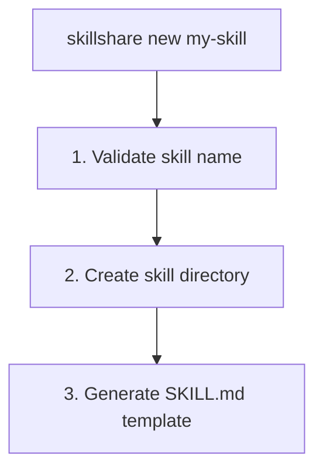

# new

使用 SKILL.md 模板创建一个新的 Skill。

```bash
skillshare new <name>            # 创建一个新的 Skill
skillshare new <name> -p         # 在 project 中创建（.skillshare/skills/）
skillshare new <name> --dry-run  # 预览而不创建
```

## 使用场景

- 使用推荐的模板结构从头创建一个新 Skill
- 以正确的 SKILL.md 格式（name、description、frontmatter）开始

**执行流程：**


---

## 选项

| Flag | Description |
|------|-------------|
| `--project`, `-p` | 在 project 中创建（`.skillshare/skills/`） |
| `--global`, `-g` | 在 global 中创建（`~/.config/skillshare/skills/`） |
| `--pattern`, `-P` | 使用设计模式（`tool-wrapper`、`generator`、`reviewer`、`inversion`、`pipeline`、`none`） |
| `--dry-run`, `-n` | 预览而不创建文件 |
| `--help`, `-h` | 显示帮助 |

自动检测：如果当前目录中存在 `.skillshare/config.yaml`，则默认使用 project mode。

---

## Skill 命名规则

- 小写字母、数字、连字符、下划线
- 必须以字母或下划线开头
- 示例：`my-skill`、`code_review`、`pdf-tools`

---

## 模板结构

生成的 SKILL.md 遵循 [Anthropic 的 Skill 构建最佳实践](https://www.anthropic.com/engineering/building-skills-for-claude)：

```markdown
---
name: my-skill
description: >-
  Describe what this skill does. Use when user asks to
  "trigger phrase 1", "trigger phrase 2", or needs help
  with a specific task.
# ── Optional fields ──────────────────────────────────
# license: MIT
# allowed-tools: "Bash(python:*) WebFetch"
# metadata:
#   author: Your Name
#   version: 1.0.0
---

# My Skill

Brief overview of what this skill does and its value.

## When to Use

Use this skill when the user:
- Asks to "specific trigger phrase"
- Mentions specific keywords or file types
- Needs help with a particular task

Do NOT use this skill for:
- Unrelated tasks (clarify scope boundaries)

## Instructions

### Step 1: Gather Context
### Step 2: Execute
### Step 3: Validate

## Examples

**Example:** Common scenario
User says: "Help me with <my-skill-related task>"

## Troubleshooting

**Error:** Common error message
**Cause:** Why it happens
**Solution:** How to fix it
```

### 关键设计考量

该模板遵循 Anthropic 的[三层渐进式披露](https://www.anthropic.com/engineering/building-skills-for-claude)模型：

| Level | What | Loaded when |
|-------|------|-------------|
| **1. Frontmatter** | `name` + `description` | 始终加载（system prompt） |
| **2. SKILL.md body** | 完整指令 | 当 Skill 相关时加载 |
| **3. Linked files** | `references/`、`scripts/` | 按需加载 |

**description 必须包含 WHAT + WHEN** — 这是最重要的单个字段。Claude 会用它来判断是否要加载你的 Skill。不好的示例：`"Helps with projects"`。好的示例：`"Manages sprint planning. Use when user says 'plan sprint' or 'create tickets'."`。更多示例参见 [Anthropic 的指南](https://www.anthropic.com/engineering/building-skills-for-claude)。

---

## 示例

### 创建一个简单的 Skill

```bash
skillshare new code-review
```

输出：
```
New Skill Created
─────────────────────────────────────────────
✓ Created: ~/.config/skillshare/skills/code-review/SKILL.md

Next steps:
  1. Edit ~/.config/skillshare/skills/code-review/SKILL.md
  2. Run 'skillshare sync' to deploy
```

### 在 project 中创建

```bash
skillshare new code-review -p
```

输出：
```
New Skill Created (project)
─────────────────────────────────────────────
✓ Created: .skillshare/skills/code-review/SKILL.md

Next steps:
  1. Edit .skillshare/skills/code-review/SKILL.md
  2. Run 'skillshare sync' to deploy
```

### 创建前预览

```bash
skillshare new my-skill --dry-run
```

输出：
```
New Skill (dry-run)
─────────────────────────────────────────────
→ Would create: ~/.config/skillshare/skills/my-skill
→ Would write: ~/.config/skillshare/skills/my-skill/SKILL.md

Template preview:
─────────────────────────────────────────────
---
name: my-skill
description: >-
  Describe what this skill does. Use when user asks to ...
---
...
```

---

## 模式模板

使用 `-P` 生成带有推荐目录结构的特定模式模板：

```bash
skillshare new my-reviewer -P reviewer     # Reviewer 模式
skillshare new my-pipeline -P pipeline     # 带 references/、assets/、scripts/ 的 Pipeline
skillshare new my-skill                    # 交互式 TUI 选择
```

可用模式：

| Pattern | Scaffold Directories |
|---------|---------------------|
| `tool-wrapper` | `references/` |
| `generator` | `assets/`、`references/` |
| `reviewer` | `references/` |
| `inversion` | `assets/` |
| `pipeline` | `references/`、`assets/`、`scripts/` |
| `none` | *（纯模板，无目录）* |

详情参见 [Skill 设计模式](/docs/understand/philosophy/skill-design-patterns)。

---

## Web UI 向导

你也可以从 Web 控制台创建 Skill — 无需终端。

1. 运行 `skillshare ui`
2. 导航到 **Skills** → 点击 **"+ New Skill"**
3. 按照向导操作：

| Step | What |
|------|------|
| **Name** | 输入 Skill 名称，实时验证 |
| **Pattern** | 从 6 种设计模式中选择（卡片网格） |
| **Category** | 选择一个领域分类 — 如果 pattern 为 `none` 则跳过 |
| **Scaffold** | 切换推荐目录 — 如果 pattern 没有目录则跳过 |
| **Confirm** | 确认所选内容并创建 |

向导会遵循当前 mode — 如果控制台运行在 project mode（`-p`）下，Skill 会创建在 `.skillshare/skills/` 中。

---

## 后续步骤

创建 Skill 后：

1. **编辑 SKILL.md** — 首先关注 `description` 字段（WHAT + WHEN）
2. **添加指令** — 使用基于步骤的格式，明确动作
3. **同步到 Target** — `skillshare sync`
4. **测试触发** — 向你的 AI CLI 提出相关问题，检查 Skill 是否被加载
5. **迭代** — 根据触发过多/过少的情况调整触发短语

---

## 另请参阅

- [install](/docs/reference/commands/install) — 从仓库安装 Skill
- [sync](/docs/reference/commands/sync) — 将 Skill 同步到 Target
- [Configuration](/docs/reference/targets/configuration) — 配置参考
