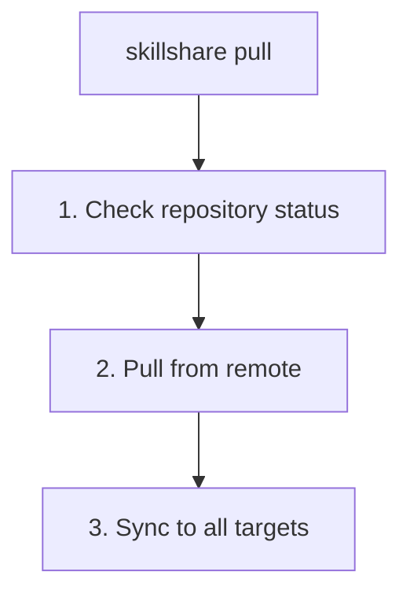

# pull

从 git remote 拉取并同步到所有 targets。

```bash
skillshare pull              # 拉取并同步
skillshare pull --dry-run    # 预览
skillshare pull --force      # 首次拉取时用 remote 替换本地
```

## 何时使用

- 从推送了更改的另一台机器同步 skills
- 在别人推送更新后获取最新的 skills
- 在新机器上执行 `init --remote` 后开始工作

## 会发生什么



## 选项

| 标志 | 描述 |
|------|-------------|
| `--dry-run, -n` | 预览而不做任何更改 |
| `--force, -f` | 首次拉取冲突时，用 remote 替换本地 skills |

## Git Root 作用域

`pull` 作用于 `git_root` 配置字段所选定的目录（默认：`skills` source）。作用域表参见 [commit — Git Root Scope](./commit.md#git-root-scope)。如果 `git_root` 被更改了，但 git 仓库仍然位于另一个作用域的目录中，`pull` 会打印一条 "Git root mismatch" 错误，并给出精确的 `git init` / `mv` 命令来修复。参见 [Changing the scope after init](/docs/reference/targets/configuration#git-root)。

拉取完成后，`pull` 会根据该作用域所包含的内容进行同步：`skills` 运行 `sync`，`agents` 运行 `sync agents`，`root` 两者都运行，`extras` 运行 `sync extras`。

## 前提条件

你的 source 目录必须是一个带有 remote 的 git 仓库：

```bash
# 检查是否就绪：
skillshare status
# 显示：Git: initialized with remote
```

## 本地更改警告

如果你有未提交的更改，`pull` 会失败：

```bash
$ skillshare pull
Local changes detected
  Run: skillshare push
  Or:  cd ~/.config/skillshare/skills && git stash
```

解决方案：
```bash
# 方案 1：先在本地提交，暂不推送
skillshare commit -m "Local changes"
skillshare pull

# 方案 2：先推送你的更改
skillshare push
skillshare pull

# 方案 3：暂存（stash）你的更改
cd ~/.config/skillshare/skills
git stash
skillshare pull
git stash pop
```

## 两台机器都有新 commit 时 {#when-both-machines-committed}

如果本机有 remote 没有的 commit，而 remote 也有本机没有的 commit，`pull` 会把两边的历史合并成一个 merge commit，然后执行 sync。之后再 push，把合并结果分享出去。

两台机器在安装或更新 skill 时都会改写 `.metadata.json`，所以它经常发生冲突。`pull` 会自动解决这类冲突：每个 skill 的条目分别合并；如果两台机器都改了同一个条目，以 `installed_at` 较新的一方为准。

其他文件发生冲突时，`pull` 会停止、撤销合并，并列出冲突的文件：

```bash
$ skillshare pull
git pull failed
pull stopped: this machine and the remote both changed my-skill/SKILL.md; the merge was undone, resolve it with git in ~/.config/skillshare/skills
```

仓库会保持在 pull 之前的状态。要自己解决冲突：

```bash
cd ~/.config/skillshare/skills
git pull --no-rebase             # 重新合并并保留冲突
# 编辑冲突文件，然后
git add . && git commit --no-edit
skillshare push
skillshare sync
```

## 首次拉取且已有 Skills

在首次拉取时（尚未有 upstream），如果本地和 remote 都已经包含 skill 目录，
`pull` 会尝试进行**合并（merge）**以整合双方内容。如果合并成功，本地和 remote 的 skills 都会被保留。

如果出现**合并冲突**，`pull` 会以非零退出码失败：

```bash
$ skillshare pull
Pull failed
  Resolve manually: cd ~/.config/skillshare/skills && git merge --allow-unrelated-histories <remote branch>
  Or force-pull: skillshare pull --force  (replaces local with remote)
```

解决选项：

```bash
# 手动解决冲突，然后推送
cd ~/.config/skillshare/skills
git add . && git commit
skillshare push

# 或放弃本地内容，采用 remote
skillshare pull --force
```

## 示例

```bash
# 标准拉取（最常见）
skillshare pull

# 预览将要发生的事情
skillshare pull --dry-run

# 首次拉取冲突时，用 remote 替换本地
skillshare pull --force
```

## 工作流

在第二台机器上的典型工作流：

```bash
# 一天开始时：获取最新 skills
skillshare pull

# ... 使用 AI 工具工作 ...

# 一天结束时：分享任何新的 skills
skillshare collect claude    # 如果你创建了新的 skills
skillshare push -m "Add new skill"
```

## 另请参阅

- [commit](/docs/reference/commands/commit) — 仅提交，不推送
- [push](/docs/reference/commands/push) — 推送到 remote
- [sync](/docs/reference/commands/sync) — 不拉取的手动同步
- [Cross-Machine Sync](/docs/how-to/sharing/cross-machine-sync) — 完整设置
