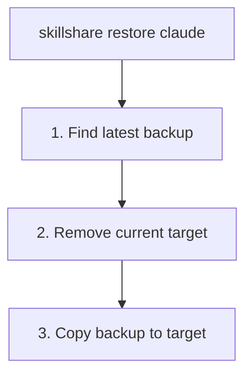

# restore

从备份恢复某个 target。

```bash
skillshare restore                                     # 交互式 TUI（浏览 + 恢复）
skillshare restore claude                              # 最新备份
skillshare restore claude --from 2026-01-19_10-00-00   # 指定备份
skillshare restore claude --dry-run                    # 预览
```

## 何时使用

- 一次同步出了问题，需要将某个 target 恢复到之前的状态
- 你不小心从某个 target 中移除了 skills
- 交互式浏览备份版本，并与当前状态进行对比

## 交互式 TUI

在 TTY 中，`skillshare restore`（不带参数）会启动一个统一的恢复 TUI：

1. **Source 选择器**——在 "Backup Restore" 和 "Trash Restore" 之间选择
2. **Backup Restore**——选择一个 target，然后浏览备份版本，详情面板中会显示：
   - 备份日期、大小和 skill 数量
   - 与当前 target 的差异（新增/移除的 skills）
   - 单个文件列表
3. **Trash Restore**——打开 trash TUI 以恢复已删除的 skills

### 键位绑定

| 按键 | 操作 |
|-----|------|
| `↑`/`↓` | 在 targets / 版本之间导航 |
| `Enter` | 选择 target / 恢复版本 |
| `/` | 过滤 targets |
| `d` | 删除某个备份版本 |
| `Ctrl+d`/`Ctrl+u` | 滚动详情面板 |
| `Esc` | 返回上一步 |
| `q`/`Ctrl+C` | 退出 |

使用 `--no-tui` 跳过 TUI，改为显示纯文本备份列表。

## 会发生什么



## 选项

| 标志 | 描述 |
|------|-------------|
| `--all` | 同时恢复 skills 和 agents |
| `--project, -p` | 使用 project mode（`.skillshare/backups/`）；**仅限 agents** |
| `--global, -g` | 使用 global mode（skills 的默认值） |
| `--from, -f <timestamp>` | 从指定备份恢复 |
| `--force` | 覆盖而不确认 |
| `--dry-run, -n` | 预览而不做任何更改 |
| `--no-tui` | 跳过交互式 TUI，改为显示备份列表 |

`restore` 也接受一个位置 kind 参数：`skillshare restore agents claude` 会恢复 `claude` target 的 agent 备份。

## 查找备份

列出可用的备份：

```bash
skillshare backup --list
```

```
All backups (15.3 MB total)
  2026-01-20_15-30-00  claude, cursor     4.2 MB
  2026-01-19_10-00-00  claude             2.1 MB
  2026-01-18_09-00-00  claude, cursor     4.0 MB
```

## 示例

```bash
# 从最新备份恢复
skillshare restore claude

# 从指定备份恢复
skillshare restore claude --from 2026-01-19_10-00-00

# 预览恢复
skillshare restore claude --dry-run

# 强制恢复（跳过确认）
skillshare restore claude --force
```

## 恢复之后

`restore` 会用快照内容替换 target 目录。由于备份只捕获本地内容——被 symlink 的 skills 会被排除，参见 [What Gets Backed Up](/docs/reference/commands/backup#what-gets-backed-up)——之后应运行 `sync` 把被同步的 skills 找回来：

```bash
skillshare restore claude    # 从备份恢复本地内容
skillshare sync              # 为被同步的 skills 重新创建 symlink
```

恢复出的内容是普通文件，而不是 symlink。如果该 target 一直只持有本地 skills，那么仅恢复就已足够。

## 使用场景

### 意外删除

如果你不小心删除了某个 skill：

```bash
skillshare restore claude --from 2026-01-19_10-00-00
```

### 撤销更改

如果一次同步出了问题：

```bash
skillshare restore claude  # 回到同步前的状态
```

### 测试

恢复以测试旧版本的 skill：

```bash
skillshare restore claude --from 2026-01-15_10-00-00
# 测试旧的 skills……
skillshare sync  # 返回当前状态
```

### Agent 恢复

Agent 恢复与 skill 恢复类似，但作用于由 `backup agents`（以及在 `sync agents` 之前运行的自动备份）创建的并行 `<target>-agents` 备份条目：

```bash
skillshare restore agents claude                       # claude 的最新 agent 备份
skillshare restore agents claude --from 2026-01-19_10-00-00
skillshare restore agents -p                           # Project agents（唯一允许的 project mode）
skillshare restore --all claude                        # 一次性恢复 skills + agents
```

在 project mode 下，restore——与 backup 一样——只对 agents 起作用。不带 `agents` 参数时会报错：

```
restore is not supported in project mode (except for agents)
```

通过 `skillshare backup --list` 列出备份时，agent 备份会以带 `-agents` 后缀的独立条目显示（例如 `claude-agents`）。

## 另请参阅

- [backup](/docs/reference/commands/backup) — 创建和管理备份
- [sync](/docs/reference/commands/sync) — 恢复后重新同步
- [Agents](/docs/understand/agents) — Agent 资源模型
