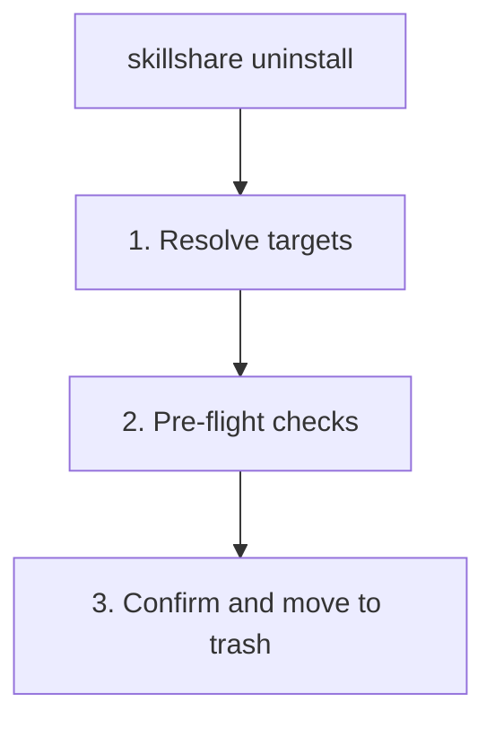

# uninstall

从 source 目录中移除一个或多个 skills 或 tracked repositories。Skills 会被移动到 trash，保留 7 天后自动清理。

```bash
skillshare uninstall my-skill              # Remove a single skill
skillshare uninstall a b c --force         # Remove multiple skills at once
skillshare uninstall --all                 # Remove all skills
skillshare uninstall --group frontend      # Remove all skills in a group
skillshare uninstall team-repo             # Remove tracked repository (_ prefix optional)
```

## 何时使用

- 移除不再需要的 skills（它们会移动到 trash，保留 7 天）
- 清理不再使用的 tracked repository
- 一次性批量移除整个 group 的 skills
- 使用 `--all` 一次性移除**所有** skills


## 会发生什么



## 选项

| Flag | Description |
|------|-------------|
| `--all` | Remove **all** skills from source (requires confirmation) |
| `--group, -G <name>` | Remove all skills in a group (prefix match, repeatable) |
| `--force, -f` | Skip confirmation and ignore uncommitted changes |
| `--dry-run, -n` | Preview without making changes |
| `--project, -p` | Use project-level config in current directory |
| `--global, -g` | Use global config (`~/.config/skillshare`) |
| `--json` | Global mode: output JSON and skip confirmation; dirty tracked repositories still require `--force` |
| `--help, -h` | Show help |

## JSON 输出

```bash
skillshare uninstall my-skill another-skill --json
```

```json
{
  "removed": ["my-skill", "another-skill"],
  "failed": [],
  "skipped": 0,
  "dry_run": false,
  "duration": "0.089s"
}
```

结合 `--dry-run` 进行预览：

```bash
skillshare uninstall --all --json --dry-run
```

## 移除多个

一条命令移除多个 skills：

```bash
skillshare uninstall alpha beta gamma --force
```

当某些 skills 找不到时，该命令会**跳过它们并给出警告**，然后继续移除其余的。只有当**所有**
指定的 skills 都无效时才会失败。

### Glob 模式

Skill 名称支持 glob 模式（`*`、`?`、`[...]`）用于批量移除：

```bash
skillshare uninstall "core-*"              # Remove all skills matching core-*
skillshare uninstall "test-?" --force      # Single-character wildcard
skillshare uninstall "core-*" "util-*"     # Multiple patterns
```

Glob 匹配不区分大小写：`"Core-*"` 会匹配 `core-auth`、`CORE-DB` 等。

:::note Top-level matching only
Glob 模式只匹配 source 文件夹中的**顶层目录名**。嵌套的 skills（例如 `frontend/react-hooks`）
不会被 `"react-*"` 匹配到——请使用 `--group frontend` 来定位某个子目录中的 skills。
:::

## 移除全部

使用 `--all` 一次性从 source 目录中移除所有 skills：

```bash
skillshare uninstall --all                 # Interactive confirmation
skillshare uninstall --all --force         # Skip confirmation
skillshare uninstall --all -n              # Preview what would be removed
```

`--all` 不能与 skill 名称或 `--group` 组合使用。

:::tip Shell glob 保护
不带引号运行 `skillshare uninstall *` 会导致你的 shell 将 `*` 展开为当前目录中的文件名。
skillshare 会检测到这一点，并建议改用 `--all`。请始终为通配符加上引号（`"*"`）或使用 `--all`。
:::

## Group 移除

当你 uninstall 一个包含子 skills 的目录时，skillshare 会自动将其检测为一个 **group**，
并在请求确认之前列出其中包含的 skills：

```
Uninstalling group (5 skills)
─────────────────────────────────────────
  - feature-radar
  - feature-radar-archive
  - feature-radar-learn
  - feature-radar-ref
  - feature-radar-scan
→ Name: feature-radar
→ Path: ~/.config/skillshare/skills/feature-radar

Are you sure you want to uninstall this group? [y/N]:
```

`--group` flag 使用**前缀匹配**移除某个目录下的所有 skills：

```bash
# Remove all skills under frontend/
skillshare uninstall --group frontend

# Also removes nested skills: frontend/react/hooks, frontend/vue/composables
skillshare uninstall --group frontend --force

# Preview what would be removed
skillshare uninstall --group frontend --dry-run
```

当执行 group 移除（包括自动检测到的目录 group）时，每个被移除的成员也会从配置中受管理的
`skills:` 列表中移除（`~/.config/skillshare/config.yaml`，或 project mode 下的 `.skillshare/config.yaml`）。

你可以将位置参数名称与 `--group` 组合使用，甚至可以多次使用 `-G`：

```bash
# Mix names and groups
skillshare uninstall standalone-skill -G frontend -G backend --force

# Duplicates are automatically deduplicated
skillshare uninstall frontend/hooks -G frontend --force  # hooks removed once
```

## Tracked Repositories

对于 tracked repositories（以 `_` 开头的文件夹）：

- 检查是否有未提交的更改（使用 `--force` 覆盖）
- 自动从 `.gitignore` 中移除该条目
- Uninstall 时 `_` 前缀是可选的

```bash
skillshare uninstall _team-skills        # With prefix
skillshare uninstall team-skills         # Without prefix (auto-detected)
skillshare uninstall _team-skills --force # Force remove with uncommitted changes
```

## 示例

```bash
# Remove a single skill
skillshare uninstall my-skill

# Remove multiple skills
skillshare uninstall skill-a skill-b skill-c --force

# Remove all skills
skillshare uninstall --all
skillshare uninstall --all --force
skillshare uninstall --all -n              # Preview

# Remove by group
skillshare uninstall --group frontend --force

# Preview removal
skillshare uninstall my-skill --dry-run
skillshare uninstall --group frontend -n

# Remove tracked repository
skillshare uninstall team-repo

# Mix names and groups
skillshare uninstall my-skill -G frontend --force
```

## 安全性

被 uninstall 的 skills 会被**移动到 trash**，而不是永久删除：

- **位置：**`~/.local/share/skillshare/trash/`（global）或 `.skillshare/trash/`（project）
- **保留期：**7 天，之后自动清理
- **重新安装提示：**如果该 skill 是从远程来源安装的，会显示重新安装命令
- **恢复：**使用 `skillshare trash restore <name>` 从 trash 恢复

单个 skill（详细模式）：

```
✓ Uninstalled skill: my-skill
ℹ Moved to trash (7 days): ~/.local/share/skillshare/trash/my-skill_2026-01-20_15-30-00
ℹ Reinstall: skillshare install github.com/user/repo/my-skill
```

多个 skills（批量）：

```
✓ Uninstalled 4 skill(s) (0.1s)

── Removed ─────────────────────────────
✓ pdf        skill
✓ tdd        skill
✓ security   group, 2 skills
✗ bad-skill  failed to move to trash: ...

── Next Steps ──────────────────────────
ℹ Moved to trash (7 days).
ℹ Run 'skillshare sync' to update all targets
```

大批量操作会使用精简格式：

```
✓ Uninstalled 920, failed 2 (1.2s)

── Failed ──────────────────────────────
✗ bad-a  failed to move to trash: permission denied
✗ bad-b  failed to move to trash: permission denied

── Removed ─────────────────────────────
✓ 920 uninstalled

── Next Steps ──────────────────────────
ℹ Moved to trash (7 days).
ℹ Run 'skillshare sync' to update all targets
```

要恢复一个不小心 uninstall 的 skill：

```bash
skillshare trash list                  # See what's in trash
skillshare trash restore my-skill      # Restore to source
skillshare sync                        # Sync back to targets
```

## Uninstall 之后

运行 `skillshare sync` 从所有 targets 中移除该 skill：

```bash
skillshare uninstall old-skill
skillshare sync  # Remove from Claude, Cursor, etc.
```

## Project Mode

从项目的 `.skillshare/skills/` 中 uninstall skills 或 tracked repos：

```bash
skillshare uninstall my-skill -p                  # Remove a skill
skillshare uninstall a b c -p -f                  # Remove multiple skills
skillshare uninstall --all -p -f                   # Remove all project skills
skillshare uninstall --group frontend -p -f        # Remove a group
skillshare uninstall team-skills -p                # Tracked repo (_ prefix optional)
```

在 project mode 下，uninstall 会：
- 将 skill 目录移动到 `.skillshare/trash/`（保留 7 天）
- 从 `.skillshare/config.yaml` 的 `skills:` 列表中移除该 skill 的条目（对于远程 skills）
- 从 `.skillshare/.gitignore` 中移除该条目（对于远程/tracked skills）
- 从 `.skillshare/skills.lock.json` 中移除该 skill 的固定（对于 group，则移除其下的所有固定）
- 对于 tracked repos：检查是否有未提交的更改（使用 `--force` 覆盖）
- `_` 前缀是可选的——会自动检测

```bash
skillshare uninstall pdf -p
skillshare sync
git add .skillshare/ && git commit -m "Remove pdf skill"
```

## Agent 支持

使用 `--kind agent` 来 uninstall agents 而非 skills：

```bash
skillshare uninstall --kind agent tutor              # Remove an agent
skillshare uninstall --kind agent tutor reviewer -f   # Remove multiple agents
skillshare uninstall --kind agent --all               # Remove all agents
```

Agent uninstall 遵循与 skills 相同的移入 trash 并保留的行为（移动到 trash，保留 7 天）。
背景信息参见 [Agents](/docs/understand/agents)。

## 另请参阅

- [install](/docs/reference/commands/install) — 安装 skills
- [list](/docs/reference/commands/list) — 列出已安装的 skills
- [trash](/docs/reference/commands/trash) — 管理已删除到 trash 的 skills
- [Project Skills](/docs/understand/project-skills) — Project mode 概念
- [Agents](/docs/understand/agents) — Agent 概念
