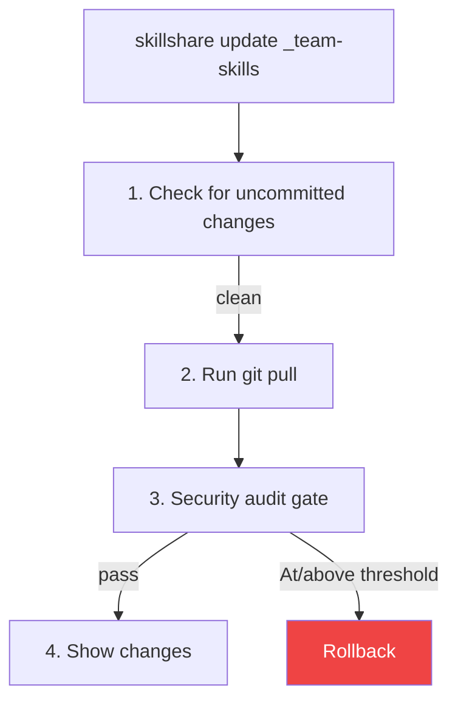
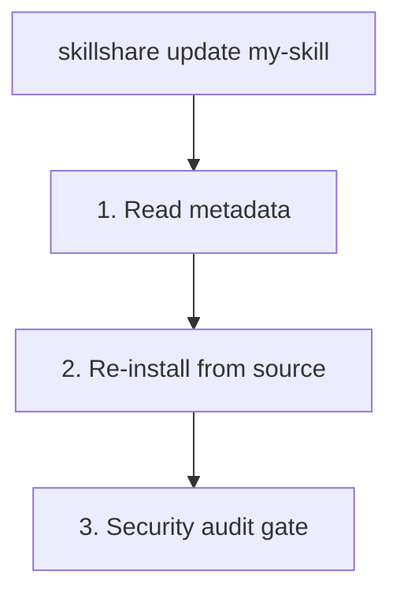

# update

将一个或多个 skills 或 tracked repositories 更新到最新版本。

```bash
skillshare update my-skill           # Update single skill
skillshare update a b c              # Update multiple at once
skillshare update --group frontend   # Update all skills in a group
skillshare update team-skills        # Update tracked repo
skillshare update --all              # Update everything
skillshare update agents --all       # Update all tracked/updatable agents
```

## 何时使用

- 某个 tracked repository 有新的 commit（可通过 `check` 发现）
- 已安装的 skill 有新版本可用
- 你想从原始来源重新下载某个 skill


## 会发生什么

### 对于 Tracked Repositories



### 对于普通 Skills



## 选项

| Flag | Description |
|------|-------------|
| `--all, -a` | Update all tracked repos/skills, or all agents when used as `update agents --all` |
| `--group, -G <name>` | Update all updatable skills in a group, or all agents in an agent subdirectory |
| `--force, -f` | Discard local changes and proceed despite audit findings |
| `--dry-run, -n` | Preview without making changes |
| `--skip-audit` | Skip the post-update security audit gate |
| `--audit-threshold <t>`, `--threshold <t>`, `-T <t>` | Override update audit block threshold (`critical|high|medium|low|info`; shorthand: `c|h|m|l|i`, plus `crit`, `med`) |
| `--diff` | Show file-level change summary after skill/repo update |
| `--audit-verbose` | Show detailed per-skill audit findings in batch mode |
| `--prune` | Remove stale skills (deleted upstream) instead of warning |
| `--project, -p` | Use project-level config in current directory |
| `--global, -g` | Use global config (`~/.config/skillshare`) |
| `--json` | Output as JSON |
| `--help, -h` | Show help |

`update agents` 支持：`--all`、`--group`、`--force`、`--dry-run`、`--skip-audit`、`--audit-threshold` / `--threshold` / `-T`、`--json`，以及 `--project` / `--global`。它**不**支持 `--diff`、`--audit-verbose` 或 `--prune`。

## JSON 输出

```bash
skillshare update --all --json
```

```json
{
  "updated": 3,
  "skipped": 1,
  "security_failed": 0,
  "pruned": 0,
  "dry_run": false,
  "duration": "4.567s",
  "items": [
    {"name": "_team-skills", "type": "repo", "status": "updated"},
    {"name": "my-skill", "type": "skill", "status": "updated"},
    {"name": "another-skill", "type": "skill", "status": "updated"},
    {"name": "local-only", "type": "skill", "status": "skipped"}
  ]
}
```

可能的 `status` 值：`updated`、`skipped`、`failed`、`security_blocked`。当某项失败时，会包含 `error` 字段。

当元数据中声明了 tracked repos 但在磁盘上缺失时，每个都会被报告为 `skipped` 的 `repo` 项，并附带简短的 `error`（`clone directory absent`），同时一个聚合的 `missing_tracked_repos` 摘要会列出名称和一次性的恢复提示：

```json
{
  "updated": 0,
  "skipped": 1,
  "items": [
    {"name": "_team-skills", "type": "repo", "status": "skipped", "error": "clone directory absent"}
  ],
  "missing_tracked_repos": {
    "names": ["_team-skills"],
    "hint": "Run 'skillshare install' to rehydrate tracked repositories"
  }
}
```

当没有 tracked repos 缺失时，`missing_tracked_repos` 字段会被省略。

### Agent JSON 输出

```bash
skillshare update agents --all --json
```

```json
{
  "agents": [
    {"name": "reviewer", "status": "updated", "source": "github.com/user/agents/reviewer.md"},
    {"name": "team/tutor", "status": "up_to_date", "source": "github.com/user/agents/team/tutor.md"}
  ],
  "dry_run": false,
  "duration": "1.234s"
}
```

可能的 agent `status` 值包括 `updated`、`failed`、`skipped`、`up_to_date`、`update_available`、`dirty`、`drifted` 和 `local`。

## 更新 Agents

当你只想更新独立的 `.md` agents 时，使用 `agents` kind selector：

```bash
skillshare update agents reviewer
skillshare update agents --group team
skillshare update agents --all -T high
skillshare update agents --all --json
```

Agent 更新遵循与 skills 相同的 audit gate：

- tracked agent repos 会运行 `git pull`，然后对更新后的 repo 进行 audit
- 由 metadata 支持的单文件 agents 会从来源重新安装，对暂存的 `.md` 进行 audit，只有成功后才会替换本地文件

## 更新多个

一次性更新多个 skills：

```bash
skillshare update skill-a skill-b skill-c
```

只有可更新的 skills（tracked repos 或带 metadata 的 skills）会被处理。找不到的 skills 会被警告但不会导致失败。但是，如果任何 skill 被 **security audit gate 阻止**，批量命令会以非零代码退出。

### Glob 模式

Skill 名称支持 glob 模式（`*`、`?`、`[...]`）用于批量操作：

```bash
skillshare update "core-*"              # Update all skills matching core-*
skillshare update "_team-?"             # Single-character wildcard
skillshare update "core-*" "util-*"     # Multiple patterns
```

Glob 模式匹配每个 skill 或 tracked repo 的**基础名称**（路径的最后一段）。例如，`"react-*"` 会匹配 `frontend/react-hooks`，因为其基础名称是 `react-hooks`。

Glob 匹配不区分大小写：`"Core-*"` 会匹配 `core-auth`、`CORE-DB` 等。

:::tip Shell glob 保护
始终为 glob 模式加上引号（`"core-*"`），以防止你的 shell 将 `*` 展开为当前目录中的文件名。
:::

## 更新 Group

更新某个 group 目录内所有可更新的 skills：

```bash
skillshare update --group frontend        # Update all in frontend/
skillshare update -G frontend -G backend  # Multiple groups
skillshare update x -G backend            # Mix names and groups
```

group 内没有 metadata 或 `.git` 的本地 skills 会被静默跳过。

匹配某个 group 目录（而非 repo 或 skill）的位置参数会被自动展开：

```bash
skillshare update frontend   # Same as --group frontend
# ℹ 'frontend' is a group — expanding to 3 updatable skill(s)
```

:::note
`--all` 不能与 skill 名称或 `--group` 组合使用。
:::

## 更新全部

一次性更新所有内容：

```bash
skillshare update --all
```

这会更新：
1. 所有 tracked repositories（git pull）
2. 所有带来源 metadata 的 skills（重新安装）

### 示例输出

```
Updating 2 tracked repos + 3 skills

[1/5] ✓ _team-skills       Already up to date
[2/5] ✓ _personal-repo     3 commits, 2 files
[3/5] ✓ my-skill           Reinstalled from source
→ risk: LOW (12/100)
[4/5] ! other-skill        has uncommitted changes (use --force)
[5/5] ✓ another-skill      Reinstalled from source

── Summary ─────────────────────────────
  Total:    5
  Updated:  4
  Skipped:  1
```

### 缺失的 Tracked Repositories

如果 `.metadata.json` 声明了某个 tracked repo（`tracked: true`），但其克隆目录在磁盘上不存在——这在全新机器上很常见，因为克隆目录位于受管理的 `.gitignore` 区块内——`update --all` 不再对此静默跳过。它会报告每个缺失的 repo，并提示你恢复它：

```
! 1 tracked repo(s) declared in metadata but missing on disk:
  ! _team-skills         clone directory absent
→ Run 'skillshare install' to rehydrate tracked repositories
```

这适用于全局模式和项目（`-p`）模式。要从 metadata 重新创建克隆，运行不带参数的 [install](/docs/reference/commands/install)（参见 [全新克隆后的恢复](/docs/understand/tracked-repositories#rehydrating-after-a-fresh-clone)）。

## 陈旧 Skill 清理（`--prune`）

当上游 repository 重命名或删除某个 skill 时，`update` 会将其检测为**陈旧（stale）**并向你发出警告：

```
⚠ 1 skill(s) no longer found in upstream repository:
  ⚠ frontend/old-skill — stale (deleted upstream)
ℹ Run with --prune to remove stale skills
```

加上 `--prune` 可自动移除陈旧的 skills（移动到 trash，而不是永久删除）：

```bash
skillshare update --all --prune
```

`check` 也会报告陈旧的 skills：

```bash
skillshare check --all
# ⚠ 1 skill(s) stale (deleted upstream) — run 'skillshare update --all --prune' to remove
```

:::note
Tracked repositories（`_repo`）不受 `--prune` 影响。当某个 tracked repo 在内部删除一个 skill 时，`sync` 会通过 `PruneOrphanLinks` 自动清理孤立的 symlinks。
:::

## Security Audit Gate {#security-audit-gate}

更新 skills 后，`update` 会自动运行一次安全审计：

- **Tracked repos（`git pull`）**在生效阈值（`audit.block_threshold`，默认 `CRITICAL`）上使用 post-pull gate
- **普通 skills（重新安装路径）**使用相同的阈值策略
- 对于所有更新类型，都会显示风险标签/分数以供审阅参考

```
→ risk: LOW (12/100)
```

### 交互模式（TTY，tracked repos）

当检测到达到或超过生效阈值的 findings 时，会提示你做出决定：

```
  [HIGH] Source repository link detected — may be used for supply-chain redirects (SKILL.md:5)

  Security findings at or above active threshold detected.
  Apply anyway? [y/N]:
```

- **`y`** — 接受更新，忽略 findings
- **`N`**（默认）— 回滚到 pull 之前的状态

### 非交互模式（CI/CD）

在非交互环境中，更新会被自动回滚，并且命令以非零代码退出。这确保了 CI 流水线中的 fail-closed 行为。

```bash
# Bypass the audit gate when you trust the source
skillshare update --all --skip-audit
```

:::caution
`--skip-audit` 会完全禁用更新后的安全扫描。仅在你信任来源或已有外部审计流程时使用它。
:::

### Accepted Findings {#accepted-findings}

当你用 `--force`（或在提示时回答 `y`）覆盖 gate 时，你所接受的 findings 会被记录在 `.metadata.json` 的 `audit_accepted` 下。同一个 skill 之后的更新不会再因这些完全相同的 findings 而被阻止，因此你不必在每次 `update --all` 时都重复使用 `--force`。

```
ℹ 1 previously accepted finding(s) skipped
```

一个 finding 是通过 rule、file 和匹配到的文本来判定的——而不是按行号——因此当无关内容发生偏移时，它仍会保持已接受状态。任何新的 finding，或同一 rule 匹配到不同文本，都会重新阻止。这适合那些合理地引用攻击字符串作为示例的 skills（安全扫描器、red-team 文档），同时仍能捕获后续版本中的新 payload。

你可以通过 `--audit-threshold`、`--threshold` 或 `-T` 按命令覆盖阈值：

```bash
skillshare update _team-skills --threshold high
skillshare update --all -T h
```

## 文件变更摘要（`--diff`）

使用 `--diff` 可以在每次更新后查看文件级别的变更摘要：

```bash
skillshare update team-skills --diff
skillshare update --all --diff
```

对于 **tracked repositories**，diff 使用 `git diff` 并包含行级统计：

```
┌─ Files Changed ─────────────────────────────┐
│                                             │
│  ~ SKILL.md (+12 -3)                        │
│  + scripts/deploy.sh (+45 -0)               │
│  - old-helper.sh (+0 -22)                   │
│  ~ utils/format.md (+5 -2)                  │
│                                             │
└─────────────────────────────────────────────┘
```

对于**普通 skills**（从远程来源安装），diff 会比较重新安装前后的文件哈希：

```
┌─ Files Changed ─────────────────────────────┐
│                                             │
│  ~ SKILL.md                                 │
│  + new-helper.sh                            │
│                                             │
└─────────────────────────────────────────────┘
```

标记：`+` 新增，`-` 删除，`~` 修改。最多显示 20 个文件；其余文件会汇总为 "... and N more file(s)"。

## 处理冲突

如果某个 tracked repo 有未提交的变更：

```bash
# Option 1: Commit your changes first
cd ~/.config/skillshare/skills/_team-skills
git add . && git commit -m "My changes"
skillshare update _team-skills

# Option 2: Discard and force update
skillshare update _team-skills --force
```

## 更新之后

运行 `skillshare sync` 将变更分发到所有 targets：

```bash
skillshare update --all --diff   # Update with file-level change summary
skillshare sync
```

## Project Mode

在项目中更新 skills 和 tracked repos：

```bash
skillshare update pdf -p              # Update single skill (reinstall)
skillshare update a b c -p            # Update multiple skills
skillshare update --group frontend -p # Update all in a group
skillshare update team-skills -p      # Update tracked repo (git pull)
skillshare update --all -p            # Update everything
skillshare update --all -p --dry-run  # Preview
skillshare update --all -p --diff     # Update with file change summary
skillshare update --all -p --skip-audit  # Skip security audit gate
```

### 工作原理

| Type | Method | Detected by |
|------|--------|-------------|
| **Tracked repo** (`_repo`) | `git pull` | Has `.git/` directory |
| **Remote skill** (with metadata) | Reinstall from source | Listed in `.metadata.json` |
| **Local skill** | Skipped | Not listed in `.metadata.json` |

`_` 前缀是可选的——`skillshare update team-skills -p` 会自动检测为 `_team-skills`。

### 处理冲突

有未提交变更的 tracked repos 默认会被阻止：

```bash
# Option 1: Commit changes first
cd .skillshare/skills/_team-skills
git add . && git commit -m "My changes"
skillshare update team-skills -p

# Option 2: Discard and force update
skillshare update team-skills -p --force
```

### 典型工作流

```bash
skillshare update --all -p
skillshare sync
git add .skillshare/ && git commit -m "Update remote skills"
```

## 另请参阅

- [install](/docs/reference/commands/install) — 安装 skills
- [upgrade](/docs/reference/commands/upgrade) — 升级 CLI 和内置 skill
- [sync](/docs/reference/commands/sync) — 同步到 targets
- [Project Skills](/docs/understand/project-skills) — Project mode 概念
