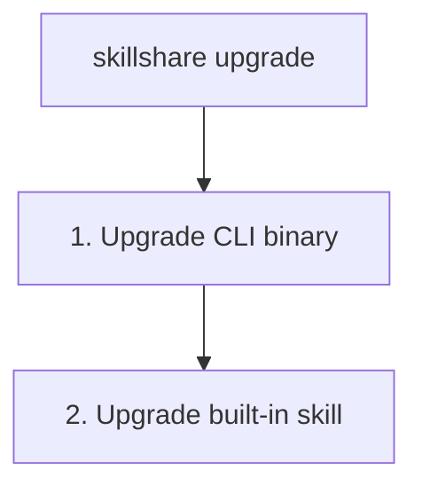

# upgrade

升级 skillshare CLI 二进制文件和/或内置的 skillshare skill。

```bash
skillshare upgrade              # 同时升级 CLI 和 skill
skillshare upgrade --cli        # 仅升级 CLI
skillshare upgrade --skill      # 仅升级 skill
```

## 何时使用

- skillshare CLI 有新版本可用
- 内置的 skillshare skill 需要更新
- `doctor` 报告有可用更新时


## 会发生什么



## 选项

| 标志 | 描述 |
|------|-------------|
| `--cli` | 仅升级 CLI |
| `--skill` | 仅升级 skill（如果尚未安装则会提示） |
| `--force, -f` | 跳过确认提示 |
| `--dry-run, -n` | 预览而不做任何更改 |
| `--help, -h` | 显示帮助 |

## Homebrew 用户

如果你是通过 Homebrew 安装的，`skillshare upgrade` 会自动委托给 `brew upgrade`：

```bash
skillshare upgrade
# → brew update && brew upgrade skillshare
```

你也可以直接使用 Homebrew：

```bash
brew upgrade skillshare
```

## 示例

```bash
# 标准升级（CLI 和 skill 都升级）
skillshare upgrade

# 预览将要升级的内容
skillshare upgrade --dry-run

# 强制升级，不显示提示
skillshare upgrade --force

# 仅升级 CLI 二进制文件
skillshare upgrade --cli

# 仅升级 skillshare skill
skillshare upgrade --skill
```

## 升级之后

如果你升级了 skill，运行 `skillshare sync` 来分发它：

```bash
skillshare upgrade --skill
skillshare sync  # 分发到所有 targets
```

## 会升级什么

### CLI 二进制文件

`skillshare` 可执行文件本身。从 GitHub releases 下载。

在终端中，下载时会显示已经下载了多少，这样网络较慢时就不会看起来像是卡住了。
下面的 Web UI 资源也会以同样的方式显示。

```
Downloading v0.21.4...  3.2 MB / 9.1 MB
```

如果该二进制文件位于受保护的目录中（例如 `/usr/local/bin`），skillshare 只会使用 `sudo` 替换二进制文件——无需手动加前缀。内置 skill、UI 资源和日志仍以你的身份写入，所以不要用 `sudo` 运行整个升级：这会在 skill 源目录留下 root 拥有的文件，之后 `git pull` 会出现 `Permission denied`。

没有终端可以输入密码时（Dashboard 的 **立即更新** 按钮、CI），升级会立即停止，并提示你改在终端中运行 `skillshare upgrade`，而不是一直等待输入。已缓存的 `sudo` 凭据和 `NOPASSWD` 配置仍会直接升级，不会出现提示。

### Web UI 资源

升级之后，skillshare 会预先下载新版本的 Web UI 前端资源。这些资源会缓存在 `~/.cache/skillshare/ui/<version>/`，并在你运行 `skillshare ui` 时提供。

如果预下载失败（例如网络问题），这些资源会在下一次 `skillshare ui` 启动时再下载。

### skillshare Skill

内置的 `skillshare` skill，为 AI CLI 添加 `/skillshare` 命令。位于：
```
~/.config/skillshare/skills/skillshare/SKILL.md
```

## 另请参阅

- [update](/docs/reference/commands/update) — 更新其他 skills 和仓库
- [status](/docs/reference/commands/status) — 检查当前版本
- [doctor](/docs/reference/commands/doctor) — 诊断问题
