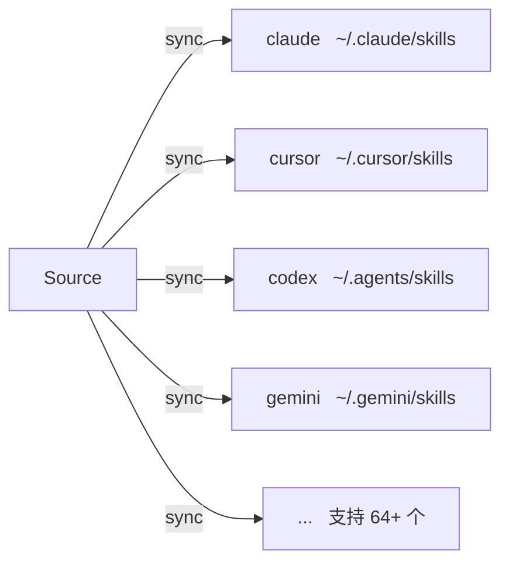

# Targets

Target 是 skillshare 会 sync 到的 AI CLI Skill 目录。

## 概览



## 你想做什么？

| 我想要... | 阅读 |
|--------------|------|
| 查看支持哪些 AI CLI | [Supported Targets](./supported-targets.md) |
| 添加一个不在内置列表中的 Target | [Adding Custom Targets](./adding-custom-targets.md) |
| 配置 Sync 模式、过滤器或路径 | [Configuration](./configuration.md) |

## 快速链接

| 主题 | 说明 |
|-------|-------------|
| [Supported Targets](./supported-targets.md) | 64+ 个支持的 AI CLI 完整列表 |
| [Adding Custom Targets](./adding-custom-targets.md) | 添加任何拥有 Skill 目录的工具 |
| [Configuration](./configuration.md) | 配置文件参考 |

---

## 常见操作

### 列出 Target

```bash
skillshare target list
```

### 显示 Target 详情

```bash
skillshare target claude
```

### 更改 Sync 模式

```bash
skillshare target claude --mode symlink
skillshare sync
```

### 添加自定义 Target

```bash
skillshare target add myapp ~/.myapp/skills
skillshare sync
```

### 移除 Target

```bash
skillshare target remove claude
```

---

## 自动检测

运行 `skillshare init` 时，已安装的 AI CLI 会被自动检测并添加为 Target。

只有存在的路径才会被添加。完整的检查路径列表参见 [Supported Targets](./supported-targets.md)。

---

## 相关内容

- [Source & Targets](/docs/understand/source-and-targets) — 核心概念
- [Sync Modes](/docs/understand/sync-modes) — Merge、copy、symlink
- [Commands: target](/docs/reference/commands/target) — Target 命令详情
