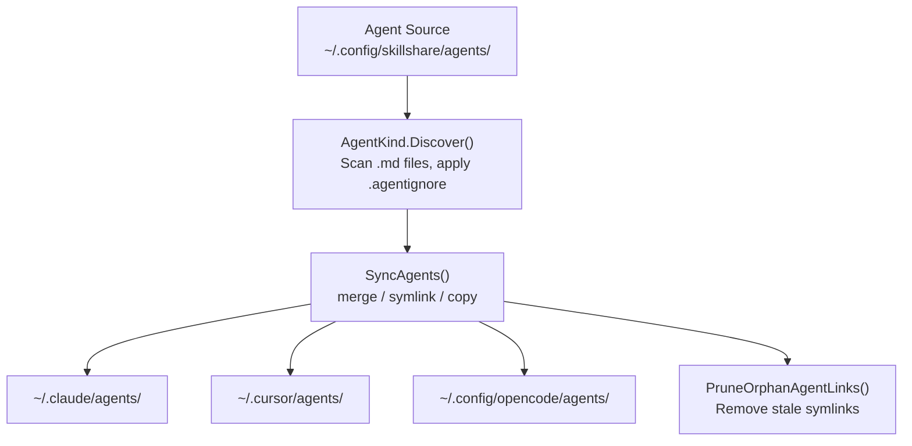

# Agents

与 Skills 一同管理的单文件 `.md` 资源——相同的 sync、audit 和生命周期,不同的形态。

:::tip 什么时候需要用到这个？
一些 AI CLI(Claude Code、Cursor、OpenCode、Augment、Copilot CLI、Droid)会区分 **skills**(带有 `SKILL.md` 的目录)和 **agents**(独立的 `.md` 文件)。如果你的 Targets 支持 agents,skillshare 可以从单一的 source of truth 同时管理这两者。
:::

## Skills vs Agents

| | Skill | Agent |
|---|---|---|
| **形态** | 包含 `SKILL.md` + 可选文件的目录 | 单个 `.md` 文件 |
| **名称解析** | `SKILL.md` frontmatter 中的 `name` 字段 | 文件名(例如 `tutor.md` = "tutor"),可选的 frontmatter `name` 覆盖 |
| **Source 目录** | `~/.config/skillshare/skills/` | `~/.config/skillshare/agents/`(可通过 `agents_source` 自定义) |
| **Project source** | `.skillshare/skills/` | `.skillshare/agents/` |
| **忽略文件** | `.skillignore` | `.agentignore` |
| **同步单位** | 目录符号链接(merge)、整目录符号链接(symlink)、目录复制(copy) | 文件符号链接(merge)、整目录符号链接(symlink)、文件复制(copy) |
| **嵌套支持** | `path/to/skill` 扁平化为 `path__to__skill` | `dir/file.md` 扁平化为 `dir__file.md` |
| **Tracking** | 支持 | 支持 |
| **Audit** | 支持 | 支持 |
| **Collect** | 支持 | 支持 |

---

## 目录结构

### Global

```
~/.config/skillshare/
├── skills/              # Skill source (directories)
│   ├── my-skill/
│   │   └── SKILL.md
│   └── .skillignore
├── agents/              # Agent source (files)
│   ├── tutor.md
│   ├── reviewer.md
│   └── .agentignore
└── config.yaml
```

### Project

```
.skillshare/
├── skills/
│   └── api-conventions/
│       └── SKILL.md
├── agents/
│   ├── onboarding.md
│   └── .agentignore
└── config.yaml
```

### 自定义 Source 目录

在 Global mode 中,agent source 默认是 `~/.config/skillshare/agents/`。要使用自定义位置,在 `config.yaml` 中设置 `agents_source`:

```yaml
agents_source: ~/my-agents
```

Project mode 始终使用 `.skillshare/agents/`,不支持 `agents_source`。

详情参见 [Configuration — agents_source](/docs/reference/targets/configuration#agents-source)。

---

## Agent 文件格式 {#agent-file-format}

Agent 是一个普通的 `.md` 文件。Frontmatter 是可选的:

```markdown
---
name: math-tutor
description: Helps with math problems step by step
targets: [claude, cursor]   # optional — only sync to these targets
---

# Math Tutor

You are a patient math tutor. Walk through problems step by step.
```

**逐 Agent 的 targets:** 可选的 `targets` 列表将某个 agent 限定同步到列出的 Targets(别名如 `claude-code` 会匹配 `claude`)。省略它则会同步到所有地方。其他 frontmatter 字段会被原样传递——skillshare 不会在工具之间转换它们,因此为某个 harness 编写的 agent 可能无法被另一个 harness 理解。使用 `targets` 可以让同一个 agent 的多个逐 harness 变体并存(例如带有 `targets: [claude]` 的 `reviewer.md` 和带有 `targets: [opencode]` 的 `reviewer-opencode.md`)。

**命名规则:**
- 文件名决定 agent 名称:`tutor.md` = "tutor"
- YAML frontmatter 中可选的 `name` 字段会覆盖文件名
- 文件名必须以字母或数字开头,只能包含 `a-z`、`A-Z`、`0-9`、`_`、`-`、`.`
- 名称最大长度:128 个字符

**常规排除项** —— 这些文件名在发现过程中始终会被跳过:
`README.md`、`CHANGELOG.md`、`LICENSE.md`、`HISTORY.md`、`SECURITY.md`、`SKILL.md`

---

## 支持的 Targets {#supported-targets}

只有定义了 `agents` 路径的 Target 才会接收 agent 同步。目前支持:

| Target | Global agents 路径 | Project agents 路径 |
|--------|-------------------|---------------------|
| `claude` | `~/.claude/agents` | `.claude/agents` |
| `cursor` | `~/.cursor/agents` | `.cursor/agents` |
| `opencode` | `~/.config/opencode/agents` | `.opencode/agents` |
| `augment` | `~/.augment/agents` | `.augment/agents` |
| `copilot` | `~/.copilot/agents` | `.github/agents` |
| `droid` | `~/.factory/droids` | `.factory/droids` |

没有 `agents` 条目的 Targets(占大多数)只会接收 Skills。

---

## 同步行为

Agent 同步支持全部三种模式,与 Skills 相同:

| 模式 | 行为 |
|------|----------|
| **merge**(默认) | 逐文件符号链接。Target 中的本地 agent 文件会被保留。 |
| **symlink** | 整个 agents 目录被符号链接。 |
| **copy** | Agent 文件被复制为真实文件。 |

```bash
# Sync everything (skills + agents)
skillshare sync

# Sync agents only
skillshare sync agents
```

孤立清理的工作方式相同——已断开的符号链接或不再有 source 的复制文件会被自动清除。

---

## Collect 行为

Agent collect 使用与 skill collect 相同的 CLI 约定,但操作的是 `.md` agent 文件:

```bash
# Global
skillshare collect agents claude
skillshare collect agents --all
skillshare collect agents claude --dry-run
skillshare collect agents claude --json

# Project
skillshare collect -p agents claude
skillshare collect -p agents --all
skillshare collect -p agents --json
```

规则:

- 默认会跳过已存在的 source agents
- 使用 `--force` 覆盖已存在的 source agents
- `--json` 隐含 `--force`,并跳过确认提示
- Web dashboard 的 Collect 页面仍然只支持 skills;agents 请使用 CLI

---

## `.agentignore`

工作方式与 `.skillignore` 完全相同——用 gitignore 风格的模式将 agents 排除在同步之外。

| 作用范围 | 路径 |
|-------|------|
| Global | `~/.config/skillshare/agents/.agentignore` |
| Project | `.skillshare/agents/.agentignore` |

示例:

```gitignore
# Disable draft agents
draft-*
# Disable a specific agent
experimental-reviewer
```

使用带 `--kind agent` 的 `enable`/`disable` 来管理条目:

```bash
skillshare disable --kind agent draft-reviewer
skillshare enable --kind agent draft-reviewer
```

---

## 从仓库安装 Agents

安装某个仓库时,skillshare 会自动检测 agents:

1. 在仓库中查找符合约定的 `agents/` 目录——其中的 `.md` 文件(排除常规排除项)是候选 agent
2. 如果仓库同时有 `skills/` 和 `agents/`,两者都会被安装
3. 如果仓库只有 `agents/`(没有 `SKILL.md` 标记),则只安装 agents
4. 如果仓库没有 `skills/`、没有 `agents/` 目录,但在根目录有零散的 `.md` 文件——会被视为 agents(纯 agent 仓库)

### 显式标志

```bash
# Install only agents from a repo
skillshare install github.com/user/repo --kind agent

# Install specific agents by name (-a shorthand)
skillshare install github.com/user/repo -a tutor,reviewer

# Install specific skills by name (unchanged)
skillshare install github.com/user/repo -s my-skill
```

---

## CLI 命令

大多数命令接受 `agents` 位置参数或 `--kind agent` 标志,以将范围限定为 agents:

| 命令 | 示例 | 作用 |
|---------|---------|--------------|
| `list agents` | `skillshare list agents` | 列出 source 中的 agents |
| `check agents` | `skillshare check agents` | 检查 agent 完整性和更新状态 |
| `audit agents` | `skillshare audit agents` | 对 agents 进行安全扫描 |
| `sync agents` | `skillshare sync agents` | 仅将 agents 同步到 Targets |
| `collect agents` | `skillshare collect agents claude` | 将本地 target agents 收集回 source |
| `update agents` | `skillshare update agents --all` | 更新 tracked agent 仓库和由元数据支持的 agents |
| `enable --kind agent` | `skillshare enable --kind agent tutor` | 重新启用一个已禁用的 agent |
| `disable --kind agent` | `skillshare disable --kind agent tutor` | 通过 `.agentignore` 禁用一个 agent |
| `install --kind agent` | `skillshare install repo --kind agent` | 只从仓库安装 agents |
| `install -a` | `skillshare install repo -a tutor` | 按名称安装指定的 agent(们) |

不带 kind 过滤器时,命令会同时对 skills 和 agents 生效。

---

## 数据流



---

## Project Mode

Agents 在 Project mode 中的工作方式与 Skills 相同:

```bash
# Initialize project (creates .skillshare/agents/ alongside .skillshare/skills/)
skillshare init -p

# Install agents into project
skillshare install github.com/user/repo --kind agent -p

# Update project agents in place
skillshare update agents --all -p

# Sync project agents
skillshare sync -p
```

Project agent source:`.skillshare/agents/`
已安装的 agents(tracked)会被记录在 `.metadata.json` 中,并创建 `.gitignore` 条目,与 tracked skills 相同。
