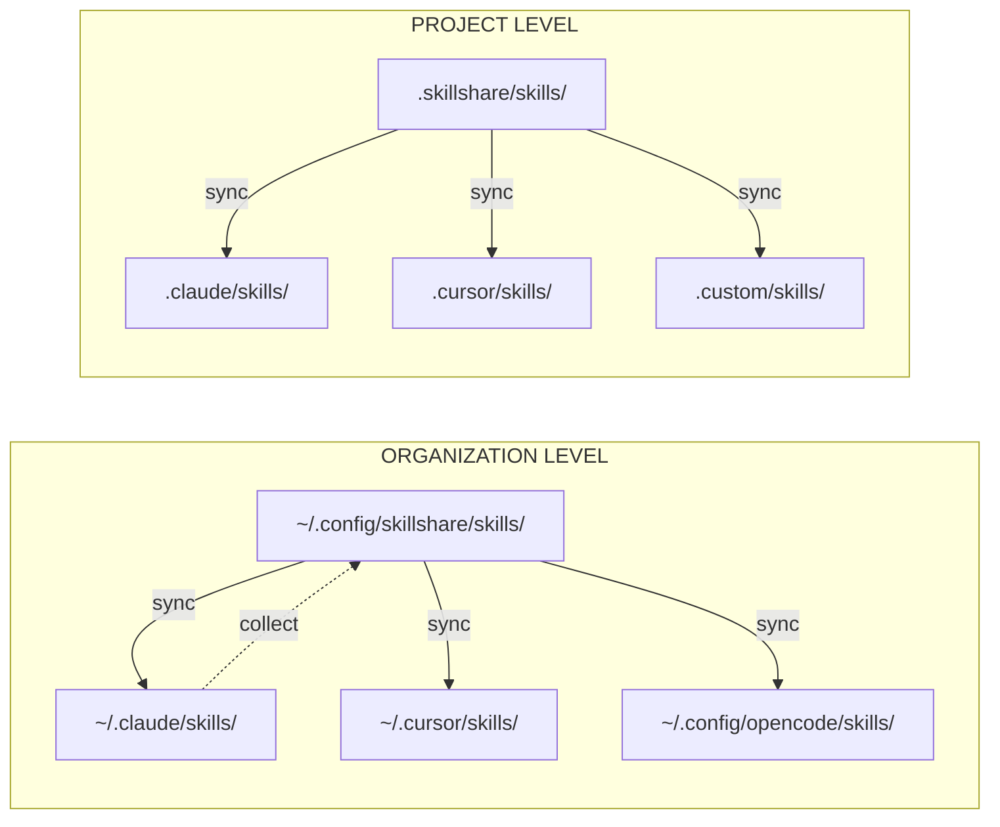

# Understand

理解这些概念有助于你充分利用 skillshare。

## 你想了解什么？

| 问题 | 阅读 |
|----------|------|
| skillshare 如何在各处移动 skill？ | [Source & Targets](./source-and-targets.md) |
| merge 和 symlink 有什么区别？ | [Sync Modes](./sync-modes.md) |
| 如何共享组织范围的 skill？ | [Tracked Repositories](./tracked-repositories.md) |
| SKILL.md 里面有什么？ | [Skill Format](./skill-format.md) |
| 项目级 skill 是如何运作的？ | [Project Skills](./project-skills.md) |

## 概览

## 核心概念

| 概念 | 是什么 | 了解更多 |
|---------|-----------|------------|
| **Source & Targets** | 单一事实来源，多个目的地 | [→ Source & Targets](./source-and-targets.md) |
| **Sync Modes** | Merge、copy、symlink — 文件如何被链接 | [→ Sync Modes](./sync-modes.md) |
| **Tracked Repos** | 通过 `--track` 安装的 Git 仓库 | [→ Tracked Repositories](./tracked-repositories.md) |
| **Skill Format** | SKILL.md 的结构与元数据 | [→ Skill Format](./skill-format.md) |
| **Project Skills** | 限定于某个仓库的项目级 skill | [→ Project Skills](./project-skills.md) |
| **Organization Skills** | 通过 tracked repositories 实现的组织范围 skill | [→ Organization-Wide Skills](/docs/how-to/sharing/organization-sharing) |

---

## 快速摘要

### Source & Targets
- **Source**：`~/.config/skillshare/skills/` — 你编辑 skill 的地方
- **Targets**：AI CLI 的 skill 目录 — skill 通过 symlink 部署到这里

### Sync Modes
- **Merge**（默认）：每个 skill 单独建立 symlink，保留本地 skill
- **Copy**：每个 skill 单独复制，保留本地 skill
- **Symlink**：整个目录是一个 symlink

### Tracked Repos
- 通过 `--track` 安装的 Git 仓库
- 以 `_` 为前缀（例如 `_team-skills/`）
- 通过 `skillshare update <name>` 更新

### Skill Format
- 带有 YAML frontmatter 的 `SKILL.md`
- 必填：`name` 字段
- 可选：`description`、自定义元数据

### Project Skills
- 限定于单一仓库的 skill（`.skillshare/skills/`）
- 通过 git 与团队共享 — 当 `.skillshare/` 存在时自动检测
- 每个 target 可单独配置 sync mode（默认 merge，也可选 symlink）

### Organization Skills
- 通过 tracked repositories（`--track`）在所有项目间共享
- 安装一次，使用 `skillshare update --all` 更新
- 与 project skill 互补 — organization 用于标准规范，project 用于仓库上下文

---

## 设计理念

关于 skillshare 背后设计决策的更深入说明。

| 主题 | 摘要 |
|-------|---------|
| [Why Local-First](./philosophy/why-local-first) | 单一二进制文件，零依赖，默认离线 |
| [Security-First](./philosophy/security-first) | 15+ 种审计模式，供应链威胁模型 |
| [Sync Modes Deep Dive](./philosophy/sync-modes-explained) | Merge 与 symlink 的详细权衡 |
| [Comparison](./philosophy/comparison) | skillshare 与其他工具的比较 |
| [Skill Design](./philosophy/skill-design) | 编写高效 skill 的指南 |
