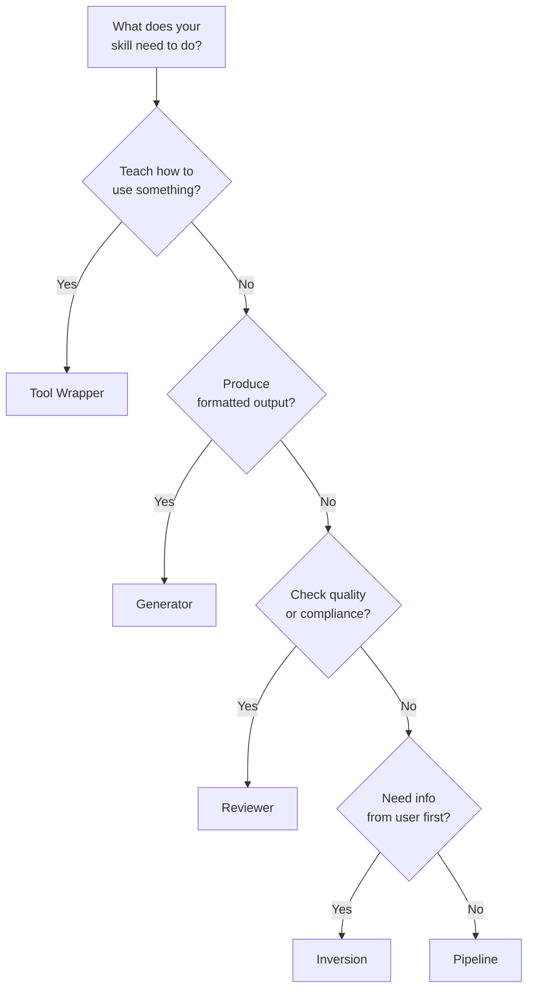

# Skill 设计模式

五种结构化模板，帮你快速上手 Skill 设计。选一种模式，用 `skillshare new` 生成模板，然后在此基础上继续定制。

:::tip 快速开始
使用 `skillshare new my-skill -P <pattern>` 为任意模式生成模板。运行 `skillshare new my-skill` 则会进入交互式选择器。
:::

---

## 第一部分：快速参考

### 模式总览

| 模式 | 作用 | 适用场景 |
|---------|-------------|----------|
| Tool Wrapper | 教会 agent 如何使用一个库/API | agent 需要特定领域的约定 |
| Generator | 根据模板生成结构化输出 | 你需要一致的文档/代码格式 |
| Reviewer | 依据检查清单打分/审查 | 代码审查、安全审计、质量检查 |
| Inversion | agent 在行动前先询问用户 | 需求收集、项目规划 |
| Pipeline | 带检查点的多步骤工作流 | 需要验证关卡的复杂任务 |

### 我该用哪种模式？



### 用途分类

创建 Skill 时，你还可以为其打上**分类（category）**标签，以标明其所属领域：

| 分类 | 说明 | 示例 |
|----------|-------------|----------|
| `library` | 库与 API 参考 | `billing-lib`、`internal-platform-cli` |
| `verification` | 产品验证 | `signup-flow-driver`、`checkout-verifier` |
| `data` | 数据获取与分析 | `funnel-query`、`grafana` |
| `automation` | 业务流程与团队自动化 | `standup-post`、`weekly-recap` |
| `scaffold` | 代码脚手架与模板 | `new-migration`、`create-app` |
| `quality` | 代码质量与审查 | `adversarial-review`、`testing-practices` |
| `cicd` | CI/CD 与部署 | `babysit-pr`、`deploy-service` |
| `runbook` | 运维手册与事件响应 | `oncall-runner`、`log-correlator` |
| `infra` | 基础设施运维 | `orphan-cleanup`、`cost-investigation` |

分类保存在 SKILL.md 的 frontmatter 中，与模式相互独立——任何模式都可以与任意分类组合。

---

## 第二部分：详细示例

### Tool Wrapper

通过嵌入约定和使用示例，教会 agent 如何使用某个特定的库、框架或 API。

agent 只需加载一次这些约定，之后在编写或审查涉及该库的代码时都会应用这些约定。这样一来，领域专属的知识就不必留在你的脑子里，而是变成了一份可重复使用的 Skill。

**SKILL.md 示例：**

```markdown
---
name: billing-lib
description: >-
  Conventions for the billing-lib SDK. Use when writing or reviewing
  code that imports billing-lib or handles payment flows.
pattern: tool-wrapper
category: library
---

# Billing Lib

## Core Conventions

Load and follow the rules in `references/conventions.md` before writing any code.

## When Reviewing Code

- Check that all API calls follow the conventions
- Verify error handling matches the library's patterns
- Ensure imports and initialization are correct

## When Writing Code

- Follow the conventions from `references/conventions.md`
- Use idiomatic patterns for this library/API
- Include error handling for common failure modes
```

**目录结构：**

```
billing-lib/
├── SKILL.md
└── references/
    └── conventions.md      # API patterns, error codes, initialization
```

**变体：** 有些 tool-wrapper Skills 会包含一份带有可直接复制粘贴代码片段的 `references/examples.md`，或者一份用于版本升级的 `references/migration.md`。

---

### Generator

根据风格指南填充模板，生成结构化输出（文档、配置文件、代码）。agent 先从用户那里收集变量，然后每次都生成一致的输出。

**SKILL.md 示例：**

```markdown
---
name: rfc-writer
description: >-
  Generates RFC documents following the team template. Use when user
  says "write an RFC", "new proposal", or "design doc".
pattern: generator
category: scaffold
---

# RFC Writer

## Steps

### Step 1: Load Style Guide

Read `references/style-guide.md` for formatting and naming rules.

### Step 2: Load Template

Read `assets/template.md` as the base structure.

### Step 3: Gather Input

Ask the user what they need generated. Collect all required variables.

### Step 4: Generate

Fill in the template following the style guide. Ensure all placeholders are replaced.

### Step 5: Deliver

Present the generated output. Ask if adjustments are needed.
```

**目录结构：**

```
rfc-writer/
├── SKILL.md
├── assets/
│   └── template.md         # RFC skeleton with placeholders
└── references/
    └── style-guide.md       # Formatting, section ordering, naming
```

**变体：** 有些 generator 会跳过风格指南，直接把所有规则写进模板里。另一些则会在 `assets/` 中放入多个模板，对应不同的文档类型。

---

### Reviewer

依据预先定义的检查清单，对工作成果进行打分或审计。agent 读取审查目标，逐条应用检查标准，并生成一份带有严重级别和通过/未通过评分的结构化报告。

**SKILL.md 示例：**

```markdown
---
name: pr-review
description: >-
  Reviews pull requests against the team quality checklist. Use when
  user says "review this PR", "check this code", or "audit quality".
pattern: reviewer
category: quality
---

# PR Review

## Steps

### Step 1: Load Checklist

Read `references/review-checklist.md` for the complete list of review criteria.

### Step 2: Understand

Read the code/document under review. Identify its purpose and scope.

### Step 3: Apply Rules

Evaluate each checklist item. Classify findings by severity:
- **Critical**: Must fix before proceeding
- **Warning**: Should fix, may cause issues later
- **Info**: Suggestion for improvement

### Step 4: Report

Produce a review report with:
1. Summary (pass/fail + one-line verdict)
2. Findings (severity, location, description)
3. Score (percentage of checklist items passed)
4. Top 3 recommended fixes
```

**目录结构：**

```
pr-review/
├── SKILL.md
└── references/
    └── review-checklist.md  # Criteria with severity weights
```

**变体：** 有些 reviewer Skills 会包含一份 `references/examples.md`，针对每条规则展示好的和差的代码示例。另一些则会加入 `references/scoring-rubric.md`，用于加权评分。

---

### Inversion

颠倒了通常的交互方式：不是由用户告诉 agent 该做什么，而是由 agent 先向用户提问以收集需求，然后再采取行动。这可以避免“先做出来、后再问需求”的问题。

**SKILL.md 示例：**

```markdown
---
name: project-planner
description: >-
  Plans a new project by interviewing the user about goals, constraints,
  and success criteria. Use when user says "plan a project", "new feature
  spec", or "help me think through this".
pattern: inversion
category: automation
---

# Project Planner

**DO NOT start building until all phases are complete.**

## Phase 1: Discovery

Ask the user these questions before proceeding:
- What is the goal?
- Who is the audience?
- What does success look like?

## Phase 2: Constraints

Ask the user about constraints:
- What are the technical limitations?
- What is the timeline?
- Are there existing patterns to follow?

## Phase 3: Synthesis

Based on the answers, load `assets/template.md` and produce a plan.
Present the plan for approval before executing.
```

**目录结构：**

```
project-planner/
├── SKILL.md
└── assets/
    └── template.md          # Plan document skeleton
```

**变体：** 有些 inversion Skills 会把固定的问题列表写进 `references/interview-questions.md`，而不是直接内嵌在正文中。另一些则会加入一个 Phase 0，在提问之前先读取现有的项目上下文。

---

### Pipeline

编排一个多步骤的工作流，每个阶段都设有验证关卡。agent 必须通过每一个检查点才能继续，这样可以防止复杂操作中出现连锁性失败。

**SKILL.md 示例：**

```markdown
---
name: deploy-staging
description: >-
  Deploys to staging with pre-flight checks and rollback plan. Use when
  user says "deploy to staging", "push to staging", or "staging release".
pattern: pipeline
category: cicd
---

# Deploy Staging

## Steps

### Step 1: Prepare

Gather inputs and validate prerequisites:
- Confirm branch is clean (`git status`)
- Run tests (`make test`)
- Check CI status

### Step 2: Gate Check

Present the plan to the user.

**Do NOT proceed until user confirms.**

### Step 3: Execute

Run the deployment pipeline. After each stage, verify output before continuing:
1. Build: `make build`
2. Push: `make push-staging`
3. Health check: `curl -sf https://staging.example.com/health`

### Step 4: Quality Check

Review results against `references/quality-checklist.md`.
Report pass/fail status for each criterion.
```

**目录结构：**

```
deploy-staging/
├── SKILL.md
├── references/
│   └── quality-checklist.md  # Post-deploy verification criteria
├── assets/
│   └── rollback-plan.md      # Steps to undo if something fails
└── scripts/
    └── healthcheck.sh        # Automated health verification
```

**变体：** 有些 pipeline 会包含一个 `scripts/` 目录，放置 agent 会执行的自动化脚本。另一些则会把回滚说明直接写在 SKILL.md 正文中。

---

## 模式可以组合使用

这些模式是构建的基本单元，而非一成不变的模板。你可以组合它们来适应真实场景的需求：

- **Pipeline + Reviewer：** 一个以质量审查步骤收尾的部署 pipeline，在标记完成之前先依据检查清单为本次部署打分。
- **Inversion + Generator：** 一个 RFC Skill，先就目标和约束条件采访用户（Inversion），再用收集到的信息填充模板（Generator）。
- **Tool Wrapper + Reviewer：** 一个既能教授约定（Tool Wrapper），又能审计现有代码是否合规（Reviewer）的库 Skill。

先从单一模式起步，再随着 Skill 范围的扩大逐步叠加其他模式。

---

## 另请参阅

- [Skill 设计](./skill-design.md) — 设计原则（确定性、渐进式披露、复杂度匹配）
- [创建 Skills](/docs/how-to/daily-tasks/creating-skills) — 分步创建指南
- [Skill 格式](/docs/understand/skill-format) — SKILL.md 结构与元数据
