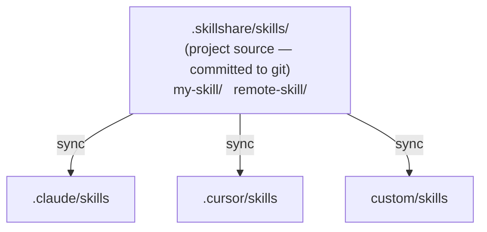

# Project Skills

在项目级别运行 skillshare —— 通过 git 共享的、限定于单个仓库的 Skills。

:::tip 什么时候需要用到这个？
当团队需要仓库专属的 AI 指令(编码规范、部署指南、API 约定),而这些内容不应该放在你的个人全局 Skill 集合中时,使用 Project Skills。
:::

## 使用场景

| 场景 | 示例 |
|----------|---------|
| **Monorepo 上手** | 新开发者克隆仓库,运行 `skillshare install -p && skillshare sync` —— 立即获得项目上下文 |
| **API 约定** | 将 API 风格指南嵌入为 Skill,让每个 AI 助手都遵循团队约定 |
| **领域专属上下文** | 带有监管规则的金融应用,带有合规指南的医疗应用 |
| **项目工具** | 特定于该仓库的 CI/CD 部署知识、测试模式、迁移脚本 |
| **加速上手** | "这里的 auth 是怎么工作的?" —— AI 已经从已提交的 project skills 中知道答案 |
| **开源项目** | 维护者提交 `.skillshare/`,让贡献者在克隆时获得项目专属的 AI 上下文 |
| **社区 Skill 策展** | 仓库 `config.yaml` 的 `skills:` 部分作为一份策展过的 Skill 清单——任何人都可以 `install -p` 来获得相同的配置 |

---

## 概览



---

## 自动检测

当当前目录存在 `.skillshare/config.yaml` 时,skillshare 会自动进入 Project mode:

```bash
cd my-project/           # Has .skillshare/config.yaml
skillshare sync          # → Project mode (auto-detected)
skillshare status        # → Project mode (auto-detected)
```

:::tip 零配置
只需 `cd` 进入任何带有 `.skillshare/` 的项目——skillshare 会自动检测到它。无需 flag、无需环境变量、无需配置。
:::

要强制指定某种模式:

```bash
skillshare sync -p       # Force project mode
skillshare sync -g       # Force global mode
```

---

## Global vs Project

| | Global Mode | Project Mode |
|---|---|---|
| **Source** | `~/.config/skillshare/skills/` | `.skillshare/skills/`(项目根目录) |
| **Config** | `~/.config/skillshare/config.yaml` | `.skillshare/config.yaml` |
| **Targets** | 系统级的 AI CLI 目录 | 逐项目的目录 |
| **Sync mode** | Merge、copy 或 symlink(按 Target) | Merge、copy 或 symlink(按 Target,默认为 merge) |
| **Tracked repos** | 支持(`--track`) | 支持(`--track -p`) |
| **Git integration** | 可选(`push`/`pull`) | Skills 直接提交到项目仓库 |
| **Scope** | 机器上的所有项目 | 单一仓库 |

对于只属于你自己的项目，还有第三种选择：把这些文件夹列在全局配置的 [`projects`](/docs/reference/targets/configuration#projects) 下。每个文件夹都会拿到自己的一份 Skill、Agent 和 MCP server，不会有任何内容添加到仓库中，一次 `sync` 就能更新它们全部。参见 [Many Projects, One Config](/docs/how-to/recipes/many-projects-one-config#scenario)，了解该如何选择。

---

## `.skillshare/` 目录结构

```
<project-root>/
├── .skillshare/
│   ├── config.yaml              # Targets + settings (incl. extras)
│   ├── skills.lock.json         # Commit each remote skill is pinned to (auto-managed, commit it)
│   ├── skills/.metadata.json     # Runtime metadata (hashes, timestamps — auto-managed, gitignored)
│   ├── .gitignore               # Ignores logs/, trash/, backups/, and cloned remote/tracked skill dirs
│   ├── extras/                  # Extras source directories
│   │   └── rules/               # e.g. extras init rules --target .claude/rules -p
│   │       └── coding.md
│   └── skills/
│       ├── my-local-skill/      # Created manually or via `skillshare new`
│       │   └── SKILL.md
│       ├── remote-skill/        # Installed via `skillshare install -p`
│       │   └── SKILL.md
│       ├── tools/               # Category folder (via --into tools)
│       │   └── pdf/             # Installed via `skillshare install ... --into tools -p`
│       │       └── SKILL.md
│       └── _team-skills/        # Installed via `skillshare install --track -p`
│           ├── .git/            # Git history preserved
│           ├── frontend/ui/
│           └── backend/api/
├── .claude/
│   └── skills/
│       ├── my-local-skill → ../../.skillshare/skills/my-local-skill
│       ├── remote-skill → ../../.skillshare/skills/remote-skill
│       ├── tools__pdf → ../../.skillshare/skills/tools/pdf
│       ├── _team-skills__frontend__ui → ../../.skillshare/skills/_team-skills/frontend/ui
│       └── _team-skills__backend__api → ../../.skillshare/skills/_team-skills/backend/api
└── .cursor/
    └── skills/
        └── (same symlink structure as .claude/skills/)
```

Project mode 中的符号链接使用**相对路径**(例如 `../../.skillshare/skills/...`)。这使得项目目录具有可移植性——重命名它、移动它,或在另一台机器上克隆它,所有符号链接都能继续正常工作。Global mode 使用绝对路径,因为 Source 和 Targets 位于不同的文件系统位置。

---

## 可见的 Project 目录 {#visible-project-directory}

将 Skills 视为可审阅内容而非工具状态的仓库,可以使用可见的 `skillshare/` 目录来代替隐藏的 `.skillshare/`:

```bash
skillshare init -p --visible
```

```
<project-root>/
├── skillshare/
│   ├── config.yaml
│   ├── skills/
│   └── agents/
└── src/
```

其余部分完全相同——`config.yaml`、`skills/`、`agents/`、`extras/`,以及操作性的 `trash/`、`backups/` 和 `logs/` 目录都位于当前使用的那个项目目录内。

检测会先检查 `.skillshare/config.yaml`,再检查 `skillshare/config.yaml`,因此:

- 现有项目不受影响。
- 如果两个目录都存在,`.skillshare/` 优先。
- 要迁移现有项目,运行 `mv .skillshare skillshare`,然后运行 `skillshare sync -p` 来修复仍指向旧目录的 Target 符号链接。如果你的 `sources` 设置显式引用了 `.skillshare/`,请在同步前先更新 `config.yaml` 中的这些路径。

不带 `--visible` 的 `init -p` 仍会创建 `.skillshare/`。

:::note
全局配置目录也叫 `skillshare`(`~/.config/skillshare/`)。只有位于项目根目录内的 `skillshare/` 目录才会被视为一个 project。
:::

### 缺失的 config

当尚不存在 project 时,Project 命令会自动初始化一个 project,并且使用 `--config local` 的[共享 skills 仓库](/docs/how-to/recipes/centralized-skills-repo)也会以同样方式重新生成其被 gitignore 的 `config.yaml`。

只有一种情况例外:如果项目目录中已经存在 skills 或 agents,但其 `config.yaml` 缺失,重新初始化会写入一个空配置并丢弃所有已配置的 Target。这些命令会改为报告问题,以便你从版本控制中恢复 `config.yaml`,或有意运行 `skillshare init -p`。

---

## Config 格式

`.skillshare/config.yaml`:

```yaml
targets:
  - claude                    # Known target (uses default path)
  - cursor                         # Known target
  - name: custom-ide               # Custom target with explicit path
    path: ./tools/ide/skills
    mode: symlink                  # Optional: "merge" (default), "copy", or "symlink"
  - name: codex                    # Optional filters (merge mode)
    include: [codex-*]
    exclude: [codex-experimental-*]
```

**Targets** 支持两种格式:
- **简短形式**:仅目标名称(例如 `claude`)。使用已知的默认路径、merge 模式。
- **完整形式**:包含 `name`、可选的 `path`、可选的 `mode`(`merge`、`copy` 或 `symlink`),以及可选的 `include`/`exclude` 过滤器的对象。支持相对路径(从项目根目录解析)和 `~` 展开。

远程 Skill 依赖在 `config.yaml` 的 `skills:` 下声明:

```yaml
targets:
  - claude
  - cursor

skills:
  - name: pdf
    source: anthropic/skills/pdf
  - name: _team-skills
    source: github.com/team/skills
    tracked: true
  - name: review
    source: github.com/team/skills/code-review
    group: frontend
```

**Skills** 列表只声明远程安装项。本地 Skill 不需要在这里有条目。

- `tracked: true`:使用 `--track` 安装(保留 `.git/` 的 git 仓库)。当有人运行 `skillshare install -p` 时,tracked skills 会连同完整的 git 历史一起被克隆,以便 `skillshare update` 能正常工作。
- `group`:子目录路径(对应安装时的 `--into`)。

运行时元数据(安装时间戳、文件哈希、commit SHA)单独存储在 `.skillshare/skills/.metadata.json` 中——此文件是自动管理的,并被 gitignore。

:::tip 可移植的 Skill 清单
`config.yaml` 是声明式的 skill manifest。在项目中,将其提交到 git,任何人都可以运行 `skillshare install -p && skillshare sync`。对于 Global mode,由于全局配置不需要通过 git 共享,`.metadata.json` 就充当了这个 manifest。
:::

### 锁定文件 {#lockfile}

`config.yaml` 声明一个 Skill 所跟随的目标,例如某个仓库的默认分支。`.skillshare/skills.lock.json` 记录的则是上次安装或更新时,那实际对应的是哪个 commit。把两者都提交到 git,任何运行 `skillshare install -p` 的人都会得到相同的内容,即使上游仓库已经继续往前推进。

```json
{
  "version": 1,
  "skills": {
    "pdf": {
      "source": "github.com/anthropics/skills/skills/pdf",
      "commit": "8f14e45fceea167a5a36dedd4bea2543ce848564",
      "tree_hash": "f88c87101780018cfabdd229d5d92abedd6f640e"
    }
  }
}
```

该文件由系统自动写入,你无需手动编辑:

| 命令 | 对锁定文件的影响 |
|---------|------------------------|
| `skillshare install <source> -p` | 将新 Skill 固定到其安装时所在的 commit |
| `skillshare install -p` | 按固定的 commit 安装每个 Skill。已安装在其他 commit 上的 Skill 会被移动到固定的 commit |
| `skillshare update <name> -p` | 将 Skill 移动到最新 commit 并重写其固定点,使该变更能在代码审查中体现出来 |
| `skillshare uninstall <name> -p` | 移除固定 |

Tracked 仓库同样会被固定。它们会被重置到固定的 commit,但仍留在原本的分支上,因此 `skillshare update` 依旧可以 pull。一旦 Skill 在 `config.yaml` 中的 `source` 与固定点不再匹配,该固定就会被忽略。本地路径来源没有 commit,因此不会被固定。

固定只会在你移动 Skill 时跟着移动,也就是执行 `update` 或强制重新安装的时候。如果队友的固定比你本机的版本新,其他命令不会改动它,直到你执行 `skillshare install -p` 把本机更新到该版本。Tracked 仓库若有未 commit 的变更,`install -p` 不会移动它,请先 commit 或丢弃变更。

用较旧版本 skillshare 安装的 Skill 没有记录 commit,会在下次更新或重新安装时被固定。

锁定文件不同于 `--branch <sha>`:该 flag 会永久固定一个 Skill,`update` 只会重新安装同一版本。使用锁定文件时,Skill 会继续跟随其分支,只有显式的 `update` 才会移动它。

---

## 自定义 Source 目录 {#custom-source-directories}

默认情况下,Project mode 从 `.skillshare/skills/`、`.skillshare/agents/` 和 `.skillshare/extras/` 读取 skills、agents 和 extras。当你想把 skill 内容与其他项目文档放在一起时,可以通过可选的 `sources` map 来覆盖这些路径:

```yaml
sources:
  skills: ./docs/skills
  agents: ./docs/agents
  extras: ./docs/extras
targets:
  - claude
```

每个 key 都是可选的——省略某个 key 会回退到默认的 `.skillshare/<type>/` 路径。路径相对于项目根目录解析,绝对路径(包括 `~`)也可以使用。

**常见布局:**

```yaml
# Co-locate skill content with existing project docs
sources:
  skills: ./docs/skills

# Keep agents in an AI-focused subdirectory
sources:
  agents: ./ai/agents
```

**限制条件:**

- **不能与 Target 路径别名重叠。** 如果某个 source 解析后与某个 Target 是同一目录(或彼此包含),`skillshare sync -p` 会拒绝这样的配置。这可以防止 `sync --force` 清空已配置的 source。例如,`sources.skills: .claude/skills` 与 `claude` target 组合会因 `overlaps` 错误而被拒绝。
- **外部路径不受 gitignore 管理。** 当某个 source 解析到项目根目录之外(磁盘上其他位置的绝对路径)时,skillshare 不会向项目的 `.gitignore` 添加条目。如有需要,请自行在该 source 目录中管理忽略规则。
- **操作性目录始终留在项目目录内。** Trash、backups 和操作日志始终位于当前使用的项目目录下(`.skillshare/`,或 `skillshare/`——见上文),与 `sources` 设置无关。
- **`init -p` 始终会在项目目录中初始化 `{skills,agents}/`。** 自定义 source 只有在你编辑 `config.yaml` 之后才会生效。

---

## 模式限制

Project mode 存在一些有意为之的限制:

| 功能 | 是否支持? | 说明 |
|---------|-----------|-------|
| Merge sync 模式 | ✓ | 默认,逐个 Skill 的符号链接 |
| Copy sync 模式 | ✓ | 通过 `skillshare target <name> --mode copy -p` 按 Target 设置 |
| Symlink sync 模式 | ✓ | 通过 `skillshare target <name> --mode symlink -p` 按 Target 设置 |
| `--track` 仓库 | ✓ | 克隆到 `.skillshare/skills/_repo/`,并加入 `.gitignore`(默认也会忽略 `logs/`、`trash/` 和 `backups/`) |
| `--discover` | ✓ | 检测并将新 Target 添加到现有项目配置中 |
| `push` / `pull` | ✗ | 直接对项目仓库使用 git |
| `collect` | ✓ | 将本地 Skill 从 project targets 收集回 `.skillshare/skills/` |
| `extras` | ✓ | Extras 的 sync、init、list、remove、collect——都支持 `-p` |
| `backup` / `restore` | ✗ | 不需要(project targets 是可复现的) |

---

## 何时使用:Project vs Organization

| 需求 | 使用 |
|------|-----|
| 特定于**单一仓库**的 Skills(API 风格、部署、领域规则) | **Project skills**——提交到该仓库 |
| **所有项目**共享的 Skills(编码规范、安全审计) | **Organization skills**——通过 `--track` 的 tracked repos |
| 让新成员**上手**某个特定项目 | **Project skills**——clone + install + sync |
| 让新成员**上手**整个组织 | **Organization skills**——一条安装命令 |
| 既需要仓库上下文**又**需要组织标准 | **两者都用**——它们可以独立共存 |

---

## 另见

- [Project Setup](/docs/how-to/sharing/project-setup) —— 分步设置指南
- [Project Workflow](/docs/how-to/daily-tasks/project-workflow) —— Project mode 的日常使用
- [Organization-Wide Skills](/docs/how-to/sharing/organization-sharing) —— 团队范围内的共享
