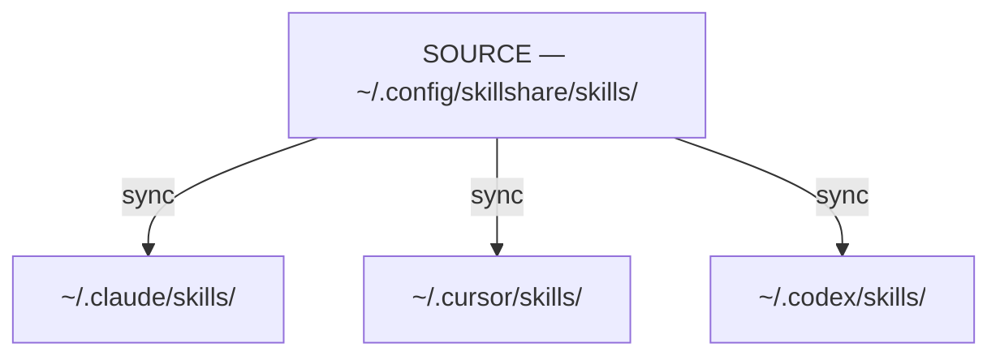

# Source & Targets

skillshare 背后的核心模型：一个 source，多个 target。

:::tip 什么时候需要关心这个？
理解 source 与 targets 的区别，能帮你知道应该在哪里编辑 skill 和 agent（永远在 source 中编辑 — 变更会通过 symlink 反映出去）、为什么 `sync` 是独立的一步，以及 `collect` 是如何反向工作的。
:::

## 问题所在

如果没有 skillshare，你需要为每个 AI CLI 分别管理 skill：

```
~/.claude/skills/         # Edit here
  └── my-skill/

~/.cursor/skills/         # Copy to here
  └── my-skill/           # Now out of sync!

~/.codex/skills/          # And here
  └── my-skill/           # Also out of sync!
```

**痛点：**
- 在一处编辑不会传播到其他地方
- Skill 会随时间逐渐产生差异
- 没有单一的事实来源

---

## 解决方案

skillshare 引入了一个 **source 目录**，它会同步到所有 **target**：



**优点：**
- 在 source 中编辑 → 所有 target 立即更新
- 在 target 中编辑 → 变更会传回 source（通过 symlink）
- 单一事实来源

---

## 为什么 Sync 是独立的一步 {#why-sync-is-a-separate-step}

像 `install`、`update` 和 `uninstall` 这样的操作只会修改 **source** 目录。单独的 `sync` 步骤会将变更传播到所有 target。这种两阶段设计是刻意为之：

**在传播前先预览** — 运行 `sync --dry-run`，可以在应用之前查看所有 target 上将会发生的变更。这在 `uninstall` 或 `--force` 操作之后尤其有用。

**批量处理多个变更** — 安装 5 个 skill，然后只 sync 一次。如果没有这种分离，每次 install 都会在所有 target 上触发一次完整扫描和 symlink 更新。

**默认安全** — Source 的变更会先暂存，而不是立即生效。你可以自主掌控 target 何时更新。此外，`uninstall` 会把 skill 移动到 trash 目录（保留 7 天）而不是永久删除，因此误删是可以恢复的。

:::tip 例外情况：pull
`pull` 在 `git pull` 之后会自动运行 sync。因为它的目的就是"把一切从远端更新到最新"，所以自动 sync 符合预期行为。
:::

:::info 什么时候不需要 sync
编辑现有 skill 不需要 sync — 由于是 symlink，变更会立即在所有 target 中可见。只有当 skill 的集合发生变化（新增、移除、重命名）或者 target/mode 发生变化时，才需要 sync。
:::

---

## Source 目录

**默认位置：** `~/.config/skillshare/skills/`

这里是：
- 你创建和编辑 skill 的地方
- Skill 被安装到的位置
- Git 跟踪变更的地方（用于跨机器同步）

:::tip 被 symlink 的 source 目录
Source 目录本身也可以是一个 symlink — 在使用 dotfiles 管理工具（GNU Stow、chezmoi、yadm）时很常见。例如 `~/.config/skillshare/skills/ → ~/dotfiles/ss-skills/`。skillshare 在扫描前会解析 symlink，因此所有命令都能透明地正常工作。也支持链式 symlink。
:::

**结构：**
```
~/.config/skillshare/skills/
├── my-skill/
│   └── SKILL.md
├── code-review/
│   └── SKILL.md
├── _team-skills/          # Tracked repo (underscore prefix)
│   ├── frontend/
│   │   └── ui/
│   └── backend/
│       └── api/
└── ...
```

### 用文件夹组织（自动展平） {#organize-with-folders-auto-flattening}

你可以用文件夹来组织自己的 skill — 它们在同步到 target 时会被自动展平：


**优点：**
- 按项目、团队或类别组织 skill
- 无需手动展平
- AI CLI 得到它们所期望的扁平结构
- 文件夹名称成为可追溯的前缀

---

## Agents Source

Agent 是与 skill 并列的一种资源类型。它们拥有自己独立的 source 目录，与 `skills/` 相邻，并遵循相同的 source-and-targets 模型：

```
~/.config/skillshare/
├── skills/                    # Skills source (directories)
│   └── my-skill/
│       └── SKILL.md
└── agents/                    # Agents source (single .md files)
    ├── reviewer.md
    └── auditor.md
```

同一次 `skillshare init` 运行会同时创建这两个目录。Agent 是单一的 `.md` 文件（没有嵌套目录），通过 `skillshare sync` 同步（或使用 `skillshare sync agents` 只针对 agent 进行同步）。

**支持 agent 的 target。** 并不是每个 AI CLI 都暴露 agent 目录。支持的 target 有：

- `~/.claude/agents/` — Claude Code
- `~/.cursor/agents/` — Cursor
- `~/.augment/agents/` — Augment
- `~/.config/opencode/agents/` — OpenCode
- `~/.factory/droids/` — Droid

其他 target 在 agent 同步时会被静默跳过（并给出 `target(s) skipped for agents (no agents path)` 警告）。适用于 skill 的 merge / copy / symlink 模式，同样适用于 agent。

完整的 agent 文件格式、`.agentignore` 规则以及发现机制，请参见 [Agents](/docs/understand/agents)。

---

## 自定义 Source 目录

默认情况下，global 模式会从 `~/.config/skillshare/skills/` 读取 skill，从 `~/.config/skillshare/agents/` 读取 agent，并从 skills source 推导出 extras 的父目录。自 v0.19.16 起，可选的顶层 `sources` 映射可以覆盖以上任意一项：

```yaml
# ~/.config/skillshare/config.yaml
sources:
  skills: ~/work/skills
  agents: ~/work/agents
  extras: ~/work/extras
targets:
  claude:
    skills:
      path: ~/.claude/skills
```

每个键都是可选的 — 省略某个键即可保留其内置默认值。路径支持 `~`（家目录展开）和绝对路径。

**常见布局：**

```yaml
# Point all three at a shared dotfiles directory
sources:
  skills: ~/dotfiles/skillshare/skills
  agents: ~/dotfiles/skillshare/agents
  extras: ~/dotfiles/skillshare/extras

# Override only skills; agents and extras keep their defaults
sources:
  skills: ~/projects/team-skills
```

### 向后兼容

v0.19.16 之前的顶层字段仍然被接受，并会继续正常工作：

```yaml
# Legacy format — fully supported, no auto-migration on save
source: ~/.config/skillshare/skills
agents_source: ~/.config/skillshare/agents
extras_source: ~/.config/skillshare/extras
```

当两种格式同时存在时，`sources.<key>` 的值会优先于对应的旧字段。现有配置不会被自动重写；只有全新的 `skillshare init` 运行才会生成新的 `sources:` 形式。

### 何时需要关心这个

项目模式下也存在相同的功能（关于项目模式的形式，包括支持从项目根目录出发的相对路径，请参见 [Project Skills](/docs/understand/project-skills#custom-source-directories)）。

---

## Targets

Target 是 skillshare 同步到的 AI CLI skill 目录。

**常见 target：**
- `~/.claude/skills/` — Claude Code
- `~/.cursor/skills/` — Cursor
- `~/.agents/skills/` — OpenAI Codex CLI（共享的 `universal` 目录）
- `~/.gemini/config/skills/` — Antigravity（app）
- `~/.gemini/antigravity-cli/skills/` — Antigravity CLI
- `~/.gemini/skills/` — Gemini CLI
- 还有 [64+ 更多](/docs/reference/targets/supported-targets)

**自动检测：** 当你运行 `skillshare init` 时，它会自动检测已安装的 AI CLI 并将它们添加为 target。

**手动添加：**
```bash
skillshare target add myapp ~/.myapp/skills
```

---

## Sync 如何工作

### Source → Targets（`sync`）

```bash
skillshare sync
```

从每个 target 创建指向 source 的 symlink：
```
~/.claude/skills/my-skill → ~/.config/skillshare/skills/my-skill
```

### Target → Source（`collect`）

```bash
skillshare collect claude
```

将本地 skill 从某个 target 收集回 source：
1. 在 target 中查找非 symlink 的 skill
2. 将它们复制到 source（`.git/` 目录会被自动排除）
3. 用 symlink 替换原有内容

---

## 编辑 Skill

由于 target 都是 symlink 到 source，你可以在任意位置编辑：

**在 source 中编辑：**
```bash
$EDITOR ~/.config/skillshare/skills/my-skill/SKILL.md
# Changes visible in all targets immediately
```

**在 target 中编辑：**
```bash
$EDITOR ~/.claude/skills/my-skill/SKILL.md
# Changes go to source (same file via symlink)
```

---

## 另请参阅

- [sync](/docs/reference/commands/sync) — 将变更从 source 传播到 targets
- [collect](/docs/reference/commands/collect) — 将 skill 从 targets 拉取回 source
- [Sync Modes](./sync-modes.md) — 文件如何被链接（merge、copy、symlink）
- [Agents](./agents.md) — Agent 资源模型与发现机制
- [Configuration](/docs/reference/targets/configuration) — Target 配置参考
