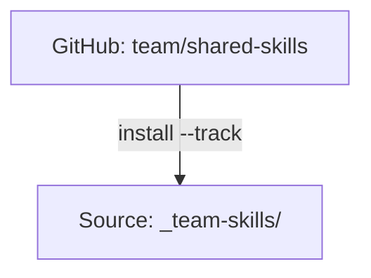

# Tracked Repositories

使用 `--track` 安装的 Git 仓库，便于团队共享和轻松更新。

:::tip 什么情况下需要关心这个？
Tracked repos 是组织分发共享 Skill 的方式。使用 `--track` 安装一次，之后只需一条命令即可更新。变更会从维护者的仓库流向每一位团队成员。
:::

## 概览

Tracked repositories 是被克隆到你的 Source 中、并保留其 `.git` 目录的 Git 仓库。这带来以下能力：

- **团队共享**：所有人安装同一个仓库
- **轻松更新**：`skillshare update <name>` 会执行 git pull
- **版本控制**：追踪你当前所在的 commit



---

## 普通 Skill 与 Tracked Repo 的对比

| 方面 | 普通 Skill | Tracked Repo |
|--------|---------------|--------------|
| Source | 复制到 Source | 保留 `.git` 克隆 |
| 更新方式 | `install --update` | `update <name>`（git pull） |
| 前缀 | 无 | `_` 前缀 |
| 嵌套 Skill | 扁平化 | 使用 `__` 扁平化 |

---

## 安装 Tracked Repo

```bash
skillshare install github.com/team/shared-skills --track
skillshare sync
```

**发生了什么：**
1. 仓库被克隆到 `~/.config/skillshare/skills/_team-skills/`
2. 保留 `.git` 目录
3. 克隆目录会被加入受管理的 `.gitignore` 区块，使其保持本机专属，不会作为嵌套 Git 仓库被提交
4. 使用当前 install 阈值（`audit.block_threshold` 或 `--threshold`）对整个仓库进行安全审计
5. 嵌套 Skill 会为 AI CLI 扁平化处理

如果发现的问题达到阈值，安装会被阻止，除非使用 `--force`。被阻止时，skillshare 会自动移除已克隆的仓库；若清理失败，命令会报告确切路径以便手动清理。

---

## 下划线前缀

Tracked repos 会以 `_` 为前缀，以便与普通 Skill 区分：

```
~/.config/skillshare/skills/
├── my-skill/           # 普通 Skill（无前缀）
├── code-review/        # 普通 Skill
└── _team-skills/       # Tracked Repo（下划线前缀）
```

---

## 嵌套 Skill 与自动扁平化 {#nested-skills--auto-flattening}

Skill 仓库通常会把 Skill 组织在文件夹中。skillshare 会自动为 AI CLI 将其扁平化：

```
SOURCE                              TARGET
(your organization)                 (what AI CLI sees)
────────────────────────────────────────────────────────────
_team-skills/
├── frontend/
│   ├── react/          ───►   _team-skills__frontend__react/
│   └── vue/            ───►   _team-skills__frontend__vue/
├── backend/
│   └── api/            ───►   _team-skills__backend__api/
└── devops/
    └── deploy/         ───►   _team-skills__devops__deploy/

• _ prefix = tracked repository
• __ (double underscore) = path separator
```

### 为什么要自动扁平化？

| 优点 | 说明 |
|---------|-------------|
| **AI CLI 兼容性** | 大多数 AI CLI 期望 Skill 位于扁平目录中，而非嵌套文件夹 |
| **保留组织结构** | 在满足 CLI 要求的同时，在 Source 中保留逻辑上的文件夹结构 |
| **可追溯性** | 扁平化后的名称会显示来源路径（例如 `_team__frontend__react` → 来自 `_team/frontend/react/`） |
| **无需手动操作** | skillshare 在 Sync 过程中自动完成转换 |

**你负责组织，skillshare 负责适配。** 无论以何种文件夹结构编写 Skill，都能在任何地方正常工作。

:::tip
自动扁平化适用于**所有 Skill**，不仅限于 Tracked Repo。你也可以用文件夹组织自己的 Skill。参见 [Organize with Folders](/docs/understand/source-and-targets#organize-with-folders-auto-flattening)。
:::

---

## 全新克隆后的重新水合（Rehydrating） {#rehydrating-after-a-fresh-clone}

Tracked repo 的克隆目录会被有意地被 Git 忽略，因为它们本身包含自己的 `.git` 目录。如果你在新机器上克隆或拉取 skillshare 的 Source 仓库，`.metadata.json` 可能已经声明了 Tracked Repo，而 `_team-skills/` 克隆目录仍然缺失。

运行不带参数的 install 即可根据元数据重新创建缺失的 Tracked Repo 克隆：

```bash
skillshare install
skillshare sync
```

在 Project mode 下，请运行：

```bash
skillshare install -p
skillshare sync -p
```

`status`、`check`、`update --all` 和 `doctor` 会报告缺失的 Tracked Repo 克隆，并建议运行 `skillshare install`，而不是默默忽略它们。

---

## 更新 Tracked Repo

### 单个仓库

```bash
skillshare update _team-skills
skillshare sync
```

### 所有 Tracked Repo

```bash
skillshare update --all
skillshare sync
```

**发生了什么：**
```
cd ~/.config/skillshare/skills/_team-skills
git pull origin main
```

**更新过程中的安全行为：**
- 拉取后会对更新内容进行审计。
- 阻止行为使用当前的阈值（默认为 `audit.block_threshold`，或按命令覆盖的 `--threshold`/`-T`）。
- 在 TTY 模式下，当发现的问题达到阈值时，`skillshare update` 会提示确认；在非 TTY 模式下，会自动回滚（除非使用 `--skip-audit`）。
- 被拒绝时，Tracked Repo 会回滚到上一个 commit 以保留本地状态。
- 如果回滚基线的捕获失败，出于安全考虑更新会中止（fail-closed）。

---

## 卸载

```bash
skillshare uninstall _team-skills
```

**发生了什么：**
1. 检查是否存在未提交的变更（若存在则警告）
2. 删除目录
3. 下一次 `sync` 会从 Target 中移除对应的符号链接

---

## Project Mode

Tracked repo 在 Project mode 下同样可用。仓库会被克隆到 `.skillshare/skills/`，并加入 `.skillshare/.gitignore`（这样 Tracked Repo 自身的 Git 历史就不会与你项目的 Git 冲突）。项目日志（`.skillshare/logs/`）、回收站（`.skillshare/trash/`）和备份（`.skillshare/backups/`）默认也会被忽略。

安装 Tracked Repo 会自动在 `.skillshare/.metadata.json` 中记录 `tracked: true`，这样新加入的团队成员通过 `skillshare install -p` 就能得到正确的克隆行为：

```json
{
  "skills": [
    {
      "name": "_team-shared-skills",
      "source": "github.com/team/shared-skills",
      "tracked": true
    }
  ]
}
```

```bash
# 将 Tracked Repo 安装到项目中
skillshare install github.com/team/shared-skills --track -p
skillshare sync

# 通过 git pull 更新
skillshare update team-skills -p
skillshare sync

# 强制更新（丢弃本地变更）
skillshare update team-skills -p --force

# 卸载
skillshare uninstall team-skills -p
```

**目录结构：**

```
<project-root>/
└── .skillshare/
    ├── .gitignore           # Contains: logs/, trash/, and skills/_team-skills
    └── skills/
        └── _team-skills/    # Tracked repo with .git/ preserved
            ├── .git/
            ├── frontend/ui/
            └── backend/api/
```

如果你有意要提交项目日志，可以在 `.skillshare/.gitignore` 中受管理区块之后追加 `!logs/` 和 `!logs/*.log`。

嵌套 Skill 的自动扁平化方式与 Global mode 相同 —— `_team-skills/frontend/ui` 在 Target 中会变成 `_team-skills__frontend__ui`。

---

## 自定义名称

```bash
skillshare install github.com/team/skills --track --name acme-skills
# Installed as: _acme-skills/
```

`--track --name` 的名称约束：
- 必须解析为以 `_` 开头的 Tracked Repo 目录名。
- 不能包含路径分隔符（`/`、`\`）或上级目录跳转（`..`）。
- 无效名称会在克隆前被拒绝。

---

## 分支追踪

你可以追踪仓库的特定分支：

```bash
skillshare install github.com/team/skills --track --branch frontend
```

Tracked Repo 会克隆并跟随指定的分支。通过 `skillshare update` 更新时会自动从该分支拉取。

如果要在多个分支上安装同一个仓库，请使用 `--name` 避免名称冲突：

```bash
skillshare install github.com/team/skills --track --branch frontend --name team-frontend
skillshare install github.com/team/skills --track --branch backend --name team-backend
```

分支参数在普通（非 Tracked）安装中同样可用：

```bash
skillshare install github.com/team/skills --branch develop --all
```

分支信息会被持久化到 Skill 元数据中，因此 `skillshare update` 和 `skillshare check` 会自动使用正确的分支。

---

## 冲突检测

当多个 Skill 共享相同的 `name` 字段时，Sync 会检查在应用 `include`/`exclude` 过滤器后，它们是否会实际落到同一个 Target 上。

**过滤器隔离了冲突** —— 仅作提示：

```
ℹ Duplicate skill names exist but are isolated by target filters:
  'ui' (2 definitions)
```

**冲突落到了同一个 Target** —— 需要处理的警告：

```
⚠ Target 'claude': skill name 'ui' is defined in multiple places:
  - _team-a/frontend/ui
  - _team-b/components/ui
Rename one in SKILL.md or adjust include/exclude filters
```

**最佳实践** —— 为 Skill 命名空间化，或使用过滤器：

```yaml
# Option 1: Namespace in SKILL.md
name: team-a-ui

# Option 2: Route with filters (global config)
targets:
  codex:
    path: ~/.codex/skills
    include: [_team-a__*]
  claude:
    path: ~/.claude/skills
    include: [_team-b__*]
```

```yaml
# Option 2: Route with filters (project config)
targets:
  - name: claude
    exclude: [codex-*]
  - name: codex
    include: [codex-*]
```

完整语法与示例参见 [Target Filters](/docs/reference/targets/configuration#include--exclude-target-filters)。

---

## 参见

- [install](/docs/reference/commands/install) — 使用 `--track` 安装
- [update](/docs/reference/commands/update) — 拉取最新变更
- [check](/docs/reference/commands/check) — 查看可用更新
- [Organization-Wide Skills](/docs/how-to/sharing/organization-sharing) — 团队共享指南
