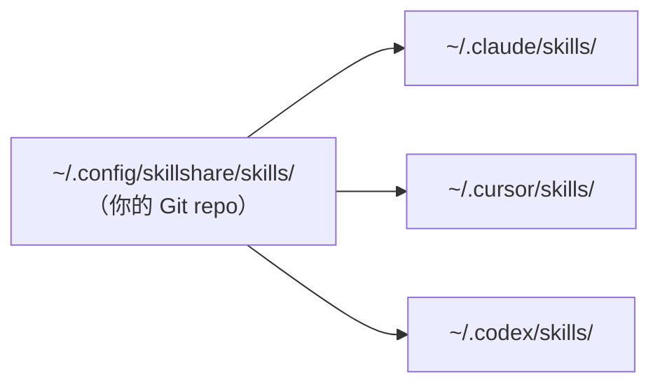

# 開始使用

skillshare 會讓單一 source 目錄和你機器上每個 AI CLI 的 skill 目錄保持同步。你只需要撰寫或安裝 skill 一次，symlink 就會讓它同時出現在 Claude、Cursor、Codex 以及其他任何已設定的 target 中。



Source 就是一個由你自己掌控的一般 Git repo。在一台機器 push、到另一台 pull、或是分享給同事都可以 — 底層的 symlink 那一層交給 skillshare 處理。

## Source 裡面有什麼

你的 source 目錄中會同時存在三種 skills。它們的差別只在於「怎麼被 Git 追蹤」以及「怎麼更新」。

**你自己撰寫的 skills。** 用 `skillshare new <name>` 建立，或直接放一個資料夾進去。會 commit 進你的 repo，透過編輯來更新。

**Vendored skills。** 用 `skillshare install <url>` 安裝。clone 下來的內容直接放在你的 repo 裡，會和你自己的作品一起被 commit。`.metadata.json` 會記錄上游 URL，之後 `skillshare update` 才能拉取新版本。當你想要客製化、鎖定某個版本，或維持離線可重現時，選這種。

**Tracked skills。** 用 `skillshare install <url> --track` 安裝。clone 會放進以 `_` 為前綴的目錄，並自動加入 `.gitignore`，因此永遠不會進到你的 repo。`skillshare update` 會重新從上游拉取。用於你不打算修改的公司或社群 repo。

用了幾個月之後，典型的 source 大致長這樣：

```
~/.config/skillshare/skills/
├── my-review/                 # authored
├── my-deploy-checklist/       # authored
├── agent-browser/             # vendored
├── skill-creator/             # vendored
├── _company-skills/           # tracked  (gitignored)
└── _team-rules/               # tracked  (gitignored)
```

## 選一個起點

| 你的情況是… | 從這裡開始 |
|---|---|
| 第一次設定 skillshare | [First Sync](./first-sync.md) |
| Claude / Cursor / Codex 裡已經有 skills | [從既有 Skills 遷移](./from-existing-skills.md) |
| 想快速查指令語法 | [快速參考](./quick-reference.md) |
| 想先試玩而不安裝 | [Docker Playground](/docs/how-to/advanced/docker-sandbox#playground) |

## 接下來

- [核心概念](/docs/understand) — 深入了解 source、targets、sync 模式
- [日常工作流程](/docs/how-to/daily-tasks/daily-workflow) — 每天怎麼用
- [指令參考](/docs/reference/commands) — 完整指令說明
