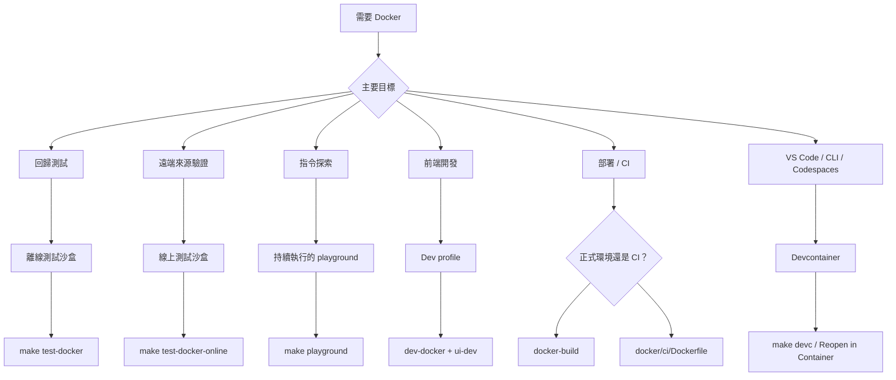

# Docker：測試、開發與部署

使用 Docker 進行可重複的測試、不需要 Go 的前端開發、正式環境部署，以及 CI 中的自動化 Skill 驗證。

## 模式選擇圖



指令對照：

| 指令 | `mise` | `make` |
|---|---|---|
| 測試（離線） | `mise run test:docker` | `make test-docker` |
| 測試（線上） | `mise run test:docker:online` | `make test-docker-online` |
| **Playground**（啟動 + 進入 shell） | **`mise run playground`** | **`make playground`** |
| Playground（停止） | `mise run playground:down` | `make playground-down` |
| Sandbox（進階） | — | `./scripts/sandbox.sh <up\|down\|shell\|reset\|status\|logs\|bare>` |
| **Devcontainer**（啟動 + 進入 shell） | **`mise run devc`** | **`make devc`** |
| Devcontainer（僅啟動） | `mise run devc:up` | `make devc-up` |
| Devcontainer（停止） | `mise run devc:down` | `make devc-down` |
| Devcontainer（重新啟動） | `mise run devc:restart` | `make devc-restart` |
| Devcontainer（完全重置） | `mise run devc:reset` | `make devc-reset` |
| Devcontainer（狀態） | `mise run devc:status` | `make devc-status` |
| Dev API server | `mise run dev:docker` | `make dev-docker` |
| Dev 停止 | `mise run dev:docker:down` | `make dev-docker-down` |
| Docker build | `mise run docker:build` | `make docker-build` |
| Docker multiarch | `mise run docker:build:multiarch` | `make docker-build-multiarch` |

## 你可以用它來做什麼

| 模式 | 最適合 | 網路 | 生命週期 |
|------|----------|---------|-----------|
| 離線測試沙盒 | 穩定的回歸測試（`build + unit + integration`） | 停用 | 一次性 |
| 線上測試沙盒 | 選擇性的遠端安裝／更新檢查 | 啟用 | 一次性 |
| 互動式 playground | 手動指令探索與展示 | 啟用 | 持續執行 |
| Dev profile | 在 Docker 中執行 Go API server + 主機端 Vite HMR | 啟用 | 持續執行 |
| Devcontainer | VS Code / Codespaces 一鍵開發環境 | 啟用 | 持續執行 |
| 正式環境映像檔 | 輕量部署（`docker/production/`） | 啟用 | 持續執行 |
| CI 映像檔 | Pipeline 中的 Skill 驗證（`docker/ci/`） | 啟用 | 一次性 |

---

## 常見情境

### 1. 以確定性方式驗證本機的安裝／更新邏輯

當你正在變更 `install` / `update` 行為，並想要一個類似 CI 的本機關卡時，使用這個方式。

```bash
mise run test:docker
make test-docker
```

這會在隔離環境中驗證本機路徑與 `file://` 的流程。

### 2. 執行選擇性的遠端來源檢查

用於需要網路連線的 GitHub／遠端來源驗證。

```bash
make test-docker-online
```

### 3. 開啟專屬的 playground 並探索所有指令 {#playground}

一個指令即可啟動並進入 playground：

```bash
make playground
mise run playground
```

在 playground 內，`skillshare` 與 `ss` 都已就緒。Global mode 與 Project mode 也都已預先初始化：

```bash
skillshare --help
ss status
skillshare list
```

### Playground 中的 Project Mode

playground 會自動在 `~/demo-project` 建立一個示範專案，內含一個範例 Skill 與一個 `claude` target。你可以立即開始探索 Project mode：

```bash
cd ~/demo-project
skillshare status        # 自動偵測為 Project mode
skillshare list
skillshare sync --dry-run
```

若要啟動 web dashboard，可使用內建的別名：

```bash
skillshare-ui            # Global mode dashboard → http://localhost:19420
skillshare-ui-p          # Project mode dashboard（~/demo-project）→ http://localhost:19420
```

接著在你的主機上開啟 `http://localhost:19420`（連接埠已透過 Docker Compose 映射）。

### GitHub Token（供 Search 使用）

playground 會自動從主機取得你的 GitHub token，供 `skillshare search` 使用。檢查順序為：`$GITHUB_TOKEN` → `$GH_TOKEN` → `gh auth token`。若你在主機上已經完成驗證，不需要額外設定。

```bash
# 如果沒有被偵測到，請在啟動 playground 前設定：
export GITHUB_TOKEN=ghp_your_token_here
make playground
```

完成後：

```bash
make playground-down
```

---

## 依角色劃分的使用情境

### 個人開發者

| 情境 | 該使用什麼 | 取代了什麼 |
|----------|-------------|-----------------|
| 不安裝 Go/Node 就試用 skillshare | `docker run ghcr.io/runkids/skillshare` | 安裝 Go + Node + pnpm，再從原始碼建置 |
| 在開 PR 前執行完整測試套件 | `make test-docker` | 依賴本機工具鏈（Go 版本不一致會導致結果不穩定） |
| 沒有安裝 Go 也能做前端開發 | `make dev-docker` + `cd ui && pnpm run dev` | 必須在本機安裝 Go 1.25+ 才能執行 API server |
| 向同事展示 skillshare | `make playground` → Web UI 於 `:19420` | 帶著他們走一遍完整的本機安裝流程 |
| 在 Apple Silicon 上驗證 Linux 行為 | `make docker-build` | 推送到 CI 並等待結果 |

### 團隊與開源貢獻者

| 情境 | 該使用什麼 | 解決了什麼問題 |
|----------|-------------|---------------|
| 新貢獻者上手 | `make playground` — 一個指令即可就緒 | 不再需要「安裝 Go、設定 PATH、clone、build」的教學文件 |
| CI 中的自動化 Skill 品質關卡 | `docker run ghcr.io/.../skillshare-ci audit /skills` | 以往每個 workflow 都需要安裝 Go 並從原始碼建置 |
| 各貢獻者環境間「在我機器上可以跑」的問題 | Docker 固定了 Go 1.25.5 與所有依賴套件 | 本機 Go 版本不同導致測試不穩定 |
| PR 審查者重現問題 | `./scripts/test_docker.sh --cmd "go test -run TestXxx ..."` | 必須 clone 並完成完整本機設定才能重現 |

### 企業與自架部署

| 情境 | 該使用什麼 | 帶來的價值 |
|----------|-------------|-------|
| 內部 Skill 管理 dashboard | 正式環境映像檔 + 掛載 Skill 的 volume | 一個容器搞定，伺服器上不需要 Go/Node |
| Kubernetes 部署 | 正式環境映像檔（healthcheck + 優雅關機 + 非 root） | 已準備好接受 readiness/liveness probe，通過 PodSecurityPolicy |
| 自動化 Skill PR 審查 | CI 映像檔 + GitHub Actions 中的 `skillshare audit` | 在 workflow 中加一行就能阻擋不安全的 Skill 合併 |
| 容器安全合規 | `read_only` + `cap_drop: ALL` + `no-new-privileges` | 通過 CIS Docker Benchmark、Trivy 與 Aqua 掃描 |
| 為了節省成本使用 ARM 伺服器（AWS Graviton） | `make docker-build-multiarch` | 原生 arm64 映像檔，沒有模擬帶來的額外負擔 |

### 快速範例

**具備持久化 Skill 資料的自架 dashboard：**

```bash
docker run -d \
  -p 19420:19420 \
  -v skillshare-data:/home/skillshare/.config/skillshare \
  ghcr.io/runkids/skillshare
```

**GitHub Actions 中的 CI Skill 稽核：**

```yaml
- name: Audit skills
  run: |
    docker run --rm \
      -v ${{ github.workspace }}/skills:/skills \
      ghcr.io/runkids/skillshare-ci audit /skills
```

**Kubernetes 部署（最小化）：**

```yaml
apiVersion: apps/v1
kind: Deployment
metadata:
  name: skillshare
spec:
  replicas: 1
  template:
    spec:
      containers:
        - name: skillshare
          image: ghcr.io/runkids/skillshare:latest
          ports:
            - containerPort: 19420
          livenessProbe:
            httpGet:
              path: /api/health
              port: 19420
          readinessProbe:
            httpGet:
              path: /api/health
              port: 19420
          securityContext:
            runAsNonRoot: true
            readOnlyRootFilesystem: true
```

---

## Dev Profile {#dev-profile}

有兩種方式可以透過 Vite HMR 開發前端：

**本機已安裝 Go**（單一指令）：

```bash
make ui-dev              # 同時啟動 Go API server + Vite dev server
# 開啟 http://localhost:5173
```

**沒有 Go**（Go API 在 Docker 中執行，Go 變更時自動重建）：

```bash
# 終端機 1
make dev-docker          # Go API 在 Docker 中執行 + Compose Watch（localhost:19420）

# 終端機 2
cd ui && pnpm run dev    # Vite dev server（localhost:5173，代理 /api → :19420）

# 完成後
make dev-docker-down
```

兩種方式都能讓你在修改 `ui/` 時獲得即時 HMR。Docker 版本固定了 Go 工具鏈，讓各貢獻者的後端行為保持一致。當你編輯 Go 檔案時，Compose Watch 會偵測變更、重建容器，並自動重新啟動 API server。需要 Docker Compose v2.22 以上版本。

**注意：** 使用 `make ui-dev` 時，Go 程式碼變更需要重新啟動 server（`Ctrl+C` 後重新執行）。`make dev-docker` 會透過 Compose Watch 自動處理這件事。

---

## Devcontainer（VS Code / Codespaces / CLI）

在一個隨開即用的容器中開啟專案 — 不需要本機安裝 Go、Node 或 pnpm。**有或沒有** VS Code 都能使用。

:::info Devcontainer 與 Playground 的差異
兩者使用相同的基礎映像檔與示範內容。**playground**（`make playground`）是一個僅限終端機的環境，用來探索指令。**devcontainer** 則加入了開發工具（Go、Node、pnpm、air），用於開發 skillshare 本身的程式碼 — 可從 VS Code、Codespaces 或純終端機使用。
:::

### 事前準備

- [Docker Desktop](https://www.docker.com/products/docker-desktop/) 已在執行中
- **選項 A（終端機）：** 不需要額外工具 — `make devc` 會處理好一切
- **選項 B（VS Code）：** 已安裝 [Dev Containers](https://marketplace.visualstudio.com/items?itemName=ms-vscode-remote.remote-containers) 擴充功能的 VS Code

:::tip GitHub Codespaces
在 GitHub 上，點選 **Code → Codespaces → New codespace**。devcontainer 設定會自動被套用 — 不需要本機 Docker 或擴充功能。
:::

### 開始使用

**從終端機**（不需要 VS Code）：

```bash
make devc            # 建置映像檔 → 啟動容器 → 設定 → 進入 shell
```

第一次執行需要幾分鐘（建置映像檔、安裝依賴套件）。之後的執行會偵測到既有的設定，直接進入 shell。

其他生命週期指令：

```bash
make devc-up         # 只啟動（不進入 shell）
make devc-down       # 停止容器
make devc-restart    # 重新啟動 + 重新執行 start-dev.sh
make devc-reset      # 完全重置（移除 volume），之後執行 make devc 重新初始化
make devc-status     # 顯示容器狀態
```

**從 VS Code：**

1. 在 VS Code 中開啟專案資料夾
2. 按下 `Ctrl+Shift+P`（macOS 上為 `Cmd+Shift+P`），選擇 **Dev Containers: Reopen in Container**
3. 等待容器建置完成（第一次需要幾分鐘，之後開啟會很快）
4. 就緒後，設定腳本會自動建置執行檔並建立示範 Skills

### 包含哪些內容

devcontainer 與 sandbox 共用同一份 `docker/sandbox/Dockerfile`，因此你會得到：

- Go 1.25 工具鏈
- Node.js 24 + pnpm（已包含在 Docker 映像檔中）— 讓你可以在容器內使用 `make ui-dev` 與 `cd website && pnpm start`
- VS Code 擴充功能：Go、Tailwind CSS、ESLint、Prettier
- 已轉發的連接埠：`45173`（Vite HMR）、`49420`（Go API）、`48888`（Docusaurus）— 刻意使用不常見的號碼，避免與主機上其他專案衝突
- 原始碼掛載於 `/workspace`
- **預先設定好的示範環境** — 與互動式 playground 相同：
  - PATH 中已有捷徑指令（`ss`、`ui`、`docs`）
  - 前端依賴套件已預先安裝（`ui/` 與 `website/`）
  - Global 示範 Skills（稽核範例、部署檢查清單）
  - 自訂稽核規則（Global + Project）
  - 位於 `~/demo-project` 的示範專案，內含 Project-mode 的 Skills

### 容器開啟後的快速上手

```bash
ss status                 # Global mode — 已初始化完成
ss list                   # 查看示範 Skills（平面式 + 巢狀式）
ss audit                  # 使用自訂規則執行 audit

cd ~/demo-project
ss status                 # 自動偵測為 Project mode
ss audit                  # Project 層級的 audit
ui -p                     # 將 API 切換為 Project mode → http://localhost:45173
```

### 前端開發

| Port | 服務 | 指令 |
|------|---------|---------|
| `45173` | Vite（React UI + HMR） | `ui` 或 `ui -p` |
| `49420` | Go API 後端 | 由 `ui` / `ui -p` 啟動 |
| `48888` | Docusaurus | `docs` |

```bash
ui                        # Global mode：API + Vite → http://localhost:45173
ui -p                     # Project mode：API + Vite → http://localhost:45173
ui stop                   # 停止 API + Vite
docs                      # 文件網站 → http://localhost:48888
docs stop                 # 停止 Docusaurus
```

`ui` 會同時啟動 Go API 後端（連接埠 49420，背景執行）與 Vite dev server（連接埠 45173，HMR）。在 `ui` 與 `ui -p` 之間切換時，會自動以新的模式重新啟動 API。VS Code 會自動將連接埠轉發到你主機上的瀏覽器。

### Token 設定

存取私有 repo 所需的 token（`GITHUB_TOKEN`、`GITLAB_TOKEN` 等）可以來自多個來源。檢查順序如下：

| 優先順序 | 來源 | 設定方式 |
|----------|--------|-------|
| 1 | `.devcontainer/.env` | 複製 `.env.example` → `.env`，填入數值（已加入 gitignore） |
| 2 | 主機環境變數 | 設定於 `~/.zshrc` — 透過 `devcontainer.json` 中的 `remoteEnv` 轉發 |
| 3 | `gh auth login` | 容器啟動時自動偵測 `GITHUB_TOKEN`（僅限 GitHub） |

所有來源皆為選擇性。你也可以隨時在容器內手動 `export`。

檢查目前狀態：

```bash
credential-helper status
```

### 私有 repo 測試

VS Code Dev Containers 會自動將你主機上的 git 憑證轉發進容器。這代表即使沒有明確設定 token 環境變數，`git clone` 私有 repo 也可能會成功 — 轉發的 credential helper 會在背後靜默處理驗證。

若要為了測試而停用**所有**驗證方式（credential helper + token 環境變數）：

```bash
eval "$(credential-helper --eval off)"    # 停用所有驗證
eval "$(credential-helper --eval on)"     # 還原所有驗證
credential-helper status                  # 檢查目前狀態
```

若不加 `--eval`，只會切換 git credential helper（token 環境變數仍維持啟用）。

### 執行測試

```bash
make test          # unit + integration
make test-unit     # 僅 unit
make lint          # go vet
```

---

## 正式環境與 CI 映像檔

### 映像檔比較

三個 Dockerfile 各自服務不同用途：

| | 正式環境 | CI | Sandbox |
|---|---|---|---|
| **映像檔** | `ghcr.io/runkids/skillshare` | `ghcr.io/runkids/skillshare-ci` | 僅限本機建置 |
| **Dockerfile** | `docker/production/Dockerfile` | `docker/ci/Dockerfile` | `docker/sandbox/Dockerfile` |
| **基礎映像** | `debian:bookworm-slim` | `debian:bookworm-slim` | `golang:1.25.5-bookworm` |
| **包含內容** | git、curl、tini | 僅 git | Go 工具鏈、gh、jq、air、delve、已建置的 UI |
| **非 root** | 是（UID 10001） | 否 | 否 |
| **PID 1** | tini | 預設 | 預設 |
| **Healthcheck** | 有（`/api/health`） | 無 | 無 |
| **Entrypoint** | `skillshare ui`（Web dashboard） | `skillshare`（直接呼叫 CLI） | `entrypoint.sh`（測試執行器） |
| **使用情境** | 自架 dashboard、Kubernetes | CI/CD Skill 驗證 | 開發、測試、playground |
| **發布到 GHCR** | 是 | 是 | 否 |
| **Multi-arch** | amd64 + arm64 | amd64 + arm64 | 僅限主機架構 |

**何時該用哪一種：**

- **正式環境** — 在伺服器或 Kubernetes 叢集上部署 Web UI dashboard
- **CI** — 在 GitHub Actions / GitLab CI 中執行 `audit`、`install --dry-run` 或其他驗證指令
- **Sandbox** — 本機開發（`make test-docker`、`make playground`、`make dev-docker`）

### 正式環境映像檔

建置一個內嵌 Web UI 的輕量正式環境映像檔：

```bash
make docker-build                          # 僅限目前平台（速度快，供本機測試）
make docker-build-multiarch                # linux/amd64 + linux/arm64（速度較慢，供推送到 registry）
```

`docker-build` 只會產生你機器架構專用的映像檔 — 從 Apple Silicon 建置出的 arm64 映像檔無法在 x86 伺服器上執行。推送到 registry 時請使用 `docker-build-multiarch`，讓任何平台都能自動取得正確的映像檔。

正式環境映像檔使用 `tini` 作為 PID 1，以非 root 使用者（UID 10001）執行，內含 healthcheck，並在第一次執行時自動初始化設定。預設指令：`skillshare ui -g --host 0.0.0.0 --no-open`。

已發布的映像檔可在 GHCR 上取得（在打 tag 時自動推送）：

```bash
# 拉取並執行（自動選擇 amd64 或 arm64）
docker run -d -p 19420:19420 ghcr.io/runkids/skillshare

# 搭配持久化的 Skill 資料
docker run -d -p 19420:19420 \
  -v skillshare-data:/home/skillshare/.config/skillshare \
  ghcr.io/runkids/skillshare
```

### CI 映像檔

用於在 CI pipeline 中驗證 Skills 的最小化映像檔：

```bash
docker build -f docker/ci/Dockerfile -t skillshare-ci .
docker run --rm -v ./my-skills:/skills skillshare-ci audit /skills
```

CI 映像檔的 entrypoint 就是 `skillshare` 本身，因此可以直接傳入子指令：

```bash
# 帶門檻值的 audit
docker run --rm -v ./skills:/skills ghcr.io/runkids/skillshare-ci audit /skills --threshold HIGH

# 以 dry-run 方式安裝來驗證某個 repo
docker run --rm ghcr.io/runkids/skillshare-ci install org/repo --dry-run
```

### Sandbox 映像檔

Sandbox 映像檔僅供本機開發與測試使用（不會發布到 GHCR）。它包含完整的 Go 工具鏈、開發工具（air、delve）、GitHub CLI，以及已預先建置的前端資源。

使用者：`make test-docker`、`make test-docker-online`、`make playground`、`make dev-docker`。

使用方式請參見上方的 [Playground](#playground) 與 [Dev Profile](#dev-profile) 章節。

### 映像檔標籤與版本控制

在推送 tag（`v*`）時，`docker-publish` GitHub Actions workflow 會建置並推送正式環境與 CI 兩種映像檔到 GHCR，並支援 multi-arch。

每個映像檔都會標記三種模式的標籤：

| 標籤模式 | 範例 | 說明 |
|---|---|---|
| `v<major>.<minor>.<patch>` | `v0.16.1` | 精確版本（不可變） |
| `<major>.<minor>` | `0.16` | 該次要版本下的最新修補版本（會滾動更新） |
| `sha-<short>` | `sha-153464a` | Git commit SHA（不可變） |

:::tip
正式環境請使用精確版本標籤（`v0.16.1`）以確保可重現性。使用次要版本標籤（`0.16`）可自動取得修補更新。使用 `sha-` 標籤可固定在特定 commit。
:::

可在 [GitHub Packages](https://github.com/runkids/skillshare/pkgs/container/skillshare) 瀏覽已發布的版本。

---

## 限制與預期行為

- **Playground 與 dev profile 共用連接埠 19420** — 一次只能執行其中一個。請先停止另一個（`make playground-down` 或 `make dev-docker-down`）。
- 離線 sandbox 無法驗證依賴網路的功能（例如從 GitHub 進行遠端 `install`）。
- Playground 使用容器內部的 `HOME`，因此不會直接修改你真正的主機端 home 設定。
- Go 程式碼變更會自動被偵測到（`go build` 會在容器內針對掛載的原始碼執行）。在 devcontainer 中執行 `make ui-dev`（Vite HMR）時，**前端（`ui/`）變更**會立即被偵測到。devcontainer 與 playground 都包含 Node.js 與 pnpm。
- 若需要自訂實驗，可直接傳入指令：

```bash
./scripts/test_docker.sh --cmd "go test -v ./tests/integration/..."
./scripts/sandbox_playground_shell.sh "skillshare list"
```

---

## 另請參閱

- [Getting Started](/docs/getting-started) — 標準設定
- [Commands Reference](/docs/reference/commands) — 所有指令
- [Troubleshooting](/docs/troubleshooting) — 常見問題
