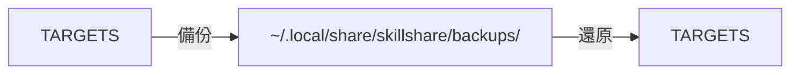
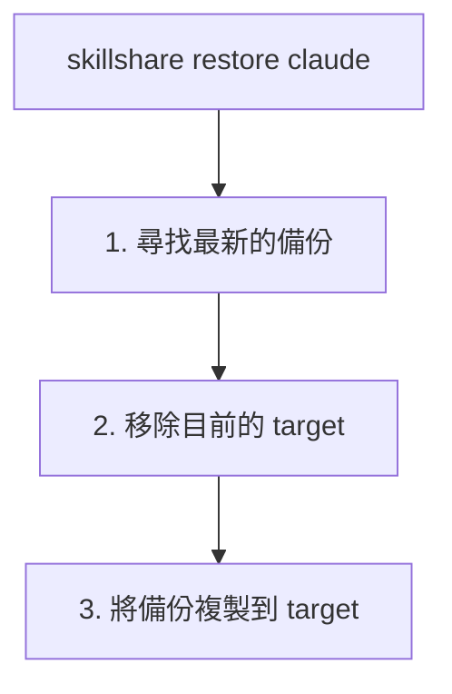

# 備份與還原

保護你的 Skills，並在出錯時能夠復原。

## 總覽

skillshare 會自動維護備份，並提供手動的備份／還原指令。



---

## 自動備份

備份會在以下情況前自動建立：

- `skillshare sync`（skill targets 與 agent targets）
- `skillshare sync agents`（僅 agent targets）
- `skillshare target remove`

**位置：** `~/.local/share/skillshare/backups/<timestamp>/`（agent 備份會顯示為 `<target>-agents/`，與一般的 `<target>/` 目錄並列）。

**範圍：** 只會擷取本機 target 的內容。merge-mode 的 symlink 會被略過，因為它們指向你的 Source — `sync` 會重新建立它們。詳見 [What Gets Backed Up](/docs/reference/commands/backup#what-gets-backed-up)。

---

## 手動備份

### 所有 Targets

```bash
skillshare backup
```

### 特定 Target

```bash
skillshare backup claude
```

### 預覽

```bash
skillshare backup --dry-run
```

---

## 列出備份

```bash
skillshare backup --list
```

**輸出範例：**
```
Backups
─────────────────────────────────────────
  2026-01-20_15-30-00/
    claude/    5 skills, 2.1 MB
    cursor/    5 skills, 2.1 MB
  2026-01-19_10-00-00/
    claude/    4 skills, 1.8 MB
```

---

## 還原

### 從最新的備份還原

```bash
skillshare restore claude
```

### 從特定的備份還原

```bash
skillshare restore claude --from 2026-01-19_10-00-00
```

### 預覽

```bash
skillshare restore claude --dry-run
```

---

## 還原做了什麼



**注意：** 還原之後，target 中會是實際的檔案（而非 symlink）。請執行 `skillshare sync` 以重新建立 symlink。

---

## 清理舊備份

```bash
skillshare backup --cleanup
```

移除超過設定保留期限的備份。保留機制已經會在每次 `sync` 後自動執行，因此這個指令僅用於按需清理。

若要檢查快照占用了多少空間：

```bash
du -sh ~/.local/share/skillshare/backups
skillshare backup --cleanup --dry-run   # 預覽將會被移除的內容
```

備份範圍與 `.gitignore`、`ignore:` 有何不同，請參閱 [Backups & Disk Space](/docs/reference/commands/backup#backups--disk-space)。

---

## 復原情境

### 不小心透過 symlink 刪除了一個 Skill

```bash
# 若已初始化 git（建議）
cd ~/.config/skillshare/skills
git checkout -- deleted-skill/

# 或從備份還原
skillshare restore claude
skillshare sync
```

### sync mode 設定錯誤

```bash
skillshare restore claude
skillshare target claude --mode merge
skillshare sync
```

### 想要復原最近的變更

```bash
skillshare backup --list
skillshare restore claude --from <earlier-timestamp>
```

### 復原一個 agent

Agents 有自己的備份項目（`<target>-agents`），流程與 Skills 相同：

```bash
# 手動備份 agent
skillshare backup agents claude

# 從最新的備份還原
skillshare restore agents claude

# 從特定時間戳記還原
skillshare restore agents claude --from 2026-01-19_10-00-00
```

在 Project mode 中，只有 agents 可以備份或還原 — `skillshare backup -p agents` 可以正常執行，但單純的 `skillshare backup -p` 會回傳錯誤。Project mode 的規則請參閱 [backup](/docs/reference/commands/backup#agent-backup)。

---

## 最佳實務

### 進行有風險的操作之前

```bash
skillshare backup
```

### 進行重大變更之後

```bash
skillshare push -m "Major update"  # Git 備份
```

### 每週維護

```bash
skillshare backup --cleanup
```

---

## 以 Git 作為備份

Git 提供了額外的備份層：

```bash
# 復原被刪除的 Skill
cd ~/.config/skillshare/skills
git checkout -- deleted-skill/

# 查看歷史紀錄
git log --oneline

# 還原到先前的 commit
git checkout <commit-hash> -- specific-skill/
```

---

## 另請參閱

- [backup](/docs/reference/commands/backup) — backup 指令參考
- [restore](/docs/reference/commands/restore) — restore 指令參考
- [trash](/docs/reference/commands/trash) — 軟刪除管理
- [Troubleshooting](/docs/troubleshooting) — 遇到問題時
