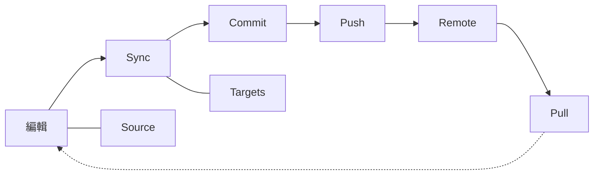

# 日常工作流程

日常 Skill 管理的 edit → sync → commit/push/pull 循環。

## 總覽



---

## 編輯 Skills

### 選項 1：在 Source 中編輯（建議）

```bash
$EDITOR ~/.config/skillshare/skills/my-skill/SKILL.md
```

由於是透過 symlink，變更會立即反映在所有 Targets 中。

### 選項 2：在 Target 中編輯

```bash
$EDITOR ~/.claude/skills/my-skill/SKILL.md
```

因為 Targets 是透過 symlink 連結，這樣編輯會直接修改 Source 檔案。

---

## 同步

編輯之後，因為有 symlink，**通常不需要**再執行 sync。但在以下情況請執行 sync：

- 你安裝或移除了 Skills
- 你變更了 sync mode
- 你新增或移除了 Targets
- status 中顯示「out of sync」

```bash
skillshare sync
```

:::tip 為什麼 sync 是獨立的一個步驟？
Sync 被刻意與 install/update/uninstall 分離。這讓你可以批次處理多個變更（例如：安裝 3 個 Skills → 只同步一次）、在套用變更前用 `--dry-run` 先預覽，並完全掌控 Targets 何時更新。詳情請參閱 [Source & Targets：為什麼 Sync 是獨立的一個步驟](/docs/understand/source-and-targets#why-sync-is-a-separate-step)。
:::

### 先預覽

```bash
skillshare sync --dry-run
```

### 只同步 agents

如果你只變更了 agents（或只想把 agents 推送到支援 agent 的 Targets），可以限定同步範圍：

```bash
skillshare sync agents
```

`skillshare sync` 會一次同時執行 Skills 與 agents 的同步。agent 檔案格式與支援的 Targets 請參閱 [Agents](/docs/understand/agents)。

---

## Git 檢查點與跨機器同步

### 在本機 Commit

當你想要一個本機還原點、但不推送到遠端時，使用 `commit`：

```bash
skillshare commit -m "Update draft skill"
```

這會執行：
1. `git add .`
2. `git commit -m "Update draft skill"`

即使 Source repo 沒有設定 remote，`commit` 也能正常運作。

### 推送變更（從這台機器）

如果你有使用 git remote，`push` 可以一個指令完成 commit 並分享變更：

```bash
skillshare push -m "Add new skill"
```

這會執行：
1. `git add .`
2. `git commit -m "Add new skill"`
3. `git push`

### 拉取變更（到這台機器）

```bash
skillshare pull
```

這會執行：
1. `git pull`
2. `skillshare sync`

---

## 常見的日常任務

### 建立新 Skill

```bash
skillshare new code-review
$EDITOR ~/.config/skillshare/skills/code-review/SKILL.md
skillshare sync
```

### 編輯或新增 agent

Agents 是位於 `~/.config/skillshare/agents/` 中的單一 `.md` 檔案。可以直接用編輯器建立或編輯它們：

```bash
$EDITOR ~/.config/skillshare/agents/reviewer.md
skillshare sync agents
```

`disable` / `enable` 可透過 `.agentignore` 切換個別 agent，而不需要刪除它們：

```bash
skillshare disable reviewer --kind agent     # 從同步中排除
skillshare enable reviewer --kind agent      # 重新啟用
```

### 更新一個 tracked repo

```bash
skillshare update _team-skills
skillshare sync
```

### 更新所有 tracked repos

```bash
skillshare update --all
skillshare sync
```

### 檢查狀態

```bash
skillshare status
```

會顯示：
- Source 目錄狀態
- Git 狀態（領先/落後的 commits）
- Target 同步狀態

---

## 小技巧

### 讓它自動化

加入你的 shell 啟動設定：
```bash
# ~/.bashrc 或 ~/.zshrc
alias ss="skillshare"
alias sss="skillshare sync"
alias ssc="skillshare commit"
alias ssp="skillshare push"
alias ssl="skillshare pull"
```

### 重要工作前先檢查

```bash
# 一天的開始
skillshare pull
skillshare status

# Commit 之前
skillshare diff
```

### 保持環境乾淨

```bash
# 每週維護
skillshare audit             # 掃描安全威脅
skillshare backup --cleanup  # 移除舊備份
skillshare doctor            # 檢查是否有問題
```

---

## 另請參閱

- [sync](/docs/reference/commands/sync) — 核心 sync 指令
- [status](/docs/reference/commands/status) — 檢查同步狀態
- [commit](/docs/reference/commands/commit) — 不推送的本機 git 檢查點
- [push](/docs/reference/commands/push) / [pull](/docs/reference/commands/pull) — 跨機器同步
- [Skill 探索](/docs/how-to/daily-tasks/skill-discovery) — 尋找新的 Skills
