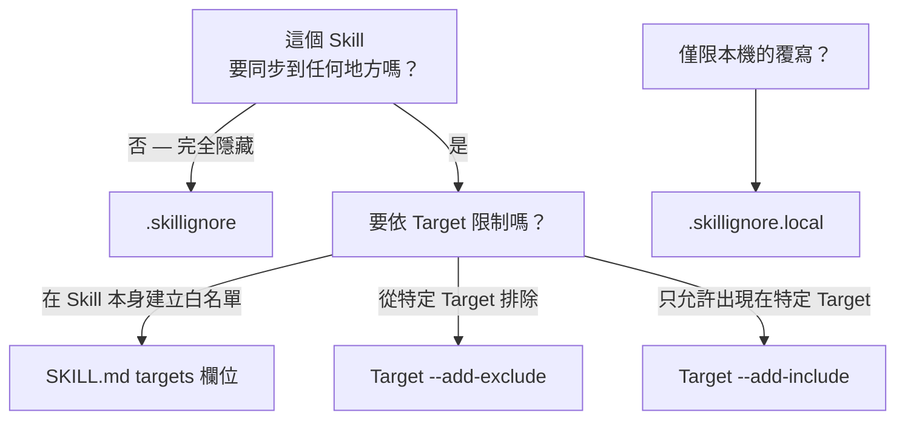

# 篩選 Skills

Skillshare 提供三層過濾機制，控制哪些 Skills 要送到哪些 Targets。
請選擇符合你目標的情境。

## 只同步某個 Skill 到特定 Targets

在 Skill 的 SKILL.md frontmatter 中加入 `metadata.targets`（建議做法）。
該 Skill 將只會同步到列出的 Targets。

```yaml
---
name: my-cursor-only-skill
metadata:
  targets: [cursor]
---
```

支援 Target 別名 — `claude` 同時符合 `claude` 與 `claude-code`。

📖 [SKILL.md targets 欄位](/docs/understand/skill-format#targets) · [Filtering Reference](/docs/reference/filtering#skillmd-targets-field)

## 從某個 Target 排除特定 Skills

在該 Target 上使用 `--add-exclude`，以 glob pattern 封鎖符合的 Skills：

```bash
skillshare target cursor --add-exclude "legacy-*"
skillshare sync
```

📖 [Target 過濾旗標](/docs/reference/commands/target#target-filters-includeexclude) · [Filtering Reference](/docs/reference/filtering#target-includeexclude-filters)

## 只允許特定 Skills 出現在某個 Target 上

使用 `--add-include` 建立白名單 — 只有符合的 Skills 會被同步：

```bash
skillshare target claude --add-include "team-*"
skillshare sync
```

📖 [Target 過濾旗標](/docs/reference/commands/target#target-filters-includeexclude) · [Filtering Reference](/docs/reference/filtering#target-includeexclude-filters)

## 從所有 Targets 隱藏 Skills

在你的 Source 目錄中放置一個 `.skillignore` 檔案。符合這些 pattern 的 Skills 會在探索階段就被排除在**所有** Targets 之外：

```text title="~/.config/skillshare/skills/.skillignore"
drafts/
experimental-*
```

新增或移除 pattern 最快的方式是使用 `enable` / `disable` 指令：

```bash
skillshare disable experimental-*   # 加入 .skillignore
skillshare enable experimental-*    # 從 .skillignore 移除
```

你也可以在 `skillshare list` TUI 中按下 **E** 來切換某個 Skill 的開關。

📖 [enable / disable](/docs/reference/commands/enable) · [.skillignore 語法](/docs/reference/appendix/file-structure#skillignore-optional) · [Filtering Reference](/docs/reference/filtering#skillignore)

## 排除 tracked repo 內的 Skills

在 tracked repo 目錄內放置一個 `.skillignore`。它只會影響該 repo 內的 Skills：

```text title="_team-repo/.skillignore"
internal-only/*
validation-scripts
```

📖 [Repo 層級的 .skillignore](/docs/reference/appendix/file-structure#skillignore-optional)

## 僅限本機的覆寫規則

`.skillignore.local` 會附加在 `.skillignore` 之後 — 最後符合的規則生效。使用否定 pattern 可以在不修改共用檔案的情況下，於本機取消忽略某些 Skills：

```text title="_team-repo/.skillignore.local"
# 該 repo 忽略了 private-*，但我需要自己的
!private-mine
```

不要 commit 這個檔案 — 把它加進 `.gitignore`。

📖 [.skillignore.local](/docs/reference/appendix/file-structure#skillignorelocal-optional)

## 該用哪一層？



## 如何驗證過濾結果

| 指令 | 顯示內容 |
|---------|--------------|
| `skillshare sync` | 底部顯示被忽略的 Skill 數量與名稱 |
| `skillshare status --json` | 完整的 `.skillignore` 統計資料（patterns、被忽略的 Skills、啟用中的檔案） |
| `skillshare doctor` | 健康檢查包含 `.skillignore` 的 pattern 數量與忽略數量 |
| `skillshare ui` → Sync 頁面 | 可摺疊的「Ignored by .skillignore」卡片並顯示徽章 |

## 另請參閱

- [Filtering Reference](/docs/reference/filtering) — 三層機制的完整規格
- [Sync 指令](/docs/reference/commands/sync#per-target-includeexclude-filters) — 過濾行為範例
- [Target 指令](/docs/reference/commands/target#target-filters-includeexclude) — include/exclude 的 CLI 旗標
