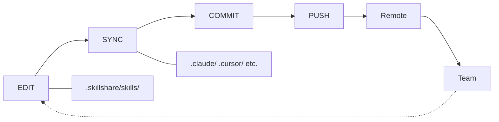

# 專案工作流程

Project 層級 skill 管理的 edit → sync → commit 循環。

## 總覽



---

## 團隊協作情境

一個典型的團隊工作流程，展示 project skills 如何保持同步：

```
Alice (adds a skill)                    Bob (gets the update)
──────────────────────                  ──────────────────────
skillshare new api-guide -p
$EDITOR .skillshare/skills/api-guide/
skillshare sync
git add . && git commit && git push
                                        git pull
                                        skillshare install -p
                                        skillshare sync
                                        → api-guide now in .claude/skills/
```

Bob 不需要知道新增了哪些 skills — `skillshare install -p` 會讀取設定，並安裝所有列出的項目。

---

## 常見操作

### 新增一個 Skill

```bash
# 建立 skill
skillshare new my-skill -p
$EDITOR .skillshare/skills/my-skill/SKILL.md

# 同步到 targets
skillshare sync

# Commit
git add .skillshare/
git commit -m "Add my-skill"
```

### 新增一個 Agent

Agents 是單一 `.md` 檔案；直接在 `.skillshare/agents/` 底下建立即可：

```bash
# 建立 agent 檔案
$EDITOR .skillshare/agents/my-agent.md

# 同步到支援 agent 的 targets（claude、cursor、augment、opencode）
skillshare sync agents

# Commit
git add .skillshare/agents/
git commit -m "Add my-agent"
```

`skillshare sync`（不加 `agents`）會一次同步 skills 與 agents。使用 `skillshare disable my-agent --kind agent -p` 可以在 `.skillshare/agents/.agentignore` 中加入一筆項目，而不刪除檔案。

### 安裝遠端 Skill

```bash
# 從 GitHub 安裝
skillshare install anthropics/skills/skills/pdf -p

# 同步到 targets
skillshare sync

# Commit 設定變更
git add .skillshare/
git commit -m "Add pdf skill from anthropic"
```

### 更新遠端 Skills

```bash
# 更新特定的 skill
skillshare update pdf -p

# 或更新所有遠端 skills
skillshare update --all -p

# 同步已更新的 skills
skillshare sync

# 如果設定有變更就 commit
git add .skillshare/
git commit -m "Update remote skills"
```

### 移除一個 Skill

```bash
# 解除安裝
skillshare uninstall my-skill -p

# 同步以清理 symlinks
skillshare sync

# Commit
git add .skillshare/
git commit -m "Remove my-skill"
```

### 有人加入這個 Project

不論是新的團隊成員、開源貢獻者，或是嘗試某個社群範本的人 — 設定方式都一樣：

```bash
# Clone 這個 project
git clone github.com/team/project
cd project

# 安裝設定中列出的遠端 skills
skillshare install -p

# 同步到 targets
skillshare sync
```

`config.yaml` 就像一份可攜的 skill 清單 — 不需要手動去尋找 skills。

---

## 管理 Targets

### 新增一個 Target

```bash
# 新增一個已知的 target
skillshare target add windsurf -p

# 用路徑新增一個自訂 target
skillshare target add custom-tool ./tools/ai/skills -p

# 同步到新的 target
skillshare sync
```

### 移除一個 Target

```bash
skillshare target remove windsurf -p
```

### 列出 Targets

```bash
skillshare target list -p
```

```
Project Targets
  claude    .claude/skills (merge)
  cursor         .cursor/skills (merge)
```

---

## 檢查狀態

```bash
skillshare status
```

```
Project Skills (.skillshare/)

Source
  ✓ .skillshare/skills (3 skills)

Targets
  ✓ claude       [merge] .claude/skills (3 synced)
  ✓ cursor       [merge] .cursor/skills (3 synced)

Remote Skills
  ✓ pdf          anthropic/skills/pdf
  ✓ review       github.com/team/tools
```

---

## 列出 Skills

```bash
skillshare list
```

```
Installed skills (project)
─────────────────────────────────────────
  → my-skill            local
  → pdf                 anthropic/skills/pdf
  → review              github.com/team/tools

→ 3 skill(s): 2 remote, 1 local
```

---

## Web Dashboard

使用 web UI 進行視覺化的 project skill 管理：

```bash
skillshare ui -p
```

如果 `.skillshare/config.yaml` 已存在，也可以直接用 `skillshare ui`（會自動偵測）。dashboard 會隱藏 Git Sync（請使用你 project 自己的 git），並直接編輯 `.skillshare/config.yaml`。

---

## 小技巧

### 自動偵測

一旦 `.skillshare/config.yaml` 存在，大多數指令都會自動偵測 project mode：

```bash
cd my-project/
skillshare sync          # 自動偵測 project mode
skillshare status        # 自動偵測 project mode
skillshare list          # 自動偵測 project mode
```

:::tip Zero Config
只要 `cd` 進入 project 目錄 — skillshare 就會偵測到 `.skillshare/config.yaml`，並自動切換到 project mode。不需要任何 flag。
:::

### 編輯後立即看到變更

Skills 是以 symlink 建立的 — 在 `.skillshare/skills/` 中編輯會立即反映在 targets 中：

```bash
$EDITOR .skillshare/skills/my-skill/SKILL.md
# 變更已經反映在 .claude/skills/my-skill/ 中（symlink）
```

只有在新增／移除 skills 或 targets 時才需要執行 `sync`。

### 同步前先預覽

```bash
skillshare sync --dry-run
```

---

## 參閱

- [Project Skills](/docs/understand/project-skills) — 概念說明
- [Project Setup](/docs/how-to/sharing/project-setup) — 初始設定指南
- [日常工作流程](./daily-workflow.md) — Global mode 的日常使用方式
