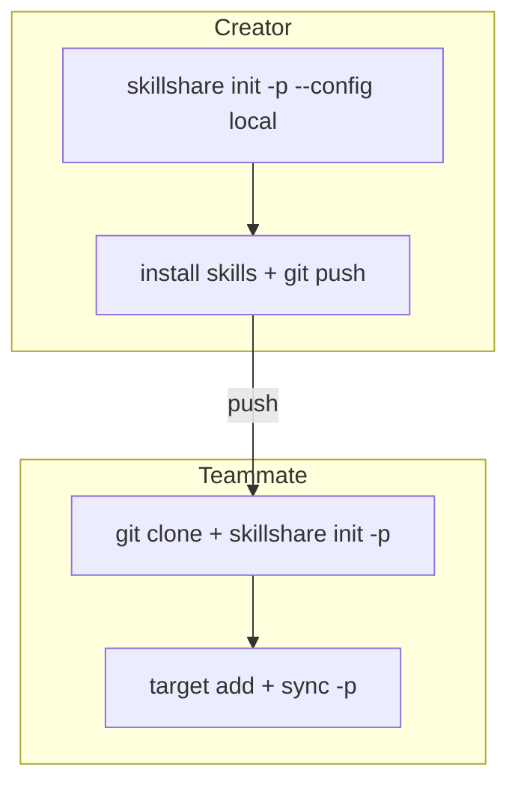

# 集中式 Skills Repo

> 使用一個 project 作為共用的 skills repository；其他 project 保持乾淨。

## 情境

你的團隊有多個 project（B、C、D），但希望在單一專用 repo（A）中管理 AI Skills。每位開發者 clone repo A，並將 targets 指向自己本機的 project。

## 解決方案

### 建立者：設定共用 repo

```bash
cd ~/DEV/skills-repo        # Project A
skillshare init -p --config local --targets claude
```

這會建立 `.skillshare/`，其中 `config.yaml` 已加入 gitignore，讓每位開發者可以獨立管理自己的 targets。

```bash
# 加入共用 skills
skillshare install <skill-repo> -p

# Commit（config.yaml 已被 .gitignore 排除）
git add .skillshare/
git commit -m "add shared skills"
git push
```

### 團隊成員：Clone 並設定

```bash
git clone <A-repo> && cd skills-repo
skillshare init -p
```

skillshare 會自動偵測共用 repo（`.gitignore` 中含有 `config.yaml`），並建立一個空的 config。不需要 `--config local` flag。

```bash
# 加入指向你本機 project 的 targets
skillshare target add project-b ~/DEV/project-b/.cursor/skills -p
skillshare target add project-c ~/DEV/project-c/.claude/skills -p

# 同步共用 skills 到你所有的 targets
skillshare sync -p
```

## 運作方式



`--config local` flag 會將 `config.yaml` 加入 `.skillshare/.gitignore`。這代表：

- **Skills**（`.skillshare/skills/`）透過 git 共用
- **Config**（`.skillshare/config.yaml`）僅存在於每位開發者本機
- 每位開發者可以選擇自己的 targets，而不影響其他人

## 驗證

建立者執行 `init -p --config local` 之後：

```bash
cat .skillshare/.gitignore
# 應包含：config.yaml
```

團隊成員 clone 並執行 `init -p` 之後：

```bash
skillshare list -p     # 顯示共用 skills
skillshare status -p   # 顯示你個人的 targets
```

## FAQ

**Q：每位團隊成員都需要 `--config local` 嗎？**
A：不需要。只有建立者需要使用 `--config local`。團隊成員只需執行 `skillshare init -p`，skillshare 會自動偵測共用 repo 的模式。

**Q：團隊成員可以額外安裝 skills 嗎？**
A：可以。`skillshare install <repo> -p` 可正常運作。安裝的 skill 會存放在受 git 追蹤的 `.skillshare/skills/` 中，因此你可以 push 讓其他人使用。

**Q：如果某位團隊成員想要不同的 skills 怎麼辦？**
A：`.skillshare/skills/` 中的 skills 是共用的。若要真正個人化的 skills，請使用 [global mode](/docs/understand/project-skills)（`skillshare install <repo>`，不加 `-p`）。
