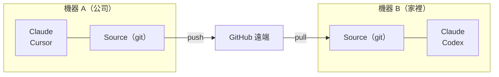

# 跨機器 Sync

使用 git 在多台電腦之間 Sync 你的 skills。

## 概覽



---

## 第一台機器的設定

### 互動模式（引導式提示）

```bash
skillshare init --remote git@github.com:you/my-skills.git
```

### 非互動模式（無提示）

```bash
# Remote 已經有你的 skills（或從全新的 source 開始）
skillshare init --remote git@github.com:you/my-skills.git --no-copy --all-targets --no-skill

# 第一台機器已有 Claude skills：在 init 時匯入
skillshare init --remote git@github.com:you/my-skills.git --copy-from claude --all-targets --no-skill
```

這麼做會：
1. 建立 source 目錄
2. 以初始 commit 初始化 git
3. 新增 remote
4. 自動偵測並設定 targets

之後可選擇性執行（僅在設定完成後又安裝了其他 AI CLI 時需要）：

```bash
skillshare init --discover
```

接著 push 你的 skills：
```bash
skillshare push
```

:::tip 已經初始化過了？
為既有的設定新增 remote：
```bash
skillshare init --remote git@github.com:you/my-skills.git
```
即使在初始設定之後執行也沒問題 — 它只會新增 remote。
:::

---

## 第二台機器的設定

在新機器上，**同樣的指令就能用**：

```bash
skillshare init --remote git@github.com:you/my-skills.git
```

Init 會自動偵測 remote 上已有現成的 skills 並將它們拉下來。不需要手動 `git clone`。

:::info 幕後發生了什麼
1. 建立 source 目錄並初始化 git
2. 新增 remote 並執行 `git fetch`
3. 偵測到 remote 有 skills → 重設本機以符合 remote
4. 設定追蹤分支
5. 自動偵測並設定本機 targets
:::

如果你偏好手動控制：

```bash
# 直接 clone，再用既有的 source 初始化
git clone git@github.com:you/my-skills.git ~/.config/skillshare/skills
skillshare init --source ~/.config/skillshare/skills
skillshare sync
```

---

## 日常工作流程

### 機器 A：進行變更並 push

```bash
# 編輯 skills（透過 symlink 立即可見變更）
$EDITOR ~/.config/skillshare/skills/my-skill/SKILL.md

# 選用：建立本機檢查點但不 push
skillshare commit -m "Update my-skill"

# 準備好分享時再 push 到 remote
skillshare push -m "Update my-skill"
```

### 機器 B：Pull 並 sync

```bash
skillshare pull
```

就這樣。`pull` 在拉取後會自動執行 `sync`。

---

## 指令

### Commit

建立本機檢查點但不 push：

```bash
skillshare commit                  # Default message
skillshare commit -m "Add pdf"     # Custom message
skillshare commit --dry-run        # Preview
```

**會發生什麼：**
```
git add -A
git commit -m "Add pdf"
```

`commit` 不需要 remote，也絕不會 push。

### Push

Commit 並 push 本機變更：

```bash
skillshare push                  # Auto-generated message
skillshare push -m "Add pdf"     # Custom message
```

**會發生什麼：**
```
git add -A
git commit -m "Add pdf"
git push          # auto-sets upstream on first push
```

### Pull

Pull 遠端變更並 sync：

```bash
skillshare pull
```

**會發生什麼：**
```
git pull           # or fetch + reset on first pull
skillshare sync
```

---

## 衝突處理

### Pull 失敗（本機有未提交的變更）

如果你想保留本機變更，但還沒準備好 push，請先在本機 commit：

```bash
skillshare commit -m "Save local changes"
skillshare pull
```

### Push 失敗（remote 領先）

```
$ skillshare push
Push failed
  Remote may have newer changes
  Run: skillshare pull
  Then: skillshare push
```

**解決方式：**
```bash
skillshare pull
skillshare push
```

### Pull 仍因本機未提交的變更而失敗

```
$ skillshare pull
Local changes detected
  Run: skillshare push
  Or:  cd ~/.config/skillshare/skills && git stash
```

**解決方式：**
```bash
# 選項 1：先在本機 commit
skillshare commit -m "Local changes"
skillshare pull

# 選項 2：先 push 你的變更
skillshare push -m "Local changes"
skillshare pull

# 選項 3：暫時 stash 變更
cd ~/.config/skillshare/skills
git stash
skillshare pull
git stash pop
```

### Merge 衝突

```bash
cd ~/.config/skillshare/skills
git status                    # 查看衝突的檔案
# 編輯檔案以解決衝突
git add .
git commit -m "Resolve conflicts"
skillshare sync
```

---

## 檢查狀態

```bash
skillshare status
```

顯示：
- Git 狀態（clean、ahead、behind）
- Remote 設定
- Sync 狀態

---

## 私有 Repository

私有 repo 請使用 SSH URL：

```bash
skillshare init --remote git@github.com:you/private-skills.git
```

---

## 小技巧

### 使用 SSH 金鑰

設定 SSH 金鑰以避免密碼提示：
```bash
ssh-keygen -t ed25519 -C "your@email.com"
# 將公開金鑰新增到 GitHub
```

### 適用於 dotfiles 的可攜路徑

如果你透過 dotfiles 分享 `config.yaml`，啟用 `preserve_tilde_on_save` 可以讓路徑保持 `~/...` 的形式，而不是 `/home/alice/...`：

```yaml
preserve_tilde_on_save: true
```

這可以避免在不同使用者名稱或作業系統特有家目錄前綴的機器之間共用同一份設定時，產生雜訊般的 diff。詳見 [Configuration — preserve_tilde_on_save](/docs/reference/targets/configuration#preserve_tilde_on_save)。

### 多個 Remote

新增備援 remote：
```bash
cd ~/.config/skillshare/skills
git remote add backup git@gitlab.com:you/skills-backup.git
git push backup main
```

### 在 shell 啟動時 Sync

加入到 `~/.bashrc` 或 `~/.zshrc`：
```bash
# 在終端機開啟時 Sync skillshare（若已設定 remote）
skillshare pull 2>/dev/null
```

---

## 替代方案：從 Config 安裝 {#alternative-install-from-config}

如果你不想設定 git remote，`config.yaml` 也可以當作可攜的 skill 清單。每次 `install` / `uninstall` 都會自動更新 `skills:` 區塊，而 `skillshare install`（不帶參數）會重新安裝清單中列出的所有項目：

```bash
# 機器 A — config.yaml 會記錄你安裝了什麼
skillshare install anthropics/skills -s pdf
# config.yaml now has: skills: [{name: pdf, source: "..."}]

# 機器 B — 複製 config.yaml，然後：
skillshare install      # Installs all listed skills
skillshare sync
```

### 該用哪一種

| | `push` / `pull` | `install`（不帶參數） |
|---|---|---|
| Sync 了什麼 | 實際的 skill 檔案（完整內容） | 僅 source URL — 安裝時重新下載 |
| 本機/手寫的 skills | 包含 | 不包含（沒有 source URL） |
| 需要的設定 | source 目錄要有 Git remote | 只需要 `config.yaml` |
| Project mode | 僅限 Global | 可搭配 `-p`（`.skillshare/config.yaml`） |
| 維護方式 | 變更後需手動 `push` | install/uninstall 時自動同步 |

**建議**：個人跨機器 Sync 請使用 `push`/`pull`。團隊導入與專案設定則使用 config 的 `install`。

---

## 參見

- [push](/docs/reference/commands/push) — Push 到 remote
- [pull](/docs/reference/commands/pull) — 從 remote pull
- [install](/docs/reference/commands/install#install-from-config-no-arguments) — 從 config 安裝
- [Organization-Wide Skills](./organization-sharing.md) — 團隊分享
- [init](/docs/reference/commands/init) — 使用 `--remote` 進行 Init
